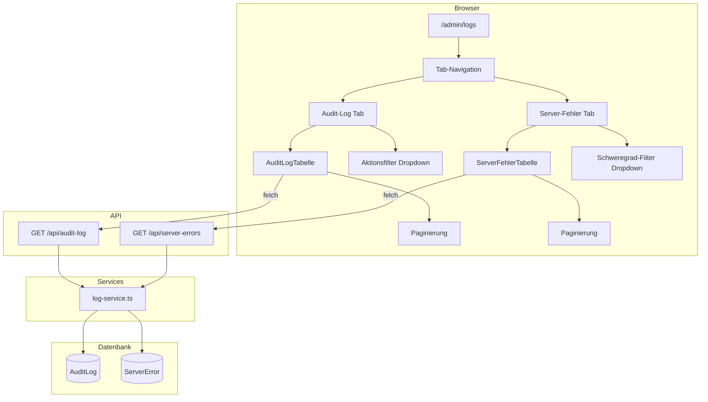
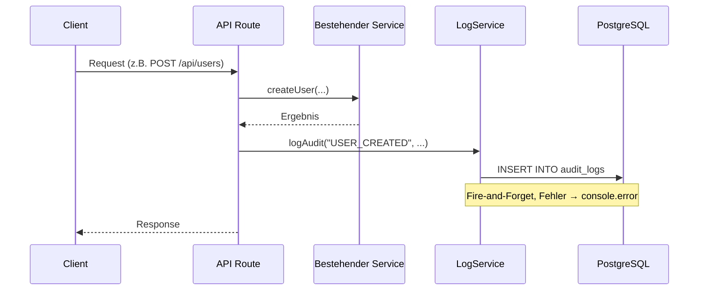

# Design-Dokument: Admin Audit & Server-Fehler Log

## Übersicht

Dieses Feature erweitert den Admin-Bereich um zwei Log-Systeme:

1. **Audit-Log** – Protokolliert sicherheitsrelevante Benutzeraktionen (Login, CRUD-Operationen, Einstellungsänderungen) in einer `AuditLog`-Tabelle.
2. **Server-Fehler-Log** – Erfasst serverseitige Fehler und API-Ausfälle in einer `ServerError`-Tabelle mit Schweregrad-Klassifizierung.

Beide Logs sind über eine neue Admin-Seite unter `/admin/logs` mit Tab-Navigation, Filterung und Paginierung zugänglich. Der Zugriff ist ausschließlich auf Benutzer mit der Rolle `ADMIN` beschränkt.

### Designentscheidungen

- **Datenbank statt Dateisystem**: Log-Einträge werden in PostgreSQL gespeichert, um Filterung, Paginierung und Konsistenz mit dem bestehenden Prisma-ORM-Stack zu gewährleisten.
- **Entkoppelter Log-Service**: Das Schreiben von Log-Einträgen erfolgt über einen dedizierten `LogService`, der Fehler beim Schreiben abfängt und in die Konsole loggt, ohne die ursprüngliche Anfrage zu beeinträchtigen (Fire-and-Forget-Muster).
- **Bestehende Patterns**: Die Implementierung folgt den etablierten Mustern des Projekts – `getAdminSession()` für Zugriffsschutz, Prisma-Services unter `src/lib/services/`, API-Routes unter `src/app/api/`.

## Architektur



### Integrationsfluss für Audit-Logging



## Komponenten und Schnittstellen

### 1. Prisma-Modelle

Zwei neue Modelle im `prisma/schema.prisma`:

- **`AuditLog`** – Speichert Audit-Einträge mit Aktion, Akteur, Ziel und optionalen Details.
- **`ServerError`** – Speichert Server-Fehler mit Schweregrad, Nachricht, Stack-Trace und API-Kontext.

Neues Enum `ErrorSeverity` mit den Werten `ERROR`, `WARN`, `FATAL`.

### 2. Log-Service (`src/lib/services/log-service.ts`)

Exportiert folgende Funktionen:

| Funktion | Beschreibung |
|---|---|
| `logAudit(params)` | Erstellt einen Audit-Log-Eintrag. Fängt DB-Fehler ab und loggt in die Konsole. |
| `logServerError(params)` | Erstellt einen Server-Fehler-Log-Eintrag. Fängt DB-Fehler ab und loggt in die Konsole. |
| `getAuditLogs({ page, limit, action? })` | Gibt paginierte Audit-Logs zurück (absteigend nach `createdAt`). |
| `getServerErrors({ page, limit, severity? })` | Gibt paginierte Server-Fehler zurück (absteigend nach `createdAt`). |

### 3. API-Endpunkte

| Endpunkt | Methode | Beschreibung |
|---|---|---|
| `/api/audit-log` | GET | Paginierte Audit-Logs mit optionalem `action`-Filter. Erfordert ADMIN-Rolle. |
| `/api/server-errors` | GET | Paginierte Server-Fehler mit optionalem `severity`-Filter. Erfordert ADMIN-Rolle. |

Beide Endpunkte verwenden das bestehende `getAdminSession()`-Muster für Authentifizierung und Autorisierung.

**Response-Format:**
```json
{
  "entries": [...],
  "total": 150,
  "page": 1,
  "limit": 25
}
```

### 4. Admin-Seite (`src/app/(admin)/admin/logs/page.tsx`)

Client-Komponente ("use client") mit:
- Tab-Navigation (Audit Log / Server-Fehler), Standard: Audit Log
- Tabellen im bestehenden Stil (rounded borders, gray-50 header, divide-y rows, hover states)
- Dropdown-Filter pro Tab (Aktionstyp bzw. Schweregrad)
- Paginierung mit Zurück/Weiter-Buttons und Seitenanzeige
- 25 Einträge pro Seite

### 5. Navigation

Neuer Link "Logs" in `src/app/(admin)/layout.tsx`, eingefügt nach "Vocal Tags", mit dem bestehenden `pathname?.startsWith("/admin/logs")`-Muster für aktive Hervorhebung.

## Datenmodelle

### AuditLog (Prisma-Modell)

```prisma
model AuditLog {
  id           String   @id @default(cuid())
  action       String
  actorId      String?
  targetEntity String?
  targetId     String?
  details      Json?
  ipAddress    String?
  createdAt    DateTime @default(now())

  actor User? @relation("AuditLogActor", fields: [actorId], references: [id], onDelete: SetNull)

  @@index([action, createdAt])
  @@map("audit_logs")
}
```

**Aktionstypen** (als String-Konstanten im Log-Service):
- `LOGIN_SUCCESS`, `LOGIN_FAILED`
- `USER_CREATED`, `USER_UPDATED`, `USER_DELETED`
- `SETTING_CHANGED`
- `ACCOUNT_STATUS_CHANGED`

### ServerError (Prisma-Modell)

```prisma
enum ErrorSeverity {
  ERROR
  WARN
  FATAL
}

model ServerError {
  id         String        @id @default(cuid())
  severity   ErrorSeverity
  message    String
  stackTrace String?
  apiPath    String?
  httpMethod String?
  statusCode Int?
  userId     String?
  createdAt  DateTime      @default(now())

  user User? @relation("ServerErrorUser", fields: [userId], references: [id], onDelete: SetNull)

  @@index([severity, createdAt])
  @@map("server_errors")
}
```

### User-Modell Erweiterung

Das bestehende `User`-Modell erhält zwei neue Relationen:

```prisma
auditLogs    AuditLog[]    @relation("AuditLogActor")
serverErrors ServerError[] @relation("ServerErrorUser")
```

### TypeScript-Interfaces

```typescript
// Audit-Log Typen
interface AuditLogEntry {
  id: string;
  action: string;
  actorId: string | null;
  targetEntity: string | null;
  targetId: string | null;
  details: Record<string, unknown> | null;
  ipAddress: string | null;
  createdAt: string;
  actor?: { id: string; name: string | null; email: string } | null;
}

interface LogAuditParams {
  action: string;
  actorId?: string;
  targetEntity?: string;
  targetId?: string;
  details?: Record<string, unknown>;
  ipAddress?: string;
}

// Server-Fehler Typen
interface ServerErrorEntry {
  id: string;
  severity: "ERROR" | "WARN" | "FATAL";
  message: string;
  stackTrace: string | null;
  apiPath: string | null;
  httpMethod: string | null;
  statusCode: number | null;
  userId: string | null;
  createdAt: string;
}

interface LogServerErrorParams {
  severity: "ERROR" | "WARN" | "FATAL";
  message: string;
  stackTrace?: string;
  apiPath?: string;
  httpMethod?: string;
  statusCode?: number;
  userId?: string;
}

// Paginierte Response
interface PaginatedResponse<T> {
  entries: T[];
  total: number;
  page: number;
  limit: number;
}
```


## Correctness Properties

*Eine Property ist eine Eigenschaft oder ein Verhalten, das über alle gültigen Ausführungen eines Systems hinweg gelten sollte – im Wesentlichen eine formale Aussage darüber, was das System tun soll. Properties bilden die Brücke zwischen menschenlesbaren Spezifikationen und maschinell überprüfbaren Korrektheitsgarantien.*

### Property 1: Audit-Log Round-Trip

*Für jede* gültige Kombination aus Aktion, Akteur-ID, Ziel-Entität, Ziel-ID, Details und IP-Adresse: Wenn `logAudit` mit diesen Parametern aufgerufen wird, dann soll `getAuditLogs` einen Eintrag zurückgeben, der exakt dieselbe Aktion, Akteur-ID, Ziel-Entität, Ziel-ID, Details und IP-Adresse enthält.

**Validates: Requirements 1.1, 1.2, 1.3, 1.4, 1.5, 1.6**

### Property 2: Server-Fehler-Log Round-Trip

*Für jede* gültige Kombination aus Schweregrad, Nachricht, Stack-Trace, API-Pfad, HTTP-Methode, Statuscode und Benutzer-ID: Wenn `logServerError` mit diesen Parametern aufgerufen wird, dann soll `getServerErrors` einen Eintrag zurückgeben, der exakt dieselben Felder enthält.

**Validates: Requirements 2.1, 2.2, 2.3**

### Property 3: Log-Service Fehlerresilienz

*Für jeden* Datenbankfehler beim Schreiben eines Log-Eintrags (Audit oder Server-Fehler): Der `logAudit`- bzw. `logServerError`-Aufruf soll keine Exception werfen und stattdessen den Fehler in die Konsole schreiben.

**Validates: Requirements 2.4**

### Property 4: Filterung liefert nur passende Einträge

*Für jede* Menge von Log-Einträgen und jeden Filterwert (Aktionstyp für Audit-Logs, Schweregrad für Server-Fehler): Alle zurückgegebenen Einträge sollen den angegebenen Filterwert haben, und kein Eintrag mit dem Filterwert soll fehlen.

**Validates: Requirements 3.4, 4.4**

### Property 5: Paginierung liefert korrekte Teilmenge

*Für jede* Gesamtmenge von N Einträgen und jede gültige Kombination aus `page` und `limit`: Die zurückgegebene Teilmenge soll genau `min(limit, N - (page-1)*limit)` Einträge enthalten, und `total` soll gleich N sein.

**Validates: Requirements 3.5, 4.5**

### Property 6: Absteigende Zeitstempel-Sortierung

*Für jede* Menge von Log-Einträgen: Die von `getAuditLogs` bzw. `getServerErrors` zurückgegebenen Einträge sollen absteigend nach `createdAt` sortiert sein, d.h. für jeden Index i gilt `entries[i].createdAt >= entries[i+1].createdAt`.

**Validates: Requirements 3.6, 4.6**

### Property 7: Zugriffsschutz der Log-APIs

*Für jeden* Benutzer mit einer beliebigen Rolle (ADMIN, USER) oder ohne Authentifizierung: Nur Benutzer mit der Rolle ADMIN sollen Daten von `/api/audit-log` und `/api/server-errors` erhalten. Nicht-authentifizierte Anfragen sollen 401 erhalten, authentifizierte Nicht-Admins sollen 403 erhalten.

**Validates: Requirements 3.2, 3.3, 4.2, 4.3, 7.3**

### Property 8: Filter-Reset auf Seite 1

*Für jeden* aktuellen Seitenzustand (page > 1) und jede Filteränderung: Nach dem Ändern eines Filters soll die Paginierung auf Seite 1 zurückgesetzt werden.

**Validates: Requirements 6.5**

## Fehlerbehandlung

| Szenario | Verhalten |
|---|---|
| DB-Fehler beim Schreiben eines Audit-Log-Eintrags | `logAudit` fängt den Fehler ab, loggt ihn via `console.error` und gibt `void` zurück. Die ursprüngliche Anfrage wird nicht beeinträchtigt. |
| DB-Fehler beim Schreiben eines Server-Fehler-Eintrags | `logServerError` fängt den Fehler ab, loggt ihn via `console.error` und gibt `void` zurück. |
| Ungültige Query-Parameter (page/limit) | API gibt Standardwerte zurück (page=1, limit=25). Negative oder nicht-numerische Werte werden auf Standardwerte zurückgesetzt. |
| Ungültiger Filterwert | API ignoriert den Filter und gibt alle Einträge zurück. |
| Nicht authentifizierter Zugriff auf API | HTTP 401 mit `{ error: "Nicht authentifiziert" }` |
| Authentifizierter Nicht-Admin Zugriff auf API | HTTP 403 mit `{ error: "Zugriff verweigert" }` |
| Netzwerkfehler beim Laden der Log-Seite | Client zeigt Fehlermeldung "Logs konnten nicht geladen werden." an. |

## Teststrategie

### Dualer Testansatz

Dieses Feature wird mit einer Kombination aus Unit-Tests und Property-Based Tests getestet:

- **Unit-Tests**: Spezifische Beispiele, Edge Cases und Integrationspunkte
- **Property-Based Tests**: Universelle Eigenschaften über alle gültigen Eingaben hinweg

### Property-Based Testing

- **Bibliothek**: `fast-check` (bereits im Projekt vorhanden)
- **Framework**: `vitest` (bereits im Projekt vorhanden)
- **Mindestanzahl Iterationen**: 100 pro Property-Test (`{ numRuns: 100 }`)
- **Tagging-Format**: `Feature: admin-audit-log, Property {nummer}: {property-text}`
- **Jede Correctness Property wird durch genau einen Property-Based Test implementiert**

### Testplan

| Test-Typ | Datei | Beschreibung |
|---|---|---|
| Property | `__tests__/admin/audit-log-roundtrip.property.test.ts` | Property 1: Audit-Log Round-Trip |
| Property | `__tests__/admin/server-error-roundtrip.property.test.ts` | Property 2: Server-Fehler-Log Round-Trip |
| Property | `__tests__/admin/log-error-resilience.property.test.ts` | Property 3: Fehlerresilienz |
| Property | `__tests__/admin/log-filter.property.test.ts` | Property 4: Filterung |
| Property | `__tests__/admin/log-pagination.property.test.ts` | Property 5: Paginierung |
| Property | `__tests__/admin/log-sort-order.property.test.ts` | Property 6: Sortierung |
| Property | `__tests__/admin/log-access-control.property.test.ts` | Property 7: Zugriffsschutz |
| Property | `__tests__/admin/log-filter-reset.property.test.ts` | Property 8: Filter-Reset |
| Unit | `__tests__/admin/audit-log-api.test.ts` | API-Endpunkt-Tests (Beispiele, Edge Cases) |
| Unit | `__tests__/admin/server-error-api.test.ts` | API-Endpunkt-Tests (Beispiele, Edge Cases) |
| Unit | `__tests__/admin/log-service.test.ts` | Service-Layer-Tests (spezifische Aktionstypen) |
