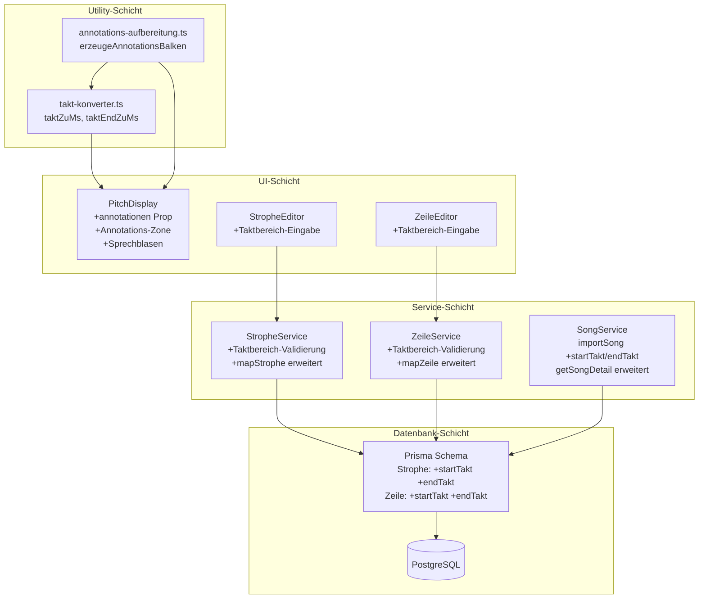
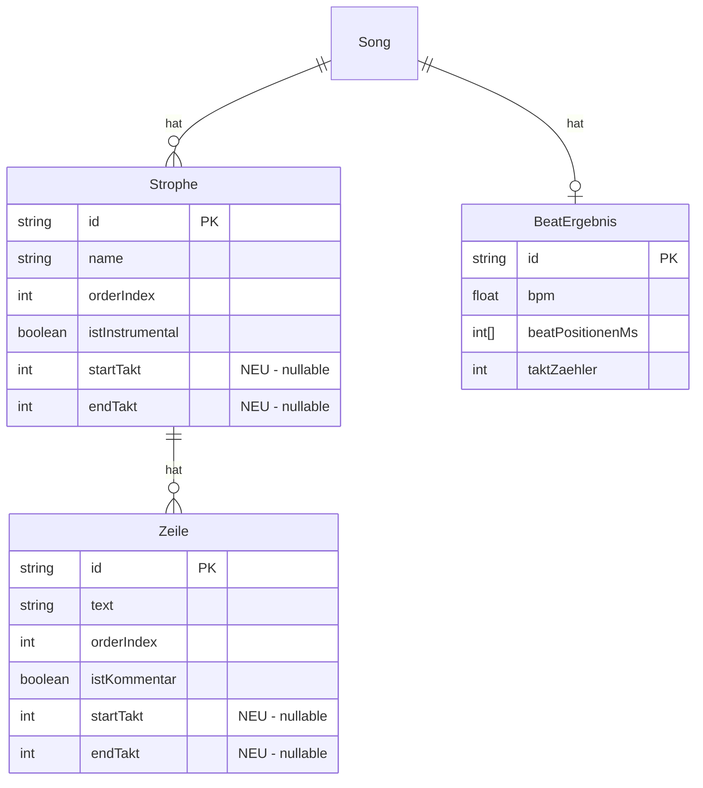

# Design-Dokument: Annotation-Taktbereiche

## Übersicht

Dieses Feature erweitert die bestehenden Instrumental- und Kommentar-Annotationen um Taktbereich-Angaben (`startTakt`, `endTakt`). In der PitchDisplay-Komponente werden diese Annotationen als farbige horizontale Balken unterhalb der Pitch-Balken visualisiert. Jeder Annotationstyp erhält eine eigene Farbe (Blau/Cyan für Instrumental, Amber/Orange für Kommentar). Der Annotationstext wird direkt auf dem Balken angezeigt; bei kurzen Balken erscheint er in einer Sprechblasen-Darstellung, damit der Balken nicht künstlich verbreitert wird.

### Designentscheidungen

- **Taktbereich auf DB-Ebene** — `startTakt` und `endTakt` werden als optionale `Int`-Felder direkt auf den Modellen `Strophe` und `Zeile` gespeichert (nicht als Markup), da sie strukturelle Metadaten sind und keine Markup-Semantik haben
- **Neues Utility-Modul `takt-konverter.ts`** — reine Funktionen für die Takt→Millisekunden-Konvertierung, unabhängig von React, testbar mit Property-Based Tests
- **Neues Utility-Modul `annotations-aufbereitung.ts`** — bereitet Strophen/Zeilen-Daten zu renderbaren `AnnotationsBalken` auf, ebenfalls reine Funktionen
- **Annotations-Zone im SVG** — ein reservierter Bereich am unteren Rand des PitchDisplay-SVG, getrennt von den Pitch-Balken, mit Lane-Stacking bei Überlappungen
- **Sprechblasen als SVG-Elemente** — kein HTML-Overlay, sondern native SVG-Gruppen (`<g>`, `<rect>`, `<text>`, `<polygon>`) für konsistentes Rendering innerhalb des SVG-Viewports
- **Fallback für Instrumental ohne Taktbereich** — wenn eine Instrumental-Strophe keinen Taktbereich hat, aber einen Timecode-Markup besitzt, wird der Bereich vom Timecode bis zum nächsten Strophen-Timecode abgeleitet

## Architektur



### Datenfluss

1. **Speichern:** Editor → API (PATCH) → Service (Validierung) → Prisma → DB
2. **Laden:** DB → Prisma → Service (Mapping) → API → Client (`SongDetail` mit `startTakt`/`endTakt`)
3. **Rendering:** `SongDetail` + `BeatErgebnis` → `erzeugeAnnotationsBalken()` (nutzt `taktZuMs`) → `AnnotationsBalken[]` → PitchDisplay-Prop `annotationen`

## Komponenten und Schnittstellen

### 1. TaktKonverter: `src/lib/pitch-display/takt-konverter.ts`

Reine Funktionen für die Konvertierung von Taktnummern zu Millisekunden-Zeitpunkten.

```typescript
/**
 * Konvertiert eine Taktnummer in den Millisekunden-Zeitpunkt des ersten Beats dieses Takts.
 *
 * @param taktNummer - Taktnummer (≥ 1)
 * @param beatPositionenMs - Array aller Beat-Zeitpunkte in ms
 * @param taktZaehler - Beats pro Takt (z.B. 4 für 4/4)
 * @returns Millisekunden-Zeitpunkt oder null wenn keine Beats vorhanden
 */
export function taktZuMs(
  taktNummer: number,
  beatPositionenMs: number[],
  taktZaehler: number,
): number | null

/**
 * Konvertiert eine Taktnummer in den Millisekunden-Zeitpunkt des Endes dieses Takts
 * (= erster Beat des nächsten Takts, oder letzter bekannter Beat falls am Ende).
 *
 * @param taktNummer - Taktnummer (≥ 1)
 * @param beatPositionenMs - Array aller Beat-Zeitpunkte in ms
 * @param taktZaehler - Beats pro Takt (z.B. 4 für 4/4)
 * @returns Millisekunden-Zeitpunkt oder null wenn keine Beats vorhanden
 */
export function taktEndZuMs(
  taktNummer: number,
  beatPositionenMs: number[],
  taktZaehler: number,
): number | null
```

**Berechnungslogik:**

- `taktZuMs(t, beats, z)`: Der Beat-Index des ersten Beats von Takt `t` ist `(t - 1) * z`. Falls dieser Index ≥ `beats.length`, wird `beats[beats.length - 1]` zurückgegeben (letzter bekannter Beat).
- `taktEndZuMs(t, beats, z)`: Der Beat-Index des ersten Beats von Takt `t + 1` ist `t * z`. Falls dieser Index ≥ `beats.length`, wird `beats[beats.length - 1]` zurückgegeben.
- Falls `beats` leer ist, geben beide Funktionen `null` zurück.

### 2. Annotations-Aufbereitung: `src/lib/pitch-display/annotations-aufbereitung.ts`

Reine Funktion, die aus Song-Daten eine Liste renderbarer Annotationsbalken erzeugt.

```typescript
/** Typ eines Annotationsbalkens */
export type AnnotationsTyp = 'instrumental' | 'kommentar';

/** Ein renderbarer Annotationsbalken */
export interface AnnotationsBalken {
  startMs: number;
  endMs: number;
  text: string;
  typ: AnnotationsTyp;
}

/**
 * Erzeugt AnnotationsBalken aus Strophen- und Zeilen-Daten.
 *
 * @param strophen - Alle Strophen des Songs (mit Zeilen und Markups)
 * @param beatPositionenMs - Beat-Zeitpunkte in ms
 * @param taktZaehler - Beats pro Takt
 * @returns Array von AnnotationsBalken, sortiert nach startMs
 */
export function erzeugeAnnotationsBalken(
  strophen: StropheDetail[],
  beatPositionenMs: number[],
  taktZaehler: number,
): AnnotationsBalken[]
```

**Logik:**

1. **Instrumental-Strophen mit Taktbereich:** Für jede Strophe mit `istInstrumental === true` und `startTakt !== null`:
   - `startMs = taktZuMs(startTakt, beats, tz)`
   - `endMs = taktEndZuMs(endTakt ?? startTakt, beats, tz)` (wenn `endTakt` null, wird `startTakt` als End-Takt verwendet)
   - `text = strophe.name`
   - `typ = 'instrumental'`

2. **Instrumental-Strophen ohne Taktbereich, mit Timecode:** Für jede Strophe mit `istInstrumental === true`, `startTakt === null`, und einem Timecode-Markup (`typ === 'TIMECODE'`, `ziel === 'STROPHE'`, `timecodeMs !== null`):
   - `startMs = timecodeMs` des Markups
   - `endMs = timecodeMs` der nächsten Strophe (nach `orderIndex`) oder letzter Beat-Zeitpunkt
   - `text = strophe.name`
   - `typ = 'instrumental'`

3. **Kommentar-Zeilen mit Taktbereich:** Für jede Zeile mit `istKommentar === true` und `startTakt !== null`:
   - `startMs = taktZuMs(startTakt, beats, tz)`
   - `endMs = taktEndZuMs(endTakt ?? startTakt, beats, tz)`
   - `text = zeile.text`
   - `typ = 'kommentar'`

4. **Kommentar-Zeilen ohne Taktbereich:** Werden übersprungen (kein Balken).

5. Ergebnis wird nach `startMs` sortiert.

### 3. PitchDisplay-Erweiterung: `src/components/pitch-display/pitch-display.tsx`

Neue optionale Prop und Rendering-Logik für Annotationsbalken.

```typescript
interface PitchDisplayProps {
  // ... bestehende Props ...
  /** Optionale Annotationsbalken für Instrumental/Kommentar-Bereiche */
  annotationen?: AnnotationsBalken[];
}
```

**Rendering-Konzept:**

```
┌──────────────────────────────────────────────┐
│  Noten-Skala │  Hilfslinien + Pitch-Balken   │  ← Bestehender Bereich
│              │  Beat-Marker + Cursor          │
│──────────────┼────────────────────────────────│
│              │  ▓▓▓▓▓ Solo ▓▓▓▓▓             │  ← Annotations-Zone
│              │       ▒▒▒ [Pause] ▒▒▒         │     (Lane 1, Lane 2, ...)
└──────────────┴────────────────────────────────┘
```

**Annotations-Zone:**

- Reservierter Bereich am unteren Rand des SVG, Höhe = `ANNOTATION_LANE_HEIGHT * anzahlLanes`
- `ANNOTATION_LANE_HEIGHT = 22px` (Balkenhöhe 16px + 6px Abstand)
- Die SVG-Gesamthöhe wird um die Annotations-Zone erweitert
- Lane-Zuweisung: Greedy-Algorithmus — jeder Balken wird in die erste Lane platziert, in der er nicht mit einem bereits platzierten Balken überlappt

**Sprechblasen-Logik:**

- Textbreite wird über `<text>`-Element-Messung oder Heuristik (Zeichenanzahl × durchschnittliche Zeichenbreite) geschätzt
- Wenn Balkenbreite < Textbreite: Sprechblase rendern
  - Halbtransparenter Hintergrund-Rect in Annotationsfarbe
  - Kleines Dreieck (`<polygon>`) zeigt nach unten auf den Balken
  - Text zentriert in der Sprechblase
- Wenn Balkenbreite ≥ Textbreite: Text direkt auf dem Balken (zentriert, weiß, kleine Schrift)

**Farben:**

- Instrumental: `rgba(56, 189, 248, 0.6)` (Cyan/Sky) — Balken und Sprechblasen-Hintergrund
- Kommentar: `rgba(251, 191, 36, 0.6)` (Amber/Orange) — Balken und Sprechblasen-Hintergrund

**Viewport-Filterung:** Annotationsbalken werden analog zu Pitch-Balken gefiltert — nur Balken, deren Zeitbereich das aktuelle Viewport überlappt, werden gerendert.

**Barrierefreiheit:**

- `aria-label` des SVG wird um Annotationsanzahl erweitert (z.B. „Pitch-Anzeige: 42 Balken, Tonhöhenbereich C3 bis G4, 3 Annotationen")
- Jeder Annotationsbalken erhält ein `<title>`-Element mit Typ, Text und Taktbereich (z.B. „Instrumental: Solo, Takt 5 bis 12")

### 4. StropheService-Erweiterung: `src/lib/services/strophe-service.ts`

**Validierung in `updateStrophe()`:**

```typescript
// Taktbereich-Validierung
if (data.startTakt !== undefined) {
  if (data.startTakt !== null && (!Number.isInteger(data.startTakt) || data.startTakt < 1)) {
    throw new Error("startTakt muss eine positive Ganzzahl sein");
  }
}
if (data.endTakt !== undefined) {
  if (data.endTakt !== null && (!Number.isInteger(data.endTakt) || data.endTakt < 1)) {
    throw new Error("endTakt muss eine positive Ganzzahl sein");
  }
}

// Konsistenzprüfung: endTakt ohne startTakt ist ungültig
const effektivStartTakt = data.startTakt !== undefined ? data.startTakt : bestehendeStrophe.startTakt;
const effektivEndTakt = data.endTakt !== undefined ? data.endTakt : bestehendeStrophe.endTakt;

if (effektivEndTakt !== null && effektivStartTakt === null) {
  throw new Error("endTakt kann nicht ohne startTakt gesetzt werden");
}
if (effektivStartTakt !== null && effektivEndTakt !== null && effektivStartTakt > effektivEndTakt) {
  throw new Error("startTakt muss kleiner oder gleich endTakt sein");
}
```

**Mapping in `mapStrophe()`:** Die Felder `startTakt` und `endTakt` werden aus dem DB-Objekt in `StropheDetail` übernommen.

### 5. ZeileService-Erweiterung: `src/lib/services/zeile-service.ts`

Analoge Validierung und Mapping wie beim StropheService.

### 6. SongService-Erweiterung: `src/lib/services/song-service.ts`

**`importSong()`:** `startTakt` und `endTakt` werden beim Erstellen von Strophen und Zeilen übergeben (Default: `null`). Die gleiche Validierung wie bei `updateStrophe`/`updateZeile` wird angewendet.

**`getSongDetail()`:** Die Felder `startTakt` und `endTakt` werden in die Mapping-Logik für `StropheDetail` und `ZeileDetail` aufgenommen.

### 7. Editor-UI: Taktbereich-Eingabe

**StropheEditor** (`src/components/songs/strophe-editor.tsx`):

- Wenn `strophe.istInstrumental === true`: Zwei `<input type="number" min={1} step={1}>` Felder für Start-Takt und End-Takt anzeigen
- Label: „Takt von" / „bis"
- Kompakte Inline-Darstellung neben dem Instrumental-Toggle
- Bestätigung per Blur oder Enter → PATCH-Request
- Leere Felder → `null` senden (Taktbereich entfernen)
- Client-seitige Validierung: `endTakt >= startTakt`, nur positive Ganzzahlen
- Optimistic Update mit Rollback bei API-Fehler

**ZeileEditor** (`src/components/songs/zeile-editor.tsx`):

- Wenn `zeile.istKommentar === true`: Zwei `<input type="number" min={1} step={1}>` Felder für Start-Takt und End-Takt anzeigen
- Gleiche Logik wie beim StropheEditor

## Datenmodelle

### Prisma-Schema-Erweiterungen

```prisma
model Strophe {
  // ... bestehende Felder ...
  istInstrumental Boolean  @default(false)
  startTakt       Int?                        // NEU
  endTakt         Int?                        // NEU
}

model Zeile {
  // ... bestehende Felder ...
  istKommentar Boolean @default(false)
  startTakt    Int?                           // NEU
  endTakt      Int?                           // NEU
}
```

**Migration:** `ALTER TABLE strophen ADD COLUMN "startTakt" INTEGER; ALTER TABLE strophen ADD COLUMN "endTakt" INTEGER;` (analog für `zeilen`). Bestehende Daten bleiben unverändert — alle Felder sind `null`.

### TypeScript-Typ-Erweiterungen

```typescript
// src/types/song.ts — Erweiterungen

export interface StropheDetail {
  // ... bestehende Felder ...
  startTakt: number | null;   // NEU
  endTakt: number | null;     // NEU
}

export interface ZeileDetail {
  // ... bestehende Felder ...
  startTakt: number | null;   // NEU
  endTakt: number | null;     // NEU
}

export interface UpdateStropheInput {
  name?: string;
  istInstrumental?: boolean;
  startTakt?: number | null;  // NEU
  endTakt?: number | null;    // NEU
}

export interface UpdateZeileInput {
  text?: string;
  uebersetzung?: string;
  istKommentar?: boolean;
  startTakt?: number | null;  // NEU
  endTakt?: number | null;    // NEU
}

export interface ImportStropheInput {
  name: string;
  istInstrumental?: boolean;
  startTakt?: number;         // NEU
  endTakt?: number;           // NEU
  zeilen: ImportZeileInput[];
  markups?: ImportMarkupInput[];
}

export interface ImportZeileInput {
  text: string;
  uebersetzung?: string;
  istKommentar?: boolean;
  startTakt?: number;         // NEU
  endTakt?: number;           // NEU
  markups?: ImportMarkupInput[];
}
```

### Neuer Typ: AnnotationsBalken

```typescript
// src/lib/pitch-display/annotations-aufbereitung.ts

export type AnnotationsTyp = 'instrumental' | 'kommentar';

export interface AnnotationsBalken {
  startMs: number;   // Start-Zeitpunkt in Millisekunden
  endMs: number;     // End-Zeitpunkt in Millisekunden
  text: string;      // Anzeigetext (Strophen-Name oder Zeilen-Text)
  typ: AnnotationsTyp;
}
```

### Datenfluss-Diagramm



## Correctness Properties

*Eine Property ist eine Eigenschaft oder ein Verhalten, das über alle gültigen Ausführungen eines Systems hinweg gelten sollte — im Wesentlichen eine formale Aussage darüber, was das System tun soll. Properties bilden die Brücke zwischen menschenlesbaren Spezifikationen und maschinenverifizierbaren Korrektheitsgarantien.*

### Property 1: Taktbereich-Validierung akzeptiert nur gültige Werte

*Für alle* Eingabewerte `startTakt` und `endTakt` gilt: Die Validierung (in StropheService, ZeileService und Import) akzeptiert den Wert genau dann, wenn er `null` ist oder eine positive Ganzzahl (≥ 1). Nicht-ganzzahlige Werte, Null und negative Werte werden abgelehnt.

**Validates: Requirements 2.1, 2.2, 2.6, 2.7, 10.4**

### Property 2: Taktbereich-Invariante startTakt ≤ endTakt

*Für alle* Kombinationen von `startTakt` und `endTakt` gilt: Die Validierung akzeptiert die Kombination genau dann, wenn (a) beide `null` sind, (b) nur `startTakt` gesetzt ist (endTakt wird als gleich startTakt interpretiert), oder (c) beide gesetzt sind und `startTakt ≤ endTakt`. Die Kombination `endTakt` gesetzt ohne `startTakt` wird immer abgelehnt.

**Validates: Requirements 2.3, 2.5, 2.8, 2.9, 2.10**

### Property 3: taktZuMs gibt den korrekten Beat-Zeitpunkt zurück

*Für jedes* nicht-leere Beat-Array `beats`, jeden `taktZaehler ≥ 1` und jede Taktnummer `t ≥ 1` gilt: `taktZuMs(t, beats, tz)` gibt `beats[min((t-1)*tz, beats.length-1)]` zurück. Bei leerem Beat-Array gibt die Funktion `null` zurück.

**Validates: Requirements 4.1, 4.2, 4.4, 4.5**

### Property 4: taktZuMs(t) ≤ taktEndZuMs(t) für alle gültigen Taktnummern

*Für jedes* nicht-leere Beat-Array, jeden `taktZaehler ≥ 1` und jede Taktnummer `t ≥ 1` gilt: `taktZuMs(t, beats, tz)` liefert einen Wert, der kleiner oder gleich `taktEndZuMs(t, beats, tz)` ist.

**Validates: Requirements 4.3, 4.6**

### Property 5: Monotonie von taktZuMs

*Für jedes* nicht-leere Beat-Array, jeden `taktZaehler ≥ 1` und alle Taktnummern `t1 < t2` (beide ≥ 1) gilt: `taktZuMs(t1, beats, tz) ≤ taktZuMs(t2, beats, tz)`.

**Validates: Requirements 4.7**

### Property 6: Bereichs-Invariante der Takt-Konvertierung

*Für jedes* nicht-leere Beat-Array, jeden `taktZaehler ≥ 1` und jede Taktnummer `t ≥ 1` gilt: Sowohl `taktZuMs(t, beats, tz)` als auch `taktEndZuMs(t, beats, tz)` liefern Werte innerhalb des Bereichs `[beats[0], beats[beats.length-1]]`.

**Validates: Requirements 4.8**

### Property 7: Annotations-Aufbereitung erzeugt korrekte Balken

*Für jede* Menge von Strophen und Zeilen mit beliebigen `istInstrumental`/`istKommentar`-Flags und Taktbereichen gilt: `erzeugeAnnotationsBalken` erzeugt genau einen Balken vom Typ `'instrumental'` für jede Strophe mit `istInstrumental === true` und gesetztem `startTakt`, mit `text === strophe.name`, und genau einen Balken vom Typ `'kommentar'` für jede Zeile mit `istKommentar === true` und gesetztem `startTakt`, mit `text === zeile.text`. Strophen/Zeilen ohne Taktbereich (und ohne Timecode-Fallback) erzeugen keinen Balken.

**Validates: Requirements 5.2, 5.3, 5.4, 5.6, 5.7**

### Property 8: Annotations-Aufbereitung startMs ≤ endMs Invariante

*Für alle* von `erzeugeAnnotationsBalken` erzeugten Balken gilt: `startMs ≤ endMs`.

**Validates: Requirements 5.8**

### Property 9: Lane-Zuweisung ohne Überlappung

*Für jede* Menge von Annotationsbalken mit beliebigen Zeitbereichen gilt: Nach der Lane-Zuweisung überlappen sich keine zwei Balken innerhalb derselben Lane (d.h. für alle Balken A und B in derselben Lane gilt: `A.endMs ≤ B.startMs` oder `B.endMs ≤ A.startMs`).

**Validates: Requirements 6.7**

### Property 10: Viewport-Filterung der Annotationsbalken

*Für jeden* Viewport und jede Menge von Annotationsbalken gilt: Die gefilterten Balken sind genau diejenigen, deren Zeitbereich `[startMs, endMs]` den Viewport-Zeitbereich `[viewport.startMs, viewport.endMs]` überlappt. Kein Balken außerhalb des Viewports wird eingeschlossen, kein Balken innerhalb wird ausgeschlossen.

**Validates: Requirements 6.8**

## Fehlerbehandlung

### Taktbereich-Validierung

| Fehler | Ursache | HTTP-Status | Nachricht |
|--------|---------|-------------|-----------|
| Ungültiger startTakt | Wert < 1 oder nicht ganzzahlig | 400 | „startTakt muss eine positive Ganzzahl sein" |
| Ungültiger endTakt | Wert < 1 oder nicht ganzzahlig | 400 | „endTakt muss eine positive Ganzzahl sein" |
| endTakt ohne startTakt | endTakt gesetzt, startTakt null | 400 | „endTakt kann nicht ohne startTakt gesetzt werden" |
| startTakt > endTakt | Bereichs-Verletzung | 400 | „startTakt muss kleiner oder gleich endTakt sein" |

### Import-Validierung

Beim Song-Import gelten die gleichen Validierungsregeln. Ungültige Taktbereich-Werte führen zum Abbruch des gesamten Imports (Transaktion wird zurückgerollt).

### Fehlende Beat-Daten

| Situation | Verhalten |
|-----------|-----------|
| Kein BeatErgebnis vorhanden | `erzeugeAnnotationsBalken` gibt leeres Array zurück — keine Annotationsbalken werden gerendert |
| Beat-Array leer | `taktZuMs` und `taktEndZuMs` geben `null` zurück — Balken werden übersprungen |
| Taktnummer > verfügbare Takte | Letzter bekannter Beat-Zeitpunkt wird verwendet (graceful degradation) |

### Editor-Fehler

| Situation | Verhalten |
|-----------|-----------|
| API-Fehler beim Speichern | Optimistic Update wird zurückgerollt, Fehlermeldung wird angezeigt |
| Ungültige Eingabe (endTakt < startTakt) | Client-seitige Fehlermeldung, kein API-Request |
| Nicht-numerische Eingabe | HTML `type="number"` verhindert Eingabe, zusätzliche Validierung im onChange-Handler |

## Teststrategie

### Property-Based Tests (fast-check + vitest)

Die Property-Tests verwenden [fast-check](https://github.com/dubzzz/fast-check) als PBT-Bibliothek (bereits im Projekt vorhanden). Jeder Test läuft mit mindestens 100 Iterationen.

| Property | Testdatei | Beschreibung |
|----------|-----------|--------------|
| Property 1 | `__tests__/annotation-bar-ranges/taktbereich-validierung.property.test.ts` | Taktbereich-Wert-Validierung |
| Property 2 | `__tests__/annotation-bar-ranges/taktbereich-invariante.property.test.ts` | startTakt ≤ endTakt Invariante |
| Property 3 | `__tests__/annotation-bar-ranges/takt-zu-ms-korrektheit.property.test.ts` | taktZuMs Beat-Index-Korrektheit |
| Property 4 | `__tests__/annotation-bar-ranges/takt-start-end-ordnung.property.test.ts` | taktZuMs ≤ taktEndZuMs |
| Property 5 | `__tests__/annotation-bar-ranges/takt-monotonie.property.test.ts` | Monotonie von taktZuMs |
| Property 6 | `__tests__/annotation-bar-ranges/takt-bereichs-invariante.property.test.ts` | Werte innerhalb Beat-Bereich |
| Property 7 | `__tests__/annotation-bar-ranges/annotations-aufbereitung-korrektheit.property.test.ts` | Korrekte Balken-Erzeugung |
| Property 8 | `__tests__/annotation-bar-ranges/annotations-aufbereitung-invariante.property.test.ts` | startMs ≤ endMs Invariante |
| Property 9 | `__tests__/annotation-bar-ranges/lane-zuweisung.property.test.ts` | Keine Überlappung in Lanes |
| Property 10 | `__tests__/annotation-bar-ranges/viewport-filterung.property.test.ts` | Viewport-Filterung korrekt |

**Tag-Format:** `Feature: annotation-bar-ranges, Property {N}: {Titel}`

**Konfiguration:** Minimum 100 Iterationen pro Property-Test (`fc.assert(fc.property(...), { numRuns: 100 })`).

**Generatoren:** Gemeinsame fast-check Arbitraries in `__tests__/annotation-bar-ranges/generators.ts`:

- `arbBeatPositionenMs()` — sortiertes Array positiver Millisekunden-Werte (1–200 Einträge)
- `arbTaktZaehler()` — Ganzzahl 1–12 (typisch: 2, 3, 4, 6)
- `arbTaktNummer()` — positive Ganzzahl 1–100
- `arbStropheDetail()` — zufällige StropheDetail mit variierenden `istInstrumental`, `startTakt`, `endTakt`
- `arbZeileDetail()` — zufällige ZeileDetail mit variierenden `istKommentar`, `startTakt`, `endTakt`
- `arbAnnotationsBalken()` — zufälliger AnnotationsBalken mit `startMs ≤ endMs`

### Unit-Tests (Beispiel-basiert)

| Bereich | Testdatei | Beschreibung |
|---------|-----------|--------------|
| TaktKonverter | `__tests__/annotation-bar-ranges/takt-konverter.test.ts` | Leeres Array, einzelner Beat, Takt über Array-Ende, taktZaehler-Varianten |
| Annotations-Aufbereitung | `__tests__/annotation-bar-ranges/annotations-aufbereitung.test.ts` | Timecode-Fallback, gemischte Strophen, leere Eingabe |
| PitchDisplay Annotations | `__tests__/annotation-bar-ranges/pitch-display-annotations.test.tsx` | Rendering mit/ohne Annotationen, Farben, Sprechblasen, aria-labels |
| Editor Taktbereich | `__tests__/annotation-bar-ranges/editor-taktbereich.test.tsx` | Eingabefelder sichtbar/ausgeblendet, Validierung, optimistic update |

### Integrationstests

| Bereich | Testdatei | Beschreibung |
|---------|-----------|--------------|
| StropheService API | `__tests__/annotation-bar-ranges/strophe-taktbereich-api.test.ts` | PATCH startTakt/endTakt, GET enthält Felder, Validierungsfehler |
| ZeileService API | `__tests__/annotation-bar-ranges/zeile-taktbereich-api.test.ts` | PATCH startTakt/endTakt, GET enthält Felder, Validierungsfehler |
| Import | `__tests__/annotation-bar-ranges/import-taktbereich.test.ts` | Import mit/ohne Taktbereich, Validierung, Default-Werte |
