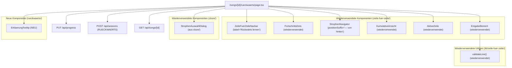
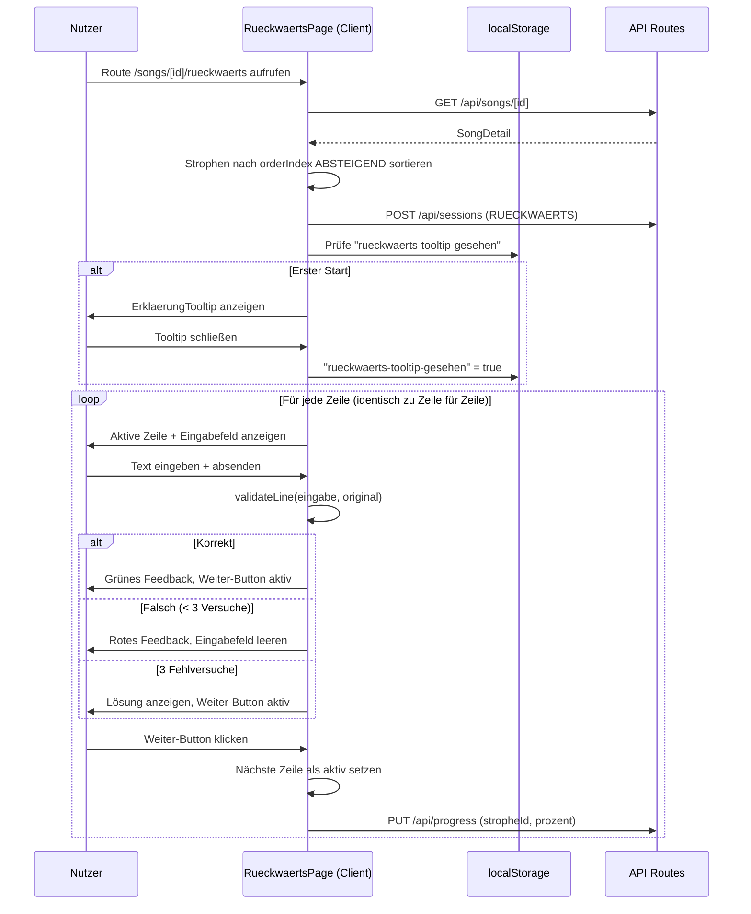

# Design-Dokument: Rückwärts lernen – Lernmethode

## Übersicht

Die Lernmethode „Rückwärts lernen" ist eine Variante der bestehenden „Zeile für Zeile"-Methode. Die Lerninteraktion innerhalb jeder Strophe ist identisch (kumulative Zeilen-Eingabe, Textvergleich, Fehlversuche, Fortschritts-Dots). Der einzige strukturelle Unterschied: Die Strophen werden in umgekehrter Reihenfolge präsentiert (letzte Strophe zuerst), um den Primacy-Effekt zu bekämpfen.

Das Feature maximiert die Wiederverwendung bestehender Komponenten und Utilities:
- Dedizierte Route: `/songs/[id]/rueckwaerts/page.tsx`
- Wiederverwendung aller Komponenten aus `src/components/zeile-fuer-zeile/` (mit Prop-Anpassungen für Navbar und StrophenNavigator)
- Wiederverwendung aller Utilities aus `src/lib/zeile-fuer-zeile/` (`validateLine`, `calculateStropheProgress`)
- Session-Tracking via `POST /api/sessions` mit `lernmethode: "RUECKWAERTS"` (Enum existiert bereits im Prisma-Schema)
- Fortschritts-Updates via `PUT /api/progress`
- Wiederverwendung des `StrophenAuswahlDialog` aus `src/components/cloze/`

### Designentscheidungen

1. **Maximale Wiederverwendung**: Alle 6 Komponenten aus `src/components/zeile-fuer-zeile/` werden direkt importiert. Navbar und StrophenNavigator erhalten neue Props für Label-Anpassungen, statt neue Komponenten zu erstellen.

2. **Navbar-Erweiterung**: Die bestehende `ZeileFuerZeileNavbar` erhält ein optionales `label`-Prop (Default: „Zeile für Zeile"), sodass die Rückwärts-Seite `label="Rückwärts lernen"` übergeben kann, ohne eine separate Navbar-Komponente zu benötigen.

3. **StrophenNavigator-Erweiterung**: Der bestehende `StrophenNavigator` erhält ein optionales `positionSuffix`-Prop (z.B. „— von hinten") und ein optionales `showDirectionIcon`-Prop, um den Richtungspfeil anzuzeigen.

4. **Umgekehrte Sortierung**: Die einzige logische Änderung gegenüber der Zeile-für-Zeile-Seite ist die Sortierung der Strophen nach `orderIndex` absteigend statt aufsteigend. Dies geschieht in der Page-Komponente.

5. **Erklärungs-Tooltip als neue Komponente**: Der „Warum von hinten?"-Tooltip ist die einzige wirklich neue UI-Komponente. Er wird in `src/components/rueckwaerts/erklaerung-tooltip.tsx` platziert und nutzt `localStorage` für die Persistierung.

6. **Keine neuen API-Routen nötig**: Alle benötigten Endpunkte existieren bereits (`/api/songs/[id]`, `/api/sessions`, `/api/progress`). Der `RUECKWAERTS`-Enum-Wert ist bereits im Prisma-Schema vorhanden.

7. **Rein clientseitiger Zustand**: Identisch zur Zeile-für-Zeile-Methode – der aktuelle Zeilen-Index, Fehlversuche und kumulative Ansicht werden im React-State gehalten.

## Architektur



### Datenfluss



### Unterschiede zur Zeile-für-Zeile-Seite

| Aspekt | Zeile für Zeile | Rückwärts lernen |
|--------|----------------|------------------|
| Route | `/songs/[id]/zeile-fuer-zeile` | `/songs/[id]/rueckwaerts` |
| Strophen-Sortierung | `orderIndex` aufsteigend | `orderIndex` absteigend |
| Navbar-Label | „Zeile für Zeile" | „Rückwärts lernen" |
| Positions-Label | „Strophe N von M" | „Strophe N von M — von hinten" |
| Richtungs-Icon | Keines | ← Pfeil neben Label |
| Erklärungs-Tooltip | Keiner | „Warum von hinten?" beim ersten Start |
| Session-Lernmethode | `ZEILE_FUER_ZEILE` | `RUECKWAERTS` |
| Lerninteraktion | Kumulative Zeilen-Eingabe | Identisch |

## Komponenten und Schnittstellen

### 1. Page-Komponente: `RueckwaertsPage`

**Pfad**: `src/app/(main)/songs/[id]/rueckwaerts/page.tsx`

**Verantwortung**: Orchestriert den Lernablauf. Nahezu identisch zur `ZeileFuerZeilePage`, mit folgenden Unterschieden:
- Strophen werden nach `orderIndex` absteigend sortiert
- Session wird mit `lernmethode: "RUECKWAERTS"` erstellt
- Navbar erhält `label="Rückwärts lernen"`
- StrophenNavigator erhält `positionSuffix="— von hinten"` und `showDirectionIcon={true}`
- ErklaerungTooltip wird beim ersten Start angezeigt

**State** (identisch zu ZeileFuerZeilePage, plus Tooltip-State):
```typescript
interface RueckwaertsState {
  // Identisch zu ZeileFuerZeileState
  song: SongDetail | null;
  loading: boolean;
  error: string | null;
  activeStrophenIds: Set<string> | null;
  currentStropheIndex: number;
  currentZeileIndex: number;
  completedZeilen: Set<string>;
  eingabe: string;
  fehlversuche: number;
  zeilenStatus: "eingabe" | "korrekt" | "loesung";
  dialogOpen: boolean;
  stropheAbgeschlossen: boolean;
  // Neu für Rückwärts
  tooltipVisible: boolean;
}
```

**Schlüsseländerung – Strophen-Sortierung**:
```typescript
// Zeile für Zeile (bestehend):
const filteredStrophen = [...song.strophen]
  .filter(s => activeStrophenIds?.has(s.id) ?? true)
  .sort((a, b) => a.orderIndex - b.orderIndex);  // aufsteigend

// Rückwärts lernen (neu):
const filteredStrophen = [...song.strophen]
  .filter(s => activeStrophenIds?.has(s.id) ?? true)
  .sort((a, b) => b.orderIndex - a.orderIndex);  // absteigend
```

### 2. Erweiterte `ZeileFuerZeileNavbar`

**Pfad**: `src/components/zeile-fuer-zeile/navbar.tsx` (bestehend, wird erweitert)

**Neue Props**:
```typescript
interface ZeileFuerZeileNavbarProps {
  songId: string;
  songTitle: string;
  label?: string;  // NEU – Default: "Zeile für Zeile"
}
```

**Änderung**: Das Label-`<span>` zeigt `label` statt des hartcodierten „Zeile für Zeile" an. Bestehende Aufrufe bleiben durch den Default-Wert kompatibel.

### 3. Erweiterter `StrophenNavigator`

**Pfad**: `src/components/zeile-fuer-zeile/strophen-navigator.tsx` (bestehend, wird erweitert)

**Neue Props**:
```typescript
interface StrophenNavigatorProps {
  currentStropheName: string;
  currentPosition: number;
  totalStrophen: number;
  canGoBack: boolean;
  canGoForward: boolean;
  onPrevious: () => void;
  onNext: () => void;
  positionSuffix?: string;      // NEU – z.B. "— von hinten"
  showDirectionIcon?: boolean;  // NEU – zeigt ← Icon
}
```

**Änderung**: Das Positions-Label zeigt optional den Suffix und das Richtungs-Icon an:
```tsx
<p className="text-xs text-gray-500">
  {showDirectionIcon && <span className="mr-1">←</span>}
  Strophe {currentPosition} von {totalStrophen}
  {positionSuffix && <span> {positionSuffix}</span>}
</p>
```

### 4. Neue Komponente: `ErklaerungTooltip`

**Pfad**: `src/components/rueckwaerts/erklaerung-tooltip.tsx`

**Props**:
```typescript
interface ErklaerungTooltipProps {
  visible: boolean;
  onClose: () => void;
}
```

**Verhalten**:
- Zeigt einen modalen Dialog mit `role="dialog"` und `aria-labelledby`
- Titel: „Warum von hinten?"
- Inhalt: Kurze Erklärung des Primacy-Effekts (2-3 Sätze)
- Schließen-Button mit `aria-label="Erklärung schließen"`
- Schließbar per Escape-Taste oder Klick auf Schließen-Button
- Mindestgröße 44×44px für den Schließen-Button

**localStorage-Logik** (in der Page-Komponente):
```typescript
const TOOLTIP_KEY = "rueckwaerts-tooltip-gesehen";

// Beim Mount prüfen
const [tooltipVisible, setTooltipVisible] = useState(() => {
  if (typeof window === "undefined") return false;
  return localStorage.getItem(TOOLTIP_KEY) !== "true";
});

// Beim Schließen persistieren
const handleTooltipClose = () => {
  setTooltipVisible(false);
  localStorage.setItem(TOOLTIP_KEY, "true");
};
```

### 5–8. Wiederverwendete Komponenten (ohne Änderungen)

Die folgenden Komponenten werden 1:1 aus `src/components/zeile-fuer-zeile/` importiert:

| Komponente | Pfad | Änderung |
|-----------|------|----------|
| `FortschrittsDots` | `fortschritts-dots.tsx` | Keine |
| `KumulativeAnsicht` | `kumulative-ansicht.tsx` | Keine |
| `AktiveZeile` | `aktive-zeile.tsx` | Keine |
| `EingabeBereich` | `eingabe-bereich.tsx` | Keine |

### 9–10. Wiederverwendete Utilities (ohne Änderungen)

| Utility | Pfad | Änderung |
|---------|------|----------|
| `validateLine` | `src/lib/zeile-fuer-zeile/validate-line.ts` | Keine |
| `calculateStropheProgress` | `src/lib/zeile-fuer-zeile/progress.ts` | Keine |

## Datenmodell

### Bestehende Entitäten (keine Änderungen nötig)

Das Feature nutzt ausschließlich bestehende Datenbank-Entitäten und den bereits vorhandenen `RUECKWAERTS`-Enum-Wert:

| Entität | Verwendung |
|---------|-----------|
| `Song` | Song-Daten laden (Titel, Strophen, Zeilen) |
| `Strophe` | Strophen-Navigation in umgekehrter Reihenfolge, Fortschritts-Tracking |
| `Zeile` | Aktive Zeile, Textvergleich, kumulative Ansicht |
| `Session` | Session-Tracking mit `RUECKWAERTS` |
| `Fortschritt` | Prozentualer Lernstand pro Strophe |
| `Lernmethode` (Enum) | `RUECKWAERTS` bereits vorhanden |

### Client-seitiges Zustandsmodell

Identisch zur Zeile-für-Zeile-Methode:

```typescript
interface StropheLernzustand {
  currentZeileIndex: number;
  completedZeilen: Set<string>;
  fehlversuche: number;
}
```

Beim Strophen-Wechsel wird der Lernzustand in einer `Map<string, StropheLernzustand>` gespeichert.

### API-Aufrufe

| Aktion | Methode | Endpunkt | Body |
|--------|---------|----------|------|
| Song laden | GET | `/api/songs/[id]` | – |
| Session starten | POST | `/api/sessions` | `{ songId, lernmethode: "RUECKWAERTS" }` |
| Fortschritt speichern | PUT | `/api/progress` | `{ stropheId, prozent }` |
| Session abschließen | POST | `/api/sessions` | `{ songId, lernmethode: "RUECKWAERTS" }` |

