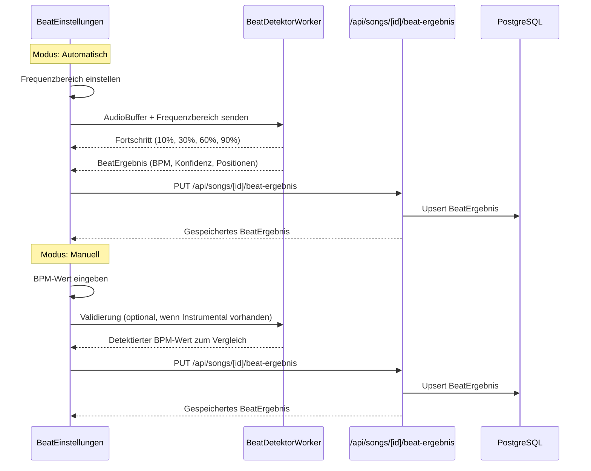
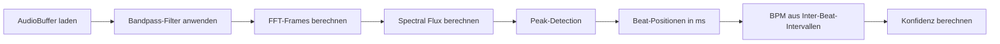

# Design-Dokument: Takt-Erkennung (Beat Detection)

## Übersicht

Die Takt-Erkennung erweitert den Song Text Trainer um die Fähigkeit, das Tempo (BPM) eines Songs zu ermitteln und Beat-Positionen zu berechnen. Das Feature bietet zwei Modi:

1. **Automatische Erkennung** — Analyse der Instrumental-Spur mittels Web Worker im definierten Frequenzbereich (z.B. Bassdrum bei 60–200 Hz)
2. **Manuelle Eingabe** — Direkte BPM-Eingabe mit optionaler Validierung gegen die detektierten Beats

Das Ergebnis (BPM, Konfidenz, Beat-Positionen in Millisekunden) wird als `BeatErgebnis` in der Datenbank persistiert und auf der Song-Detail-Seite als visuelle Beat-Marker auf dem Fortschrittsbalken dargestellt.

### Designentscheidungen

- **Web Worker für Beat-Erkennung** — Folgt dem bestehenden Muster aus `src/lib/vocal-trainer/analyse-worker.ts`. Die Frequenzanalyse läuft in einem separaten Thread, damit die UI nicht blockiert wird.
- **Onset-Detection-Algorithmus** — Spectral Flux mit Bandpass-Filter im konfigurierbaren Frequenzbereich. Kein externes NPM-Paket nötig, da die Implementierung mit der Web Audio API (`OfflineAudioContext`, `AnalyserNode`) und reiner Signalverarbeitung im Worker erfolgt.
- **1:1-Beziehung Song ↔ BeatErgebnis** — Ein Song hat maximal ein BeatErgebnis. Bei erneuter Erkennung wird das bestehende Ergebnis überschrieben (Upsert-Semantik).
- **Integration in bestehenden AudioPlayer** — Die Beat-Marker werden als Overlay auf dem Fortschrittsbalken des AudioPlayers dargestellt. Der `SharedAudioProvider` liefert die aktuelle Wiedergabeposition für die Beat-Hervorhebung.
- **Beat-Einstellungen als aufklappbarer Bereich** — Auf der Song-Detail-Seite unterhalb des AudioPlayers, konsistent mit dem bestehenden Layout-Muster.
- **Deutsche Benennung** — Alle Modelle, Typen und UI-Texte folgen der bestehenden deutschen Namenskonvention (z.B. `BeatErgebnis`, `BeatMethode`, `Frequenzbereich_Regler`).

## Architektur

### Komponentenhierarchie

```
SongDetailPage (bestehend)
└── SharedAudioProvider (bestehend)
    ├── AudioPlayer (bestehend, erweitert um Beat-Marker)
    │   └── BeatMarkerOverlay (neu)
    ├── StickyPlayerBar (bestehend, erweitert um Beat-Marker)
    │   └── BeatMarkerOverlay (neu)
    └── BeatEinstellungen (neu)
        ├── ModusAuswahl (neu)
        ├── FrequenzbereichRegler (neu)
        ├── BpmEingabe (neu)
        ├── BpmValidierung (neu)
        └── BeatAnzeige (neu)
```

### Datenfluss



### Beat-Detection-Algorithmus

Der Beat-Detektor verwendet einen **Spectral-Flux-basierten Onset-Detection-Ansatz**:



**Schritte im Detail:**

1. **Audio laden** — Die Instrumental-Spur wird über `fetch` als `ArrayBuffer` geladen und mit `OfflineAudioContext.decodeAudioData()` dekodiert.
2. **Bandpass-Filter** — Ein `BiquadFilterNode` (Typ: bandpass) filtert das Signal auf den vom Nutzer definierten Frequenzbereich (Standard: 60–200 Hz für Bassdrum).
3. **FFT-Analyse** — Das gefilterte Signal wird in überlappende Frames (Hop-Size: 512 Samples) aufgeteilt. Für jeden Frame wird die FFT berechnet.
4. **Spectral Flux** — Für aufeinanderfolgende Frames wird die positive Differenz der Magnitude-Spektren summiert. Steigende Energie deutet auf einen Onset hin.
5. **Peak-Detection** — Lokale Maxima im Spectral-Flux-Signal werden als Beat-Kandidaten identifiziert. Ein adaptiver Schwellenwert (gleitender Mittelwert + Faktor) filtert Rauschen.
6. **BPM-Berechnung** — Aus den Inter-Beat-Intervallen (IBI) wird der Median berechnet und in BPM umgerechnet. Der Wert wird auf den gültigen Bereich 40–240 BPM begrenzt.
7. **Konfidenz** — Basiert auf der Standardabweichung der IBIs. Geringe Streuung = hohe Konfidenz. Formel: `konfidenz = max(0, 100 - (stddev / medianIBI) * 200)`.

## Komponenten und Schnittstellen

### Neue Dateien

| Pfad | Beschreibung |
|------|-------------|
| `src/lib/beat-detection/beat-detektor-worker.ts` | Web Worker für die Beat-Analyse |
| `src/lib/beat-detection/beat-algorithmus.ts` | Reine Funktionen: Spectral Flux, Peak-Detection, BPM-Berechnung, Konfidenz |
| `src/lib/beat-detection/bpm-validierung.ts` | Vergleich manueller BPM-Wert vs. detektierter Wert |
| `src/types/beat-detection.ts` | TypeScript-Typen und Interfaces |
| `src/lib/services/beat-ergebnis-service.ts` | Service-Layer für DB-Operationen (Upsert, Get) |
| `src/app/api/songs/[id]/beat-ergebnis/route.ts` | API-Route (GET, PUT) |
| `src/components/songs/beat-einstellungen.tsx` | Hauptkomponente für Beat-Einstellungen |
| `src/components/songs/beat-modus-auswahl.tsx` | Toggle zwischen Automatisch/Manuell |
| `src/components/songs/frequenzbereich-regler.tsx` | Dual-Slider für Frequenzbereich |
| `src/components/songs/bpm-eingabe.tsx` | Numerisches Eingabefeld für manuelle BPM |
| `src/components/songs/bpm-validierung.tsx` | Validierungsanzeige (Bestätigung/Warnung) |
| `src/components/songs/beat-anzeige.tsx` | BPM-Wert, Konfidenz, Methode-Label |
| `src/components/songs/beat-marker-overlay.tsx` | Beat-Marker auf dem Fortschrittsbalken |

### Geänderte Dateien

| Pfad | Änderung |
|------|----------|
| `prisma/schema.prisma` | Neues Modell `BeatErgebnis`, Enum `BeatMethode`, Relation zu `Song` |
| `src/app/(main)/songs/[id]/page.tsx` | Integration der `BeatEinstellungen` und `BeatMarkerOverlay` |
| `src/components/songs/audio-player.tsx` | Optionales `BeatMarkerOverlay` auf dem Fortschrittsbalken |
| `src/components/songs/sticky-player-bar.tsx` | Optionales `BeatMarkerOverlay` auf dem Fortschrittsbalken |
| `src/types/song.ts` | `SongDetail` um optionales `beatErgebnis` erweitern |

### Schnittstellen

#### BeatDetektorWorker Messages

```typescript
// src/types/beat-detection.ts

export type BeatMethode = 'AUTOMATISCH' | 'MANUELL';

export interface BeatDetektorRequest {
  type: 'ANALYSE';
  audioBuffer: Float32Array;
  sampleRate: number;
  frequenzUntergrenze: number; // Hz
  frequenzObergrenze: number;  // Hz
}

export interface BeatDetektorResponse {
  type: 'ERGEBNIS' | 'FORTSCHRITT' | 'FEHLER';
  ergebnis?: BeatErgebnisLokal;
  fortschritt?: number;
  fehler?: string;
}

export interface BeatErgebnisLokal {
  bpm: number;
  konfidenz: number; // 0–100
  beatPositionenMs: number[];
}
```

#### BeatErgebnis API

```typescript
// GET /api/songs/[id]/beat-ergebnis → BeatErgebnisResponse | null
// PUT /api/songs/[id]/beat-ergebnis ← BeatErgebnisSpeichernInput → BeatErgebnisResponse

export interface BeatErgebnisResponse {
  id: string;
  songId: string;
  bpm: number;
  methode: BeatMethode;
  konfidenz: number | null;
  beatPositionenMs: number[];
  frequenzUntergrenze: number | null;
  frequenzObergrenze: number | null;
}

export interface BeatErgebnisSpeichernInput {
  bpm: number;
  methode: BeatMethode;
  konfidenz?: number | null;
  beatPositionenMs: number[];
  frequenzUntergrenze?: number | null;
  frequenzObergrenze?: number | null;
}
```

#### BeatEinstellungen Props

```typescript
interface BeatEinstellungenProps {
  songId: string;
  audioQuellen: AudioQuelleResponse[];
  initialBeatErgebnis: BeatErgebnisResponse | null;
}
```

#### BeatMarkerOverlay Props

```typescript
interface BeatMarkerOverlayProps {
  beatPositionenMs: number[];
  durationMs: number;
  currentTimeMs: number;
}
```

#### beat-algorithmus.ts (reine Funktionen)

```typescript
// Spectral Flux aus FFT-Frames berechnen
export function berechneSpectralFlux(frames: Float32Array[]): number[];

// Peaks im Spectral-Flux-Signal finden
export function findePeaks(flux: number[], schwellenwertFaktor: number): number[];

// BPM aus Beat-Positionen berechnen
export function berechneBpm(beatPositionenMs: number[]): number;

// Konfidenz aus Inter-Beat-Intervallen berechnen
export function berechneKonfidenz(beatPositionenMs: number[]): number;

// BPM-Validierung: Abweichung zwischen manuellem und detektiertem Wert
export function berechneAbweichungProzent(manuellBpm: number, detektiertBpm: number): number;
```

## Datenmodell

### Prisma-Schema-Erweiterung

```prisma
enum BeatMethode {
  AUTOMATISCH
  MANUELL
}

model BeatErgebnis {
  id                  String      @id @default(cuid())
  songId              String      @unique
  bpm                 Int
  methode             BeatMethode
  konfidenz           Int?
  beatPositionenMs    Int[]
  frequenzUntergrenze Int?
  frequenzObergrenze  Int?
  createdAt           DateTime    @default(now())
  updatedAt           DateTime    @updatedAt

  song Song @relation(fields: [songId], references: [id], onDelete: Cascade)

  @@map("beat_ergebnisse")
}
```

**Änderung am Song-Modell:**

```prisma
model Song {
  // ... bestehende Felder ...
  beatErgebnis BeatErgebnis?
}
```

### Feld-Beschreibungen

| Feld | Typ | Beschreibung |
|------|-----|-------------|
| `id` | String (cuid) | Primärschlüssel |
| `songId` | String (unique) | Fremdschlüssel zu Song, 1:1-Beziehung |
| `bpm` | Int | Erkannter oder manuell eingegebener BPM-Wert |
| `methode` | BeatMethode | AUTOMATISCH oder MANUELL |
| `konfidenz` | Int? | Konfidenz der automatischen Erkennung (0–100), null bei manueller Eingabe |
| `beatPositionenMs` | Int[] | Array der Beat-Zeitpunkte in Millisekunden |
| `frequenzUntergrenze` | Int? | Untere Frequenzgrenze in Hz (nur bei automatischer Erkennung) |
| `frequenzObergrenze` | Int? | Obere Frequenzgrenze in Hz (nur bei automatischer Erkennung) |
| `createdAt` | DateTime | Erstellungszeitpunkt |
| `updatedAt` | DateTime | Letzter Aktualisierungszeitpunkt |

### API-Endpunkte

#### GET /api/songs/[id]/beat-ergebnis

Gibt das gespeicherte BeatErgebnis für einen Song zurück.

| Status | Beschreibung |
|--------|-------------|
| 200 | `{ beatErgebnis: BeatErgebnisResponse }` |
| 200 | `{ beatErgebnis: null }` (kein Ergebnis vorhanden) |
| 401 | Nicht authentifiziert |
| 403 | Zugriff verweigert (fremder Song) |
| 404 | Song nicht gefunden |

#### PUT /api/songs/[id]/beat-ergebnis

Erstellt oder aktualisiert das BeatErgebnis eines Songs (Upsert).

**Request Body:** `BeatErgebnisSpeichernInput`

| Status | Beschreibung |
|--------|-------------|
| 200 | `{ beatErgebnis: BeatErgebnisResponse }` |
| 400 | Ungültige Eingabe (BPM außerhalb des Bereichs, fehlende Pflichtfelder) |
| 401 | Nicht authentifiziert |
| 403 | Zugriff verweigert (fremder Song) |
| 404 | Song nicht gefunden |

**Validierungsregeln:**
- `bpm` muss eine Ganzzahl im Bereich 20–300 sein
- `methode` muss `AUTOMATISCH` oder `MANUELL` sein
- `beatPositionenMs` muss ein Array von nicht-negativen Ganzzahlen sein
- `konfidenz` (wenn vorhanden) muss im Bereich 0–100 liegen
- `frequenzUntergrenze` und `frequenzObergrenze` (wenn vorhanden) müssen im Bereich 20–20000 Hz liegen
- `frequenzUntergrenze` muss kleiner als `frequenzObergrenze` sein


## Correctness Properties

*Eine Property ist eine Eigenschaft oder ein Verhalten, das für alle gültigen Ausführungen eines Systems gelten sollte — im Wesentlichen eine formale Aussage darüber, was das System tun soll. Properties bilden die Brücke zwischen menschenlesbaren Spezifikationen und maschinenverifizierbaren Korrektheitsgarantien.*

### Property 1: Standard-Modus basiert auf Instrumental-Verfügbarkeit

*Für jedes* Array von AudioQuellen gilt: Wenn mindestens eine AudioQuelle mit Rolle `INSTRUMENTAL` vorhanden ist, soll der Standard-Modus `AUTOMATISCH` sein; andernfalls soll der Standard-Modus `MANUELL` sein.

**Validates: Requirements 1.2, 1.3**

### Property 2: BPM-Erkennung liefert Werte im gültigen Bereich

*Für jedes* gültige Audio-Signal, das dem Beat-Detektor übergeben wird, soll der erkannte BPM-Wert im Bereich [40, 240] liegen.

**Validates: Requirements 2.6**

### Property 3: Frequenzbereich-Constraint-Durchsetzung

*Für jedes* Paar von Frequenzwerten (untergrenze, obergrenze) gilt: Nach Anwendung der Constraint-Logik soll `untergrenze < obergrenze` gelten. Wenn der Nutzer die Untergrenze über die Obergrenze schiebt, wird `obergrenze = untergrenze + 10`. Wenn der Nutzer die Obergrenze unter die Untergrenze schiebt, wird `untergrenze = obergrenze - 10`. Beide Werte bleiben im Bereich [20, 20000].

**Validates: Requirements 3.2, 3.4, 3.5**

### Property 4: BPM-Eingabe-Validierung

*Für jeden* Eingabewert gilt: Die Validierungsfunktion soll genau dann `true` zurückgeben, wenn der Wert eine Ganzzahl im Bereich [20, 300] ist. Für alle anderen Werte (nicht-ganzzahlig, außerhalb des Bereichs, nicht-numerisch) soll sie `false` zurückgeben.

**Validates: Requirements 4.2, 4.3, 4.4**

### Property 5: BPM-Abweichungsberechnung

*Für jedes* Paar von BPM-Werten (manuell, detektiert) mit detektiert > 0 gilt: Die berechnete prozentuale Abweichung soll `|manuell - detektiert| / detektiert * 100` entsprechen. Die Validierung soll genau dann als „übereinstimmend" gelten, wenn die Abweichung kleiner als 5% ist.

**Validates: Requirements 5.2, 5.3**

### Property 6: BeatErgebnis Round-Trip (Speichern und Laden)

*Für jedes* gültige `BeatErgebnisSpeichernInput` gilt: Nach dem Speichern über die API und anschließendem Laden soll das zurückgegebene `BeatErgebnisResponse` die gleichen Werte für `bpm`, `methode`, `konfidenz`, `beatPositionenMs`, `frequenzUntergrenze` und `frequenzObergrenze` enthalten.

**Validates: Requirements 6.1**

### Property 7: Upsert überschreibt bestehendes Ergebnis

*Für jeden* Song und zwei aufeinanderfolgende BeatErgebnis-Speichervorgänge gilt: Nach dem zweiten Speichern soll nur das zweite Ergebnis abrufbar sein. Der Song hat zu jedem Zeitpunkt maximal ein BeatErgebnis.

**Validates: Requirements 6.3, 7.2, 10.3**

### Property 8: API-Zugriffskontrolle

*Für jeden* API-Request an `/api/songs/[id]/beat-ergebnis` gilt: Ohne gültige Authentifizierung soll die API mit Status 401 antworten. Wenn ein authentifizierter Nutzer auf den Song eines anderen Nutzers zugreift, soll die API mit Status 403 antworten.

**Validates: Requirements 6.6, 6.7**

### Property 9: Beat-Marker-Positionierung

*Für jedes* Array von Beat-Positionen und eine Gesamtdauer > 0 gilt: Jeder Beat-Marker soll an der Position `(beatMs / durationMs) * 100` Prozent auf dem Fortschrittsbalken platziert werden. Alle Positionen liegen im Bereich [0, 100]%.

**Validates: Requirements 8.3**

### Property 10: Beat-Hervorhebung bei Wiedergabe

*Für jede* aktuelle Wiedergabeposition und ein Array von Beat-Positionen gilt: Der hervorgehobene Beat soll derjenige sein, dessen Position am nächsten zur aktuellen Wiedergabeposition liegt und innerhalb eines Toleranzfensters (z.B. ±50ms) fällt. Wenn kein Beat innerhalb des Fensters liegt, soll kein Beat hervorgehoben sein.

**Validates: Requirements 8.4**

### Property 11: Instrumental-Quellen-Auswahl

*Für jedes* Array von AudioQuellen, das mindestens eine Quelle mit Rolle `INSTRUMENTAL` enthält, soll die Auswahlfunktion die Quelle mit dem niedrigsten `orderIndex` unter allen INSTRUMENTAL-Quellen zurückgeben.

**Validates: Requirements 9.1, 9.3**

## Fehlerbehandlung

### Worker-Fehler

| Fehlerfall | Behandlung |
|-----------|-----------|
| Instrumental-Spur kann nicht geladen werden (Netzwerkfehler, CORS) | Worker sendet `FEHLER`-Nachricht. UI zeigt: „Die Instrumental-Spur konnte nicht geladen werden. Bitte prüfe die URL und versuche es erneut." |
| Audio-Dekodierung schlägt fehl (ungültiges Format) | Worker sendet `FEHLER`-Nachricht. UI zeigt: „Das Audio-Format wird nicht unterstützt. Bitte verwende eine MP3-Datei." |
| Keine Beats erkannt (z.B. Stille, Rauschen) | Worker liefert leeres `beatPositionenMs`-Array mit `konfidenz: 0`. UI zeigt: „Es konnten keine Beats erkannt werden. Versuche den Frequenzbereich anzupassen." |
| Worker-Absturz (unerwarteter Fehler) | `onerror`-Handler am Worker. UI zeigt: „Ein unerwarteter Fehler ist aufgetreten. Bitte versuche es erneut." |

### API-Fehler

| Fehlerfall | HTTP-Status | Nachricht |
|-----------|-------------|-----------|
| Nicht authentifiziert | 401 | „Nicht authentifiziert" |
| Zugriff verweigert (fremder Song) | 403 | „Zugriff verweigert" |
| Song nicht gefunden | 404 | „Song nicht gefunden" |
| Ungültige Eingabe (BPM außerhalb Bereich) | 400 | „BPM muss zwischen 20 und 300 liegen" |
| Ungültige Eingabe (fehlende Pflichtfelder) | 400 | „BPM und Methode sind erforderlich" |
| Ungültige Eingabe (ungültige Methode) | 400 | „Methode muss AUTOMATISCH oder MANUELL sein" |
| Datenbankfehler | 500 | „Interner Serverfehler" |

### UI-Fehler

| Fehlerfall | Behandlung |
|-----------|-----------|
| API-Speichern schlägt fehl | Toast/Alert mit Fehlermeldung, Ergebnis bleibt im lokalen State |
| API-Laden schlägt fehl | BeatEinstellungen zeigen Fehlermeldung, Nutzer kann erneut laden |
| Frequenzbereich-Werte ungültig (z.B. nach Edge-Case-Berechnung) | Werte werden auf gültige Defaults zurückgesetzt (60/200 Hz) |

## Testing-Strategie

### Property-Based Tests (fast-check)

Das Projekt verwendet bereits `fast-check` (v4.6.0) mit `vitest` (v4.1.0). Jeder Property-Test wird mit mindestens 100 Iterationen ausgeführt und referenziert die zugehörige Design-Property.

| Test-Datei | Properties |
|-----------|-----------|
| `__tests__/beat-detection/standard-modus.property.test.ts` | Property 1: Standard-Modus |
| `__tests__/beat-detection/bpm-bereich.property.test.ts` | Property 2: BPM-Bereich |
| `__tests__/beat-detection/frequenzbereich-constraint.property.test.ts` | Property 3: Frequenzbereich-Constraint |
| `__tests__/beat-detection/bpm-validierung.property.test.ts` | Property 4: BPM-Eingabe-Validierung |
| `__tests__/beat-detection/bpm-abweichung.property.test.ts` | Property 5: BPM-Abweichung |
| `__tests__/beat-detection/beat-ergebnis-roundtrip.property.test.ts` | Property 6: Round-Trip |
| `__tests__/beat-detection/beat-ergebnis-upsert.property.test.ts` | Property 7: Upsert |
| `__tests__/beat-detection/api-zugriffskontrolle.property.test.ts` | Property 8: Zugriffskontrolle |
| `__tests__/beat-detection/beat-marker-position.property.test.ts` | Property 9: Marker-Positionierung |
| `__tests__/beat-detection/beat-hervorhebung.property.test.ts` | Property 10: Beat-Hervorhebung |
| `__tests__/beat-detection/instrumental-auswahl.property.test.ts` | Property 11: Instrumental-Auswahl |

**Tag-Format:** `Feature: beat-detection, Property {number}: {property_text}`

**Konfiguration:** Minimum 100 Iterationen pro Property-Test.

### Unit Tests (Beispiel-basiert)

| Test-Datei | Abdeckung |
|-----------|-----------|
| `__tests__/beat-detection/beat-einstellungen.test.ts` | UI-Rendering: Modi-Anzeige, Controls-Wechsel, Hinweise |
| `__tests__/beat-detection/beat-anzeige.test.ts` | BPM-Anzeige, Konfidenz, Warnung bei niedriger Konfidenz |
| `__tests__/beat-detection/bpm-eingabe.test.ts` | Eingabefeld-Verhalten, Fehlermeldungen |
| `__tests__/beat-detection/frequenzbereich-regler.test.ts` | Slider-Rendering, Initialwerte, numerische Anzeige |
| `__tests__/beat-detection/beat-detektor-worker.test.ts` | Worker-Message-Handling, Fortschritt, Fehler |
| `__tests__/beat-detection/beat-ergebnis-api.test.ts` | API-Endpunkte: GET, PUT, Validierung, Fehler |

### Integration Tests

| Test-Datei | Abdeckung |
|-----------|-----------|
| `__tests__/beat-detection/beat-ergebnis-api.test.ts` | API + Service + DB: Speichern, Laden, Upsert, Auth |

### Testbare vs. nicht-testbare Anforderungen

**Nicht als Property testbar:**
- UI-Layout und visuelle Darstellung (Anforderungen 1.1, 1.4, 1.5, 2.3, 2.4, 2.5, 3.1, 3.3, 3.6, 4.1, 8.1, 8.2, 8.5, 9.2, 10.1, 10.4) → Beispiel-basierte Unit Tests
- Architektur-Anforderungen (2.2: Web Worker) → Smoke Test
- Schema-Definitionen (7.1, 7.3, 7.4) → Compile-Time / Smoke Tests
