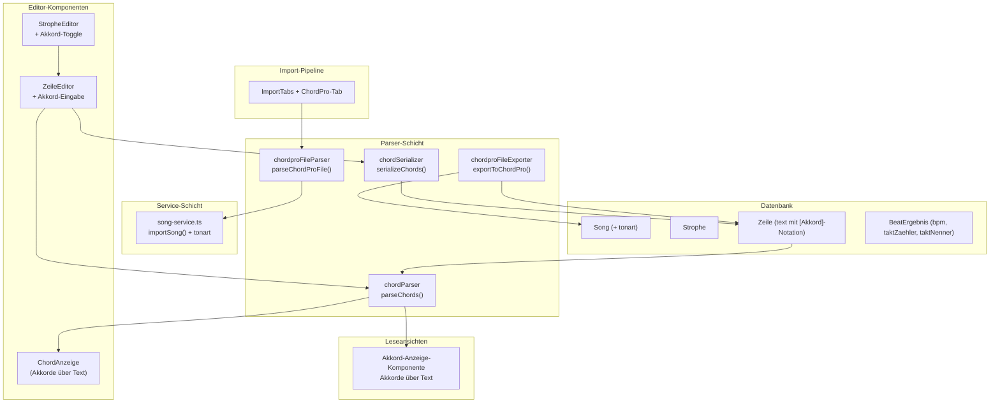

# Design-Dokument: ChordPro-Akkord-Unterstützung

## Übersicht

Dieses Design beschreibt die technische Architektur für die ChordPro-Akkord-Unterstützung in der Lyco Song-Lern-App. Das Feature umfasst:

- **Akkord-Speicherung**: Akkorde werden inline im `text`-Feld der Zeile in eckiger Klammer-Notation `[Am]` gespeichert
- **Tonart-Feld**: Neues optionales `tonart`-Feld am Song-Modell
- **Parser/Serializer**: Bidirektionale Konvertierung zwischen Inline-Notation und strukturierten Akkord-Objekten
- **ChordPro-Import**: Einlesen von `.chopro`/`.cho`/`.chordpro`-Dateien mit Metadaten-Extraktion
- **ChordPro-Export**: Ausgabe als ChordPro-Datei mit optionaler Vocal-Tag-Integration
- **Editor-Erweiterungen**: Akkord-Toggle, Leer-Akkord-Button, kürzlich verwendete Akkorde
- **Akkordanzeige**: Visuelle Darstellung über dem Text in Leseansichten

Die Akkord-Notation `[chord]` ist vollständig getrennt vom bestehenden Vocal-Tag-System `{tag: wert}`.

## Architektur

### Architektur-Diagramm



### Design-Entscheidungen

1. **Akkorde im `text`-Feld**: Akkorde werden direkt im bestehenden `text`-Feld der Zeile gespeichert, nicht in separaten Spalten oder Tabellen. Das vereinfacht die Datenmigration (keine Schema-Änderung an Zeile nötig) und hält Akkorde positionsgebunden.

2. **Separater Parser für Akkorde**: Der neue Akkord-Parser (`parseChords`) ist vollständig getrennt vom bestehenden Vocal-Tag-Parser (`parseChordPro`). Der Vocal-Tag-Parser arbeitet mit `{tag: wert}`, der Akkord-Parser mit `[chord]`. Beide können auf denselben Text angewendet werden.

3. **ChordPro-Datei-Parser als eigenes Modul**: Der Import von `.chopro`-Dateien wird als neues Modul `chordpro-file-parser.ts` implementiert, getrennt vom bestehenden `chordpro-parser.ts` (der für Vocal-Tags zuständig ist). Der Datei-Parser verarbeitet Metadaten-Direktiven, Sektions-Direktiven und Akkorde.

4. **BPM/Taktart über BeatErgebnis**: Da `bpm`, `taktZaehler` und `taktNenner` bereits im `BeatErgebnis`-Modell existieren, wird der ChordPro-Import diese Werte dort speichern (mit `methode: MANUELL`), anstatt neue Felder am Song-Modell anzulegen.

5. **Tonart als String**: Das `tonart`-Feld wird als einfacher String gespeichert (z.B. "Am", "C", "F#m"), ohne Validierung gegen eine feste Liste. Das erlaubt maximale Flexibilität für verschiedene Notationssysteme.

## Komponenten und Schnittstellen

### 1. Akkord-Parser (`src/lib/chords/chord-parser.ts`)

Extrahiert Akkorde aus Zeilentext mit `[chord]`-Notation.

```typescript
interface ChordPosition {
  /** Akkordname (z.B. "Am", "G", "Cmaj7#11") */
  name: string;
  /** Zeichenposition im reinen Text (0-basiert) */
  position: number;
}

interface ChordParseResult {
  /** Reiner Text ohne Akkord-Notation */
  plainText: string;
  /** Extrahierte Akkorde mit Positionen */
  chords: ChordPosition[];
}

/** Parst Zeilentext mit [Akkord]-Notation */
function parseChords(text: string): ChordParseResult;
```

**Verhalten:**
- `"[Am]Hallo [G]Welt"` → `{ plainText: "Hallo Welt", chords: [{ name: "Am", position: 0 }, { name: "G", position: 6 }] }`
- `"Kein Akkord"` → `{ plainText: "Kein Akkord", chords: [] }`
- `"[]Platzhalter"` → `{ plainText: "Platzhalter", chords: [{ name: "", position: 0 }] }`

### 2. Akkord-Serializer (`src/lib/chords/chord-serializer.ts`)

Wandelt strukturierte Akkord-Daten zurück in Zeilentext.

```typescript
/** Serialisiert Akkorde zurück in [Akkord]-Notation im Text */
function serializeChords(plainText: string, chords: ChordPosition[]): string;
```

**Verhalten:**
- `serializeChords("Hallo Welt", [{ name: "Am", position: 0 }, { name: "G", position: 6 }])` → `"[Am]Hallo [G]Welt"`
- `serializeChords("Kein Akkord", [])` → `"Kein Akkord"`

### 3. ChordPro-Datei-Parser (`src/lib/chords/chordpro-file-parser.ts`)

Parst vollständige ChordPro-Dateien mit Metadaten und Sektionen.

```typescript
interface ChordProFileMetadata {
  title?: string;
  artist?: string;
  key?: string;
  tempo?: number;
  time?: { zaehler: number; nenner: number };
}

interface ChordProFileSection {
  type: 'verse' | 'chorus' | 'bridge' | 'unknown';
  name: string;
  lines: string[]; // Zeilen mit [Akkord]-Notation
}

interface ChordProFileParseResult {
  metadata: ChordProFileMetadata;
  sections: ChordProFileSection[];
  warnings: string[];
  errors: ChordProFileParseError[];
}

interface ChordProFileParseError {
  message: string;
  line: number;
}

/** Parst eine ChordPro-Datei */
function parseChordProFile(content: string): ChordProFileParseResult;
```

**Verarbeitungsregeln:**
- `{title: ...}` → `metadata.title`
- `{artist: ...}` → `metadata.artist`
- `{key: ...}` → `metadata.key`
- `{tempo: ...}` → `metadata.tempo` (als Zahl)
- `{time: 3/4}` → `metadata.time` (geparst als Zähler/Nenner)
- `{start_of_verse}` / `{end_of_verse}` → Verse-Sektion
- `{start_of_chorus}` / `{end_of_chorus}` → Chorus-Sektion
- `{start_of_bridge}` / `{end_of_bridge}` → Bridge-Sektion
- `{define:}`, `{chord:}`, `{start_of_tab}`, `{start_of_grid}`, ABC, Lilypond → ignoriert
- Akkorde `[Am]text` bleiben im Zeilentext erhalten

### 4. ChordPro-Datei-Exporter (`src/lib/chords/chordpro-file-exporter.ts`)

Exportiert einen Song als ChordPro-Datei.

```typescript
interface ChordProExportOptions {
  includeVocalTags?: boolean;
}

/** Exportiert einen Song als ChordPro-String */
function exportToChordPro(
  song: SongDetail,
  tagDefinitions: TagDefinitionData[],
  options?: ChordProExportOptions
): string;
```

**Ausgabeformat:**
```
{title: Songname}
{artist: Künstler}
{key: Am}
{tempo: 120}
{time: 4/4}

{start_of_verse: Verse 1}
[Am]Erste Zeile [G]Text
Zweite Zeile
{end_of_verse}

{start_of_chorus: Chorus}
[C]Refrain [F]Text
{end_of_chorus}
```

### 5. Strophe-Typ zu Sektions-Mapping

Mapping zwischen Strophe-Namen und ChordPro-Sektionstypen:

```typescript
const SECTION_TYPE_MAP: Record<string, string> = {
  'verse': 'verse',
  'chorus': 'chorus',
  'refrain': 'chorus',
  'bridge': 'bridge',
};

/** Ermittelt den Sektionstyp aus dem Strophe-Namen */
function getSectionType(stropheName: string): 'verse' | 'chorus' | 'bridge' | 'unknown';
```

Heuristik: Der Strophe-Name wird in Kleinbuchstaben konvertiert und gegen bekannte Schlüsselwörter geprüft (z.B. "Verse 1" → `verse`, "Chorus" → `chorus`, "Bridge" → `bridge`). Unbekannte Namen werden als `verse` behandelt (da `{start_of_verse}` der allgemeinste Sektionstyp ist).

### 6. Import-Pipeline-Integration

Erweiterung der bestehenden Import-Pipeline:

```typescript
// Erweiterung von ImportMode
type ImportMode = "manuell" | "text" | "pdf" | "genius" | "chordpro";

// Erweiterung von ImportSongInput
interface ImportSongInput {
  // ... bestehende Felder
  tonart?: string;
  bpm?: number;
  taktZaehler?: number;
  taktNenner?: number;
}
```

**Konvertierungsfunktion:**
```typescript
/** Konvertiert ChordPro-Parse-Ergebnis in ImportSongInput */
function chordProToImportInput(result: ChordProFileParseResult): ImportSongInput;
```

### 7. Song-Service-Erweiterung

Erweiterung von `importSong()` und `updateSong()`:

- `importSong()` akzeptiert `tonart`, `bpm`, `taktZaehler`, `taktNenner` im `ImportSongInput`
- Bei vorhandenem `bpm` wird ein `BeatErgebnis` mit `methode: MANUELL` erstellt
- `updateSong()` akzeptiert `tonart` im `UpdateSongInput`
- `getSongDetail()` gibt `tonart` in der Antwort zurück

### 8. Editor-Erweiterungen

**StropheEditor – Akkord-Toggle:**
- Neuer Toggle-Button in der Toolbar des StropheEditors
- State `showChords: boolean` (Standard: `false`)
- Wird an alle ZeileEditor-Instanzen weitergegeben

**ZeileEditor – Akkord-Eingabe (wenn `showChords` aktiv):**
- **Akkordzeile über Text**: Zeigt geparste Akkorde über dem Zeilentext an
- **Leer-Akkord-Button**: Fügt `[]` an der Cursorposition ein
- **Kürzlich verwendete Akkorde**: Sammelt Akkordnamen aus allen Zeilen des Songs, zeigt die letzten N als Schnellzugriff-Buttons

**Akkord-Anzeige-Komponente (`ChordAnzeige`):**
```typescript
interface ChordAnzeigeProps {
  text: string; // Zeilentext mit [Akkord]-Notation
}

/** Zeigt Akkorde über dem Text an */
function ChordAnzeige({ text }: ChordAnzeigeProps): JSX.Element;
```

### 9. Akkordanzeige in Leseansichten

Die `ChordAnzeige`-Komponente wird in den Leseansichten (StropheEditor read-only, Lernmodi) eingebunden:

- Parst den Zeilentext mit `parseChords()`
- Rendert eine Akkordzeile über der Textzeile
- Akkorde werden per CSS an der korrekten Zeichenposition ausgerichtet (monospace-basiert oder per `ch`-Einheit)
- Wenn keine Akkorde vorhanden sind, wird keine zusätzliche Zeile gerendert

## Datenmodelle

### Prisma-Schema-Änderung

```prisma
model Song {
  // ... bestehende Felder
  tonart String?  // NEU: Musikalische Tonart (z.B. "Am", "C", "F#m")
}
```

### TypeScript-Typen

**Erweiterung `SongDetail`:**
```typescript
interface SongDetail {
  // ... bestehende Felder
  tonart: string | null;
}
```

**Erweiterung `ImportSongInput`:**
```typescript
interface ImportSongInput {
  // ... bestehende Felder
  tonart?: string;
  bpm?: number;
  taktZaehler?: number;
  taktNenner?: number;
}
```

**Erweiterung `UpdateSongInput`:**
```typescript
interface UpdateSongInput {
  // ... bestehende Felder
  tonart?: string | null;
}
```

**Erweiterung `ImportMode`:**
```typescript
type ImportMode = "manuell" | "text" | "pdf" | "genius" | "chordpro";
```

### Neue Typen (`src/types/chord.ts`)

```typescript
export interface ChordPosition {
  name: string;
  position: number;
}

export interface ChordParseResult {
  plainText: string;
  chords: ChordPosition[];
}

export interface ChordProFileMetadata {
  title?: string;
  artist?: string;
  key?: string;
  tempo?: number;
  time?: { zaehler: number; nenner: number };
}

export interface ChordProFileSection {
  type: 'verse' | 'chorus' | 'bridge' | 'unknown';
  name: string;
  lines: string[];
}

export interface ChordProFileParseResult {
  metadata: ChordProFileMetadata;
  sections: ChordProFileSection[];
  warnings: string[];
  errors: ChordProFileParseError[];
}

export interface ChordProFileParseError {
  message: string;
  line: number;
}
```


## Correctness Properties

*Eine Property ist eine Eigenschaft oder ein Verhalten, das über alle gültigen Ausführungen eines Systems hinweg gelten soll – im Wesentlichen eine formale Aussage darüber, was das System tun soll. Properties bilden die Brücke zwischen menschenlesbaren Spezifikationen und maschinenverifizierbaren Korrektheitsgarantien.*

### Property 1: Akkord-Parser/Serializer Round-Trip

*Für alle* gültigen `ChordParseResult`-Objekte (bestehend aus `plainText` und einer Liste von `ChordPosition`-Objekten mit gültigen Positionen), soll das Serialisieren zu einem Text mit `[Akkord]`-Notation und anschließendes Parsen ein äquivalentes `ChordParseResult` erzeugen. Ebenso soll für jeden Text mit `[Akkord]`-Notation das Parsen und anschließende Serialisieren einen äquivalenten Text erzeugen.

**Validates: Requirements 2.2, 2.4, 3.1, 3.2, 3.3, 3.4, 4.1, 4.2, 4.3**

### Property 2: ChordPro-Datei Metadaten-Extraktion

*Für alle* gültigen Kombinationen von Titel, Künstler, Tonart, Tempo und Taktart soll das Erstellen einer ChordPro-Datei mit den entsprechenden Metadaten-Direktiven (`{title:}`, `{artist:}`, `{key:}`, `{tempo:}`, `{time:}`) und anschließendes Parsen ein `ChordProFileParseResult` erzeugen, dessen `metadata`-Felder den ursprünglichen Werten entsprechen.

**Validates: Requirements 5.3, 5.4, 5.5**

### Property 3: ChordPro-Datei Sektions-Parsing

*Für alle* gültigen ChordPro-Dateien mit Sektions-Direktiven (`{start_of_verse}`, `{start_of_chorus}`, `{start_of_bridge}` mit zugehörigen End-Direktiven) soll der Parser die korrekte Anzahl von Sektionen mit dem richtigen Typ und den richtigen Zeilen extrahieren. Jede Sektion soll genau die Zeilen enthalten, die zwischen der Start- und End-Direktive stehen.

**Validates: Requirements 5.6, 5.7**

### Property 4: ChordPro-Datei Akkord-Erhaltung

*Für alle* ChordPro-Dateien mit Akkorden in eckiger Klammer-Notation soll der Parser die Akkorde unverändert im `text`-Feld der zugehörigen Zeilen erhalten. Das Parsen der resultierenden Zeilen mit dem Akkord-Parser soll die gleichen Akkordnamen in der gleichen Reihenfolge ergeben.

**Validates: Requirements 5.2**

### Property 5: ChordPro-Datei ignoriert nicht unterstützte Direktiven

*Für alle* ChordPro-Dateien, die nicht unterstützte Direktiven enthalten (Akkorddiagramme, Tabs, Grids, ABC-Notation, Lilypond), soll der Parser diese Direktiven ignorieren, ohne Fehler zu erzeugen. Die resultierenden Sektionen und Zeilen sollen nur den unterstützten Inhalt enthalten.

**Validates: Requirements 5.8, 12.1, 12.2, 12.3, 12.4**

### Property 6: Export→Import Round-Trip

*Für alle* Songs mit Akkorden, Metadaten (Titel, Künstler, Tonart) und Strophenstruktur soll das Exportieren als ChordPro-Datei und anschließendes Importieren einen Song mit äquivalenten Akkorden, Metadaten und Strophenstruktur erzeugen.

**Validates: Requirements 6.3, 10.1, 10.2, 10.3, 10.4, 10.5, 11.1**

### Property 7: Import→Export Round-Trip

*Für alle* gültigen ChordPro-Dateien (mit Akkorden, Metadaten und Sektions-Direktiven) soll das Importieren und anschließendes Exportieren eine ChordPro-Datei mit äquivalentem Akkord- und Metadaten-Inhalt erzeugen. Die Akkorde in den Zeilen, die Metadaten-Direktiven und die Sektionsstruktur sollen erhalten bleiben.

**Validates: Requirements 11.2**

## Fehlerbehandlung

### Parser-Fehler

| Fehlerfall | Verhalten |
|---|---|
| Ungültige ChordPro-Syntax (nicht geschlossene Klammern) | Fehlermeldung mit Zeilennummer in `errors`-Array |
| Leere Datei | Leeres Ergebnis ohne Fehler |
| Nicht unterstützte Direktiven | Ignoriert, optional Warnung in `warnings`-Array |
| Ungültiges Tempo (nicht-numerisch) | Warnung, `tempo` bleibt `undefined` |
| Ungültige Taktart (nicht im Format `x/y`) | Warnung, `time` bleibt `undefined` |

### Serializer-Fehler

| Fehlerfall | Verhalten |
|---|---|
| Akkord-Position außerhalb des Textbereichs | Akkord wird am Textende angehängt |
| Überlappende Akkord-Positionen | Akkorde werden in Reihenfolge eingefügt (spätere Positionen werden angepasst) |
| Leerer Akkordname | Wird als `[]` serialisiert (Platzhalter) |

### Import-Fehler

| Fehlerfall | Verhalten |
|---|---|
| Datei mit falscher Endung | Fehlermeldung an den Nutzer |
| Datei zu groß | Fehlermeldung mit Größenlimit |
| Parse-Fehler in der Datei | Fehlermeldung mit Zeilennummer |
| Fehlende Pflichtfelder (Titel) | Nutzer wird aufgefordert, Titel manuell einzugeben |

### Editor-Fehler

| Fehlerfall | Verhalten |
|---|---|
| Ungültige Akkord-Notation im Text | Wird beim Speichern als Warnung angezeigt |
| Cursorposition nicht verfügbar | Akkord wird am Textende eingefügt |

## Teststrategie

### Dualer Testansatz

Das Feature wird mit einer Kombination aus Unit-Tests, Property-Based Tests und Integrationstests getestet.

**Property-Based Tests** (mit `fast-check`):
- Minimum 100 Iterationen pro Property-Test
- Jeder Property-Test referenziert seine Design-Property
- Tag-Format: **Feature: chordpro-chords, Property {nummer}: {property-text}**
- Fokus auf die 7 definierten Correctness Properties

**Unit-Tests** (mit `vitest`):
- Spezifische Beispiele für Parser, Serializer, Importer, Exporter
- Edge Cases: leere Eingaben, leere Akkorde, Sonderzeichen
- UI-Komponenten: Toggle-Verhalten, Button-Klicks, Cursorposition
- Fehlerbehandlung: ungültige Syntax, fehlende Felder

**Integrationstests**:
- Import-Pipeline: ChordPro-Datei → ImportSongInput → importSong()
- Song-Service: Tonart-Persistierung und -Abruf
- Editor-Workflow: Akkord-Eingabe → Speichern → Anzeige

### Teststruktur

```
__tests__/chordpro-chords/
├── chord-parser.test.ts              # Unit-Tests für parseChords()
├── chord-parser-roundtrip.property.test.ts  # Property 1: Round-Trip
├── chord-serializer.test.ts          # Unit-Tests für serializeChords()
├── chordpro-file-parser.test.ts      # Unit-Tests für parseChordProFile()
├── chordpro-file-metadata.property.test.ts  # Property 2: Metadaten
├── chordpro-file-sections.property.test.ts  # Property 3: Sektionen
├── chordpro-file-chords.property.test.ts    # Property 4: Akkord-Erhaltung
├── chordpro-file-unsupported.property.test.ts # Property 5: Ignorierte Direktiven
├── chordpro-file-exporter.test.ts    # Unit-Tests für exportToChordPro()
├── chordpro-export-import.property.test.ts  # Property 6: Export→Import
├── chordpro-import-export.property.test.ts  # Property 7: Import→Export
├── chord-anzeige.test.ts             # UI-Tests für ChordAnzeige
├── chord-toggle.test.ts              # UI-Tests für Akkord-Toggle
├── chord-eingabe.test.ts             # UI-Tests für Akkord-Eingabe
├── tonart-service.test.ts            # Integrationstests für Tonart
└── chordpro-import-integration.test.ts # Import-Pipeline-Integration
```

### Property-Test-Konfiguration

Jeder Property-Test verwendet `fast-check` mit folgender Konfiguration:

```typescript
fc.assert(
  fc.property(
    /* Generatoren */,
    (input) => {
      // Property-Assertion
    }
  ),
  { numRuns: 100 }
);
```

### Generator-Strategie

**Akkord-Generator:**
- Zufällige Grundtöne: A-G mit optionalem # oder b
- Zufällige Qualitäten: m, maj7, 7, dim, aug, sus2, sus4, etc.
- Zufällige Erweiterungen: #11, b9, add9, etc.
- Slash-Akkorde: Grundton/Basston
- Leere Akkorde: `""`

**ChordPro-Datei-Generator:**
- Zufällige Metadaten-Direktiven
- Zufällige Sektionsstrukturen (verse, chorus, bridge)
- Zufällige Zeilen mit und ohne Akkorde
- Optionale nicht unterstützte Direktiven

**Song-Generator (für Export-Tests):**
- Zufällige SongDetail-Objekte mit Strophen, Zeilen und Akkorden
- Zufällige Metadaten (Titel, Künstler, Tonart)
- Optionale BPM- und Taktart-Daten
