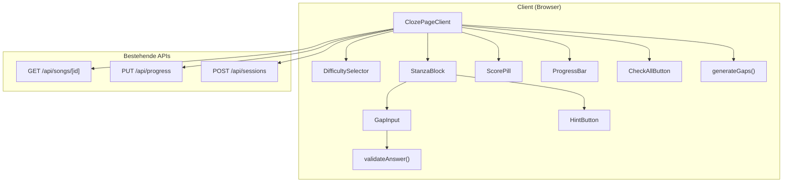
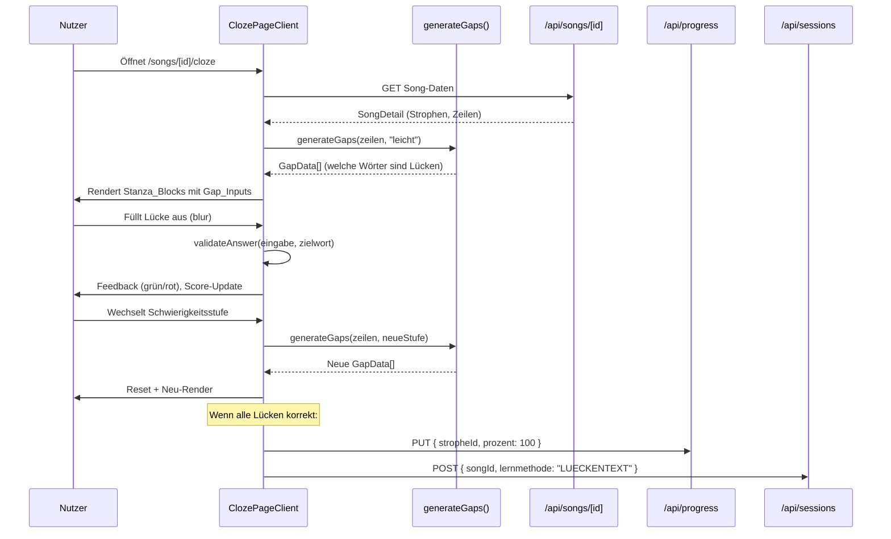

# Design Document – Lückentext (Cloze Learning)

## Übersicht (Overview)

Das Lückentext-Feature ermöglicht es Nutzern, Songtexte durch Ausfüllen von Lücken zu lernen. Basierend auf einer wählbaren Schwierigkeitsstufe (Leicht/Mittel/Schwer/Blind) werden Wörter im Text durch Eingabefelder ersetzt. Der Nutzer füllt die Lücken aus und erhält sofortiges visuelles Feedback (grün = richtig, rot = falsch). Score und Fortschritt aktualisieren sich in Echtzeit.

Das Feature ist rein client-seitig implementiert – die Lücken-Generierung und Validierung erfolgen im Browser. Bestehende APIs (`GET /api/songs/[id]`, `PUT /api/progress`, `POST /api/sessions`) werden für Datenladen und Fortschritts-Persistierung genutzt. Keine neuen Datenbanktabellen oder API-Routen sind erforderlich.

### Kernentscheidungen

- **Client-seitige Lücken-Generierung**: Der Gap-Generator läuft im Browser, da keine serverseitige Logik nötig ist. Die Wort-Auswahl basiert auf einem deterministischen Algorithmus mit Seed (Zeilen-ID + Schwierigkeitsstufe), sodass bei gleichen Eingaben immer die gleichen Lücken entstehen.
- **Bestehende API-Nutzung**: Kein neuer Backend-Code. Song-Daten werden über die existierende Song-Detail-API geladen, Fortschritt über die Progress-API gespeichert.
- **Komponentenstruktur**: Analog zum Emotional-Learning-Feature wird eine eigene Seite unter `src/app/(main)/songs/[id]/cloze/page.tsx` mit zugehörigen Komponenten in `src/components/cloze/` erstellt.

## Architektur



### Datenfluss



## Komponenten und Schnittstellen (Components and Interfaces)

### Seitenkomponente

**Datei:** `src/app/(main)/songs/[id]/cloze/page.tsx`

```typescript
// "use client" – Client Component analog zu emotional/page.tsx
export default function ClozePage(): JSX.Element
```

Verantwortlich für:
- Song-Daten laden via `fetch("/api/songs/${id}")`
- Session tracken via `POST /api/sessions` mit `lernmethode: "LUECKENTEXT"`
- State-Management: Schwierigkeitsstufe, Lücken-Daten, Eingaben, Feedback-Zustände, Score
- Fortschritt persistieren bei 100% Completion

### UI-Komponenten

**Verzeichnis:** `src/components/cloze/`

#### ClozeNavbar
```typescript
// src/components/cloze/cloze-navbar.tsx
interface ClozeNavbarProps {
  songId: string;
  songTitle: string;
}
export function ClozeNavbar({ songId, songTitle }: ClozeNavbarProps): JSX.Element
```

#### DifficultySelector
```typescript
// src/components/cloze/difficulty-selector.tsx
type DifficultyLevel = "leicht" | "mittel" | "schwer" | "blind";

interface DifficultySelectorProps {
  active: DifficultyLevel;
  onChange: (level: DifficultyLevel) => void;
}
export function DifficultySelector({ active, onChange }: DifficultySelectorProps): JSX.Element
```
- Rendert 4 Buttons als `role="radiogroup"` mit `aria-label="Schwierigkeitsstufe"`
- Aktiver Button: lila Hintergrund
- Responsive: 2×2-Raster unter 640px Viewport-Breite

#### StanzaBlock
```typescript
// src/components/cloze/stanza-block.tsx
interface StanzaBlockProps {
  strophe: StropheDetail;
  gaps: GapData[];
  answers: Record<string, string>;       // gapId → Eingabe
  feedback: Record<string, "correct" | "incorrect" | null>;
  hints: Set<string>;                     // gapIds mit aktivem Hint
  onAnswer: (gapId: string, value: string) => void;
  onBlur: (gapId: string) => void;
  onHint: (gapId: string) => void;
}
export function StanzaBlock(props: StanzaBlockProps): JSX.Element
```

#### GapInput
```typescript
// src/components/cloze/gap-input.tsx
interface GapInputProps {
  gapId: string;
  targetWord: string;
  value: string;
  feedback: "correct" | "incorrect" | null;
  hintActive: boolean;
  ariaLabel: string;
  onChange: (value: string) => void;
  onBlur: () => void;
}
export function GapInput(props: GapInputProps): JSX.Element
```
- Inline-Input mit lila `border-bottom`, kein Rahmen
- Mindestbreite 60px, wächst mit Eingabe
- Placeholder: `'···'` (oder erster Buchstabe + `'···'` bei Hint)
- `readonly` wenn `feedback === "correct"`
- `aria-label` gemäß Requirement 9.1
- Status-Kommunikation via `aria-live="polite"`

#### ScorePill
```typescript
// src/components/cloze/score-pill.tsx
interface ScorePillProps {
  correct: number;
  total: number;
}
export function ScorePill({ correct, total }: ScorePillProps): JSX.Element
```

#### HintButton
```typescript
// src/components/cloze/hint-button.tsx
interface HintButtonProps {
  disabled: boolean;
  onClick: () => void;
}
export function HintButton({ disabled, onClick }: HintButtonProps): JSX.Element
```

#### CheckAllButton
```typescript
// src/components/cloze/check-all-button.tsx
interface CheckAllButtonProps {
  disabled: boolean;
  onClick: () => void;
}
export function CheckAllButton({ disabled, onClick }: CheckAllButtonProps): JSX.Element
```

### Logik-Module

**Verzeichnis:** `src/lib/cloze/`

#### Gap-Generator
```typescript
// src/lib/cloze/gap-generator.ts
type DifficultyLevel = "leicht" | "mittel" | "schwer" | "blind";

interface GapData {
  gapId: string;          // Eindeutige ID: `${zeileId}-${wortIndex}`
  zeileId: string;
  wordIndex: number;      // Index des Wortes in der Zeile
  word: string;           // Das Zielwort
  isGap: boolean;         // true = Lücke, false = sichtbar
}

interface ZeileInput {
  id: string;
  text: string;
}

function generateGaps(zeilen: ZeileInput[], difficulty: DifficultyLevel): GapData[]
```

#### Antwort-Validierung
```typescript
// src/lib/cloze/validate-answer.ts
function validateAnswer(input: string, target: string): boolean
```
- Vergleich case-insensitive
- Trimmt Whitespace

#### Score-Berechnung
```typescript
// src/lib/cloze/score.ts
interface ScoreState {
  correct: number;
  total: number;
}

function calculateProgress(correct: number, total: number): number
// Gibt Prozentwert 0–100 zurück, gerundet
```

### Wiederverwendete Komponenten

- **ProgressBar** aus `src/components/songs/progress-bar.tsx` – wird direkt wiederverwendet
- **Auth-Pattern** aus `src/lib/auth.ts` – Session-Check im API-Layer (bereits vorhanden)

## Datenmodelle (Data Models)

### Client-seitiger State

```typescript
interface ClozePageState {
  song: SongDetail | null;
  difficulty: DifficultyLevel;
  gaps: GapData[];
  answers: Record<string, string>;                    // gapId → Nutzereingabe
  feedback: Record<string, "correct" | "incorrect" | null>;  // gapId → Feedback
  hints: Set<string>;                                  // gapIds mit genutztem Hint
  score: ScoreState;
  loading: boolean;
  error: string | null;
}
```

### Bestehende Typen (unverändert)

Die folgenden Typen aus `src/types/song.ts` werden direkt genutzt:

- `SongDetail` – Song mit Strophen und Zeilen
- `StropheDetail` – Strophe mit Zeilen-Array
- `ZeileDetail` – Zeile mit `text`, `uebersetzung`, `orderIndex`

### Neue Typen

```typescript
// src/types/cloze.ts
export type DifficultyLevel = "leicht" | "mittel" | "schwer" | "blind";

export interface GapData {
  gapId: string;
  zeileId: string;
  wordIndex: number;
  word: string;
  isGap: boolean;
}

export interface ScoreState {
  correct: number;
  total: number;
}

export type FeedbackState = "correct" | "incorrect" | null;
```

### API-Interaktionen (bestehende Endpunkte)

| Endpunkt | Methode | Body | Verwendung |
|---|---|---|---|
| `/api/songs/[id]` | GET | – | Song-Daten laden |
| `/api/progress` | PUT | `{ stropheId, prozent }` | Fortschritt pro Strophe speichern |
| `/api/sessions` | POST | `{ songId, lernmethode: "LUECKENTEXT" }` | Session tracken |

### Gap-Generator Algorithmus (Low-Level Design)

Der Gap-Generator ist die zentrale Logik des Features. Er bestimmt deterministisch, welche Wörter als Lücken dargestellt werden.

#### Algorithmus-Schritte

1. **Wörter extrahieren**: Zeile in Wörter aufteilen via `text.split(/\s+/).filter(w => w.length > 0)`
2. **Lücken-Anteil bestimmen**: Basierend auf Schwierigkeitsstufe (0.2 / 0.4 / 0.6 / 1.0)
3. **Anzahl Lücken berechnen**: `Math.round(wörterAnzahl * anteil)`, mit Sonderregel: bei < 2 Wörtern und nicht-Blind mindestens 1 Wort sichtbar lassen
4. **Deterministische Auswahl**: Seeded Pseudo-Random basierend auf `hash(zeileId + difficulty)` für konsistente Ergebnisse
5. **Prioritäts-Sortierung** (nur bei "leicht"): Schlüsselwörter (längere Wörter, keine Stoppwörter) werden bevorzugt als Lücken gewählt

#### Seed-basierte Pseudo-Random-Funktion

```typescript
function seededRandom(seed: number): () => number {
  // Einfacher LCG (Linear Congruential Generator)
  let state = seed;
  return () => {
    state = (state * 1664525 + 1013904223) & 0xffffffff;
    return (state >>> 0) / 0xffffffff;
  };
}

function hashString(str: string): number {
  let hash = 0;
  for (let i = 0; i < str.length; i++) {
    hash = ((hash << 5) - hash + str.charCodeAt(i)) | 0;
  }
  return hash;
}
```

#### Schwierigkeitsstufen-Mapping

```typescript
const DIFFICULTY_CONFIG: Record<DifficultyLevel, { ratio: number; preferKeywords: boolean }> = {
  leicht:  { ratio: 0.2, preferKeywords: true },
  mittel:  { ratio: 0.4, preferKeywords: false },
  schwer:  { ratio: 0.6, preferKeywords: false },
  blind:   { ratio: 1.0, preferKeywords: false },
};
```

#### Stoppwörter-Liste (für "leicht" und "schwer")

Für die Schwierigkeitsstufe "leicht" werden Schlüsselwörter bevorzugt (= keine Stoppwörter). Für "schwer" bleiben nur Füllwörter sichtbar.

```typescript
const STOP_WORDS = new Set([
  "der", "die", "das", "ein", "eine", "und", "oder", "aber",
  "in", "im", "an", "am", "auf", "aus", "bei", "mit", "von",
  "zu", "zum", "zur", "für", "über", "unter", "nach", "vor",
  "the", "a", "an", "and", "or", "but", "in", "on", "at",
  "to", "for", "of", "with", "by", "from", "is", "are", "was",
  "i", "you", "he", "she", "it", "we", "they", "my", "your",
  "ich", "du", "er", "sie", "es", "wir", "ihr", "mein", "dein",
]);
```

#### validateAnswer – Low-Level

```typescript
function validateAnswer(input: string, target: string): boolean {
  return input.trim().toLowerCase() === target.trim().toLowerCase();
}
```


## Correctness Properties

*Eine Property ist eine Eigenschaft oder ein Verhalten, das über alle gültigen Ausführungen eines Systems hinweg gelten sollte – im Wesentlichen eine formale Aussage darüber, was das System tun soll. Properties bilden die Brücke zwischen menschenlesbaren Spezifikationen und maschinell verifizierbaren Korrektheitsgarantien.*

### Property 1: Lücken-Anteil entspricht Schwierigkeitsstufe

*Für jede* Zeile mit mindestens 2 Wörtern und *jede* Schwierigkeitsstufe soll der Anteil der als Lücken markierten Wörter dem konfigurierten Prozentsatz entsprechen (±1 Wort Toleranz durch Rundung). Bei „Blind" müssen exakt 100% der Wörter Lücken sein.

**Validates: Requirements 2.1, 2.2, 2.3, 2.4**

### Property 2: Deterministische Lücken-Generierung

*Für jede* Zeile und *jede* Schwierigkeitsstufe soll der Gap-Generator bei zweimaligem Aufruf mit identischen Eingaben (gleiche Zeilen-ID, gleicher Text, gleiche Schwierigkeitsstufe) exakt die gleichen Lücken erzeugen.

**Validates: Requirements 2.5**

### Property 3: Case-insensitive Antwort-Validierung

*Für jedes* Wortpaar (Eingabe, Zielwort) soll `validateAnswer` genau dann `true` zurückgeben, wenn die beiden Strings nach Trimmen und Konvertierung in Kleinbuchstaben identisch sind.

**Validates: Requirements 4.3**

### Property 4: Schwierigkeitswechsel setzt State zurück

*Für jeden* beliebigen Cloze-State mit ausgefüllten Antworten und Feedback soll ein Schwierigkeitswechsel dazu führen, dass alle Antworten leer sind, alle Feedback-Zustände `null` sind, der Score auf `{ correct: 0, total: <neue Lückenanzahl> }` steht und die Hints leer sind.

**Validates: Requirements 3.3, 3.5, 1.5**

### Property 5: Korrekte Antwort sperrt Eingabe, falsche bleibt editierbar

*Für jedes* Gap_Input gilt: wenn das Feedback `"correct"` ist, soll das Feld `readonly` sein; wenn das Feedback `"incorrect"` oder `null` ist, soll das Feld editierbar bleiben.

**Validates: Requirements 4.6, 4.7**

### Property 6: Score und Fortschritt sind konsistent

*Für jede* Sequenz von Antwort-Validierungen soll gelten: `score.correct` entspricht der Anzahl der Gaps mit Feedback `"correct"`, und der Fortschrittswert in Prozent entspricht `Math.round(score.correct / score.total * 100)`.

**Validates: Requirements 5.1, 5.2**

### Property 7: Check-All validiert alle offenen Lücken

*Für jeden* Cloze-State mit mindestens einer offenen Lücke (Feedback ≠ `"correct"`) soll nach Ausführung von Check-All jede offene Lücke mit einer nicht-leeren Eingabe ein Feedback (`"correct"` oder `"incorrect"`) erhalten. Bereits korrekte Lücken bleiben unverändert.

**Validates: Requirements 6.2, 6.3**

### Property 8: Hinweis-Format

*Für jedes* Zielwort mit mindestens einem Zeichen soll der generierte Hinweis dem Format `ersterBuchstabe + '···'` entsprechen.

**Validates: Requirements 7.2**

### Property 9: Hinweis ist einmalig pro Lücke

*Für jedes* Gap_Input gilt: nach einmaliger Nutzung des Hints soll der Hint_Button für dieses Gap deaktiviert sein. Ein erneuter Aufruf soll den Hint-Zustand nicht verändern (Idempotenz).

**Validates: Requirements 7.1, 7.3, 7.4**

### Property 10: Zeilen werden in orderIndex-Reihenfolge dargestellt

*Für jede* Strophe mit beliebig geordneten Zeilen soll die Darstellung die Zeilen aufsteigend nach `orderIndex` sortiert ausgeben.

**Validates: Requirements 8.3**

### Property 11: Aria-Label-Format für Lücken

*Für jede* Lücke N in einer Strophe mit M Lücken und Strophen-Name S soll das `aria-label` dem Format `"Lücke N von M in S"` entsprechen.

**Validates: Requirements 9.1**

### Property 12: Feedback-Status wird via aria-live kommuniziert

*Für jedes* Gap_Input mit Feedback (`"correct"` oder `"incorrect"`) soll ein Element mit `aria-live="polite"` den Status „Richtig" bzw. „Falsch" enthalten.

**Validates: Requirements 9.2, 9.3**

## Fehlerbehandlung (Error Handling)

| Szenario | Verhalten |
|---|---|
| Song-API gibt 401 zurück | Weiterleitung zu `/login` |
| Song-API gibt 403/404 zurück | Weiterleitung zu `/dashboard` (analog zu Emotional-Page) |
| Song-API gibt 500 zurück | Fehlermeldung: „Fehler beim Laden des Songs" |
| Progress-API schlägt fehl | Stille Fehlerbehandlung – lokaler State bleibt erhalten, Nutzer wird nicht unterbrochen |
| Sessions-API schlägt fehl | Stille Fehlerbehandlung – Session-Tracking ist nicht kritisch für die Lernfunktion |
| Song hat keine Strophen | Leere Seite mit Hinweis „Dieser Song hat noch keine Strophen" |
| Zeile hat leeren Text | Zeile wird übersprungen (kein Stanza-Block-Eintrag) |
| Netzwerkfehler beim Laden | Fehlermeldung mit Retry-Option |

## Teststrategie (Testing Strategy)

### Dualer Testansatz

Das Feature wird mit einer Kombination aus Unit-Tests und Property-Based Tests getestet.

### Property-Based Tests

**Bibliothek:** `fast-check` (bereits als devDependency im Projekt vorhanden)

**Konfiguration:** Minimum 100 Iterationen pro Property-Test.

**Tagging-Format:** Jeder Test wird mit einem Kommentar referenziert:
```
// Feature: cloze-learning, Property N: <Property-Text>
```

**Testdateien:**

| Datei | Properties |
|---|---|
| `__tests__/cloze/gap-ratio.property.test.ts` | Property 1: Lücken-Anteil |
| `__tests__/cloze/gap-determinism.property.test.ts` | Property 2: Determinismus |
| `__tests__/cloze/validate-answer.property.test.ts` | Property 3: Case-insensitive Validierung |
| `__tests__/cloze/difficulty-reset.property.test.ts` | Property 4: State-Reset |
| `__tests__/cloze/input-locking.property.test.ts` | Property 5: Eingabe-Sperre |
| `__tests__/cloze/score-consistency.property.test.ts` | Property 6: Score-Konsistenz |
| `__tests__/cloze/check-all.property.test.ts` | Property 7: Check-All |
| `__tests__/cloze/hint-format.property.test.ts` | Property 8: Hinweis-Format |
| `__tests__/cloze/hint-single-use.property.test.ts` | Property 9: Einmaliger Hinweis |
| `__tests__/cloze/zeilen-order.property.test.ts` | Property 10: Zeilen-Reihenfolge |
| `__tests__/cloze/aria-label.property.test.ts` | Property 11: Aria-Label |
| `__tests__/cloze/aria-feedback.property.test.ts` | Property 12: Aria-Feedback |

Jede Property wird durch genau einen Property-Based Test implementiert.

### Unit-Tests

Unit-Tests decken spezifische Beispiele, Edge Cases und Integrationspunkte ab:

| Datei | Fokus |
|---|---|
| `__tests__/cloze/gap-generator.test.ts` | Edge Cases: leere Zeilen, 1-Wort-Zeilen, Sonderzeichen |
| `__tests__/cloze/cloze-page.test.ts` | Seitenlade-Verhalten, Auth-Redirect, 404-Handling |
| `__tests__/cloze/completion.test.ts` | API-Aufrufe bei 100% Completion (Progress + Session) |

### Generatoren für Property-Tests

```typescript
// Beispiel-Generatoren für fast-check
const arbZeile = fc.record({
  id: fc.uuid(),
  text: fc.array(fc.stringOf(fc.char(), { minLength: 1 }), { minLength: 1, maxLength: 20 })
    .map(words => words.join(" ")),
});

const arbDifficulty = fc.constantFrom("leicht", "mittel", "schwer", "blind");

const arbStrophe = fc.record({
  id: fc.uuid(),
  name: fc.string({ minLength: 1 }),
  orderIndex: fc.nat(),
  zeilen: fc.array(arbZeile, { minLength: 0, maxLength: 10 }),
});
```
