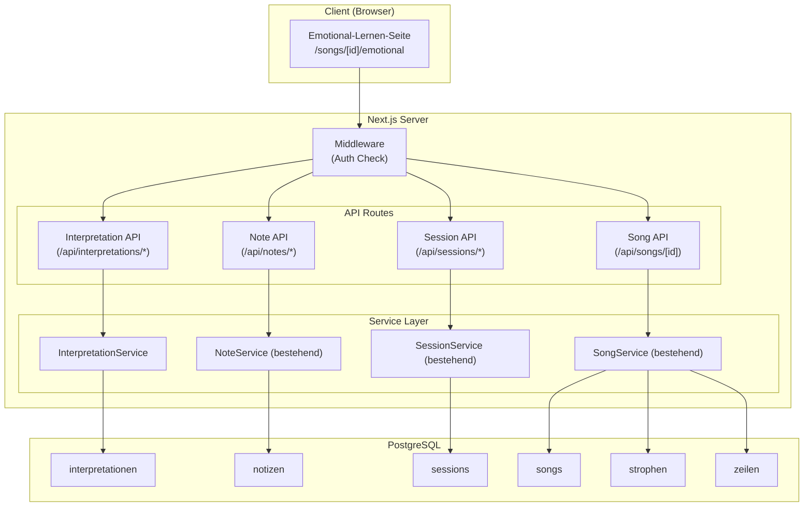
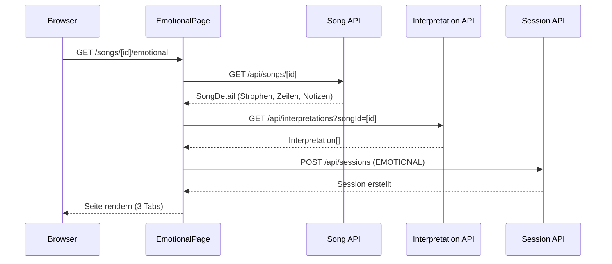
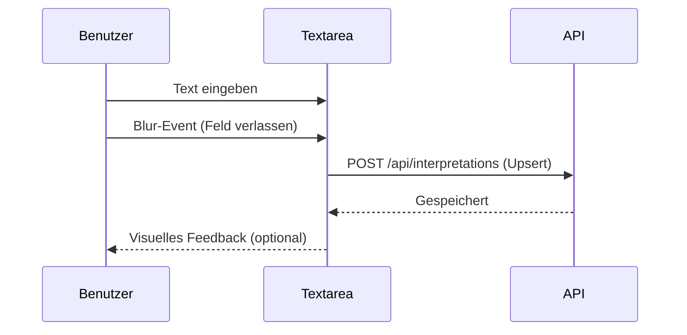

# Technisches Design: Emotionales Lernen

## Übersicht

Dieses Dokument beschreibt das technische Design für die Lernmethode „Emotionales Lernen" der Songtext-Lern-Webanwendung „Lyco". Das Feature ermöglicht es Benutzern, einen Song über Bedeutung und emotionalen Gehalt zu erschließen, bevor der Text auswendig gelernt wird.

Das Design umfasst:

- Prisma-Schema-Erweiterung um ein `Interpretation`-Modell (Freitext pro Benutzer und Strophe, Unique-Constraint, Cascade-Delete)
- InterpretationService (`interpretation-service.ts`) nach bestehendem Muster (analog zu NoteService)
- API-Routen unter `/api/interpretations` und `/api/interpretations/[id]` (POST Upsert, GET nach songId, DELETE)
- Frontend-Seite unter `/songs/[id]/emotional` mit drei Tabs (Übersetzung, Interpretation, Meine Notizen)
- Übersetzungs-Tab mit Aufdecken-Interaktion (verborgene Übersetzungen, Einzelzeilen-Aufdecken, „Alle aufdecken")
- Interpretations-Tab mit Auto-Save (Blur-Event)
- Notizen-Tab mit bestehender Notiz-API und Auto-Save
- Session-Tracking über bestehenden SessionService mit Lernmethode EMOTIONAL
- Aktions-Buttons („Symbolik vertiefen", „Zum Lückentext")
- Ownership-Prüfung auf Service-Ebene

Referenz: [Planungsdokument](../../.planning/key_features.md) Kapitel 4, [Anforderungen](requirements.md)

## Architektur

### Systemübersicht



### Seitenlade-Flow



### Auto-Save-Flow (Interpretation/Notiz)



## Komponenten und Schnittstellen

### Frontend-Komponenten

| Komponente | Pfad | Beschreibung |
| --- | --- | --- |
| `EmotionalPage` | `app/(main)/songs/[id]/emotional/page.tsx` | Hauptseite für Emotionales Lernen |
| `EmotionalNavbar` | `components/emotional/emotional-navbar.tsx` | Navigationsleiste mit Zurück-Button, Titel, Methoden-Label |
| `EmotionsTags` | `components/emotional/emotions-tags.tsx` | Horizontale Pill-Reihe mit Emotions-Tags |
| `ModeTabs` | `components/emotional/mode-tabs.tsx` | Tab-Leiste (Übersetzung, Interpretation, Meine Notizen) |
| `TranslationTab` | `components/emotional/translation-tab.tsx` | Übersetzungs-Tab mit Aufdecken-Interaktion |
| `InterpretationTab` | `components/emotional/interpretation-tab.tsx` | Interpretations-Tab mit Auto-Save |
| `NotesTab` | `components/emotional/notes-tab.tsx` | Notizen-Tab mit Auto-Save |
| `StropheCard` | `components/emotional/strophe-card.tsx` | Strophen-Karte (wiederverwendbar für alle Tabs) |
| `RevealLine` | `components/emotional/reveal-line.tsx` | Einzelne Zeile mit Aufdecken-Interaktion |
| `ActionButtons` | `components/emotional/action-buttons.tsx` | Aktions-Buttons am unteren Rand |

### API-Endpunkte (neu)

| Methode | Pfad | Auth | Beschreibung |
| --- | --- | --- | --- |
| POST | `/api/interpretations` | ✓ | Interpretation erstellen/aktualisieren (Upsert) |
| GET | `/api/interpretations?songId=X` | ✓ | Alle Interpretationen eines Songs für den Benutzer |
| DELETE | `/api/interpretations/[id]` | ✓ | Interpretation löschen |

### Service Layer (neu)

```typescript
// InterpretationService – Interpretation-Verwaltung
// Datei: src/lib/services/interpretation-service.ts

interface InterpretationService {
  upsertInterpretation(userId: string, stropheId: string, text: string): Promise<Interpretation>;
  deleteInterpretation(userId: string, interpretationId: string): Promise<void>;
  getInterpretationsForSong(userId: string, songId: string): Promise<Interpretation[]>;
}
```

### Bestehende Services (unverändert)

- `NoteService` – Notizen-Verwaltung (Upsert, Delete, GetForSong)
- `SessionService` – Session-Tracking (createSession mit Lernmethode EMOTIONAL)
- `SongService` – Song-Detail laden (getSongDetail liefert Strophen, Zeilen, Übersetzungen, Notizen)

## Datenmodelle

### Prisma Schema (Erweiterung)

Das bestehende Schema wird um ein `Interpretation`-Modell erweitert. Alle bestehenden Modelle bleiben unverändert.

```prisma
model Interpretation {
  id        String   @id @default(cuid())
  userId    String
  stropheId String
  text      String
  updatedAt DateTime @updatedAt

  user    User    @relation(fields: [userId], references: [id], onDelete: Cascade)
  strophe Strophe @relation(fields: [stropheId], references: [id], onDelete: Cascade)

  @@unique([userId, stropheId])
  @@map("interpretationen")
}
```

Zusätzlich müssen die bestehenden Modelle `User` und `Strophe` um die Relation erweitert werden:

```prisma
model User {
  // ... bestehende Felder ...
  interpretationen Interpretation[]
}

model Strophe {
  // ... bestehende Felder ...
  interpretationen Interpretation[]
}
```

### TypeScript-Typen (Erweiterung)

```typescript
// types/interpretation.ts

export interface InterpretationResponse {
  id: string;
  stropheId: string;
  text: string;
  updatedAt: string;
}

export interface UpsertInterpretationInput {
  stropheId: string;
  text: string;
}
```

### Aufdecken-Zustand (Client-seitig)

Der Aufdecken-Zustand wird als React-State im `TranslationTab` verwaltet und nicht persistiert. Er bleibt während der Browser-Session erhalten (kein Zurücksetzen bei Tab-Wechsel innerhalb der Ansicht).

```typescript
// Client-seitiger Zustand
type RevealedState = Record<string, Set<string>>; // stropheId -> Set<zeileId>
```


## Correctness Properties

*Eine Property ist eine Eigenschaft oder ein Verhalten, das über alle gültigen Ausführungen eines Systems hinweg gelten muss – im Wesentlichen eine formale Aussage darüber, was das System tun soll. Properties bilden die Brücke zwischen menschenlesbaren Spezifikationen und maschinell verifizierbaren Korrektheitsgarantien.*

### Property 1: Interpretation Upsert Round-Trip

*Für jeden* Benutzer und jede Strophe eines eigenen Songs gilt: Das Erstellen einer Interpretation über `upsertInterpretation` und anschließendes Abrufen über `getInterpretationsForSong` muss den gleichen Text zurückgeben. Ein erneuter Aufruf von `upsertInterpretation` für dieselbe Kombination muss den Text aktualisieren (nicht duplizieren), sodass pro Benutzer und Strophe maximal eine Interpretation existiert. Nach dem Löschen über `deleteInterpretation` darf die Interpretation nicht mehr abrufbar sein.

**Validates: Requirements 1.2, 2.1, 2.2, 2.3, 2.6**

### Property 2: Interpretation Ownership

*Für jede* Strophe, die zu einem Song eines anderen Benutzers gehört, muss jeder Versuch, eine Interpretation zu erstellen, zu aktualisieren oder zu löschen, mit einem Fehler abgelehnt werden („Zugriff verweigert").

**Validates: Requirements 2.4, 4.7**

### Property 3: Interpretation Validierung

*Für jeden* String, der leer ist oder nur aus Whitespace besteht, muss das Erstellen einer Interpretation über `upsertInterpretation` abgelehnt werden und die Datenbank darf sich nicht verändern. Ebenso müssen API-Anfragen mit fehlenden Pflichtfeldern (stropheId, text) mit HTTP 400 abgelehnt werden.

**Validates: Requirements 2.5, 3.5**

### Property 4: Interpretation Auth Required

*Für jede* Interpretation-API-Route gilt: Ein Request ohne gültige Session muss mit HTTP 401 abgelehnt werden.

**Validates: Requirements 3.4**

### Property 5: ARIA-Attribute auf Emotional-Lernen-Komponenten

*Für jede* Strophe in der Emotional-Lernen-Ansicht gilt: Die Modus-Tabs müssen `role="tablist"` und `role="tab"` mit korrektem `aria-selected`-Attribut besitzen. Jeder „Alle aufdecken"-Button muss ein `aria-label` mit dem Strophen-Namen enthalten. Verborgene Übersetzungszeilen müssen `aria-hidden="true"` haben und nach dem Aufdecken `aria-hidden="false"`. Alle Textfelder (Interpretation, Notiz) müssen korrekte `aria-label`-Attribute besitzen.

**Validates: Requirements 11.2, 11.3, 11.4, 11.5**

## Fehlerbehandlung

### Interpretation-Operationen

| Fehlerfall | HTTP-Status | Verhalten |
| --- | --- | --- |
| Nicht authentifiziert | 401 | `{ error: "Nicht authentifiziert" }` |
| Interpretation nicht gefunden | 404 | `{ error: "Interpretation nicht gefunden" }` |
| Fremde Interpretation bearbeiten/löschen | 403 | `{ error: "Zugriff verweigert" }` |
| Leerer Interpretationstext | 400 | `{ error: "Interpretationstext ist erforderlich", field: "text" }` |
| Fehlende stropheId | 400 | `{ error: "Strophe-ID ist erforderlich", field: "stropheId" }` |
| Strophe nicht gefunden | 404 | `{ error: "Strophe nicht gefunden" }` |
| Fremde Strophe (Song gehört anderem Benutzer) | 403 | `{ error: "Zugriff verweigert" }` |

### Seitenlade-Fehler

| Fehlerfall | Verhalten |
| --- | --- |
| Song nicht gefunden | Weiterleitung zum Dashboard |
| Song gehört anderem Benutzer | Weiterleitung zum Dashboard |
| Nicht authentifiziert | Weiterleitung zur Login-Seite (Middleware) |
| API-Fehler beim Laden | Fehlermeldung in der UI anzeigen |
| Auto-Save fehlgeschlagen | Fehlermeldung als Toast anzeigen, Daten im lokalen State behalten |

### Allgemeine Fehlerbehandlung

- Alle API-Routen fangen unerwartete Fehler ab und geben HTTP 500 mit `{ error: "Interner Serverfehler" }` zurück
- Sensible Fehlerdetails (Stack Traces, DB-Fehler) werden nur serverseitig geloggt (`console.error`)
- Alle Fehlerantworten folgen dem Format `{ error: string, field?: string }`

## Testing-Strategie

### Property-Based Testing

**Library:** [fast-check](https://github.com/dubzzz/fast-check) (bereits im Projekt als devDependency)

Jede Correctness Property wird als einzelner Property-Based Test implementiert mit `numRuns: 20`. Jeder Test referenziert die zugehörige Design-Property im Kommentar.

**Konfiguration:**

```typescript
import fc from "fast-check";

const PBT_CONFIG = { numRuns: 20 };
```

**Test-Muster:** Alle Tests verwenden das bestehende `vi.hoisted` / In-Memory-Store / Mock-Prisma-Pattern (analog zu `note-upsert.property.test.ts` und `markup-crud.property.test.ts`).

**Property-Test-Mapping:**

| Property | Test-Datei | Tag |
| --- | --- | --- |
| Property 1 | `__tests__/emotional/interpretation-upsert.property.test.ts` | Feature: emotional-learning, Property 1: Interpretation Upsert Round-Trip |
| Property 2 | `__tests__/emotional/interpretation-ownership.property.test.ts` | Feature: emotional-learning, Property 2: Interpretation Ownership |
| Property 3 | `__tests__/emotional/interpretation-validation.property.test.ts` | Feature: emotional-learning, Property 3: Interpretation Validierung |
| Property 4 | `__tests__/emotional/interpretation-auth.property.test.ts` | Feature: emotional-learning, Property 4: Interpretation Auth Required |
| Property 5 | `__tests__/emotional/aria-attributes.property.test.ts` | Feature: emotional-learning, Property 5: ARIA-Attribute |

### Unit Tests

Unit Tests ergänzen die Property-Tests für spezifische Beispiele und Edge Cases:

| Test-Datei | Beschreibung |
| --- | --- |
| `__tests__/emotional/interpretation-service.test.ts` | Spezifische Beispiele für InterpretationService |
| `__tests__/emotional/interpretation-api.test.ts` | API-Route Integration Tests |

### Dual Testing Approach

- **Property Tests:** Universelle Eigenschaften über alle Eingaben (Upsert Round-Trip, Ownership, Validierung, Auth)
- **Unit Tests:** Spezifische Beispiele, Edge Cases (leerer String vs. nur Whitespace, Cascade-Delete-Verhalten, API-Fehlerformate)
- Beide Ansätze sind komplementär und zusammen notwendig für umfassende Abdeckung
