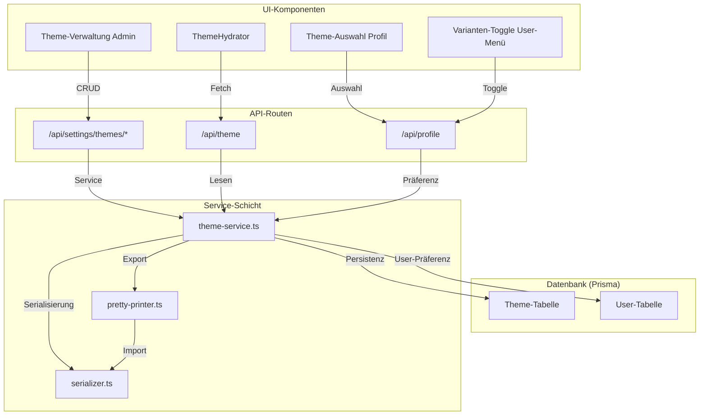

# Design-Dokument: Erweitertes Theming

## Übersicht

Das bestehende Theming-System speichert eine einzelne `ThemeConfig` als JSON-String in der `SystemSetting`-Tabelle (Key: `theme-config`). Es gibt keine Unterstützung für mehrere Themes, keine benutzerspezifische Auswahl und keine Light/Dark-Varianten.

Dieses Design erweitert das System um:
- Ein neues `Theme`-Datenbankmodell mit eigenständiger Tabelle (statt `SystemSetting`)
- Jedes Theme enthält zwei vollständige `ThemeConfig`-Varianten (Light + Dark)
- Benutzerspezifische Theme-Auswahl und Varianten-Präferenz (neue Felder auf `User`)
- Ein Standard-Theme, das nicht gelöscht werden kann
- JSON-Import/Export mit semantischen Beschreibungen (Pretty-Printer)
- Round-Trip-Eigenschaft: Export → Import ergibt semantisch äquivalentes Theme
- Varianten-Toggle im User-Menü

### Designentscheidungen

1. **Eigene `Theme`-Tabelle statt `SystemSetting`**: Themes sind komplexe Entitäten mit Name, Erstellungsdatum, zwei Varianten und einer `isDefault`-Markierung. Eine eigene Tabelle ermöglicht saubere Relationen und Constraints.
2. **Varianten als JSON-Spalten**: `lightConfig` und `darkConfig` werden als JSON-Strings in der `Theme`-Tabelle gespeichert. Die bestehende `ThemeConfig`-Struktur bleibt unverändert — jede Variante ist eine vollständige `ThemeConfig`.
3. **User-Präferenz auf `User`-Modell**: Zwei neue optionale Felder (`selectedThemeId`, `themeVariant`) auf dem `User`-Modell. Kein separates Modell nötig.
4. **Beschreibungsfelder nur im Export**: Semantische Beschreibungen werden vom Pretty-Printer beim Export hinzugefügt und vom Serializer beim Import ignoriert. Sie werden nicht in der Datenbank gespeichert.
5. **Abwärtskompatibilität**: Die bestehende `getThemeConfig()`-Funktion wird erweitert, um das Standard-Theme (Light-Variante) zurückzugeben, wenn kein benutzerspezifisches Theme gesetzt ist. Der öffentliche `/api/theme`-Endpunkt wird um einen optionalen `userId`-Parameter erweitert.

## Architektur



## Komponenten und Schnittstellen

### 1. Prisma-Schema-Erweiterungen

**Neues Modell `Theme`:**

```prisma
model Theme {
  id          String   @id @default(cuid())
  name        String   @unique
  lightConfig String   // JSON-String einer ThemeConfig
  darkConfig  String   // JSON-String einer ThemeConfig
  isDefault   Boolean  @default(false)
  createdAt   DateTime @default(now())
  updatedAt   DateTime @updatedAt

  @@map("themes")
}
```

**Erweiterung `User`-Modell:**

```prisma
model User {
  // ... bestehende Felder ...
  selectedThemeId String?
  themeVariant    String?  @default("light") // "light" | "dark"

  selectedTheme   Theme?   @relation(fields: [selectedThemeId], references: [id], onDelete: SetNull)
}
```

### 2. Theme-Service (`src/lib/services/theme-service.ts`)

Erweiterte und neue Funktionen:

| Funktion | Beschreibung |
|---|---|
| `getAllThemes()` | Gibt alle Themes zurück (id, name, isDefault, createdAt, Farbpaletten-Vorschau) |
| `getThemeById(id)` | Gibt ein einzelnes Theme mit beiden Varianten zurück |
| `createTheme(name)` | Erstellt ein neues Theme mit Standard-Light/Dark-Konfigurationen |
| `updateTheme(id, data)` | Aktualisiert Name und/oder Varianten eines Themes |
| `deleteTheme(id)` | Löscht ein Theme; setzt betroffene User auf Standard-Theme zurück |
| `setDefaultTheme(id)` | Markiert ein Theme als Standard (entfernt Markierung vom bisherigen Standard) |
| `getUserThemeConfig(userId)` | Gibt die aktive ThemeConfig für einen User zurück (Theme + Variante) |
| `setUserThemePreference(userId, themeId, variant)` | Speichert die Theme-Auswahl eines Users |
| `exportTheme(id)` | Exportiert ein Theme als formatiertes Theme_JSON mit Beschreibungen |
| `importTheme(json)` | Importiert ein Theme aus Theme_JSON, validiert und speichert |

### 3. Theme-Serializer (`src/lib/theme/serializer.ts`)

Bestehende Funktionen bleiben erhalten. Neue Funktionen:

| Funktion | Beschreibung |
|---|---|
| `deserializeThemeJson(json)` | Deserialisiert Theme_JSON (ignoriert `description`-Felder) |
| `validateThemeJson(json)` | Validiert Theme_JSON-Struktur inkl. Versionsprüfung |

### 4. Theme-Pretty-Printer (`src/lib/theme/pretty-printer.ts`)

Neues Modul:

| Funktion | Beschreibung |
|---|---|
| `prettyPrintTheme(theme)` | Erzeugt formatiertes Theme_JSON mit semantischen Beschreibungen |
| `getDescriptions()` | Gibt die Beschreibungs-Map für alle Theme-Einstellungen zurück |

### 5. API-Routen

**Admin-Routen (authentifiziert, Rolle ADMIN):**

| Route | Methode | Beschreibung |
|---|---|---|
| `/api/settings/themes` | GET | Liste aller Themes |
| `/api/settings/themes` | POST | Neues Theme erstellen |
| `/api/settings/themes/[id]` | GET | Einzelnes Theme laden |
| `/api/settings/themes/[id]` | PUT | Theme aktualisieren |
| `/api/settings/themes/[id]` | DELETE | Theme löschen |
| `/api/settings/themes/[id]/export` | GET | Theme als JSON exportieren |
| `/api/settings/themes/import` | POST | Theme aus JSON importieren |

**Öffentliche/User-Routen:**

| Route | Methode | Beschreibung |
|---|---|---|
| `/api/theme` | GET | Aktive ThemeConfig für den aktuellen User (oder Standard) |
| `/api/profile` | PUT | Erweitert um `selectedThemeId` und `themeVariant` |

### 6. UI-Komponenten

| Komponente | Ort | Beschreibung |
|---|---|---|
| `ThemeListPage` | `/admin/theming` | Übersicht aller Themes mit Vorschau, CRUD-Aktionen |
| `ThemeEditPage` | `/admin/theming/[id]` | Bearbeitungsansicht mit Light/Dark-Umschalter und Live-Vorschau |
| `ThemeImportDialog` | Admin-Theming | Dialog für JSON-Import mit Namenskollisions-Handling |
| `ThemeSelector` | Profil-Seite | Dropdown/Karten-Auswahl der verfügbaren Themes |
| `VariantToggle` | User-Menü | Light/Dark-Schalter |
| `ThemeHydrator` | Layout | Erweitert um User-spezifische Theme-Auflösung |
| `ThemePreview` | Admin + Profil | Bestehende Komponente, wiederverwendet für Vorschau |

## Datenmodelle

### Theme (Datenbank)

```typescript
interface ThemeRecord {
  id: string;
  name: string;           // Eindeutig, max. 100 Zeichen
  lightConfig: string;    // JSON-serialisierte ThemeConfig
  darkConfig: string;     // JSON-serialisierte ThemeConfig
  isDefault: boolean;
  createdAt: Date;
  updatedAt: Date;
}
```

### Theme_JSON (Export-Format)

```typescript
interface ThemeJson {
  version: 1;
  name: string;
  light: AnnotatedThemeConfig;
  dark: AnnotatedThemeConfig;
}

// Jeder Wert wird um ein optionales "description"-Feld ergänzt
interface AnnotatedValue {
  value: string | null;
  description: string;  // Semantische Beschreibung für KI-Generatoren
}

interface AnnotatedThemeConfig {
  appName: AnnotatedValue;
  colors: Record<keyof ThemeColors, AnnotatedValue>;
  typography: Record<keyof ThemeTypography, AnnotatedValue>;
  karaoke: Record<keyof KaraokeTheme, AnnotatedValue>;
}
```

Beispiel-Auszug des exportierten JSON:

```json
{
  "version": 1,
  "name": "Ocean Breeze",
  "light": {
    "appName": {
      "value": "Lyco",
      "description": "Der angezeigte Anwendungsname in der Kopfzeile und im Browser-Tab"
    },
    "colors": {
      "primary": {
        "value": "#3b82f6",
        "description": "Primärfarbe der Anwendung – wird für die Hauptpalette (50–950) generiert, beeinflusst Buttons, Links und Akzente"
      },
      "pageBg": {
        "value": "#f9fafb",
        "description": "Hintergrundfarbe der gesamten Seite – sollte bei der Light-Variante hell sein"
      }
    }
  }
}
```

### Benutzer_Theme_Präferenz (auf User-Modell)

```typescript
interface UserThemePreference {
  selectedThemeId: string | null;  // null = Standard-Theme
  themeVariant: "light" | "dark";  // Standard: "light"
}
```

### ThemeConfig (unverändert)

Die bestehende `ThemeConfig`-Schnittstelle aus `src/lib/theme/types.ts` bleibt vollständig erhalten. Jede Variante (Light/Dark) ist eine eigenständige `ThemeConfig`.


## Correctness Properties

*Eine Property ist eine Eigenschaft oder ein Verhalten, das über alle gültigen Ausführungen eines Systems hinweg gelten sollte — im Wesentlichen eine formale Aussage darüber, was das System tun soll. Properties bilden die Brücke zwischen menschenlesbaren Spezifikationen und maschinell verifizierbaren Korrektheitsgarantien.*

### Property 1: Theme-Name-Eindeutigkeit

*Für alle* Paare von Theme-Namen, wenn ein Theme mit Name N erstellt wird und anschließend ein zweites Theme mit demselben Namen N erstellt werden soll, dann muss die zweite Erstellung fehlschlagen und die Gesamtzahl der Themes darf sich nicht erhöht haben.

**Validates: Requirements 1.1, 1.4**

### Property 2: Theme-Name-Validierung

*Für alle* Strings mit einer Länge > 100 Zeichen muss das Erstellen eines Themes mit diesem Namen abgelehnt werden. *Für alle* Strings mit einer Länge zwischen 1 und 100 Zeichen muss das Erstellen akzeptiert werden (sofern der Name eindeutig ist).

**Validates: Requirements 1.3**

### Property 3: Neues Theme hat zwei gültige Varianten

*Für jedes* neu erstellte Theme muss gelten: Es enthält genau eine Light-Variante und eine Dark-Variante, beide sind gültige `ThemeConfig`-Objekte, und die Light-Variante hat eine helle Seitenhintergrundfarbe (hohe Helligkeit) während die Dark-Variante eine dunkle Seitenhintergrundfarbe (niedrige Helligkeit) hat.

**Validates: Requirements 1.2, 5.1, 5.5**

### Property 4: Varianten-Unabhängigkeit beim Speichern

*Für jedes* Theme und *für jede* gültige ThemeConfig-Änderung: Wenn nur die Light-Variante aktualisiert wird, bleibt die Dark-Variante unverändert, und umgekehrt. Die jeweils nicht bearbeitete Variante muss vor und nach dem Speichern identisch sein.

**Validates: Requirements 5.3, 5.4**

### Property 5: Löschen setzt betroffene User auf Standard-Theme zurück

*Für jedes* Theme T, das von mindestens einem User als aktives Theme ausgewählt ist: Nach dem Löschen von T müssen alle zuvor auf T zeigenden User `selectedThemeId = null` haben (Standard-Theme-Fallback).

**Validates: Requirements 3.3**

### Property 6: User-Präferenz-Persistenz

*Für jeden* User und *für jedes* verfügbare Theme und *für jede* Variante (light/dark): Wenn die Präferenz (themeId, variant) gesetzt wird, dann muss `getUserThemeConfig` anschließend die ThemeConfig der entsprechenden Variante des gewählten Themes zurückgeben.

**Validates: Requirements 6.3, 7.3, 7.4**

### Property 7: Standard-Fallback für User ohne Auswahl

*Für jeden* User ohne gesetzte Theme-Präferenz (`selectedThemeId = null`) muss `getUserThemeConfig` die Light-Variante des Standard-Themes zurückgeben.

**Validates: Requirements 6.5, 7.5**

### Property 8: Export-Struktur enthält alle Pflichtfelder

*Für jedes* exportierte Theme muss das resultierende Theme_JSON folgende Felder enthalten: `version` (Zahl), `name` (String), `light` (Objekt mit allen ThemeConfig-Feldern) und `dark` (Objekt mit allen ThemeConfig-Feldern).

**Validates: Requirements 8.2, 8.3, 8.4**

### Property 9: Pretty-Printer fügt Beschreibungen hinzu

*Für jedes* Theme, das vom Pretty-Printer exportiert wird, muss *jeder* Konfigurationswert in `light` und `dark` ein nicht-leeres `description`-Feld enthalten. Das Ergebnis muss Zeilenumbrüche und Einrückungen enthalten (formatiertes JSON).

**Validates: Requirements 10.1, 10.3**

### Property 10: Round-Trip Pretty-Print → Deserialize

*Für jedes* gültige Theme-Objekt (Name + Light-ThemeConfig + Dark-ThemeConfig) muss gelten: Pretty-Print zu Theme_JSON und anschließendes Deserialisieren ergibt ein semantisch äquivalentes Theme-Objekt (gleicher Name, gleiche Konfigurationswerte in beiden Varianten). Beschreibungsfelder werden beim Deserialisieren ignoriert.

**Validates: Requirements 11.1, 10.4, 11.2**

### Property 11: Round-Trip Deserialize → Serialize

*Für jedes* gültige Theme_JSON muss gelten: Deserialisieren und anschließendes Serialisieren (ohne Pretty-Print-Beschreibungen) ergibt ein Theme_JSON mit identischen Konfigurationswerten.

**Validates: Requirements 11.3**

### Property 12: Ungültige JSON-Eingaben werden abgelehnt

*Für alle* JSON-Strings, die ungültige oder fehlende Pflichtfelder enthalten (z.B. fehlender Name, ungültige Hex-Farben, fehlende Varianten) oder eine inkompatible Versionsnummer haben, muss der Import mit einer beschreibenden Fehlermeldung fehlschlagen. Die Anzahl der Themes in der Datenbank darf sich nicht ändern.

**Validates: Requirements 9.3, 9.5**

## Fehlerbehandlung

| Fehlerfall | Verhalten |
|---|---|
| Theme-Name bereits vergeben | HTTP 409 Conflict mit Fehlermeldung „Theme-Name existiert bereits" |
| Theme-Name > 100 Zeichen | HTTP 400 Bad Request mit Fehlermeldung |
| Theme-Name leer | HTTP 400 Bad Request mit Fehlermeldung |
| Löschen des Standard-Themes | HTTP 403 Forbidden mit Fehlermeldung „Standard-Theme kann nicht gelöscht werden" |
| Theme nicht gefunden | HTTP 404 Not Found |
| Ungültiges Theme_JSON beim Import | HTTP 400 Bad Request mit beschreibender Fehlermeldung (welches Feld fehlt/ungültig ist) |
| Inkompatible JSON-Version | HTTP 400 Bad Request mit Fehlermeldung „Inkompatible Theme-JSON-Version" |
| Ungültige Hex-Farbe in ThemeConfig | HTTP 400 Bad Request mit Feldname und Wert in der Fehlermeldung |
| User wählt gelöschtes Theme | Fallback auf Standard-Theme (durch `onDelete: SetNull` in Prisma) |
| Datenbankfehler | HTTP 500 Internal Server Error, Fehler wird geloggt |
| Nicht authentifiziert | HTTP 401 Unauthorized |
| Nicht autorisiert (kein Admin) | HTTP 403 Forbidden |

## Teststrategie

### Property-Based Testing

- **Bibliothek**: `fast-check` (bereits im Projekt vorhanden)
- **Framework**: `vitest` (bereits konfiguriert)
- **Mindestanzahl Iterationen**: 100 pro Property-Test (`numRuns: 100`)
- **Tagging**: Jeder Test wird mit einem Kommentar versehen: `Feature: extended-theming, Property {N}: {Titel}`

Jede der 12 Correctness Properties wird durch genau einen Property-Based Test implementiert:

| Property | Testdatei | Generator-Strategie |
|---|---|---|
| P1: Theme-Name-Eindeutigkeit | `theme-name-uniqueness.property.test.ts` | Zufällige gültige Theme-Namen (1–100 Zeichen) |
| P2: Theme-Name-Validierung | `theme-name-validation.property.test.ts` | Zufällige Strings variabler Länge |
| P3: Neue Themes mit Varianten | `theme-creation-variants.property.test.ts` | Zufällige gültige Theme-Namen |
| P4: Varianten-Unabhängigkeit | `variant-independence.property.test.ts` | Zufällige ThemeConfig-Paare |
| P5: Löschen-Rücksetzung | `theme-delete-reset.property.test.ts` | Zufällige User-Theme-Zuordnungen |
| P6: User-Präferenz-Persistenz | `user-preference-persistence.property.test.ts` | Zufällige User/Theme/Varianten-Kombinationen |
| P7: Standard-Fallback | `default-theme-fallback.property.test.ts` | Zufällige User ohne Präferenz |
| P8: Export-Struktur | `export-structure.property.test.ts` | Zufällige gültige Themes |
| P9: Pretty-Printer-Beschreibungen | `pretty-printer-descriptions.property.test.ts` | Zufällige ThemeConfigs |
| P10: Round-Trip Pretty-Print → Deserialize | `roundtrip-export-import.property.test.ts` | Zufällige gültige Theme-Objekte |
| P11: Round-Trip Deserialize → Serialize | `roundtrip-import-export.property.test.ts` | Zufällige gültige Theme_JSONs |
| P12: Ungültige Eingaben | `invalid-json-rejection.property.test.ts` | Zufällige ungültige JSON-Strings |

### Unit-Tests

Unit-Tests ergänzen die Property-Tests für spezifische Beispiele und Edge-Cases:

- **Admin-API-Tests**: CRUD-Operationen auf `/api/settings/themes/*` mit konkreten Beispielen
- **Import/Export-Tests**: Spezifische JSON-Beispiele mit bekannten Werten
- **Standard-Theme-Schutz**: Konkreter Test, dass das Standard-Theme nicht gelöscht werden kann (3.4)
- **Namenskollision beim Import**: Konkreter Test für den Überschreiben/Umbenennen-Dialog (9.4)
- **Versions-Inkompatibilität**: Konkreter Test mit falscher Versionsnummer (9.5)
- **ThemeHydrator-Integration**: Test, dass der Hydrator die richtige User-spezifische Config lädt
- **Varianten-Toggle**: Test, dass der Toggle die Variante korrekt umschaltet und persistiert
