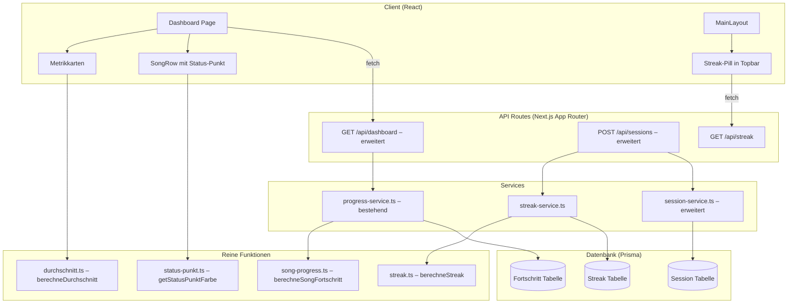

# Design: Gamification & Fortschritt

## Übersicht

Dieses Feature erweitert den Song Text Trainer um ein Gamification- und Fortschrittssystem. Es umfasst drei Kernbereiche:

1. **Streak-System**: Zählt aufeinanderfolgende Trainingstage und zeigt den Streak als orange Pill in der Topbar an. Die Streak-Logik wird als reine Funktion implementiert und bei jedem Session-Abschluss aktualisiert.
2. **Song-Fortschrittsmodell**: Berechnet den Lernstand pro Song als gewichteten Durchschnitt der Strophen-Fortschritte. Farbige Status-Punkte (grau/orange/grün) kommunizieren den Lernstand visuell.
3. **Dashboard-Metriken**: Drei Metrikkarten zeigen „Songs aktiv", „Sessions gesamt" und „Ø Fortschritt". Der Durchschnittsfortschritt wird über alle aktiven Songs aggregiert.

Alle Berechnungen (Streak, Song-Fortschritt, Status-Punkt-Farbe, Durchschnittsfortschritt) werden als reine Funktionen in `src/lib/gamification/` implementiert, um Testbarkeit und Nachvollziehbarkeit zu gewährleisten.

## Architektur

Das Feature folgt der bestehenden Architektur des Projekts:



### Designentscheidungen

- **Reine Funktionen**: Streak-Berechnung, Song-Fortschritt, Status-Punkt-Farbe und Durchschnittsfortschritt werden als reine Funktionen ohne Seiteneffekte implementiert. Dies ermöglicht Property-Based Testing und macht die Logik deterministisch.
- **Streak als eigene Tabelle**: Ein separates `Streak`-Modell pro Nutzer statt Berechnung aus Session-Daten. Dies vermeidet teure Queries über alle Sessions und ermöglicht O(1)-Zugriff.
- **Streak-Aktualisierung in Session-Transaktion**: Die Streak-Aktualisierung erfolgt innerhalb derselben Datenbanktransaktion wie der Session-Abschluss, um Konsistenz zu garantieren.
- **Bestehende `SongRow`-Komponente erweitern**: Die `SongRow`-Komponente zeigt bereits einen Status-Punkt und Session-Zähler. Die Farblogik wird durch die reine Funktion `getStatusPunktFarbe` formalisiert.

## Komponenten und Schnittstellen

### Reine Funktionen (`src/lib/gamification/`)

#### `streak.ts`

```typescript
interface StreakInput {
  currentStreak: number;
  lastSessionDate: Date | null;
  today: Date;
}

interface StreakResult {
  streak: number;
  lastSessionDate: Date;
}

function berechneStreak(input: StreakInput): StreakResult;
```

#### `song-progress.ts`

```typescript
/** Berechnet den Song-Fortschritt als Durchschnitt der Strophen-Fortschritte */
function berechneSongFortschritt(strophenFortschritte: number[]): number;
```

#### `status-punkt.ts`

```typescript
type StatusPunktFarbe = "grau" | "orange" | "gruen";

/** Gibt die Status-Punkt-Farbe basierend auf dem Fortschritt zurück */
function getStatusPunktFarbe(fortschrittProzent: number): StatusPunktFarbe;
```

#### `durchschnitt.ts`

```typescript
/** Berechnet den Durchschnittsfortschritt über alle Songs */
function berechneDurchschnitt(songFortschritte: number[]): number;
```

### Service-Schicht (`src/lib/services/`)

#### `streak-service.ts` (neu)

```typescript
/** Liest den aktuellen Streak-Wert für einen Nutzer */
async function getStreak(userId: string): Promise<number>;

/** Aktualisiert den Streak nach Session-Abschluss (innerhalb einer Transaktion) */
async function updateStreak(userId: string, tx?: PrismaTransaction): Promise<StreakResult>;
```

#### `session-service.ts` (erweitert)

Die bestehende `createSession`-Funktion wird erweitert, um die Streak-Aktualisierung innerhalb derselben Transaktion durchzuführen und den neuen Streak-Wert zurückzugeben.

```typescript
interface SessionCreateResult {
  session: Session;
  streak: number;
}

async function createSessionWithStreak(
  userId: string,
  songId: string,
  lernmethode: Lernmethode
): Promise<SessionCreateResult>;
```

### API-Endpunkte

#### `GET /api/streak` (neu)

- **Authentifizierung**: Erforderlich
- **Response**: `{ streak: number }`
- **Logik**: Liest den Streak-Datensatz. Wenn `lastSessionDate` mehr als 1 Tag zurückliegt, wird 0 zurückgegeben.

#### `POST /api/sessions` (erweitert)

- **Bestehende Funktionalität bleibt erhalten**
- **Zusätzlich**: Streak-Aktualisierung in derselben Transaktion
- **Response erweitert**: `{ session: Session, streak: number }`

#### `GET /api/dashboard` (erweitert)

- **Zusätzlich**: `streak`-Feld in der Response
- **Zusätzlich**: `activeSongCount`-Feld (Songs mit mindestens einer Session)
- **Response erweitert**: `{ ...bestehendeFelder, streak: number, activeSongCount: number }`

### UI-Komponenten

#### `StreakPill` (neu, `src/components/gamification/streak-pill.tsx`)

```typescript
interface StreakPillProps {
  streak: number;
}
```

- Zeigt eine orange Pill mit Flammen-Icon und Text „N Tage Streak" / „1 Tag Streak"
- Wird nur gerendert wenn `streak > 0`
- Platzierung: Rechts in der Topbar (MainLayout)

#### `StatusPunkt` (neu, `src/components/gamification/status-punkt.tsx`)

```typescript
interface StatusPunktProps {
  fortschritt: number;
}
```

- Rendert einen farbigen Punkt basierend auf `getStatusPunktFarbe(fortschritt)`
- Ersetzt die bestehende inline Status-Punkt-Logik in `SongRow`

#### `MetrikKarte` (neu, `src/components/gamification/metrik-karte.tsx`)

```typescript
interface MetrikKarteProps {
  label: string;
  value: string | number;
  fortschrittsbalken?: number; // Optional: Zeigt ProgressBar wenn gesetzt
}
```

- Wiederverwendbare Karte für Dashboard-Metriken
- Ersetzt die bestehenden inline Metrikkarten im Dashboard


## Datenmodelle

### Neues Prisma-Modell: `Streak`

```prisma
model Streak {
  id              String   @id @default(cuid())
  userId          String   @unique
  currentStreak   Int      @default(0)
  lastSessionDate DateTime?
  updatedAt       DateTime @updatedAt

  user User @relation(fields: [userId], references: [id], onDelete: Cascade)

  @@map("streaks")
}
```

**Felder:**
- `userId` (unique): Jeder Nutzer hat genau einen Streak-Datensatz
- `currentStreak`: Aktueller Streak-Wert (≥ 0)
- `lastSessionDate`: Datum der letzten abgeschlossenen Session (nullable für neue Nutzer)

**Relation zum User-Modell:**
```prisma
model User {
  // ... bestehende Felder
  streak Streak?
}
```

### Bestehende Modelle (unverändert)

Die folgenden bestehenden Modelle werden genutzt, aber nicht verändert:

- **`Session`**: Wird weiterhin für Session-Zählung verwendet. Das `createdAt`-Feld dient als Referenz für Trainingstage.
- **`Fortschritt`**: Speichert den Strophen-Fortschritt (`prozent`). Wird für Song-Fortschrittsberechnung verwendet.
- **`Wiederholung`**: Das `korrektZaehler`-Feld wird für die Strophe_Gelernt-Bedingung (≥ 3) ausgewertet.

### TypeScript-Typen (erweitert)

```typescript
// Erweiterung von DashboardData in src/types/song.ts
export interface DashboardData {
  // ... bestehende Felder
  streak: number;
  activeSongCount: number;
}

// Erweiterung der SongRow-Anzeige
export interface SongWithProgress {
  // ... bestehende Felder (status wird jetzt durch getStatusPunktFarbe berechnet)
  sessionCount: number; // Bereits vorhanden, wird im Dashboard angezeigt
}
```

### Datenbankmigrationsplan

1. Neues `Streak`-Modell zur Prisma-Schema hinzufügen
2. `User`-Modell um optionale `streak`-Relation erweitern
3. Migration ausführen: `npx prisma migrate dev --name add-streak-model`
4. Keine Datenmigration nötig – Streak-Datensätze werden bei erster Session automatisch erstellt


## Korrektheitseigenschaften

*Eine Korrektheitseigenschaft ist ein Merkmal oder Verhalten, das für alle gültigen Ausführungen eines Systems gelten sollte – im Wesentlichen eine formale Aussage darüber, was das System tun soll. Eigenschaften dienen als Brücke zwischen menschenlesbaren Spezifikationen und maschinenverifizierbaren Korrektheitsgarantien.*

### Property 1: Streak-Berechnung ist korrekt

*Für jede* gültige Kombination aus aktuellem Streak-Wert (≥ 0), Datum der letzten Session und heutigem Datum gilt: Wenn die Differenz zwischen heute und letzter Session 0 Tage beträgt, bleibt der Streak unverändert. Wenn die Differenz genau 1 Tag beträgt, erhöht sich der Streak um 1. Wenn die Differenz mehr als 1 Tag beträgt (oder keine letzte Session existiert), wird der Streak auf 1 gesetzt. Das zurückgegebene Datum ist immer das heutige Datum (außer bei Differenz 0, dann bleibt das letzte Session-Datum).

**Validates: Requirements 1.2, 1.3, 1.4, 1.5, 3.2, 3.3, 3.4, 11.3**

### Property 2: Streak-Anzeige-Text ist korrekt formatiert

*Für jeden* Streak-Wert ≥ 1 gilt: Die StreakPill-Komponente rendert einen Text, der den Streak-Wert enthält. Bei Streak = 1 wird „1 Tag Streak" angezeigt, bei Streak > 1 wird „N Tage Streak" angezeigt. Bei Streak = 0 wird die Komponente nicht gerendert (null).

**Validates: Requirements 2.1, 2.2, 2.3**

### Property 3: Fortschrittsberechnung als arithmetisches Mittel mit ganzzahligem Ergebnis in [0, 100]

*Für jede* nicht-leere Liste von Fortschrittswerten (jeweils ganze Zahlen in [0, 100]) gilt: Das Ergebnis von `berechneSongFortschritt` bzw. `berechneDurchschnitt` ist eine ganze Zahl im Bereich [0, 100] und entspricht dem gerundeten arithmetischen Mittel der Eingabewerte. Für eine leere Liste wird 0 zurückgegeben.

**Validates: Requirements 5.1, 5.2, 5.3, 5.4, 8.1, 8.2, 8.3**

### Property 4: Status-Punkt-Farbzuordnung ist vollständig und korrekt

*Für jeden* ganzzahligen Fortschrittswert im Bereich [0, 100] gilt: `getStatusPunktFarbe` gibt genau eine der drei Farben zurück – „grau" für 0%, „orange" für 1–99%, „grün" für 100%. Die Funktion ist total (kein Wert im gültigen Bereich führt zu einem Fehler).

**Validates: Requirements 6.1, 6.2, 6.3**

### Property 5: Session-Zählung ist methodenunabhängig und monoton steigend

*Für jeden* Song und *jede* Lernmethode gilt: Das Erstellen einer Session erhöht den Session-Zähler des Songs um genau 1. Der Session-Zähler ist immer ≥ 0 und eine ganze Zahl.

**Validates: Requirements 7.1, 7.3, 7.4**

### Property 6: Aktive-Songs-Zählung basiert auf Session-Existenz

*Für jede* Liste von Songs mit ihren Session-Zählern gilt: Die Anzahl der aktiven Songs entspricht genau der Anzahl der Songs mit `sessionCount > 0`.

**Validates: Requirements 9.2**

### Property 7: Strophe-Gelernt-Schwellenwert

*Für jede* Strophe gilt: Wenn der `korrektZaehler` in der Wiederholung ≥ 3 ist ODER die Strophe 2x fehlerfrei im Lückentext abgeschlossen wurde, dann ist der Strophen-Fortschritt 100%. Wenn keine der beiden Bedingungen erfüllt ist, ist der Fortschritt < 100%.

**Validates: Requirements 4.1, 4.2**

## Fehlerbehandlung

### Streak-Fehler bei Session-Abschluss

- Wenn die Streak-Aktualisierung innerhalb der Transaktion fehlschlägt, wird der Fehler geloggt, aber der Session-Abschluss wird **nicht** abgebrochen (Anforderung 10.3).
- Implementierung: Try-Catch um den Streak-Update innerhalb der Transaktion. Bei Fehler: `console.error` + Streak-Wert in der Response auf den vorherigen Wert setzen.

### Streak-API-Fehler

- `GET /api/streak` ohne Authentifizierung: HTTP 401 `{ error: "Nicht authentifiziert" }`
- Interner Fehler: HTTP 500 `{ error: "Interner Serverfehler" }`

### Fortschrittsberechnung

- Song ohne Strophen: Fortschritt = 0% (kein Fehler)
- Nutzer ohne aktive Songs: Durchschnittsfortschritt = 0% (kein Fehler)
- Ungültige Fortschrittswerte werden auf [0, 100] geclampt (bestehende Logik in `progress-service.ts`)

### Dashboard-Daten

- Fehlende Streak-Daten: Streak = 0 (kein Fehler, Streak-Pill wird nicht angezeigt)
- Bestehende Fehlerbehandlung im Dashboard-API-Endpunkt bleibt erhalten

## Teststrategie

### Property-Based Testing

**Bibliothek**: `fast-check` (bereits im Projekt als Dependency vorhanden)

**Konfiguration**: Mindestens 100 Iterationen pro Property-Test.

Jeder Property-Test referenziert die zugehörige Design-Property mit einem Kommentar:
```
// Feature: gamification-progress, Property N: [Beschreibung]
```

**Property-Tests** (`__tests__/gamification/`):

| Test-Datei | Property | Beschreibung |
|---|---|---|
| `streak-berechnung.property.test.ts` | Property 1 | Streak-Berechnung für alle Datumskombinationen |
| `streak-pill.property.test.ts` | Property 2 | Streak-Anzeige-Text für alle Streak-Werte |
| `fortschritt-durchschnitt.property.test.ts` | Property 3 | Arithmetisches Mittel mit ganzzahligem Ergebnis |
| `status-punkt-farbe.property.test.ts` | Property 4 | Farbzuordnung für alle Fortschrittswerte |
| `session-zaehlung.property.test.ts` | Property 5 | Session-Zählung über alle Lernmethoden |
| `aktive-songs.property.test.ts` | Property 6 | Aktive-Songs-Zählung |
| `strophe-gelernt.property.test.ts` | Property 7 | Strophe-Gelernt-Schwellenwert |

### Unit-Tests

Unit-Tests ergänzen die Property-Tests für spezifische Beispiele, Edge Cases und Integrationspunkte:

| Test-Datei | Beschreibung |
|---|---|
| `streak-service.test.ts` | Integration: Streak-Datensatz erstellen/aktualisieren via Prisma |
| `streak-api.test.ts` | API-Endpunkt: Authentifizierung, Response-Format, Streak-Verfall |
| `session-streak-integration.test.ts` | Integration: Session-Abschluss aktualisiert Streak in Transaktion |
| `dashboard-metriken.test.ts` | Integration: Dashboard-API liefert korrekte Metriken |
| `metrik-karte.test.ts` | Komponente: MetrikKarte rendert Label, Wert und optionalen Fortschrittsbalken |

### Testabdeckung

- **Reine Funktionen**: 100% durch Property-Tests abgedeckt
- **Services**: Integration mit Prisma-Mock durch Unit-Tests
- **API-Endpunkte**: Request/Response-Validierung durch Unit-Tests
- **UI-Komponenten**: Rendering-Verhalten durch Property-Tests (StreakPill) und Unit-Tests (MetrikKarte)

