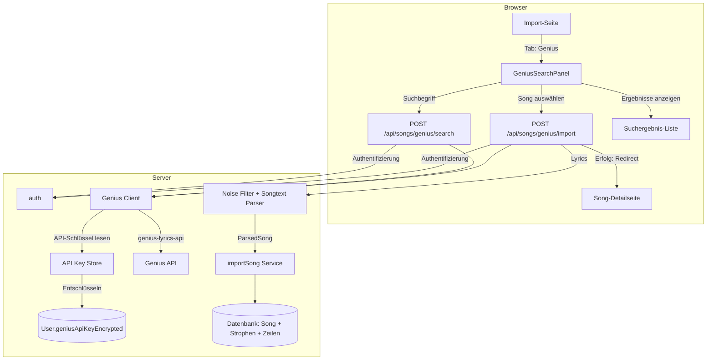

# Design-Dokument: Genius Song-Import

## Übersicht

Dieses Design beschreibt die Architektur für den Genius Song-Import in der Lyco-App. Nutzer können über einen neuen "Genius"-Tab auf der Import-Seite (`/songs/import`) Songs bei Genius suchen, ein Ergebnis auswählen und den Songtext automatisch abrufen und in die Datenbank importieren lassen. Die Genius-API-Kommunikation erfolgt serverseitig über das npm-Paket `genius-lyrics-api`. Jeder Nutzer speichert seinen eigenen Genius-API-Schlüssel verschlüsselt im Profil.

### Zentrale Design-Entscheidungen

1. **Per-User API-Schlüssel mit symmetrischer Verschlüsselung**: Jeder Nutzer hinterlegt seinen eigenen Genius Client Access Token. Der Schlüssel wird vor dem Speichern mit AES-256-GCM verschlüsselt (Schlüssel aus Umgebungsvariable `GENIUS_ENCRYPTION_KEY`). Dies vermeidet einen zentralen API-Schlüssel und gibt Nutzern Kontrolle über ihr eigenes Rate-Limit.

2. **Gekapselter Genius-Client (`src/lib/genius/client.ts`)**: Die gesamte Genius-API-Logik (Suche + Lyrics-Scraping) wird in einem eigenen Modul gekapselt, das `genius-lyrics-api` verwendet. Die API-Routen delegieren an diesen Client, der den entschlüsselten API-Schlüssel als Parameter erhält.

3. **Wiederverwendung bestehender Parser-Pipeline**: Die abgerufenen Lyrics durchlaufen den bestehenden `isNoiseLine()`-Filter und `parseSongtext()`-Parser. Da Genius-Lyrics bereits `[Section]`-Marker enthalten, funktioniert die bestehende Logik ohne Anpassung.

4. **Zwei dedizierte API-Routen**: `POST /api/songs/genius/search` für die Suche und `POST /api/songs/genius/import` für den Import. POST wird für beide verwendet, da sensible Daten (API-Schlüssel-Lookup) serverseitig verarbeitet werden und die Suchanfrage im Body übertragen wird.

5. **Erweiterung des bestehenden ImportMode-Typs**: Der Typ `ImportMode` wird um `"genius"` erweitert. Die `ImportTabs`-Komponente erhält einen vierten Tab. Die Import-Seite rendert das Genius-Such-Panel bedingt.

## Architektur



### Datenfluss

1. **Suche**: Nutzer gibt Suchbegriff ein → `POST /api/songs/genius/search` → Auth-Check → API-Schlüssel aus DB entschlüsseln → `genius-lyrics-api.searchSong()` → max. 10 Ergebnisse zurück → UI zeigt Titel, Künstler, Album-Art.
2. **Import**: Nutzer wählt Ergebnis → `POST /api/songs/genius/import` mit `geniusId` → Auth-Check → API-Schlüssel entschlüsseln → `genius-lyrics-api.getLyrics()` → Noise-Filter → Songtext-Parser → `importSong()` → Redirect zur Song-Detailseite.
3. **API-Schlüssel speichern**: Nutzer gibt Schlüssel in Profil-Einstellungen ein → `PUT /api/profile` mit `geniusApiKey` → AES-256-GCM-Verschlüsselung → Speichern in `User.geniusApiKeyEncrypted`.

## Komponenten und Schnittstellen

### 1. Genius-Client-Modul (`src/lib/genius/client.ts`)

Kapselt die Kommunikation mit der Genius-API über `genius-lyrics-api`.

```typescript
interface GeniusSearchResult {
  id: number;
  title: string;
  artist: string;
  url: string;
  albumArt: string | null;
}

async function searchSongs(query: string, apiKey: string): Promise<GeniusSearchResult[]>
async function fetchLyrics(geniusUrl: string, apiKey: string): Promise<string>
```

- `searchSongs`: Ruft `genius-lyrics-api` `searchSong()` auf, begrenzt auf 10 Ergebnisse. Gibt normalisierte `GeniusSearchResult[]` zurück.
- `fetchLyrics`: Ruft `genius-lyrics-api` `getLyrics()` auf und gibt den Rohtext zurück.
- Beide Funktionen erhalten den entschlüsselten API-Schlüssel als Parameter (kein direkter DB-Zugriff).

### 2. API-Key-Store (`src/lib/genius/api-key-store.ts`)

Verschlüsselung und Entschlüsselung des Genius-API-Schlüssels.

```typescript
function encryptApiKey(plaintext: string): string   // Gibt Base64-kodierten Ciphertext zurück (IV + Tag + Ciphertext)
function decryptApiKey(encrypted: string): string    // Entschlüsselt Base64-kodierten Ciphertext
async function getUserApiKey(userId: string): Promise<string>  // Liest und entschlüsselt aus DB
```

- Verwendet `crypto.createCipheriv` / `crypto.createDecipheriv` mit AES-256-GCM.
- Verschlüsselungsschlüssel aus `process.env.GENIUS_ENCRYPTION_KEY` (32 Bytes, hex-kodiert).
- IV wird zufällig generiert und dem Ciphertext vorangestellt.

### 3. Such-API-Route (`src/app/api/songs/genius/search/route.ts`)

```typescript
// POST /api/songs/genius/search
// Body: { query: string }
// Response 200: { results: GeniusSearchResult[] }
// Response 400: { error: "Kein Genius-API-Schlüssel hinterlegt..." }
// Response 401: { error: "Nicht authentifiziert" }
// Response 502: { error: "Genius-Suche fehlgeschlagen" }
```

### 4. Import-API-Route (`src/app/api/songs/genius/import/route.ts`)

```typescript
// POST /api/songs/genius/import
// Body: { geniusId: number, title: string, artist: string, geniusUrl: string }
// Response 201: { song: SongDetail }
// Response 400: { error: "Kein Genius-API-Schlüssel hinterlegt..." }
// Response 401: { error: "Nicht authentifiziert" }
// Response 422: { error: "Keine gültigen Lyrics gefunden" }
// Response 502: { error: "Lyrics konnten nicht abgerufen werden" }
```

### 5. GeniusSearchPanel-Komponente (`src/components/import/genius-search-panel.tsx`)

Client-Komponente für die Genius-Suche und Song-Auswahl.

```typescript
interface GeniusSearchPanelProps {
  onImportSuccess: (songId: string) => void;
  onError: (message: string) => void;
}
```

- Suchfeld mit Mindestlänge 2 Zeichen.
- Ladeanzeige während Suche und Import.
- Ergebnisliste mit Album-Art, Titel, Künstler.
- Klick auf Ergebnis löst Import aus.

### 6. Erweiterung ImportTabs (`src/components/import/import-tabs.tsx`)

- `ImportMode` wird um `"genius"` erweitert.
- Neuer Tab-Eintrag: `{ mode: "genius", label: "Genius" }`.

### 7. Erweiterung Profil-Service und API

- `PUT /api/profile` akzeptiert optionales Feld `geniusApiKey`.
- Leerer Wert → Schlüssel aus DB entfernen.
- Nicht-leerer Wert → Verschlüsseln und speichern.
- GET-Response gibt maskierten Schlüssel zurück (z.B. `"••••••abcd"`).

## Datenmodelle

### Prisma-Schema-Erweiterung

Das `User`-Modell erhält ein neues optionales Feld für den verschlüsselten Genius-API-Schlüssel:

```prisma
model User {
  // ... bestehende Felder ...
  geniusApiKeyEncrypted String?   // AES-256-GCM verschlüsselter API-Schlüssel (Base64)
}
```

### TypeScript-Typen

#### Genius-Typen (`src/types/genius.ts`)

```typescript
export interface GeniusSearchResult {
  id: number;
  title: string;
  artist: string;
  url: string;
  albumArt: string | null;
}

export interface GeniusSearchRequest {
  query: string;
}

export interface GeniusImportRequest {
  geniusId: number;
  title: string;
  artist: string;
  geniusUrl: string;
}
```

#### Erweiterung ImportMode (`src/types/import.ts`)

```typescript
export type ImportMode = "manuell" | "text" | "pdf" | "genius";
```

#### Erweiterung ProfileData (`src/types/profile.ts`)

```typescript
export interface ProfileData {
  // ... bestehende Felder ...
  geniusApiKeyMasked: string | null;  // z.B. "••••••abcd" oder null
}

export interface UpdateProfileInput {
  // ... bestehende Felder ...
  geniusApiKey?: string;  // Klartext zum Verschlüsseln, leerer String zum Entfernen
}
```

### Bestehende wiederverwendete Typen

- `ParsedSong` / `ParsedStrophe` aus `src/types/import.ts` — Ausgabe von `parseSongtext()`.
- `ImportSongInput` aus `src/types/song.ts` — Eingabe für `importSong()`.
- `SongDetail` aus `src/types/song.ts` — Rückgabe nach erfolgreichem Import.

## Correctness Properties

*Eine Property ist eine Eigenschaft oder ein Verhalten, das über alle gültigen Ausführungen eines Systems hinweg gelten sollte — im Wesentlichen eine formale Aussage darüber, was das System tun soll. Properties bilden die Brücke zwischen menschenlesbaren Spezifikationen und maschinell verifizierbaren Korrektheitsgarantien.*

### Property 1: API-Schlüssel-Verschlüsselung Round-Trip

*Für jeden* gültigen API-Schlüssel-String soll das Verschlüsseln mit `encryptApiKey()` und anschließende Entschlüsseln mit `decryptApiKey()` den ursprünglichen Klartext-Schlüssel ergeben.

**Validates: Requirements 8.2, 8.3, 8.7**

### Property 2: API-Schlüssel-Maskierung verbirgt Klartext

*Für jeden* gespeicherten API-Schlüssel mit Länge ≥ 4 soll die maskierte Darstellung in der API-Antwort den vollständigen Schlüssel nicht enthalten und nur die letzten 4 Zeichen im Klartext zeigen.

**Validates: Requirements 8.5**

### Property 3: Authentifizierungspflicht für Genius-Endpunkte

*Für jede* nicht-authentifizierte Anfrage an `POST /api/songs/genius/search` oder `POST /api/songs/genius/import` soll das System den HTTP-Status 401 zurückgeben.

**Validates: Requirements 4.2, 4.3**

### Property 4: Suchergebnis-Begrenzung auf maximal 10

*Für jede* Suchanfrage an den Genius-Client soll die zurückgegebene Ergebnisliste maximal 10 Einträge enthalten.

**Validates: Requirements 7.4**

### Property 5: Kurze Suchbegriffe lösen keine Suche aus

*Für jeden* Suchbegriff mit weniger als 2 Zeichen soll die Such-UI keine API-Anfrage auslösen.

**Validates: Requirements 2.5**

### Property 6: Suchergebnisse enthalten alle Pflichtfelder

*Für jedes* `GeniusSearchResult`-Objekt soll die gerenderte Darstellung den Titel, den Künstler und das Album-Cover (falls vorhanden) enthalten.

**Validates: Requirements 2.3**

### Property 7: Import-Pipeline verarbeitet Lyrics korrekt

*Für jeden* gültigen Lyrics-Rohtext (der nach Noise-Filterung und Parsing mindestens eine Strophe ergibt) soll der Import-Endpunkt den Song mit dem übergebenen Titel, Künstler und den korrekt geparsten Strophen in der Datenbank speichern.

**Validates: Requirements 3.3, 3.4**

### Property 8: Leere Lyrics ergeben HTTP 422

*Für jeden* Lyrics-Text, der nach Noise-Filterung und Parsing keine gültigen Strophen ergibt (leerer String, nur Whitespace, nur Noise-Zeilen), soll der Import-Endpunkt den HTTP-Status 422 mit der Meldung "Keine gültigen Lyrics gefunden" zurückgeben.

**Validates: Requirements 5.3**

### Property 9: Fehlermeldungen werden im Alert-Bereich angezeigt

*Für jede* Fehlermeldung, die von den Genius-API-Routen zurückgegeben wird, soll die Such-UI die Meldung in einem sichtbaren Alert-Bereich (`role="alert"`) anzeigen.

**Validates: Requirements 5.5**

### Property 10: Lyrics-Parsing Round-Trip (bestehend)

*Für jeden* gültigen geparsten Song soll `parseSongtext(printSongtext(song))` die gleichen Strophen-Namen und Zeilen-Arrays ergeben. (Bereits getestet in `songtext-roundtrip.property.test.ts` — wird für Genius-Lyrics wiederverwendet.)

**Validates: Requirements 6.4**

## Fehlerbehandlung

| Fehlerfall | Endpunkt | HTTP-Status | Meldung |
|---|---|---|---|
| Nicht authentifiziert | Beide | 401 | "Nicht authentifiziert" |
| Kein API-Schlüssel im Profil | Beide | 400 | "Kein Genius-API-Schlüssel hinterlegt. Bitte in den Profileinstellungen konfigurieren." |
| Genius-API-Fehler bei Suche | Search | 502 | "Genius-Suche fehlgeschlagen" |
| Lyrics-Abruf fehlgeschlagen | Import | 502 | "Lyrics konnten nicht abgerufen werden" |
| Leere/ungültige Lyrics | Import | 422 | "Keine gültigen Lyrics gefunden" |
| Netzwerkfehler (Client-seitig) | — | — | "Verbindung zu Genius fehlgeschlagen. Bitte versuche es erneut." |
| Interner Serverfehler | Beide | 500 | "Interner Serverfehler" |

### Fehlerbehandlungsstrategie

- **API-Routen**: Try-Catch um den gesamten Handler. Genius-API-Fehler werden als 502 weitergegeben, Validierungsfehler als 400/422. Unerwartete Fehler werden geloggt und als 500 zurückgegeben.
- **Client-Komponente**: Fetch-Fehler (Netzwerk) werden abgefangen und als benutzerfreundliche Meldung im Alert-Bereich angezeigt. HTTP-Fehlermeldungen aus der API-Response werden direkt angezeigt.
- **API-Key-Store**: Entschlüsselungsfehler (z.B. korrupte Daten, falscher Schlüssel) werden als interner Fehler behandelt und geloggt.

## Teststrategie

### Dualer Testansatz

Die Teststrategie kombiniert Unit-Tests für spezifische Beispiele und Edge-Cases mit Property-Based-Tests für universelle Eigenschaften.

### Property-Based Testing

- **Bibliothek**: `fast-check` (bereits im Projekt verwendet)
- **Mindestiterationen**: 100 pro Property-Test
- **Tag-Format**: `Feature: genius-song-import, Property {number}: {property_text}`
- Jede Correctness Property wird durch genau einen Property-Based-Test implementiert

### Unit-Tests

- **API-Routen**: Testen der HTTP-Statuscodes und Fehlermeldungen für spezifische Szenarien (fehlende Auth, fehlender API-Key, Genius-API-Fehler)
- **Genius-Client**: Testen mit gemocktem `genius-lyrics-api`-Paket
- **API-Key-Store**: Testen der Verschlüsselung/Entschlüsselung mit bekannten Werten
- **UI-Komponenten**: Testen der Tab-Anzeige, Suchergebnis-Rendering, Ladeanzeigen und Fehlermeldungen

### Testdateien

| Testdatei | Typ | Beschreibung |
|---|---|---|
| `__tests__/genius/api-key-roundtrip.property.test.ts` | Property | Property 1: Verschlüsselung Round-Trip |
| `__tests__/genius/api-key-masking.property.test.ts` | Property | Property 2: Maskierung |
| `__tests__/genius/auth-required.property.test.ts` | Property | Property 3: Authentifizierungspflicht |
| `__tests__/genius/search-limit.property.test.ts` | Property | Property 4: Max 10 Ergebnisse |
| `__tests__/genius/short-query.property.test.ts` | Property | Property 5: Kurze Suchbegriffe |
| `__tests__/genius/search-result-fields.property.test.ts` | Property | Property 6: Pflichtfelder |
| `__tests__/genius/import-pipeline.property.test.ts` | Property | Property 7: Import-Pipeline |
| `__tests__/genius/empty-lyrics.property.test.ts` | Property | Property 8: Leere Lyrics → 422 |
| `__tests__/genius/error-alert.property.test.ts` | Property | Property 9: Alert-Bereich |
| `__tests__/genius/genius-client.test.ts` | Unit | Genius-Client mit Mocks |
| `__tests__/genius/genius-search-api.test.ts` | Unit | Such-API-Route |
| `__tests__/genius/genius-import-api.test.ts` | Unit | Import-API-Route |
| `__tests__/genius/genius-search-panel.test.ts` | Unit | UI-Komponente |
