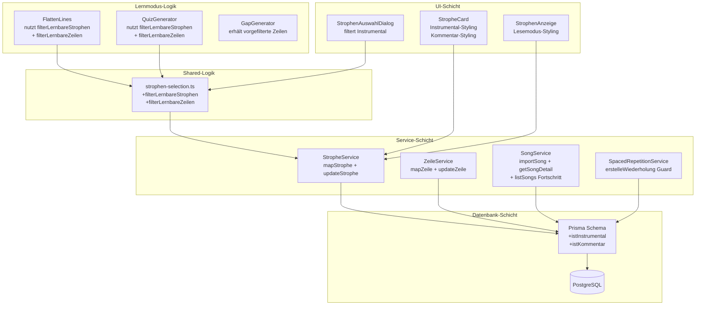
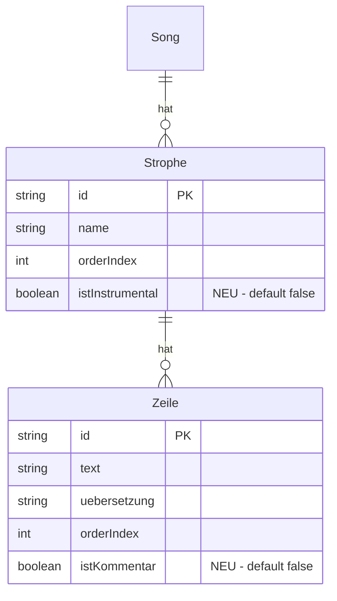

# Design Document: Instrumental-Annotations

## Übersicht

Dieses Feature erweitert das bestehende Song-Datenmodell um zwei boolesche Flags — `istInstrumental` auf Strophen-Ebene und `istKommentar` auf Zeilen-Ebene — die es ermöglichen, nicht-gesungene Abschnitte (Instrumentalteile, Pausen, Annotationen) visuell zu kennzeichnen und gleichzeitig aus allen Lerninteraktionen auszuschließen.

**Kernprinzip:** Die Markierungen wirken als Filter-Schicht zwischen Datenmodell und Lernlogik. In der Textanzeige (Karaoke, Stage, Song-Detail) bleiben markierte Elemente sichtbar mit besonderem Styling. In allen Lernmodi (Quiz, Lückentext, Karaoke-Übung, Spaced Repetition, Zeile-für-Zeile, Rückwärts) werden sie vollständig ausgeschlossen.

**Design-Entscheidung:** Statt die Filterlogik in jedem Lernmodus zu duplizieren, werden zwei zentrale Filterfunktionen (`filterLernbareStrophen`, `filterLernbareZeilen`) im Shared-Modul bereitgestellt. Alle Lernmodi nutzen diese Funktionen als einzigen Einstiegspunkt für die Filterung.

## Architektur

Die Änderungen folgen der bestehenden Schichtarchitektur des Projekts:



**Datenfluss für Lernmodi:**
1. Song-Daten werden aus der DB geladen (inkl. `istInstrumental` / `istKommentar`)
2. `filterLernbareStrophen` entfernt instrumentale Strophen
3. `filterLernbareZeilen` entfernt Kommentar-Zeilen aus den verbleibenden Strophen
4. Die gefilterten Daten werden an den jeweiligen Lernmodus übergeben

**Datenfluss für Anzeige-Modi:**
1. Song-Daten werden vollständig geladen
2. UI-Komponenten prüfen `istInstrumental` / `istKommentar` und wenden spezielles Styling an
3. Keine Filterung — alle Elemente bleiben sichtbar

## Komponenten und Schnittstellen

### 1. Shared-Modul: `src/lib/shared/strophen-selection.ts`

Neue Funktionen neben den bestehenden `getWeakStrophenIds` und `hasWeaknesses`:

```typescript
/** Filtert Strophen mit istInstrumental === true heraus */
export function filterLernbareStrophen(strophen: StropheDetail[]): StropheDetail[]

/** Filtert Zeilen mit istKommentar === true heraus */
export function filterLernbareZeilen(zeilen: ZeileDetail[]): ZeileDetail[]
```

**Rationale:** Zentrale Filterfunktionen vermeiden Duplikation und stellen sicher, dass alle Lernmodi konsistent filtern. Änderungen an der Filterlogik müssen nur an einer Stelle vorgenommen werden.

### 2. StropheService: `src/lib/services/strophe-service.ts`

Änderungen:
- `mapStrophe()`: Neues Feld `istInstrumental` aus DB-Objekt in `StropheDetail` mappen
- `updateStrophe()`: `istInstrumental` aus `UpdateStropheInput` in DB-Update übernehmen

### 3. ZeileService: `src/lib/services/zeile-service.ts`

Änderungen:
- `mapZeile()`: Neues Feld `istKommentar` aus DB-Objekt in `ZeileDetail` mappen
- `updateZeile()`: `istKommentar` aus `UpdateZeileInput` in DB-Update übernehmen

### 4. SongService: `src/lib/services/song-service.ts`

Änderungen:
- `importSong()`: `istInstrumental` pro Strophe und `istKommentar` pro Zeile beim Erstellen übergeben (Default: `false`)
- `getSongDetail()`: `istInstrumental` und `istKommentar` in die Mapping-Logik aufnehmen
- `listSongs()`: Fortschrittsberechnung anpassen — nur nicht-instrumentale Strophen in den Durchschnitt einbeziehen

### 5. SpacedRepetitionService: `src/lib/services/spaced-repetition-service.ts`

Änderungen:
- `erstelleWiederholung()`: Vor dem Erstellen prüfen, ob `strophe.istInstrumental === true`. Falls ja, mit Fehler abbrechen.

### 6. FlattenLines: `src/lib/karaoke/flatten-lines.ts`

Änderungen:
- Instrumentale Strophen überspringen (gesamte Strophe wird nicht geflacht)
- Kommentar-Zeilen innerhalb normaler Strophen überspringen
- Nutzt `filterLernbareStrophen` und `filterLernbareZeilen` intern

**Design-Entscheidung:** `flattenLines` wird nur im Lernmodus (Karaoke-Übung, Zeile-für-Zeile, Rückwärts) verwendet. Für den Lesemodus wird eine separate Funktion oder der ungefilterte Datensatz genutzt. Die bestehende `flattenLines`-Signatur bleibt kompatibel — die Filterung erfolgt intern.

### 7. QuizGenerator: `src/lib/quiz/quiz-generator.ts`

Änderungen:
- `filterActiveStrophen()`: Zusätzlich `istInstrumental === true` herausfiltern
- `collectWords()`: Kommentar-Zeilen beim Wort-Sammeln überspringen
- `generateMCQuestions()`, `generateReihenfolgeQuestions()`, `generateDiktatQuestions()`: Kommentar-Zeilen bei der Fragen-Generierung überspringen

### 8. GapGenerator: `src/lib/cloze/gap-generator.ts`

Keine direkte Änderung am GapGenerator nötig. Die Filterung erfolgt vor dem Aufruf — der Aufrufer übergibt nur `ZeileInput[]` von nicht-instrumentalen Strophen und ohne Kommentar-Zeilen.

**Rationale:** Der GapGenerator arbeitet mit `ZeileInput` (nur `id` und `text`), nicht mit `ZeileDetail`. Die Filterung muss daher im Aufrufer (Lückentext-Seite) stattfinden, bevor die Zeilen an `generateGaps` übergeben werden.

### 9. StropheCard: `src/components/songs/strophe-card.tsx`

Änderungen:
- Wenn `strophe.istInstrumental === true`: Gesamte Karte mit gedämpftem Styling (Opacity, kursive Schrift), "[Instrumental]"-Badge neben dem Strophen-Namen, Notiz-Bereich und Fortschrittsbalken ausblenden
- Wenn `zeile.istKommentar === true`: Zeile kursiv und mit gedämpfter Farbe darstellen, visuell von normalen Zeilen abgrenzen

### 10. StrophenAnzeige: `src/components/karaoke/strophen-anzeige.tsx`

Änderungen:
- Kommentar-Zeilen mit besonderem Styling anzeigen (kursiv, gedämpfte Opacity)
- Kommentar-Zeilen nicht als aktive Zeile behandeln (kein Highlighting, kein Scroll-Target)

### 11. StrophenAuswahlDialog: `src/components/cloze/strophen-auswahl-dialog.tsx`

Änderungen:
- Instrumentale Strophen aus der Auswahlliste herausfiltern (nutzt `filterLernbareStrophen`)
- "Alle auswählen" und "Schwächen üben" berücksichtigen nur lernbare Strophen

## Datenmodell

### Prisma-Schema-Erweiterungen

```prisma
model Strophe {
  // ... bestehende Felder ...
  istInstrumental Boolean @default(false)
}

model Zeile {
  // ... bestehende Felder ...
  istKommentar Boolean @default(false)
}
```

**Migration:** Eine einfache `ALTER TABLE`-Migration fügt die beiden Spalten mit Default-Wert `false` hinzu. Bestehende Daten bleiben unverändert — alle existierenden Strophen sind nicht-instrumental, alle Zeilen sind nicht-Kommentar.

### TypeScript-Typ-Erweiterungen

```typescript
// src/types/song.ts

export interface StropheDetail {
  // ... bestehende Felder ...
  istInstrumental: boolean;
}

export interface ZeileDetail {
  // ... bestehende Felder ...
  istKommentar: boolean;
}

export interface UpdateStropheInput {
  name?: string;
  istInstrumental?: boolean;
}

export interface UpdateZeileInput {
  text?: string;
  uebersetzung?: string;
  istKommentar?: boolean;
}

export interface ImportStropheInput {
  name: string;
  istInstrumental?: boolean;
  zeilen: ImportZeileInput[];
  markups?: ImportMarkupInput[];
}

export interface ImportZeileInput {
  text: string;
  uebersetzung?: string;
  istKommentar?: boolean;
  markups?: ImportMarkupInput[];
}
```

### Datenfluss-Diagramm



## Correctness Properties

*A property is a characteristic or behavior that should hold true across all valid executions of a system — essentially, a formal statement about what the system should do. Properties serve as the bridge between human-readable specifications and machine-verifiable correctness guarantees.*

### Property 1: filterLernbareStrophen Subset-Invariante

*For any* array of `StropheDetail` objects, `filterLernbareStrophen` SHALL return a subset of the input that contains no strophe with `istInstrumental === true`, and every non-instrumental strophe from the input SHALL be present in the output.

**Validates: Requirements 11.1, 11.3**

### Property 2: filterLernbareStrophen Idempotenz

*For any* array of `StropheDetail` objects where no strophe has `istInstrumental === true`, `filterLernbareStrophen` SHALL return an array identical to the input (same elements, same order).

**Validates: Requirements 11.5**

### Property 3: filterLernbareZeilen Subset-Invariante

*For any* array of `ZeileDetail` objects, `filterLernbareZeilen` SHALL return a subset of the input that contains no zeile with `istKommentar === true`, and every non-kommentar zeile from the input SHALL be present in the output.

**Validates: Requirements 11.2, 11.4**

### Property 4: filterLernbareZeilen Idempotenz

*For any* array of `ZeileDetail` objects where no zeile has `istKommentar === true`, `filterLernbareZeilen` SHALL return an array identical to the input (same elements, same order).

**Validates: Requirements 11.6**

### Property 5: FlattenLines schließt nicht-lernbare Inhalte aus

*For any* `SongDetail` mit beliebiger Mischung aus instrumentalen und normalen Strophen sowie Kommentar- und normalen Zeilen, `flattenLines` SHALL eine flache Liste zurückgeben, die keine Zeile enthält, deren `stropheId` zu einer instrumentalen Strophe gehört, und keine Zeile enthält, deren `zeileId` zu einer Kommentar-Zeile gehört.

**Validates: Requirements 3.2, 3.6, 3.7, 4.2, 4.4, 4.5**

### Property 6: QuizGenerator schließt nicht-lernbare Inhalte aus

*For any* `SongDetail` mit beliebiger Mischung aus instrumentalen Strophen und Kommentar-Zeilen, alle von `generateMCQuestions`, `generateReihenfolgeQuestions` und `generateDiktatQuestions` erzeugten Fragen SHALL keine `stropheId` referenzieren, die zu einer instrumentalen Strophe gehört, und keine `zeileId` referenzieren, die zu einer Kommentar-Zeile gehört.

**Validates: Requirements 3.1, 4.1**

### Property 7: Fortschrittsberechnung schließt Instrumental-Strophen aus

*For any* Song mit beliebiger Mischung aus instrumentalen und normalen Strophen mit beliebigen Fortschrittswerten, der berechnete Song-Fortschritt SHALL dem gerundeten Durchschnitt der Fortschrittswerte ausschließlich der nicht-instrumentalen Strophen entsprechen. Wenn alle Strophen instrumental sind, SHALL der Fortschritt 0 sein.

**Validates: Requirements 9.1, 9.2**

## Fehlerbehandlung

### SpacedRepetition: Instrumental-Strophe einschreiben

Wenn `erstelleWiederholung` mit einer instrumentalen Strophe aufgerufen wird:
- **Fehler:** `"Instrumentale Strophen können nicht zur Wiederholung hinzugefügt werden"`
- **HTTP-Status:** 400 Bad Request
- **Verhalten:** Kein Wiederholungs-Eintrag wird erstellt

### Fortschrittsberechnung: Alle Strophen instrumental

Wenn ein Song ausschließlich instrumentale Strophen enthält:
- **Fortschritt:** 0% (Division durch Null vermeiden)
- **Status:** `"neu"` (da Fortschritt = 0)

### Import: Ungültige Werte

Wenn `istInstrumental` oder `istKommentar` im Import-Payload kein Boolean ist:
- Bestehende Validierung greift (TypeScript-Typen + API-Validierung)
- Nicht-boolesche Werte werden abgelehnt

### UI: Leere lernbare Strophen

Wenn nach Filterung keine lernbaren Strophen übrig bleiben:
- StrophenAuswahlDialog zeigt eine Hinweismeldung: "Keine lernbaren Strophen vorhanden"
- Lernmodi zeigen eine entsprechende Meldung statt einer leeren Übung

## Testing-Strategie

### Property-Based Tests (fast-check + vitest)

Jeder Property-Test wird mit mindestens 100 Iterationen konfiguriert und referenziert die zugehörige Design-Property.

| Property | Testdatei | Beschreibung |
|----------|-----------|--------------|
| Property 1 | `__tests__/instrumental/filter-strophen-invariant.property.test.ts` | filterLernbareStrophen Subset-Invariante |
| Property 2 | `__tests__/instrumental/filter-strophen-idempotent.property.test.ts` | filterLernbareStrophen Idempotenz |
| Property 3 | `__tests__/instrumental/filter-zeilen-invariant.property.test.ts` | filterLernbareZeilen Subset-Invariante |
| Property 4 | `__tests__/instrumental/filter-zeilen-idempotent.property.test.ts` | filterLernbareZeilen Idempotenz |
| Property 5 | `__tests__/instrumental/flatten-lines-exclusion.property.test.ts` | FlattenLines Ausschluss |
| Property 6 | `__tests__/instrumental/quiz-generator-exclusion.property.test.ts` | QuizGenerator Ausschluss |
| Property 7 | `__tests__/instrumental/progress-calculation.property.test.ts` | Fortschrittsberechnung |

**Tag-Format:** `Feature: instrumental-annotations, Property {N}: {Titel}`

**Generatoren:** Für die Property-Tests werden fast-check Arbitraries benötigt, die zufällige `StropheDetail[]` und `ZeileDetail[]` mit variierenden `istInstrumental`/`istKommentar`-Flags erzeugen. Ein gemeinsamer Generator in einer Hilfsdatei (`__tests__/instrumental/generators.ts`) vermeidet Duplikation.

### Unit Tests (Beispiel-basiert)

| Bereich | Testdatei | Beschreibung |
|---------|-----------|--------------|
| StropheCard | `__tests__/instrumental/strophe-card-instrumental.test.ts` | Instrumental-Styling, Badge, Kommentar-Zeilen-Styling |
| StrophenAnzeige | `__tests__/instrumental/strophen-anzeige-instrumental.test.ts` | Lesemodus-Styling für Instrumental und Kommentar |
| StrophenAuswahlDialog | `__tests__/instrumental/strophen-auswahl-dialog.test.ts` | Instrumental-Strophen nicht in Auswahlliste |
| SpacedRepetition | `__tests__/instrumental/spaced-repetition-guard.test.ts` | Ablehnung instrumentaler Strophen |

### Integration Tests

| Bereich | Testdatei | Beschreibung |
|---------|-----------|--------------|
| StropheService API | `__tests__/instrumental/strophe-api.test.ts` | PATCH istInstrumental, GET enthält Feld |
| ZeileService API | `__tests__/instrumental/zeile-api.test.ts` | PATCH istKommentar, GET enthält Feld |
| Import | `__tests__/instrumental/import.test.ts` | Import mit/ohne Flags, Default-Werte |
