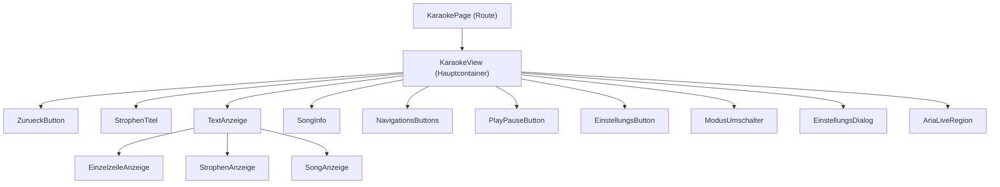
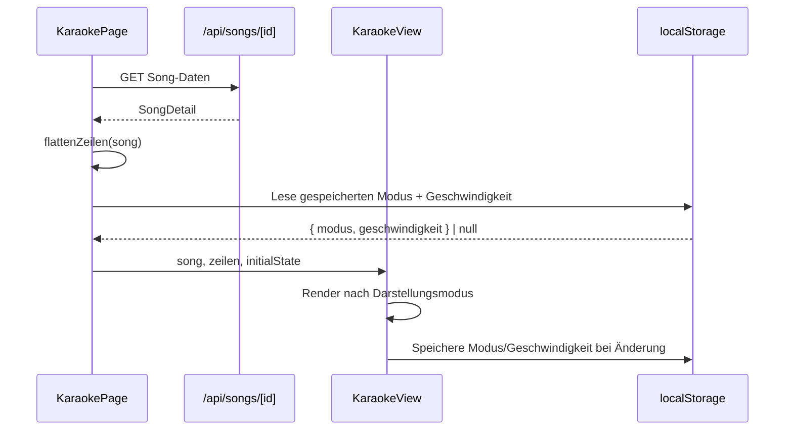

# Design-Dokument: Karaoke-Lesemodus

## Übersicht

Der Karaoke-Lesemodus ist eine neue immersive Lernmethode im Song Text Trainer, die Songtexte in einer Vollbild-Ansicht mit Farbverlauf-Hintergrund darstellt. Die Komponente wird unter `/songs/[id]/karaoke/page.tsx` als neue Route im bestehenden App-Router-Muster eingebunden.

Drei Darstellungsmodi (Einzelzeile, Strophe, Song) bieten unterschiedliche Fokusstufen. Die aktive Zeile ist stets vertikal zentriert. Auto-Scroll mit konfigurierbarer Geschwindigkeit, Tastaturnavigation und vollständige Barrierefreiheit runden das Feature ab.

Designentscheidungen:
- Kein eigener API-Endpunkt nötig – die bestehende `/api/songs/[id]`-Route liefert alle benötigten Daten (`SongDetail` mit `strophen[]` und `zeilen[]`).
- Zustandsverwaltung rein client-seitig via React-Hooks (kein globaler State-Manager nötig).
- localStorage für Persistenz von Darstellungsmodus und Scroll-Geschwindigkeit (bestehendes Muster im Projekt).
- CSS-Transitions für flüssige Zeilenübergänge (200–400ms), keine externe Animationsbibliothek.

## Architektur

### Komponentenhierarchie



### Datenfluss



## Komponenten und Schnittstellen

### KaraokePage (`src/app/(main)/songs/[id]/karaoke/page.tsx`)

Server-Route-Komponente (client-seitig via `"use client"`). Lädt Song-Daten, flacht Zeilen ab und initialisiert den Zustand.

```typescript
// Kein eigener Props-Typ – nutzt useParams() für die Song-ID
// Zustand:
// - song: SongDetail | null
// - loading: boolean
// - error: string | null
// - activeLineIndex: number (Index in der flachen Zeilenliste)
// - displayMode: DisplayMode
// - scrollSpeed: number (Sekunden)
// - isAutoScrolling: boolean
// - settingsOpen: boolean
```

### KaraokeView (`src/components/karaoke/karaoke-view.tsx`)

Hauptcontainer mit Vollbild-Layout und Gradient-Hintergrund.

```typescript
interface KaraokeViewProps {
  song: SongDetail;
  flatLines: FlatLine[];
  activeLineIndex: number;
  displayMode: DisplayMode;
  isAutoScrolling: boolean;
  scrollSpeed: number;
  onNext: () => void;
  onPrev: () => void;
  onToggleAutoScroll: () => void;
  onModeChange: (mode: DisplayMode) => void;
  onOpenSettings: () => void;
  onBack: () => void;
}
```

### TextAnzeige (`src/components/karaoke/text-anzeige.tsx`)

Delegiert an den aktiven Darstellungsmodus.

```typescript
interface TextAnzeigeProps {
  flatLines: FlatLine[];
  activeLineIndex: number;
  displayMode: DisplayMode;
  song: SongDetail;
}
```

### EinzelzeileAnzeige (`src/components/karaoke/einzelzeile-anzeige.tsx`)

Zeigt nur die aktive Zeile, zentriert.

```typescript
interface EinzelzeileAnzeigeProps {
  activeLine: FlatLine;
}
```

### StrophenAnzeige (`src/components/karaoke/strophen-anzeige.tsx`)

Zeigt alle Zeilen der aktiven Strophe. Aktive Zeile hervorgehoben, Rest abgetönt.

```typescript
interface StrophenAnzeigeProps {
  strophe: StropheDetail;
  activeZeileId: string;
}
```

### SongAnzeige (`src/components/karaoke/song-anzeige.tsx`)

Zeigt den gesamten Song mit abgestufter Deckkraft und Fade-Effekt an den Rändern.

```typescript
interface SongAnzeigeProps {
  song: SongDetail;
  activeLineIndex: number;
  flatLines: FlatLine[];
}
```

### ModusUmschalter (`src/components/karaoke/modus-umschalter.tsx`)

Segmented-Control für die drei Darstellungsmodi.

```typescript
interface ModusUmschalterProps {
  activeMode: DisplayMode;
  onChange: (mode: DisplayMode) => void;
}
```

### NavigationsButtons (`src/components/karaoke/navigations-buttons.tsx`)

Chevron-hoch/runter-Buttons, vertikal gestapelt.

```typescript
interface NavigationsButtonsProps {
  onNext: () => void;
  onPrev: () => void;
  isFirstLine: boolean;
  isLastLine: boolean;
}
```

### PlayPauseButton (`src/components/karaoke/play-pause-button.tsx`)

Toggle-Button für Auto-Scroll.

```typescript
interface PlayPauseButtonProps {
  isPlaying: boolean;
  onToggle: () => void;
}
```

### EinstellungsDialog (`src/components/karaoke/einstellungs-dialog.tsx`)

Modaler Dialog mit Slider für Scroll-Geschwindigkeit.

```typescript
interface EinstellungsDialogProps {
  isOpen: boolean;
  onClose: () => void;
  scrollSpeed: number;
  onSpeedChange: (speed: number) => void;
}
```

### Hilfsfunktionen (`src/lib/karaoke/`)

```typescript
// src/lib/karaoke/flatten-lines.ts
interface FlatLine {
  zeileId: string;
  text: string;
  stropheId: string;
  stropheName: string;
  globalIndex: number;       // Index über den gesamten Song
  indexInStrophe: number;    // Index innerhalb der Strophe
  stropheLineCount: number;  // Gesamtzahl Zeilen in dieser Strophe
}

function flattenLines(song: SongDetail): FlatLine[]

// src/lib/karaoke/line-opacity.ts
function getLineOpacity(
  line: FlatLine,
  activeLine: FlatLine,
  displayMode: DisplayMode
): number

// src/lib/karaoke/fade-visibility.ts
function shouldFade(
  lineIndex: number,
  activeLineIndex: number,
  totalLines: number,
  position: "top" | "bottom"
): boolean

// src/lib/karaoke/storage.ts
const STORAGE_KEYS = {
  displayMode: "karaoke-display-mode",
  scrollSpeed: "karaoke-scroll-speed",
} as const;

function loadKaraokeSettings(): { displayMode: DisplayMode; scrollSpeed: number }
function saveDisplayMode(mode: DisplayMode): void
function saveScrollSpeed(speed: number): void
```

### Custom Hook: `useAutoScroll`

```typescript
// src/lib/karaoke/use-auto-scroll.ts
interface UseAutoScrollOptions {
  speed: number;           // Sekunden pro Zeile
  isLastLine: boolean;
  onAdvance: () => void;   // Callback zum Weiterschalten
}

interface UseAutoScrollReturn {
  isPlaying: boolean;
  play: () => void;
  pause: () => void;
  toggle: () => void;
}

function useAutoScroll(options: UseAutoScrollOptions): UseAutoScrollReturn
```

### Custom Hook: `useKaraokeKeyboard`

```typescript
// src/lib/karaoke/use-karaoke-keyboard.ts
interface UseKaraokeKeyboardOptions {
  onNext: () => void;
  onPrev: () => void;
  onToggleAutoScroll: () => void;
  onEscape: () => void;
}

function useKaraokeKeyboard(options: UseKaraokeKeyboardOptions): void
```

## Datenmodelle

### Bestehende Typen (unverändert)

Das Feature nutzt die bestehenden Typen `SongDetail`, `StropheDetail` und `ZeileDetail` aus `src/types/song.ts`. Keine Änderungen an der Datenbank oder API nötig.

### Neue Typen

```typescript
// src/types/karaoke.ts

/** Die drei Darstellungsmodi */
type DisplayMode = "einzelzeile" | "strophe" | "song";

/** Flache Zeile mit Kontext-Informationen für die Karaoke-Ansicht */
interface FlatLine {
  zeileId: string;
  text: string;
  stropheId: string;
  stropheName: string;
  globalIndex: number;
  indexInStrophe: number;
  stropheLineCount: number;
}

/** Konfiguration des Hintergrund-Gradienten */
interface GradientConfig {
  startColor: string;
  endColor: string;
  direction: string;  // z.B. "to bottom right"
}

/** Persistierte Karaoke-Einstellungen */
interface KaraokeSettings {
  displayMode: DisplayMode;
  scrollSpeed: number;  // 1–10 Sekunden
}
```

### Zustandsmodell (KaraokePage)

```typescript
interface KaraokeState {
  song: SongDetail | null;
  loading: boolean;
  error: string | null;
  flatLines: FlatLine[];
  activeLineIndex: number;
  displayMode: DisplayMode;
  scrollSpeed: number;
  isAutoScrolling: boolean;
  settingsOpen: boolean;
}
```

### localStorage-Schema

| Schlüssel | Typ | Default | Beschreibung |
|---|---|---|---|
| `karaoke-display-mode` | `DisplayMode` | `"strophe"` | Zuletzt gewählter Darstellungsmodus |
| `karaoke-scroll-speed` | `number` | `3` | Scroll-Geschwindigkeit in Sekunden |

### Algorithmen

#### Zeilen-Abflachung (`flattenLines`)

Iteriert über `song.strophen` (sortiert nach `orderIndex`), dann über `strophe.zeilen` (sortiert nach `orderIndex`). Erzeugt eine flache Liste von `FlatLine`-Objekten mit globalem Index.

#### Deckkraft-Berechnung (`getLineOpacity`)

| Modus | Aktive Zeile | Gleiche Strophe | Andere Strophe |
|---|---|---|---|
| Einzelzeile | 1.0 | — | — |
| Strophe | 1.0 | 0.4 | — |
| Song | 1.0 | 0.6 | 0.3 |

#### Fade-Effekt (`shouldFade`)

Im Song-Modus: Wenn mehr als 3 Zeilen oberhalb der aktiven Zeile sichtbar sind, erhalten die obersten 2 Zeilen einen Fade-Effekt (Opacity-Gradient). Analog für die untersten 2 Zeilen, wenn mehr als 3 Zeilen unterhalb sichtbar sind.

#### Auto-Scroll-Timer

`useAutoScroll` nutzt `setInterval` mit der konfigurierten Geschwindigkeit. Stoppt automatisch bei letzter Zeile. Manuelle Navigation ruft `pause()` auf.


## Korrektheitseigenschaften (Correctness Properties)

*Eine Korrektheitseigenschaft ist ein Merkmal oder Verhalten, das über alle gültigen Ausführungen eines Systems hinweg gelten sollte – im Wesentlichen eine formale Aussage darüber, was das System tun soll. Eigenschaften bilden die Brücke zwischen menschenlesbaren Spezifikationen und maschinell überprüfbaren Korrektheitsgarantien.*

### Property 1: Zeilen-Abflachung bewahrt Vollständigkeit und Reihenfolge

*Für jedes* gültige `SongDetail`-Objekt mit beliebig vielen Strophen und Zeilen soll `flattenLines(song)` eine Liste zurückgeben, deren Länge der Gesamtzahl aller Zeilen entspricht, und deren Reihenfolge der `orderIndex`-Sortierung (erst Strophen, dann Zeilen innerhalb jeder Strophe) entspricht.

**Validates: Requirements 1.3**

### Property 2: Strophentitel entspricht der aktiven Zeile

*Für jedes* gültige `SongDetail`-Objekt und *jeden* gültigen `activeLineIndex` soll der angezeigte Strophentitel dem `stropheName` der `FlatLine` an diesem Index entsprechen.

**Validates: Requirements 2.4**

### Property 3: Deckkraft-Berechnung nach Darstellungsmodus

*Für jedes* gültige `SongDetail`-Objekt, *jeden* gültigen `activeLineIndex` und *jeden* `DisplayMode` soll `getLineOpacity` folgende Invarianten einhalten:
- Die aktive Zeile hat immer Deckkraft 1.0
- Im Strophen-Modus: nicht-aktive Zeilen derselben Strophe haben Deckkraft < 1.0
- Im Song-Modus: nicht-aktive Zeilen derselben Strophe haben Deckkraft < 1.0 aber > Deckkraft von Zeilen anderer Strophen
- Im Song-Modus: Zeilen anderer Strophen haben die niedrigste Deckkraft (> 0)

**Validates: Requirements 4.2, 4.3, 5.2, 5.3, 5.4**

### Property 4: Einzelzeile-Modus zeigt genau eine Zeile

*Für jedes* gültige `SongDetail`-Objekt und *jeden* gültigen `activeLineIndex` soll im Einzelzeile-Modus genau eine Zeile sichtbar sein, und deren Text soll dem Text der `FlatLine` am aktiven Index entsprechen.

**Validates: Requirements 3.1, 3.3**

### Property 5: Strophen-Modus zeigt genau die Zeilen der aktiven Strophe

*Für jedes* gültige `SongDetail`-Objekt und *jeden* gültigen `activeLineIndex` soll im Strophen-Modus die Menge der sichtbaren Zeilen exakt den Zeilen der Strophe entsprechen, zu der die aktive Zeile gehört.

**Validates: Requirements 4.1, 4.5**

### Property 6: Song-Modus zeigt alle Zeilen

*Für jedes* gültige `SongDetail`-Objekt soll im Song-Modus die Anzahl der sichtbaren Zeilen der Gesamtzahl aller Zeilen im Song entsprechen.

**Validates: Requirements 5.1**

### Property 7: Fade-Effekt an den Rändern im Song-Modus

*Für jeden* gültigen `activeLineIndex` und *jede* Gesamtzeilenzahl > 6 soll `shouldFade` genau dann `true` zurückgeben, wenn: (a) die Zeile zu den obersten 2 gehört UND mehr als 3 Zeilen oberhalb der aktiven Zeile liegen, oder (b) die Zeile zu den untersten 2 gehört UND mehr als 3 Zeilen unterhalb der aktiven Zeile liegen.

**Validates: Requirements 5.5, 5.6**

### Property 8: Moduswechsel bewahrt aktive Zeile

*Für jeden* gültigen `activeLineIndex` und *jede* Kombination von Quell- und Ziel-`DisplayMode` soll nach dem Moduswechsel der `activeLineIndex` unverändert bleiben.

**Validates: Requirements 6.3**

### Property 9: Einstellungs-Persistenz Round-Trip

*Für jeden* gültigen `DisplayMode` und *jede* gültige `scrollSpeed` (1–10) soll das Speichern und anschließende Laden aus dem localStorage den identischen Wert zurückgeben.

**Validates: Requirements 6.4, 6.5, 10.5, 10.6**

### Property 10: Navigation inkrementiert/dekrementiert um eins

*Für jedes* gültige `SongDetail`-Objekt und *jeden* `activeLineIndex`, der nicht am Rand liegt (nicht erste/letzte Zeile), soll „nächste Zeile" den Index um genau 1 erhöhen und „vorherige Zeile" den Index um genau 1 verringern.

**Validates: Requirements 8.1, 8.2, 8.3, 8.4, 11.1, 11.2**

### Property 11: Auto-Scroll stoppt an letzter Zeile

*Für jedes* gültige `SongDetail`-Objekt soll der Auto-Scroll automatisch stoppen, wenn der `activeLineIndex` die letzte Zeile erreicht, und `isPlaying` soll auf `false` wechseln.

**Validates: Requirements 9.4**

### Property 12: Manuelle Navigation stoppt Auto-Scroll

*Für jeden* Zustand, in dem `isAutoScrolling === true` ist, soll eine manuelle Navigation (nächste/vorherige Zeile) den Auto-Scroll stoppen und `isAutoScrolling` auf `false` setzen.

**Validates: Requirements 9.5**

### Property 13: Play-Button aria-label spiegelt Zustand wider

*Für jeden* Auto-Scroll-Zustand (spielend/pausiert) soll das `aria-label` des Play-Buttons den aktuellen Zustand korrekt widerspiegeln: „Auto-Scroll starten" wenn pausiert, „Auto-Scroll stoppen" wenn spielend.

**Validates: Requirements 9.2, 12.3**

### Property 14: Aria-live-Region aktualisiert bei Zeilenwechsel

*Für jedes* gültige `SongDetail`-Objekt und *jeden* Zeilenwechsel soll die `aria-live="polite"` Region den Text der neuen aktiven Zeile enthalten.

**Validates: Requirements 12.4**

## Fehlerbehandlung

| Szenario | Verhalten | UI-Feedback |
|---|---|---|
| API-Fehler beim Laden der Song-Daten | `error`-State setzen, Ladeanzeige entfernen | Fehlermeldung mit Retry-Option |
| Song hat keine Strophen | Leerer `flatLines`-Array | Hinweistext „Keine Texte vorhanden" |
| localStorage nicht verfügbar (z.B. Private Browsing) | try/catch um alle localStorage-Zugriffe, Fallback auf Defaults | Kein sichtbarer Fehler, Defaults werden verwendet |
| Ungültiger Wert im localStorage | Validierung beim Laden, Fallback auf Defaults | Kein sichtbarer Fehler |
| Navigation über Songgrenzen hinaus | Buttons deaktiviert an erster/letzter Zeile | Deaktivierte Buttons (visuell + `disabled`-Attribut) |
| Auto-Scroll bei letzter Zeile | Timer wird gestoppt, `isPlaying` → `false` | Play-Icon wird wieder angezeigt |

## Teststrategie

### Dualer Testansatz

Das Feature wird mit einer Kombination aus Unit-Tests und Property-Based Tests getestet:

- **Unit-Tests**: Spezifische Beispiele, Edge-Cases, Fehlerszenarien, UI-Rendering
- **Property-Based Tests**: Universelle Eigenschaften über alle gültigen Eingaben hinweg

### Property-Based Testing

**Bibliothek**: [fast-check](https://github.com/dubzzz/fast-check) (bereits im Projekt-Ökosystem für TypeScript/Vitest geeignet)

**Konfiguration**:
- Minimum 100 Iterationen pro Property-Test
- Jeder Test referenziert die zugehörige Design-Property via Kommentar
- Tag-Format: `Feature: karaoke-reading-mode, Property {number}: {property_text}`
- Jede Korrektheitseigenschaft wird durch genau EINEN Property-Based Test implementiert

### Testdateien

```
__tests__/karaoke/
├── flatten-lines.property.test.ts      # Property 1
├── strophe-title.property.test.ts      # Property 2
├── line-opacity.property.test.ts       # Property 3
├── einzelzeile-mode.property.test.ts   # Property 4
├── strophen-mode.property.test.ts      # Property 5
├── song-mode.property.test.ts          # Property 6
├── fade-effect.property.test.ts        # Property 7
├── mode-switch.property.test.ts        # Property 8
├── settings-persistence.property.test.ts # Property 9
├── navigation.property.test.ts         # Property 10
├── auto-scroll-stop.property.test.ts   # Property 11
├── manual-nav-stops-scroll.property.test.ts # Property 12
├── play-button-aria.property.test.ts   # Property 13
├── aria-live-update.property.test.ts   # Property 14
├── karaoke-page.test.ts               # Unit: Seitenrendering, Fehler, leerer Song
├── einstellungs-dialog.test.ts         # Unit: Dialog-Interaktion, Slider
└── keyboard-navigation.test.ts         # Unit: Tastatur-Events
```

### Unit-Tests (Beispiele und Edge-Cases)

- Seite rendert korrekt mit gültigen Song-Daten
- Fehlermeldung bei API-Fehler (Req 1.4)
- Hinweis bei leerem Song (Req 1.5)
- Standard-Darstellungsmodus ist „Strophe" (Req 6.2)
- Standard-Scroll-Geschwindigkeit ist 3s (Req 9.6)
- Einstellungs-Dialog öffnet/schließt korrekt (Req 10.1)
- Slider hat Bereich 1–10 (Req 10.2)
- ARIA-Attribute auf allen Elementen vorhanden (Req 12.1, 12.2, 12.6)
- Escape-Taste navigiert zurück (Req 11.4)
- Buttons an Songgrenzen deaktiviert (Req 8.5, 8.6)
