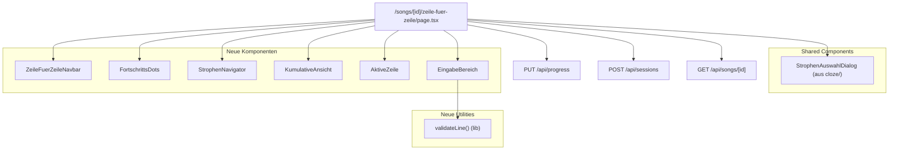
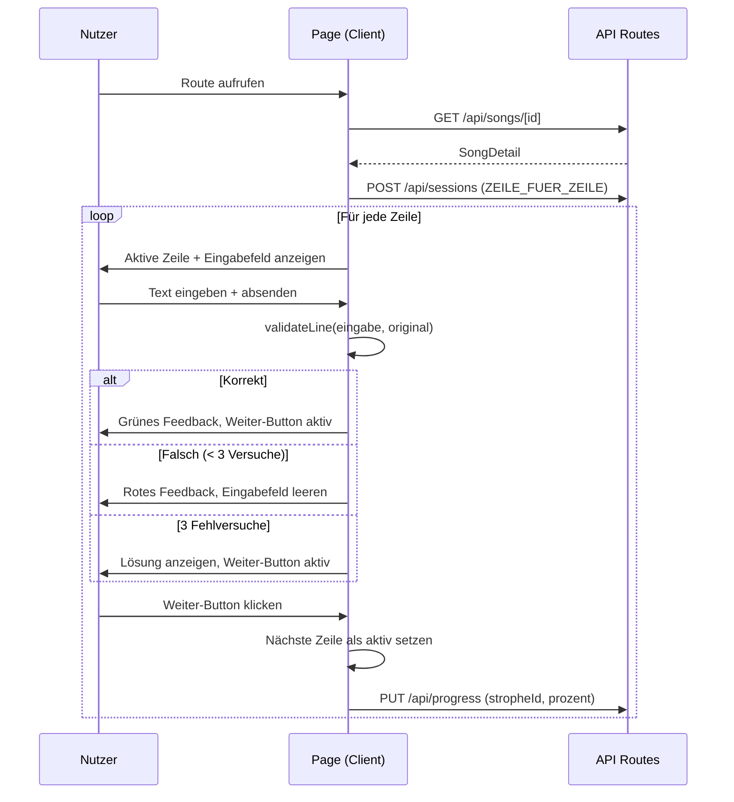

# Design-Dokument: Zeile für Zeile – Lernmethode

## Übersicht

Die Lernmethode „Zeile für Zeile" ermöglicht das sequenzielle, kumulative Lernen von Songtexten. Der Nutzer gibt Zeile für Zeile aus dem Gedächtnis ein. Bereits gelernte Zeilen bleiben sichtbar und bauen sich kumulativ auf. Der Fortschritt wird pro Strophe getrackt und über die bestehende Fortschritts-API persistiert.

Das Feature folgt exakt dem bestehenden Architekturmuster der App:
- Dedizierte Route: `/songs/[id]/zeile-fuer-zeile/page.tsx`
- Komponenten in `src/components/zeile-fuer-zeile/`
- Utility-Funktionen in `src/lib/zeile-fuer-zeile/`
- Session-Tracking via `POST /api/sessions` mit `lernmethode: "ZEILE_FUER_ZEILE"`
- Fortschritts-Updates via `PUT /api/progress`
- Wiederverwendung des `StrophenAuswahlDialog` aus `src/components/cloze/`

### Designentscheidungen

1. **Wiederverwendung des StrophenAuswahlDialog**: Der Dialog aus der Cloze-Methode wird direkt importiert, da er bereits alle benötigten Features bietet (Checkboxen, Alle/Keine auswählen, Schwächen üben, Validierung, Escape-Handling).

2. **Rein clientseitiger Zustand für Lernfortschritt innerhalb einer Session**: Der aktuelle Zeilen-Index, Fehlversuche und kumulative Ansicht werden im React-State gehalten. Nur der prozentuale Strophen-Fortschritt wird an die API persistiert.

3. **Textvergleich**: Wiederverwendung der bestehenden `validateAnswer`-Logik (case-insensitive, trim), erweitert um einen Ganzzeilenvergleich statt Einzelwortvergleich.

4. **Keine neue API-Route nötig**: Alle benötigten Endpunkte existieren bereits (`/api/songs/[id]`, `/api/sessions`, `/api/progress`).

## Architektur



### Datenfluss



## Komponenten und Schnittstellen

### 1. Page-Komponente: `ZeileFuerZeilePage`

**Pfad**: `src/app/(main)/songs/[id]/zeile-fuer-zeile/page.tsx`

**Verantwortung**: Orchestriert den gesamten Lernablauf, verwaltet den State, lädt Song-Daten, trackt Sessions und Fortschritt.

**State**:
```typescript
interface ZeileFuerZeileState {
  song: SongDetail | null;
  loading: boolean;
  error: string | null;
  activeStrophenIds: Set<string> | null;
  currentStropheIndex: number;       // Index in der gefilterten Strophen-Liste
  currentZeileIndex: number;         // Index der aktiven Zeile in der Strophe
  completedZeilen: Set<string>;      // IDs der abgeschlossenen Zeilen
  eingabe: string;                   // Aktuelle Eingabe im Textfeld
  fehlversuche: number;              // Fehlversuche für die aktive Zeile
  zeilenStatus: "eingabe" | "korrekt" | "loesung"; // Status der aktiven Zeile
  dialogOpen: boolean;
}
```

### 2. `ZeileFuerZeileNavbar`

**Pfad**: `src/components/zeile-fuer-zeile/navbar.tsx`

**Props**:
```typescript
interface ZeileFuerZeileNavbarProps {
  songId: string;
  songTitle: string;
}
```

**Verhalten**: Zeigt Zurück-Button (Link zu `/songs/[id]`), Song-Titel und Label „Zeile für Zeile". Folgt dem Muster von `ClozeNavbar`.

### 3. `FortschrittsDots`

**Pfad**: `src/components/zeile-fuer-zeile/fortschritts-dots.tsx`

**Props**:
```typescript
interface FortschrittsDotsProps {
  totalZeilen: number;
  currentIndex: number;
  completedIndices: Set<number>;
}
```

**Verhalten**:
- Ein Punkt pro Zeile der aktuellen Strophe
- Aktive Zeile: gefüllter lila Punkt (`bg-purple-600`)
- Abgeschlossene Zeilen: gefüllte grüne Punkte (`bg-green-500`)
- Ausstehende Zeilen: graue Kreise (`border-gray-300`)
- `role="progressbar"` mit `aria-valuenow` und `aria-valuemax`

### 4. `StrophenNavigator`

**Pfad**: `src/components/zeile-fuer-zeile/strophen-navigator.tsx`

**Props**:
```typescript
interface StrophenNavigatorProps {
  currentStropheName: string;
  currentPosition: number;    // 1-basiert
  totalStrophen: number;
  canGoBack: boolean;
  canGoForward: boolean;
  onPrevious: () => void;
  onNext: () => void;
}
```

**Verhalten**:
- Zeigt Strophen-Name und Position (z.B. „Strophe 2 von 5")
- Pfeile links/rechts, deaktiviert wenn am Rand
- Mindestgröße 44×44px für Touch-Ziele

### 5. `KumulativeAnsicht`

**Pfad**: `src/components/zeile-fuer-zeile/kumulative-ansicht.tsx`

**Props**:
```typescript
interface KumulativeAnsichtProps {
  zeilen: Array<{ id: string; text: string }>;
}
```

**Verhalten**:
- Zeigt alle bereits gelernten Zeilen in 14px, sekundärer Textfarbe (`text-gray-500`)
- Leer wenn keine Zeilen gelernt

### 6. `AktiveZeile`

**Pfad**: `src/components/zeile-fuer-zeile/aktive-zeile.tsx`

**Props**:
```typescript
interface AktiveZeileProps {
  text: string;
  visible: boolean;  // true wenn Lösung angezeigt wird
}
```

**Verhalten**:
- 18px, primäre Textfarbe, lila linker Rand-Akzent (`border-l-4 border-purple-600`)
- Text nur sichtbar wenn `visible=true` (nach 3 Fehlversuchen)
- Sonst wird nur der Platzhalter-Bereich mit Akzent angezeigt

### 7. `EingabeBereich`

**Pfad**: `src/components/zeile-fuer-zeile/eingabe-bereich.tsx`

**Props**:
```typescript
interface EingabeBereichProps {
  eingabe: string;
  onEingabeChange: (value: string) => void;
  onAbsenden: () => void;
  onWeiter: () => void;
  status: "eingabe" | "korrekt" | "loesung";
  fehlversuche: number;
  disabled: boolean;
  istLetzteZeile: boolean;
}
```

**Verhalten**:
- Textarea für Eingabe mit `aria-label="Zeile aus dem Gedächtnis eingeben"`
- Enter-Taste sendet ab (Shift+Enter für Zeilenumbruch)
- Visuelles Feedback: grüner Rahmen bei korrekt, roter Rahmen bei falsch
- Weiter-Button: deaktiviert bis korrekt oder 3 Fehlversuche
- `aria-live="polite"` Region für Feedback-Meldungen
- Bei letzter Zeile zeigt der Button „Strophe abschließen" statt „Weiter"

### 8. Utility: `validateLine`

**Pfad**: `src/lib/zeile-fuer-zeile/validate-line.ts`

```typescript
export function validateLine(input: string, target: string): boolean {
  return input.trim().toLowerCase() === target.trim().toLowerCase();
}
```

**Verhalten**: Case-insensitive Vergleich mit Trim. Analog zu `validateAnswer` aus der Cloze-Methode, aber für ganze Zeilen.

### 9. Utility: `calculateStropheProgress`

**Pfad**: `src/lib/zeile-fuer-zeile/progress.ts`

```typescript
export function calculateStropheProgress(
  completedZeilen: number,
  totalZeilen: number
): number {
  if (totalZeilen === 0) return 0;
  return Math.round((completedZeilen / totalZeilen) * 100);
}
```

## Datenmodell

### Bestehende Entitäten (keine Änderungen nötig)

Das Feature nutzt ausschließlich bestehende Datenbank-Entitäten:

| Entität | Verwendung |
|---------|-----------|
| `Song` | Song-Daten laden (Titel, Strophen, Zeilen) |
| `Strophe` | Strophen-Navigation, Fortschritts-Tracking |
| `Zeile` | Aktive Zeile, Textvergleich, kumulative Ansicht |
| `Session` | Session-Tracking mit `ZEILE_FUER_ZEILE` |
| `Fortschritt` | Prozentualer Lernstand pro Strophe |

### Client-seitiges Zustandsmodell

```typescript
// Pro Strophe gespeicherter Lernzustand (im React-State)
interface StropheLernzustand {
  currentZeileIndex: number;
  completedZeilen: Set<string>;
  fehlversuche: number;
}
```

Beim Strophen-Wechsel wird der Lernzustand der aktuellen Strophe in einer `Map<string, StropheLernzustand>` gespeichert, sodass der Nutzer beim Zurücknavigieren seinen Fortschritt wiederfindet.

### API-Aufrufe

| Aktion | Methode | Endpunkt | Body |
|--------|---------|----------|------|
| Song laden | GET | `/api/songs/[id]` | – |
| Session starten | POST | `/api/sessions` | `{ songId, lernmethode: "ZEILE_FUER_ZEILE" }` |
| Fortschritt speichern | PUT | `/api/progress` | `{ stropheId, prozent }` |
| Session abschließen | POST | `/api/sessions` | `{ songId, lernmethode: "ZEILE_FUER_ZEILE" }` |


## Korrektheitseigenschaften (Correctness Properties)

*Eine Korrektheitseigenschaft ist ein Merkmal oder Verhalten, das über alle gültigen Ausführungen eines Systems hinweg gelten sollte – im Wesentlichen eine formale Aussage darüber, was das System tun soll. Eigenschaften bilden die Brücke zwischen menschenlesbaren Spezifikationen und maschinenverifizierbaren Korrektheitsgarantien.*

### Property 1: Zeilenvergleich ist case-insensitive und trim-tolerant

*Für jede* Zeile und *jede* Eingabe, die sich vom Originaltext nur durch Groß-/Kleinschreibung und/oder führende/abschließende Leerzeichen unterscheidet, soll `validateLine` `true` zurückgeben.

**Validates: Requirements 3.2, 3.3, 3.4**

### Property 2: Genau eine aktive Zeile und korrekte kumulative Ansicht

*Für jede* Strophe mit N Zeilen und *jeden* Lernzustand mit `currentZeileIndex = k` (0 ≤ k < N), soll genau eine Zeile als aktiv markiert sein (Index k), und die kumulative Ansicht soll genau die Zeilen mit Index 0 bis k-1 enthalten.

**Validates: Requirements 2.1, 2.3**

### Property 3: Fehlversuch erhöht Zähler und leert Eingabe

*Für jede* aktive Zeile und *jede* falsche Eingabe (bei weniger als 3 bisherigen Fehlversuchen), soll der Fehlversuch-Zähler um genau 1 steigen und das Eingabefeld geleert werden.

**Validates: Requirements 3.6, 3.8**

### Property 4: Drei Fehlversuche zeigen Lösung

*Für jede* aktive Zeile, nach genau 3 falschen Eingaben, soll der Status auf „loesung" wechseln und der Weiter-Button aktiviert werden.

**Validates: Requirements 3.7**

### Property 5: Weiter-Transition setzt Zustand korrekt

*Für jede* Strophe mit mindestens 2 Zeilen und *jeden* Zustand, in dem die aktive Zeile abgeschlossen ist (Status „korrekt" oder „loesung"), soll das Betätigen von „Weiter" den `currentZeileIndex` um 1 erhöhen, die abgeschlossene Zeile zur `completedZeilen`-Menge hinzufügen, das Eingabefeld leeren und den Fehlversuch-Zähler auf 0 setzen.

**Validates: Requirements 4.3, 4.4, 4.5**

### Property 6: Fortschritts-Dots spiegeln Zustand korrekt wider

*Für jede* Strophe mit N Zeilen und *jeden* Lernzustand mit `currentZeileIndex = k` und einer Menge abgeschlossener Indizes, soll die Dots-Komponente genau N Punkte rendern, wobei abgeschlossene Indizes grün, der aktive Index lila und alle übrigen grau dargestellt werden.

**Validates: Requirements 5.1, 5.2, 5.3, 5.4, 5.5**

### Property 7: Fortschrittsberechnung ist proportional

*Für jede* Strophe mit N Zeilen (N > 0) und *jede* Anzahl abgeschlossener Zeilen C (0 ≤ C ≤ N), soll `calculateStropheProgress(C, N)` den Wert `Math.round((C / N) * 100)` zurückgeben.

**Validates: Requirements 7.1, 7.2**

### Property 8: Strophen-Navigation innerhalb der Auswahl

*Für jede* Auswahl von M Strophen (M ≥ 2) und *jede* aktuelle Position P (0 ≤ P < M), soll „Nächste Strophe" zur Position P+1 wechseln (wenn P < M-1) und „Vorherige Strophe" zur Position P-1 (wenn P > 0), wobei jeweils die erste Zeile der neuen Strophe als aktiv gesetzt wird. Navigation soll ausschließlich zwischen ausgewählten Strophen erfolgen.

**Validates: Requirements 6.3, 6.4, 9.7, 9.9**

### Property 9: Strophen-Auswahl-Änderung setzt Lernzustand zurück

*Für jeden* bestehenden Lernzustand und *jede* neue Strophen-Auswahl, soll nach Bestätigung der Auswahl der `currentZeileIndex` auf 0, die `completedZeilen` auf leer, der `fehlversuche`-Zähler auf 0 und der `currentStropheIndex` auf 0 gesetzt werden.

**Validates: Requirements 9.8**

### Property 10: Weiter-Button ist nur bei abgeschlossener Zeile aktiv

*Für jeden* Lernzustand soll der Weiter-Button genau dann aktiviert sein, wenn der Status der aktiven Zeile „korrekt" oder „loesung" ist. In allen anderen Zuständen (Status „eingabe") soll er deaktiviert sein.

**Validates: Requirements 4.2, 3.5, 3.7**

## Fehlerbehandlung

| Fehlerfall | Verhalten |
|-----------|-----------|
| Song nicht gefunden (404) | Weiterleitung zum Dashboard |
| Zugriff verweigert (403) | Weiterleitung zum Dashboard |
| Nicht authentifiziert (401) | Weiterleitung zur Login-Seite |
| Song ohne Strophen | Hinweismeldung „Dieser Song hat noch keine Strophen" |
| Session-Tracking fehlgeschlagen | Stille Fehlerbehandlung (non-critical) |
| Fortschritts-Persistierung fehlgeschlagen | Stille Fehlerbehandlung, lokaler State bleibt erhalten |
| Netzwerkfehler beim Laden | Fehlermeldung in rotem Banner anzeigen |

Die Fehlerbehandlung folgt dem bestehenden Muster der Cloze- und Emotional-Seiten: kritische Fehler (Auth, Zugriff) führen zu Redirects, nicht-kritische Fehler (Session-Tracking, Fortschritt) werden still behandelt.

## Teststrategie

### Dualer Testansatz

Die Teststrategie kombiniert Unit-Tests für spezifische Beispiele und Edge-Cases mit Property-Based Tests für universelle Korrektheitseigenschaften.

### Property-Based Tests

**Bibliothek**: `fast-check` (bereits im Projekt vorhanden)

**Konfiguration**: Minimum 100 Iterationen pro Property-Test

**Verzeichnis**: `__tests__/zeile-fuer-zeile/`

Jeder Property-Test referenziert die entsprechende Design-Property:

| Test-Datei | Property | Tag |
|-----------|----------|-----|
| `validate-line.property.test.ts` | Property 1 | Feature: line-by-line-learning, Property 1: Zeilenvergleich ist case-insensitive und trim-tolerant |
| `state-invariant.property.test.ts` | Property 2 | Feature: line-by-line-learning, Property 2: Genau eine aktive Zeile und korrekte kumulative Ansicht |
| `fehlerversuch.property.test.ts` | Property 3, 4 | Feature: line-by-line-learning, Property 3: Fehlversuch erhöht Zähler und leert Eingabe / Property 4: Drei Fehlversuche zeigen Lösung |
| `weiter-transition.property.test.ts` | Property 5 | Feature: line-by-line-learning, Property 5: Weiter-Transition setzt Zustand korrekt |
| `fortschritts-dots.property.test.ts` | Property 6 | Feature: line-by-line-learning, Property 6: Fortschritts-Dots spiegeln Zustand korrekt wider |
| `progress-calculation.property.test.ts` | Property 7 | Feature: line-by-line-learning, Property 7: Fortschrittsberechnung ist proportional |
| `strophen-navigation.property.test.ts` | Property 8 | Feature: line-by-line-learning, Property 8: Strophen-Navigation innerhalb der Auswahl |
| `selection-reset.property.test.ts` | Property 9 | Feature: line-by-line-learning, Property 9: Strophen-Auswahl-Änderung setzt Lernzustand zurück |
| `weiter-button-state.property.test.ts` | Property 10 | Feature: line-by-line-learning, Property 10: Weiter-Button ist nur bei abgeschlossener Zeile aktiv |

### Unit-Tests

| Test-Datei | Abdeckung |
|-----------|-----------|
| `zeile-fuer-zeile-page.test.ts` | Page-Rendering, Daten laden, Session-Tracking, Auth-Redirect, leere Strophen |
| `navbar.test.ts` | Navbar-Rendering, Zurück-Link, Titel, Label |
| `eingabe-bereich.test.ts` | Eingabefeld-Rendering, Enter-Taste, Feedback-Anzeige, aria-live |
| `strophen-navigator.test.ts` | Pfeile-Rendering, deaktivierte Pfeile, Positionsanzeige |
| `completion.test.ts` | Strophen-Abschluss-Meldung, Fortschritts-Persistierung, Session-Abschluss |

### Edge-Cases (in Unit-Tests abgedeckt)

- Song ohne Strophen (Anforderung 1.6)
- Erste Zeile einer Strophe: keine kumulative Ansicht (Anforderung 2.5)
- Letzte Zeile einer Strophe: Erfolgsmeldung (Anforderung 4.6)
- Erste/letzte Strophe: deaktivierte Navigationspfeile (Anforderung 6.5, 6.6)
- Nur eine Strophe ausgewählt: beide Pfeile deaktiviert (Anforderung 9.10)
