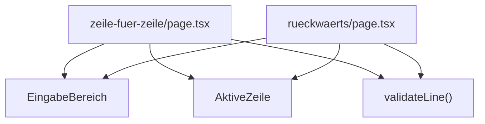
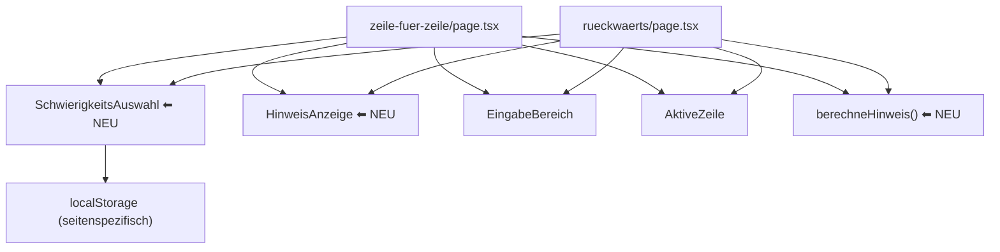

# Design-Dokument: Hinweis-Modi für Zeile-für-Zeile-Lernmethoden

## Übersicht

Dieses Feature erweitert die Lernmethoden „Zeile für Zeile" und „Rückwärts lernen" um vier Schwierigkeitsstufen, die dem Nutzer unterschiedlich starke Hinweise zur aktuellen Zeile anzeigen. Aktuell gibt es nur den Modus ohne Hinweise. Die neuen Modi erleichtern den Einstieg, indem sie Teile der Zeile als Gedächtnisstütze einblenden.

Die vier Stufen sind:
- **Sehr Leicht**: Erstes und letztes Wort (Format: `{erstesWort} … {letztesWort}`)
- **Leichter**: Erstes Wort
- **Mittel**: Erster Buchstabe des ersten Wortes (Format: `{buchstabe}…`)
- **Schwer**: Kein Hinweis (bestehender Standard)

Beide Seiten (`/songs/[id]/zeile-fuer-zeile` und `/songs/[id]/rueckwaerts`) nutzen bereits dieselben geteilten Komponenten aus `src/components/zeile-fuer-zeile/`. Die Hinweis-Logik und die Schwierigkeitsauswahl werden ebenfalls als geteilte Module implementiert, sodass beide Seiten identisches Verhalten zeigen.

## Architektur

### Bestehende Struktur

Beide Lernseiten importieren gemeinsame Komponenten:



### Erweiterte Struktur mit Hinweis-Modi



### Designentscheidungen

1. **Geteilte Utility-Funktion `berechneHinweis()`** in `src/lib/zeile-fuer-zeile/hint.ts`: Reine Funktion ohne Seiteneffekte, leicht testbar. Beide Seiten rufen dieselbe Funktion auf.

2. **Geteilte Komponente `SchwierigkeitsAuswahl`** in `src/components/zeile-fuer-zeile/schwierigkeits-auswahl.tsx`: Segment-Control mit `role="radiogroup"`, Tastaturnavigation und Touch-Mindestgröße 44×44px.

3. **Geteilte Komponente `HinweisAnzeige`** in `src/components/zeile-fuer-zeile/hinweis-anzeige.tsx`: Zeigt den berechneten Hinweis kursiv und in gedämpfter Farbe an. Nutzt `aria-live="polite"` für Screenreader.

4. **localStorage-Persistierung mit seitenspezifischen Schlüsseln**: `schwierigkeit-zeile-fuer-zeile` und `schwierigkeit-rueckwaerts`. So bleiben die Einstellungen pro Lernmethode unabhängig.

5. **Kein Prop-Drilling durch bestehende Komponenten**: Die Hinweis-Anzeige wird als eigenständige Komponente oberhalb des `EingabeBereich` platziert, nicht als Prop in `EingabeBereich` oder `AktiveZeile` integriert. Das minimiert Änderungen an bestehenden Komponenten.

## Komponenten und Schnittstellen

### Neue Dateien

#### `src/lib/zeile-fuer-zeile/hint.ts`

```typescript
export type Schwierigkeitsstufe = "sehr-leicht" | "leichter" | "mittel" | "schwer";

/**
 * Berechnet den Hinweistext für eine Zeile basierend auf der Schwierigkeitsstufe.
 * Gibt einen leeren String zurück, wenn kein Hinweis angezeigt werden soll.
 */
export function berechneHinweis(zeile: string, stufe: Schwierigkeitsstufe): string;
```

Verhalten:
- Trimmt die Zeile (führende/abschließende Leerzeichen entfernen)
- Leere/Whitespace-Zeilen → `""` (unabhängig von Stufe)
- `"schwer"` → `""`
- `"sehr-leicht"` → `"{erstesWort} … {letztesWort}"` (bei einem Wort: nur dieses Wort)
- `"leichter"` → `"{erstesWort}"`
- `"mittel"` → `"{ersterBuchstabe}…"`

#### `src/components/zeile-fuer-zeile/schwierigkeits-auswahl.tsx`

```typescript
interface SchwierigkeitsAuswahlProps {
  value: Schwierigkeitsstufe;
  onChange: (stufe: Schwierigkeitsstufe) => void;
}
```

- Segment-Control mit 4 Segmenten: Sehr Leicht | Leichter | Mittel | Schwer
- `role="radiogroup"` mit `aria-label="Schwierigkeitsstufe auswählen"`
- Jedes Segment: `role="radio"` mit `aria-checked`
- Tastaturnavigation: Pfeiltasten links/rechts
- Mindestgröße 44×44px pro Segment
- Aktives Segment visuell hervorgehoben (purple-Farbschema passend zum bestehenden Design)

#### `src/components/zeile-fuer-zeile/hinweis-anzeige.tsx`

```typescript
interface HinweisAnzeigeProps {
  hinweis: string;
}
```

- Zeigt `hinweis` kursiv in gedämpfter Farbe (`text-gray-400 italic`)
- `aria-live="polite"` für Screenreader-Ankündigungen
- `aria-label="Hinweis: {hinweis}"` wenn Hinweis vorhanden
- Rendert nichts (leeres Element), wenn `hinweis` leer ist

### Änderungen an bestehenden Seiten

#### `zeile-fuer-zeile/page.tsx` und `rueckwaerts/page.tsx`

Beide Seiten erhalten:
1. Neuen State: `schwierigkeitsstufe` (initialisiert aus localStorage oder `"schwer"`)
2. `useEffect` zum Laden/Speichern der Stufe in localStorage
3. Berechnung des Hinweises via `berechneHinweis(currentZeile.text, schwierigkeitsstufe)`
4. Einbindung von `<SchwierigkeitsAuswahl>` und `<HinweisAnzeige>` im JSX

Die bestehenden Komponenten `EingabeBereich` und `AktiveZeile` bleiben unverändert.

### Layout-Reihenfolge im Lernbereich

```
┌─────────────────────────────┐
│  StrophenNavigator          │
│  FortschrittsDots           │
│  KumulativeAnsicht          │
│  AktiveZeile                │
│  SchwierigkeitsAuswahl  ⬅ NEU │
│  HinweisAnzeige         ⬅ NEU │
│  EingabeBereich             │
└─────────────────────────────┘
```

## Datenmodelle

### Schwierigkeitsstufe (TypeScript Union Type)

```typescript
export type Schwierigkeitsstufe = "sehr-leicht" | "leichter" | "mittel" | "schwer";

export const SCHWIERIGKEITS_STUFEN: readonly Schwierigkeitsstufe[] = [
  "sehr-leicht",
  "leichter",
  "mittel",
  "schwer",
] as const;

export const SCHWIERIGKEITS_LABELS: Record<Schwierigkeitsstufe, string> = {
  "sehr-leicht": "Sehr Leicht",
  "leichter": "Leichter",
  "mittel": "Mittel",
  "schwer": "Schwer",
};

export const DEFAULT_SCHWIERIGKEITSSTUFE: Schwierigkeitsstufe = "schwer";
```

### localStorage-Schlüssel

| Seite | Schlüssel |
|---|---|
| Zeile für Zeile | `schwierigkeit-zeile-fuer-zeile` |
| Rückwärts lernen | `schwierigkeit-rueckwaerts` |

Gespeicherter Wert: Einer der vier String-Werte des Union Types. Bei ungültigem Wert wird auf `"schwer"` zurückgefallen.

### Kein Datenbank-Schema nötig

Die Schwierigkeitsstufe ist eine rein clientseitige Einstellung. Es werden keine serverseitigen Änderungen benötigt.

