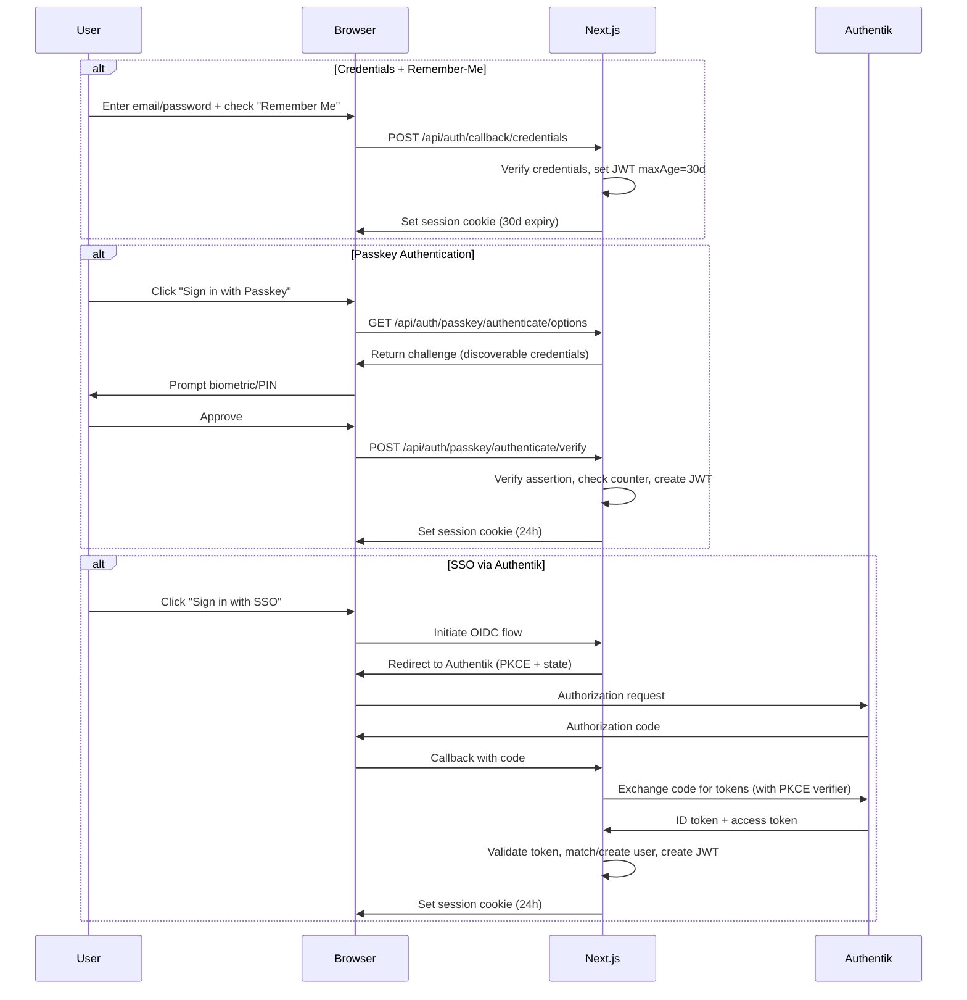

# Design Document: Login Enhancements

## Overview

This design extends the existing Lyco authentication system with three capabilities: Remember-Me sessions, Passkey (WebAuthn/FIDO2) authentication, and Single Sign-On via Authentik (OpenID Connect). The existing credentials-based authentication (NextAuth v5, JWT sessions, bcrypt) remains unchanged and is complemented by the new methods.

### Key Design Decisions

1. **NextAuth v5 provider extension**: New auth methods are added as additional NextAuth providers/custom logic rather than replacing the existing Credentials provider.
2. **Server-side WebAuthn via `@simplewebauthn/server`**: Uses the well-maintained SimpleWebAuthn library for challenge generation, registration verification, and authentication assertion verification.
3. **OIDC via NextAuth built-in provider**: Leverages NextAuth's built-in OpenID Connect provider support for Authentik integration with PKCE.
4. **JWT session extension for Remember-Me**: The existing JWT `maxAge` is dynamically adjusted based on the remember-me flag passed during sign-in.
5. **Prisma schema extension**: New models (`Passkey`, `SsoAccount`) are added to the existing schema without modifying existing tables beyond adding relations.

## Architecture

```mermaid
graph TB
    subgraph Client["Browser"]
        LP[Login Page]
        PS[Passkey Settings UI]
        AS[Account Settings UI]
    end

    subgraph NextJS["Next.js App"]
        MW[Middleware - auth.config.ts]
        
        subgraph Providers["NextAuth Providers"]
            CP[Credentials Provider]
            OP[OIDC Provider - Authentik]
        end
        
        subgraph API["API Routes"]
            PA[/api/auth/passkey/register]
            PV[/api/auth/passkey/authenticate]
            PC[/api/auth/passkey/credentials]
            SSO[/api/auth/[...nextauth] - OIDC callback]
        end
        
        subgraph Services["Service Layer"]
            PKS[Passkey Service]
            AUS[Auth Service - extended]
            SYS[System Setting Service - extended]
            LOG[Log Service - extended]
            RL[Rate Limiter - extended]
        end
    end

    subgraph External["External"]
        AUTH[Authentik OIDC Provider]
        DB[(PostgreSQL)]
    end

    LP --> CP
    LP --> PV
    LP --> SSO
    PS --> PA
    PS --> PC
    AS --> PC
    
    CP --> AUS
    PV --> PKS
    PA --> PKS
    SSO --> OP
    OP --> AUTH
    
    PKS --> DB
    AUS --> DB
    AUS --> LOG
    AUS --> RL
    PKS --> LOG
    PKS --> RL
```

### Authentication Flow Overview



## Components and Interfaces

### 1. Extended Auth Configuration (`src/lib/auth.config.ts`)

The existing edge-compatible config is extended to support dynamic session duration:

```typescript
interface ExtendedJWTPayload {
  id: string;
  role: "ADMIN" | "USER";
  accountStatus: string;
  rememberMe?: boolean;
  authMethod: "credentials" | "passkey" | "sso";
}
```

The `jwt` callback checks for a `rememberMe` flag and adjusts the token's `exp` accordingly. The `session` callback propagates `authMethod` to the client session.

### 2. Passkey Service (`src/lib/services/passkey-service.ts`)

```typescript
interface PasskeyService {
  // Registration
  generateRegistrationOptions(userId: string): Promise<PublicKeyCredentialCreationOptionsJSON>;
  verifyRegistration(userId: string, credential: RegistrationResponseJSON, name: string): Promise<Passkey>;
  
  // Authentication
  generateAuthenticationOptions(): Promise<PublicKeyCredentialRequestOptionsJSON>;
  verifyAuthentication(assertion: AuthenticationResponseJSON): Promise<AuthenticatedUser>;
  
  // Management
  listPasskeys(userId: string): Promise<PasskeyInfo[]>;
  deletePasskey(userId: string, passkeyId: string): Promise<void>;
  getPasskeyCount(userId: string): Promise<number>;
}
```

### 3. SSO/OIDC Integration (`src/lib/auth.ts`)

The NextAuth configuration adds an OIDC provider conditionally based on environment variables:

```typescript
interface SsoConfig {
  clientId: string;
  clientSecret: string;
  issuerUrl: string;
}
```

The OIDC provider is only added when all three environment variables (`SSO_CLIENT_ID`, `SSO_CLIENT_SECRET`, `SSO_ISSUER_URL`) are present.

### 4. Extended System Settings Service

```typescript
interface SsoSettings {
  autoCreateAccounts: boolean;  // Default: false
}
```

Added to the existing `SystemSetting` key-value store with key `sso-auto-create-accounts`.

### 5. API Routes

| Route | Method | Purpose |
|-------|--------|---------|
| `/api/auth/passkey/register/options` | POST | Generate registration challenge |
| `/api/auth/passkey/register/verify` | POST | Verify and store credential |
| `/api/auth/passkey/authenticate/options` | POST | Generate authentication challenge |
| `/api/auth/passkey/authenticate/verify` | POST | Verify assertion, return session |
| `/api/auth/passkey/credentials` | GET | List user's passkeys |
| `/api/auth/passkey/credentials/[id]` | DELETE | Remove a passkey |
| `/api/settings/sso` | GET/PUT | Admin: manage SSO auto-create setting |

### 6. UI Components

| Component | Location | Purpose |
|-----------|----------|---------|
| `RememberMeCheckbox` | Login page | Toggle for 30-day session |
| `PasskeyLoginButton` | Login page | Initiate passkey auth (conditional on WebAuthn support) |
| `SsoLoginButton` | Login page | Initiate SSO flow (conditional on SSO config) |
| `PasskeyManager` | Account settings | List, register, delete passkeys |
| `SsoStatus` | Account settings | Show SSO link status |
| `SsoAdminSettings` | Admin settings | Toggle auto-create accounts |

## Data Models

### New Prisma Models

```prisma
model Passkey {
  id               String   @id @default(cuid())
  userId           String
  credentialId     String   @unique  // Base64URL-encoded credential ID
  publicKey        Bytes                // COSE public key
  counter          Int      @default(0) // Signature counter
  name             String   @db.VarChar(64)
  algorithm        Int                  // COSE algorithm identifier (-7 = ES256, -257 = RS256)
  transports       String[] @default([]) // e.g. ["usb", "ble", "nfc", "internal"]
  isCompromised    Boolean  @default(false)
  createdAt        DateTime @default(now())

  user User @relation(fields: [userId], references: [id], onDelete: Cascade)

  @@index([userId])
  @@map("passkeys")
}

model SsoAccount {
  id           String   @id @default(cuid())
  userId       String
  provider     String   // "authentik"
  providerAccountId String // Subject claim from ID token
  createdAt    DateTime @default(now())

  user User @relation(fields: [userId], references: [id], onDelete: Cascade)

  @@unique([provider, providerAccountId])
  @@index([userId])
  @@map("sso_accounts")
}

model WebAuthnChallenge {
  id        String   @id @default(cuid())
  challenge String   @unique
  userId    String?  // null for authentication (discoverable), set for registration
  type      String   // "registration" | "authentication"
  expiresAt DateTime
  createdAt DateTime @default(now())

  @@index([challenge])
  @@index([expiresAt])
  @@map("webauthn_challenges")
}
```

### User Model Extension

```prisma
model User {
  // ... existing fields ...
  passkeys    Passkey[]
  ssoAccounts SsoAccount[]
}
```

### Environment Variables

```env
# SSO Configuration (all required for SSO to be active)
SSO_CLIENT_ID=
SSO_CLIENT_SECRET=
SSO_ISSUER_URL=

# WebAuthn Configuration
WEBAUTHN_RP_ID=localhost          # Relying Party ID (domain)
WEBAUTHN_RP_NAME=Lyco            # Human-readable RP name
WEBAUTHN_ORIGIN=http://localhost:3000  # Expected origin for WebAuthn
```


## Correctness Properties

*A property is a characteristic or behavior that should hold true across all valid executions of a system — essentially, a formal statement about what the system should do. Properties serve as the bridge between human-readable specifications and machine-verifiable correctness guarantees.*

### Property 1: Session duration determined by rememberMe flag

*For any* valid authentication (credentials or passkey), if the rememberMe flag is true the resulting JWT session SHALL have a maxAge of 30 days, and if the rememberMe flag is false the session SHALL have a maxAge of 24 hours.

**Validates: Requirements 1.2, 1.3**

### Property 2: Rolling session extends expiry on each request

*For any* active remember-me session and any authenticated request made at time T, the session token's expiry SHALL be updated to T + 30 days.

**Validates: Requirements 1.4**

### Property 3: Suspended account invalidates active session

*For any* user whose account status is SUSPENDED and who has an active session (remember-me or standard), the next authenticated request SHALL be denied and the session SHALL be invalidated.

**Validates: Requirements 1.8**

### Property 4: WebAuthn challenge expiry

*For any* WebAuthn challenge (registration or authentication), the challenge SHALL have a timeout of 60 seconds, and any verification attempt after 60 seconds SHALL be rejected.

**Validates: Requirements 2.2, 2.9, 3.2, 3.5**

### Property 5: Passkey registration stores complete credential data

*For any* valid WebAuthn registration response with a name between 1 and 64 characters, the system SHALL store the public key, credential ID, user-defined name, and COSE algorithm identifier, and the stored credential SHALL be retrievable by the user.

**Validates: Requirements 2.3**

### Property 6: Maximum passkeys per user invariant

*For any* user, the number of registered passkeys SHALL never exceed 10. Any registration attempt when the user already has 10 passkeys SHALL be rejected.

**Validates: Requirements 2.4, 2.5**

### Property 7: Passkey deletion removes credential

*For any* user and any of their registered passkeys, after deletion the credential SHALL no longer exist in the database and SHALL not appear in the user's passkey list.

**Validates: Requirements 2.7**

### Property 8: Signature counter monotonicity

*For any* passkey authentication attempt, if the presented signature counter is less than or equal to the stored counter value, the authentication SHALL be rejected AND the credential SHALL be marked as compromised.

**Validates: Requirements 3.8, 6.2**

### Property 9: Compromised credentials permanently rejected

*For any* credential marked as compromised (isCompromised = true), all subsequent authentication attempts using that credential SHALL be rejected regardless of the assertion's validity.

**Validates: Requirements 6.7**

### Property 10: Rate limiting on passkey authentication

*For any* IP address, after 5 failed passkey authentication attempts within a 15-minute window, all subsequent attempts from that IP SHALL be blocked until the window expires.

**Validates: Requirements 3.9, 6.4**

### Property 11: Only ES256 and RS256 algorithms accepted

*For any* WebAuthn credential registration, if the COSE algorithm identifier is not -7 (ES256) or -257 (RS256), the registration SHALL be rejected.

**Validates: Requirements 6.1**

### Property 12: ID token validation rejects invalid tokens

*For any* ID token received from the SSO provider, if the issuer does not match the configured issuer URL, OR the audience does not match the configured client ID, OR the expiry time is in the past, the authentication SHALL be rejected.

**Validates: Requirements 4.5, 6.5**

### Property 13: SSO account matching and creation

*For any* valid ID token: if an account with the token's email exists, the user SHALL be authenticated to that account; if no account exists and auto-create is enabled, a new account SHALL be created with role USER, status ACTIVE, and the email/name from the token; if no account exists and auto-create is disabled, authentication SHALL be denied.

**Validates: Requirements 4.6, 4.7, 4.8, 5.2, 5.3**

### Property 14: Non-ACTIVE accounts denied SSO login

*For any* SSO authentication attempt where the matched account has status SUSPENDED or PENDING, the login SHALL be denied regardless of the validity of the ID token.

**Validates: Requirements 5.5, 5.6**

### Property 15: State parameter validation

*For any* OIDC callback where the returned state parameter does not match the originally sent state parameter, the authentication SHALL be aborted.

**Validates: Requirements 4.9**

### Property 16: PKCE parameters in authorization request

*For any* SSO login initiation, the authorization redirect SHALL include a code_challenge using the S256 method, a random state parameter, and the scope "openid email profile".

**Validates: Requirements 4.2, 6.6**

### Property 17: Audit log for every authentication attempt

*For any* authentication attempt (credentials, passkey, or SSO), regardless of success or failure, the system SHALL create an audit log entry containing the authentication method, user ID (if known), IP address, and timestamp.

**Validates: Requirements 3.7, 6.3**

### Property 18: Session invalidation removes cookie

*For any* session invalidation event (logout, admin action, security policy), the system SHALL remove the session cookie completely.

**Validates: Requirements 1.6, 4.11**

### Property 19: Admin-only access to SSO auto-create setting

*For any* user attempting to read or modify the "auto-create accounts on SSO" setting, the operation SHALL succeed only if the user has the ADMIN role; all other roles SHALL be denied access.

**Validates: Requirements 5.1**

## Error Handling

### Authentication Errors

| Scenario | Response | User-Facing Message |
|----------|----------|---------------------|
| Invalid passkey assertion (challenge valid) | 401 + allow retry | "Passkey-Authentifizierung fehlgeschlagen. Bitte versuchen Sie es erneut." |
| Expired challenge | 401 + new flow required | "Die Sicherheitsabfrage ist abgelaufen. Bitte starten Sie den Vorgang erneut." |
| Compromised credential detected | 401 + credential disabled | "Sicherheitsproblem erkannt. Dieser Passkey wurde deaktiviert. Bitte registrieren Sie einen neuen Passkey." |
| Rate limit exceeded | 429 + Retry-After header | "Zu viele fehlgeschlagene Versuche. Bitte warten Sie {minutes} Minuten." |
| SSO token exchange failed | Redirect to /login | "SSO-Kommunikationsproblem. Bitte versuchen Sie es erneut." |
| SSO token invalid (signature/issuer/audience/expiry) | Redirect to /login | "SSO-Authentifizierung fehlgeschlagen. Bitte versuchen Sie es erneut." |
| SSO state mismatch | Redirect to /login | "Sicherheitsfehler bei der SSO-Anmeldung. Bitte versuchen Sie es erneut." |
| SSO no account + auto-create disabled | Redirect to /login | "Kein Konto gefunden. Bitte registrieren Sie sich zuerst." |
| Account SUSPENDED (any method) | 401 | "Ihr Konto wurde gesperrt. Bitte wenden Sie sich an den Administrator." |
| Account PENDING (any method) | 401 | "Ihr Konto wartet auf Freigabe durch einen Administrator." |
| Passkey registration at limit (10) | 400 | "Maximale Anzahl von 10 Passkeys erreicht. Bitte löschen Sie einen bestehenden Passkey." |
| Passkey registration timeout | 400 | "Zeitüberschreitung bei der Registrierung. Bitte versuchen Sie es erneut." |
| Passkey registration user cancel | 400 | "Registrierung abgebrochen." |
| Passkey registration unsupported device | 400 | "Ihr Gerät unterstützt keine Passkeys." |
| Invalid passkey name (empty or >64 chars) | 400 | "Der Passkey-Name muss zwischen 1 und 64 Zeichen lang sein." |
| Invalid algorithm (not ES256/RS256) | 400 | "Nicht unterstützter Algorithmus. Nur ES256 und RS256 werden akzeptiert." |

### Error Handling Strategy

1. **Fail-safe defaults**: All authentication failures result in denial. No partial authentication states.
2. **No information leakage**: Error messages don't reveal whether an account exists (for passkey/SSO flows).
3. **Audit all failures**: Every failed attempt is logged with method, IP, and timestamp.
4. **Graceful degradation**: If SSO provider is unreachable, credentials and passkey auth continue to work independently.
5. **Challenge cleanup**: Expired challenges are cleaned up via a scheduled job or lazy deletion on access.

## Testing Strategy

### Property-Based Tests (fast-check)

The project already uses `fast-check` (v4.6.0) with `vitest` for property-based testing. Each correctness property above will be implemented as a property-based test with minimum 100 iterations.

**Test file structure:**
```
__tests__/auth/
  remember-me-session.property.test.ts      → Properties 1, 2, 3, 18
  passkey-registration.property.test.ts     → Properties 4, 5, 6, 7, 11
  passkey-authentication.property.test.ts   → Properties 8, 9, 10
  sso-authentication.property.test.ts       → Properties 12, 13, 14, 15, 16
  auth-audit-logging.property.test.ts       → Property 17
  sso-admin-settings.property.test.ts       → Property 19
```

**Tag format:** Each test will include a comment:
```typescript
// Feature: login-enhancements, Property {N}: {property_text}
```

**Configuration:** Minimum 100 iterations per property test (fast-check `numRuns: 100`).

### Unit Tests (Example-Based)

| Test File | Coverage |
|-----------|----------|
| `remember-me-checkbox.test.ts` | UI: checkbox default state, cookie attributes |
| `passkey-login-button.test.ts` | UI: conditional rendering based on WebAuthn support |
| `sso-login-button.test.ts` | UI: conditional rendering based on SSO config |
| `passkey-error-messages.test.ts` | Specific error scenarios (timeout, cancel, unsupported) |
| `sso-error-handling.test.ts` | Token exchange failure, redirect behavior |
| `sso-status-display.test.ts` | Account settings SSO link status |
| `discoverable-credentials.test.ts` | Verify allowCredentials is empty |

### Integration Tests

| Test | Purpose |
|------|---------|
| `passkey-registration-flow.e2e.ts` | Full registration flow with mocked WebAuthn |
| `passkey-login-flow.e2e.ts` | Full authentication flow with mocked WebAuthn |
| `sso-login-flow.e2e.ts` | Full OIDC flow with mocked Authentik |
| `remember-me-persistence.e2e.ts` | Session survives browser restart simulation |

### Testing Dependencies

- **`@simplewebauthn/server`** (v11+): Server-side WebAuthn operations
- **`@simplewebauthn/browser`** (v11+): Client-side WebAuthn helpers (for testing)
- **`fast-check`** (already installed): Property-based test generation
- **`vitest`** (already installed): Test runner
- **`@testing-library/react`** (already installed): Component testing
