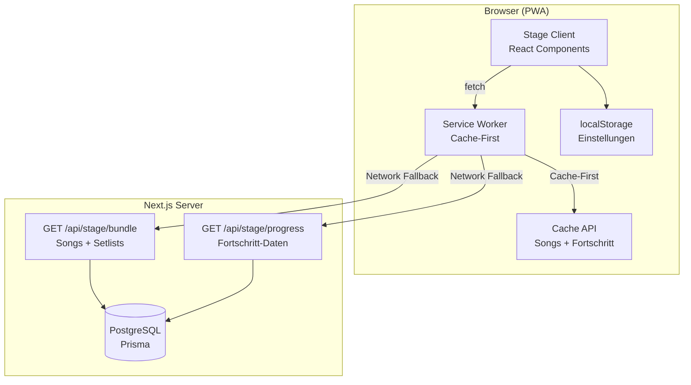
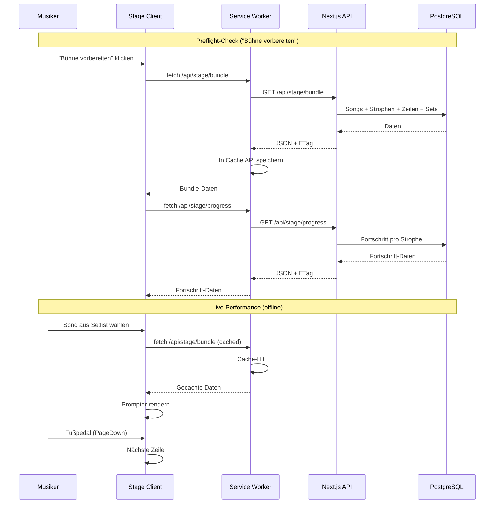

# Design-Dokument — Lyco Stage

## Übersicht

Lyco Stage erweitert die bestehende Lyco Next.js-Webanwendung um einen dedizierten Bühnen-Prompter-Modus unter der Route `/stage`. Der Modus wird als Progressive Web App (PWA) realisiert und ermöglicht Musikern, Songtexte auf der Bühne abzulesen — offline-fähig, ablenkungsfrei und per Fußpedal steuerbar.

### Zentrale Design-Entscheidungen

1. **PWA innerhalb der bestehenden Next.js-App** — kein separates React Native/Expo-Projekt. Die Route `/stage` existiert als eigenständiges Route-Segment außerhalb des `(main)`-Layouts mit eigenem minimalistischen Layout.
2. **Read-Only-Sync** — Stage konsumiert ausschließlich Daten (Songs, Setlists, Lernfortschritt). Kein Zurückschreiben.
3. **Offline-First mit Service Worker** — Cache-First-Strategie für alle Stage-Assets und API-Daten. `navigator.storage.persist()` schützt den Cache.
4. **Wiederverwendung bestehender Karaoke-Komponenten** — `KaraokeView`, `TextAnzeige`, `StrophenAnzeige`, `SongAnzeige`, `EinzelzeileAnzeige` sowie die Hooks `useAutoScroll`, `useKaraokeKeyboard`, `useKaraokeSwipe` werden erweitert.
5. **BLE-Footswitch via HID-Keyboard-Events** — Primärer Ansatz über Standard-Keyboard-Events (PageUp/PageDown/Arrow-Keys). Web Bluetooth API nur als optionales Enhancement auf Android.
6. **Lernfortschritt-Highlighting** — Strophen werden basierend auf dem `Fortschritt.prozent`-Wert farblich markiert, mit konfigurierbaren Schwellwerten.

## Architektur

### Systemarchitektur



### Routing-Architektur

```
src/app/
├── (main)/          # Bestehendes Haupt-Layout (Dashboard, Songs, Sets)
├── (auth)/          # Auth-Layout (Login, Register)
├── (admin)/         # Admin-Layout
├── stage/           # NEU: Stage-Layout (eigenständig, minimalistisch)
│   ├── layout.tsx   # Schwarzer Hintergrund, kein Chrome
│   ├── page.tsx     # Setlist-Ansicht + Preflight
│   └── [songId]/
│       └── page.tsx # Prompter-Ansicht
├── api/
│   └── stage/       # NEU: Stage-API-Endpunkte
│       ├── bundle/
│       │   └── route.ts
│       └── progress/
│           └── route.ts
└── manifest.json    # NEU: PWA-Manifest (oder route.ts für dynamisch)
```

### Datenfluss



## Komponenten und Schnittstellen

### Neue Komponenten

#### `StageLayout` (`src/app/stage/layout.tsx`)
Minimalistisches Layout ohne Navigation, schwarzer Hintergrund, Fullscreen-API-Integration.

```typescript
interface StageLayoutProps {
  children: React.ReactNode;
}
```

#### `StageSetlistPage` (`src/app/stage/page.tsx`)
Hauptseite des Stage-Modus. Zeigt Setlists, Preflight-Check und Sync-Status.

```typescript
// Verwendet intern:
// - useStageData() für gecachte Daten
// - usePreflightCheck() für Sync-Logik
```

#### `StagePrompterPage` (`src/app/stage/[songId]/page.tsx`)
Prompter-Ansicht für einen einzelnen Song. Erweitert die bestehende Karaoke-Logik um Stage-spezifische Features.

```typescript
// Verwendet intern:
// - Bestehende Karaoke-Komponenten (TextAnzeige, StrophenTitel)
// - useStageKeyboard() (erweitert useKaraokeKeyboard)
// - useKaraokeSwipe() (wiederverwendet)
// - useAutoScroll() (wiederverwendet)
// - useConfidenceHighlighting() für Lernfortschritt-Farben
```

#### `StageEinstellungsDialog` (`src/components/stage/stage-einstellungs-dialog.tsx`)
Erweitert den bestehenden `EinstellungsDialog` um Stage-spezifische Einstellungen (Schriftgröße, Highlighting-Schwellwerte, Highlighting an/aus).

```typescript
interface StageEinstellungsDialogProps {
  isOpen: boolean;
  onClose: () => void;
  settings: StageSettings;
  onSettingsChange: (settings: Partial<StageSettings>) => void;
}
```

#### `NextSongHint` (`src/components/stage/next-song-hint.tsx`)
Zeigt den nächsten Song am unteren Bildschirmrand an, wenn der Musiker die letzten 3 Zeilen erreicht.

```typescript
interface NextSongHintProps {
  nextSongTitle: string | null; // null = letzter Song → "Ende der Setlist"
  visible: boolean;
}
```

#### `PreflightCheck` (`src/components/stage/preflight-check.tsx`)
UI-Komponente für den "Bühne vorbereiten"-Prozess mit Fortschrittsbalken.

```typescript
interface PreflightCheckProps {
  onComplete: () => void;
  onError: (failedSongs: string[]) => void;
}
```

### Erweiterte/Wiederverwendete Komponenten

| Bestehende Komponente | Wiederverwendung in Stage |
|---|---|
| `TextAnzeige` | Direkt wiederverwendet — rendert `einzelzeile`, `strophe`, `song` Modi |
| `StrophenTitel` | Direkt wiederverwendet — zeigt Strophenname über dem Text |
| `EinzelzeileAnzeige` | Direkt wiederverwendet |
| `StrophenAnzeige` | Erweitert um Confidence-basierte Textfarben |
| `SongAnzeige` | Erweitert um Confidence-basierte Textfarben |
| `NavigationsButtons` | Nicht verwendet — Stage nutzt Pedal/Touch/Tastatur |
| `PlayPauseButton` | Nicht verwendet — Stage nutzt Pedal/Touch/Tastatur |
| `ModusUmschalter` | Nicht verwendet — Modus wird in Einstellungen gewählt |

### Neue Hooks

#### `useStageKeyboard`
Erweitert `useKaraokeKeyboard` um PageUp/PageDown-Support und Song-Navigation.

```typescript
interface UseStageKeyboardOptions {
  onNext: () => void;
  onPrev: () => void;
  onToggleAutoScroll: () => void;
  onNextSong: () => void;
  onPrevSong: () => void;
  onEscape: () => void;
}
```

#### `useStageData`
Hook für den Zugriff auf gecachte Stage-Daten (Songs, Setlists, Fortschritt).

```typescript
interface UseStageDataReturn {
  sets: StageSet[];
  songs: Map<string, StageSong>;
  progress: Map<string, number>; // stropheId → prozent
  lastSyncTimestamp: string | null;
  isLoading: boolean;
  error: string | null;
}
```

#### `usePreflightCheck`
Hook für den Preflight-Sync-Prozess.

```typescript
interface UsePreflightCheckReturn {
  start: () => Promise<void>;
  isRunning: boolean;
  progress: { loaded: number; total: number };
  failedSongs: string[];
  lastSync: string | null;
}
```

#### `useConfidenceHighlighting`
Hook für die Berechnung der Textfarbe basierend auf Confidence-Score.

```typescript
interface UseConfidenceHighlightingReturn {
  getLineColor: (stropheId: string) => string;
  isEnabled: boolean;
  setEnabled: (enabled: boolean) => void;
  thresholds: { low: number; medium: number };
  setThresholds: (thresholds: { low: number; medium: number }) => void;
}
```

### Wiederverwendete Hooks

| Bestehender Hook | Wiederverwendung |
|---|---|
| `useAutoScroll` | Direkt wiederverwendet — gleiche Logik für Auto-Scroll |
| `useKaraokeSwipe` | Direkt wiederverwendet — Swipe-Navigation |
| `useKaraokeWheel` | Direkt wiederverwendet — Mausrad-Navigation |

### API-Endpunkte

#### `GET /api/stage/bundle`

Liefert alle Songs mit Strophen, Zeilen und Setlists des authentifizierten Nutzers in einer einzigen Antwort.

```typescript
// Response
interface StageBundleResponse {
  sets: StageSet[];
  songs: StageSong[];
  timestamp: string; // ISO-8601
}

interface StageSet {
  id: string;
  name: string;
  description: string | null;
  songs: { songId: string; orderIndex: number }[];
}

interface StageSong {
  id: string;
  titel: string;
  kuenstler: string | null;
  strophen: StageStrophe[];
}

interface StageStrophe {
  id: string;
  name: string;
  orderIndex: number;
  zeilen: StageZeile[];
}

interface StageZeile {
  id: string;
  text: string;
  orderIndex: number;
}
```

- **Auth**: Session-basiert (next-auth). 401 bei fehlender Authentifizierung.
- **ETag**: SHA-256-Hash über die serialisierte Antwort. Service Worker nutzt `If-None-Match` für 304-Responses.

#### `GET /api/stage/progress`

Liefert den Confidence-Score (Fortschritt) aller Strophen des Nutzers.

```typescript
// Response
interface StageProgressResponse {
  progress: StageStropheProgress[];
  timestamp: string;
}

interface StageStropheProgress {
  stropheId: string;
  prozent: number; // 0–100
}
```

- **Auth**: Wie Bundle-Endpunkt.
- **ETag**: Wie Bundle-Endpunkt.

### Service Worker

Der Service Worker (`public/stage-sw.js`) implementiert eine Cache-First-Strategie:

```typescript
// Strategie:
// 1. Cache-First für /api/stage/* Endpunkte
// 2. Cache-First für Stage-Assets (JS, CSS, Fonts)
// 3. Network-First für alles andere
// 4. Stale-While-Revalidate: Bei Online-Zugang wird der Cache im Hintergrund aktualisiert

const STAGE_CACHE = "lyco-stage-v1";
const STAGE_API_URLS = ["/api/stage/bundle", "/api/stage/progress"];
```

## Datenmodelle

### Bestehende Prisma-Modelle (unverändert)

Die Stage-Funktion nutzt ausschließlich bestehende Datenmodelle — es werden keine neuen Tabellen benötigt:

| Modell | Verwendung in Stage |
|---|---|
| `Song` | Titel, Künstler, Strophen |
| `Strophe` | Name, Reihenfolge, Zeilen |
| `Zeile` | Songtext pro Zeile |
| `Set` | Setlist-Container |
| `SetSong` | Song-Reihenfolge in Setlist |
| `Fortschritt` | Confidence-Score pro Strophe (`prozent`) |

### Client-seitige Datenstrukturen

#### `StageSettings` (localStorage)

```typescript
interface StageSettings {
  displayMode: DisplayMode;        // "einzelzeile" | "strophe" | "song"
  scrollSpeed: number;             // 1–10 Sekunden
  fontSize: number;                // 32 | 40 | 48 | 56 | 72 (px)
  highlightingEnabled: boolean;    // Lernfortschritt-Highlighting an/aus
  highlightThresholdLow: number;   // Standard: 50 (%)
  highlightThresholdHigh: number;  // Standard: 80 (%)
}
```

Storage-Keys:
- `stage-display-mode`
- `stage-scroll-speed`
- `stage-font-size`
- `stage-highlighting-enabled`
- `stage-highlight-threshold-low`
- `stage-highlight-threshold-high`
- `stage-last-sync` (ISO-8601 Zeitstempel)

#### Cache-Struktur (Cache API)

```
Cache "lyco-stage-v1":
  /api/stage/bundle   → JSON (StageBundleResponse)
  /api/stage/progress → JSON (StageProgressResponse)
  /stage/*            → HTML, JS, CSS Assets
```

### Highlighting-Farbschema

| Confidence-Score | Farbe | Hex |
|---|---|---|
| > `highlightThresholdHigh` (Standard 80%) | Weiß (normal) | `#FFFFFF` |
| `highlightThresholdLow`–`highlightThresholdHigh` (Standard 50–80%) | Gedimmt | `#AAAAAA` |
| < `highlightThresholdLow` (Standard 50%) | Amber/Orange | `#F5A623` |
| Kein Fortschritt vorhanden | Weiß (normal) | `#FFFFFF` |


## Correctness Properties

*Eine Property ist eine Eigenschaft oder ein Verhalten, das über alle gültigen Ausführungen eines Systems hinweg gelten sollte — im Wesentlichen eine formale Aussage darüber, was das System tun soll. Properties bilden die Brücke zwischen menschenlesbaren Spezifikationen und maschinenverifizierbaren Korrektheitsgarantien.*

### Property 1: Confidence-Highlighting-Farbzuordnung

*Für jede* Strophe mit einem beliebigen Confidence-Score (0–100 oder undefiniert) und beliebigen konfigurierbaren Schwellwerten (low, high), soll die `getLineColor`-Funktion folgende Farbe zurückgeben:
- Score < low → `#F5A623` (Amber)
- low ≤ Score ≤ high → `#AAAAAA` (Gedimmt)
- Score > high → `#FFFFFF` (Weiß)
- Kein Score (undefined) → `#FFFFFF` (Weiß)
- Highlighting deaktiviert → `#FFFFFF` (Weiß) unabhängig vom Score

**Validates: Requirements 8.2, 8.3, 8.4, 8.5, 8.6, 8.7**

### Property 2: Keyboard-Event-Mapping

*Für jedes* Keyboard-Event aus der Menge {ArrowDown, ArrowUp, PageDown, PageUp, Space, Escape} soll der Stage-Modus die korrekte Aktion auslösen: ArrowDown/PageDown → nächste Zeile, ArrowUp/PageUp → vorherige Zeile, Space → Auto-Scroll Toggle, Escape → zurück zur Setlist.

**Validates: Requirements 9.1, 9.3**

### Property 3: Swipe-Navigationsrichtung

*Für jede* vertikale Swipe-Geste mit einem Abstand über dem Schwellwert soll die Richtung die Navigation bestimmen: Swipe nach oben → nächste Zeile (Index +1), Swipe nach unten → vorherige Zeile (Index -1). Der Index soll dabei nie unter 0 oder über die letzte Zeile hinausgehen.

**Validates: Requirements 10.1, 10.2**

### Property 4: Manuelle Navigation pausiert Auto-Scroll

*Für jeden* Auto-Scroll-Zustand (aktiv) und jede manuelle Navigationsaktion (Tastatur, Swipe, Touch), soll der Auto-Scroll nach der manuellen Aktion pausiert sein.

**Validates: Requirements 7.3**

### Property 5: Setlist-Reihenfolge-Erhaltung

*Für jede* Setlist mit beliebig vielen Songs soll die Anzeige-Reihenfolge der Songs exakt der gespeicherten `orderIndex`-Reihenfolge entsprechen.

**Validates: Requirements 5.1**

### Property 6: Nächster-Song-Hinweis bei letzten Zeilen

*Für jeden* Song in einer Setlist (außer dem letzten) und jede aktive Zeile innerhalb der letzten 3 Zeilen des Songs soll der Titel des nächsten Songs sichtbar sein. Für Zeilen vor den letzten 3 soll der Hinweis nicht sichtbar sein.

**Validates: Requirements 11.1**

### Property 7: Stage-Einstellungen Round-Trip

*Für jede* gültige Kombination von Stage-Einstellungen (DisplayMode, ScrollSpeed, FontSize, HighlightingEnabled, Schwellwerte), soll das Speichern in localStorage und anschließende Laden die identischen Werte zurückgeben.

**Validates: Requirements 12.2**

### Property 8: Schriftgrößen-Validierung

*Für jeden* konfigurierten Schriftgrößen-Wert soll dieser einer der 5 gültigen Stufen (32, 40, 48, 56, 72) entsprechen und nie unter 32px liegen.

**Validates: Requirements 6.3**

### Property 9: DisplayMode-Unterstützung

*Für jeden* gültigen DisplayMode-Wert (einzelzeile, strophe, song) soll die Prompter-Ansicht eine nicht-leere Darstellung rendern, wenn mindestens eine Zeile vorhanden ist.

**Validates: Requirements 6.2**

### Property 10: Bundle-API liefert vollständige Nutzerdaten

*Für jeden* authentifizierten Nutzer mit Songs und Sets soll der Endpunkt `GET /api/stage/bundle` alle Songs mit ihren Strophen und Zeilen sowie alle Sets mit Song-Zuordnungen zurückgeben. Die Anzahl der Songs in der Antwort soll der Anzahl der Songs des Nutzers in der Datenbank entsprechen.

**Validates: Requirements 13.1**

### Property 11: Progress-API liefert vollständige Fortschrittsdaten

*Für jeden* authentifizierten Nutzer mit Fortschrittsdaten soll der Endpunkt `GET /api/stage/progress` für jede Strophe mit Fortschritt den korrekten Prozentwert zurückgeben. Die Anzahl der Einträge soll der Anzahl der Fortschritts-Datensätze des Nutzers entsprechen.

**Validates: Requirements 13.2**

### Property 12: API-Authentifizierung

*Für jede* Anfrage an `/api/stage/bundle` oder `/api/stage/progress` ohne gültige Session soll der Server den HTTP-Statuscode 401 zurückgeben.

**Validates: Requirements 13.3**

### Property 13: ETag-Header-Präsenz

*Für jede* erfolgreiche Antwort der Stage-API-Endpunkte soll ein `ETag`-Header vorhanden sein. Bei identischen Daten soll der ETag-Wert identisch sein (Determinismus).

**Validates: Requirements 13.4**

### Property 14: Aria-Live-Region aktualisiert sich mit aktiver Zeile

*Für jede* Zeilenänderung in der Prompter-Ansicht soll die `aria-live="polite"`-Region den Text der aktuell aktiven Zeile enthalten.

**Validates: Requirements 14.1**

### Property 15: Preflight-Fortschrittsanzeige

*Für jede* Menge von N Songs im Preflight-Check soll der Fortschrittsbalken nach dem Laden von K Songs den Wert K/N anzeigen (0 ≤ K ≤ N).

**Validates: Requirements 4.3**

### Property 16: Preflight-Fehlertoleranz

*Für jede* Menge von Songs, bei der eine Teilmenge F fehlschlägt, soll der Preflight-Check die fehlgeschlagenen Songs namentlich auflisten und die übrigen (N-F) Songs erfolgreich cachen.

**Validates: Requirements 4.5**

### Property 17: Read-Only-Zugriff in der Setlist-Ansicht

*Für jede* Interaktion in der Setlist-Ansicht soll keine HTTP-Methode außer GET verwendet werden. Es dürfen keine POST-, PUT-, PATCH- oder DELETE-Anfragen an den Server gesendet werden.

**Validates: Requirements 5.4**

### Property 18: Strophentitel-Anzeige

*Für jeden* Song mit Strophen soll die Prompter-Ansicht den Namen der Strophe anzeigen, zu der die aktive Zeile gehört.

**Validates: Requirements 6.5**

### Property 19: Auto-Scroll-Geschwindigkeit

*Für jede* konfigurierte Scroll-Geschwindigkeit (1–10 Sekunden) soll der Auto-Scroll die Zeile nach exakt dieser Anzahl Sekunden (±10% Toleranz) weiterschalten.

**Validates: Requirements 7.2**

### Property 20: Sync-Zeitstempel-Persistenz

*Für jeden* erfolgreichen Preflight-Check soll der Zeitstempel der Synchronisation in localStorage gespeichert werden und nach dem Neuladen der Seite korrekt angezeigt werden.

**Validates: Requirements 4.6**

## Fehlerbehandlung

### Netzwerkfehler

| Szenario | Verhalten |
|---|---|
| Kein Netzwerk beim Start | Cache-Daten verwenden; kein Fehler wenn Cache vorhanden |
| Kein Netzwerk + kein Cache | Fehlermeldung: "Bitte zuerst online synchronisieren" |
| Netzwerkfehler während Preflight | Fehlgeschlagene Songs auflisten; Rest fortsetzen |
| API-Timeout | Nach 10s abbrechen; gecachte Daten verwenden |

### Authentifizierungsfehler

| Szenario | Verhalten |
|---|---|
| Session abgelaufen | Weiterleitung zu `/login` mit Rückkehr-URL `/stage` |
| 401 von Stage-API | Weiterleitung zu `/login` |
| 403 (kein Zugriff) | Fehlermeldung anzeigen |

### Cache-Fehler

| Szenario | Verhalten |
|---|---|
| `navigator.storage.persist()` abgelehnt | Warnung anzeigen: Cache könnte gelöscht werden |
| Cache API nicht verfügbar | Fallback auf Network-Only; Warnung anzeigen |
| Cache korrupt/leer | Automatischer Preflight-Check vorschlagen |

### Eingabefehler

| Szenario | Verhalten |
|---|---|
| Ungültige Schriftgröße in localStorage | Fallback auf Standard (48px) |
| Ungültiger DisplayMode | Fallback auf "strophe" |
| Ungültige Schwellwerte | Fallback auf Standard (50/80) |

## Teststrategie

### Dualer Testansatz

Die Teststrategie kombiniert Unit-Tests für spezifische Beispiele und Edge-Cases mit Property-Based Tests für universelle Eigenschaften.

### Property-Based Testing

- **Bibliothek**: `fast-check` (bereits im Projekt als devDependency vorhanden)
- **Mindestiterationen**: 100 pro Property-Test
- **Tagging**: Jeder Test wird mit einem Kommentar referenziert: `Feature: lyco-stage, Property {number}: {title}`

#### Property-Tests (Mapping zu Design-Properties)

| Property | Testdatei | Generatoren |
|---|---|---|
| P1: Confidence-Highlighting | `__tests__/stage/confidence-highlighting.property.test.ts` | `fc.integer({min: 0, max: 100})` für Score, `fc.integer({min: 0, max: 100})` für Schwellwerte, `fc.boolean()` für enabled |
| P2: Keyboard-Event-Mapping | `__tests__/stage/keyboard-mapping.property.test.ts` | `fc.constantFrom("ArrowDown", "ArrowUp", "PageDown", "PageUp", " ", "Escape")` |
| P3: Swipe-Navigation | `__tests__/stage/swipe-navigation.property.test.ts` | `fc.integer()` für deltaY, `fc.integer({min: 0})` für aktuelle Position, `fc.integer({min: 1})` für Gesamtzeilen |
| P4: Manual-Nav pausiert Auto-Scroll | `__tests__/stage/autoscroll-pause.property.test.ts` | `fc.constantFrom("keyboard", "swipe", "touch")` für Navigationstyp |
| P5: Setlist-Reihenfolge | `__tests__/stage/setlist-order.property.test.ts` | `fc.array(fc.record({songId: fc.uuid(), orderIndex: fc.nat()}))` |
| P6: Nächster-Song-Hinweis | `__tests__/stage/next-song-hint.property.test.ts` | `fc.integer()` für aktive Zeile, `fc.integer({min: 1})` für Gesamtzeilen, `fc.boolean()` für letzter Song |
| P7: Settings Round-Trip | `__tests__/stage/settings-roundtrip.property.test.ts` | `fc.record()` mit allen StageSettings-Feldern |
| P8: Schriftgrößen-Validierung | `__tests__/stage/font-size-validation.property.test.ts` | `fc.constantFrom(32, 40, 48, 56, 72)` |
| P9: DisplayMode-Unterstützung | `__tests__/stage/display-mode.property.test.ts` | `fc.constantFrom("einzelzeile", "strophe", "song")` |
| P10: Bundle-API | `__tests__/stage/bundle-api.property.test.ts` | Generierte Songs/Sets mit Prisma-Mock |
| P11: Progress-API | `__tests__/stage/progress-api.property.test.ts` | Generierte Fortschrittsdaten |
| P12: API-Auth | `__tests__/stage/api-auth.property.test.ts` | `fc.constantFrom("/api/stage/bundle", "/api/stage/progress")` |
| P13: ETag-Determinismus | `__tests__/stage/etag-determinism.property.test.ts` | Generierte API-Responses |
| P14: Aria-Live-Region | `__tests__/stage/aria-live.property.test.ts` | Generierte FlatLines |
| P15: Preflight-Fortschritt | `__tests__/stage/preflight-progress.property.test.ts` | `fc.integer({min: 1, max: 100})` für Songanzahl |
| P16: Preflight-Fehlertoleranz | `__tests__/stage/preflight-errors.property.test.ts` | `fc.array()` für Songs, `fc.subarray()` für fehlgeschlagene |
| P17: Read-Only-Zugriff | `__tests__/stage/readonly-access.property.test.ts` | Generierte Interaktionen |
| P18: Strophentitel | `__tests__/stage/strophen-titel.property.test.ts` | Generierte Songs mit Strophen |
| P19: Auto-Scroll-Geschwindigkeit | `__tests__/stage/autoscroll-speed.property.test.ts` | `fc.integer({min: 1, max: 10})` |
| P20: Sync-Zeitstempel | `__tests__/stage/sync-timestamp.property.test.ts` | `fc.date()` für Zeitstempel |

### Unit-Tests

Unit-Tests decken spezifische Beispiele, Edge-Cases und Integrationspunkte ab:

| Testbereich | Testdatei | Fokus |
|---|---|---|
| Stage-Layout | `__tests__/stage/stage-layout.test.ts` | Schwarzer Hintergrund, kein Chrome, Fullscreen-API |
| PWA-Manifest | `__tests__/stage/manifest.test.ts` | Manifest-Felder (display, theme_color, start_url) |
| Preflight-Check | `__tests__/stage/preflight-check.test.ts` | Erfolgreicher Sync, Zeitstempel-Anzeige |
| Song-Navigation | `__tests__/stage/song-navigation.test.ts` | Song-Wechsel, letzter Song → Setlist |
| Song-Info-Einblendung | `__tests__/stage/song-info-overlay.test.ts` | 3-Sekunden-Einblendung bei Song-Wechsel |
| Einstellungs-Dialog | `__tests__/stage/einstellungs-dialog.test.ts` | Dialog öffnen/schließen, Werte ändern |
| Service Worker | `__tests__/stage/service-worker.test.ts` | Cache-First, Offline-Fallback, Stale-While-Revalidate |
| Persist-Storage-Warnung | `__tests__/stage/persist-warning.test.ts` | Warnung bei abgelehntem persist() |
| "Ende der Setlist" | `__tests__/stage/setlist-end.test.ts` | Hinweis beim letzten Song |
| Web Bluetooth Enhancement | `__tests__/stage/web-bluetooth.test.ts` | Feature-Detection, Fallback ohne Fehler |
