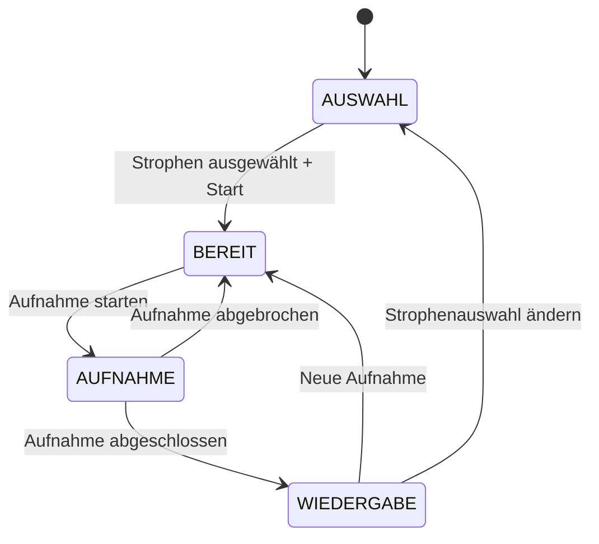
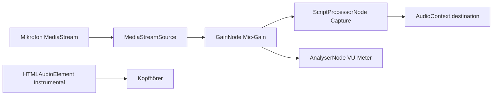
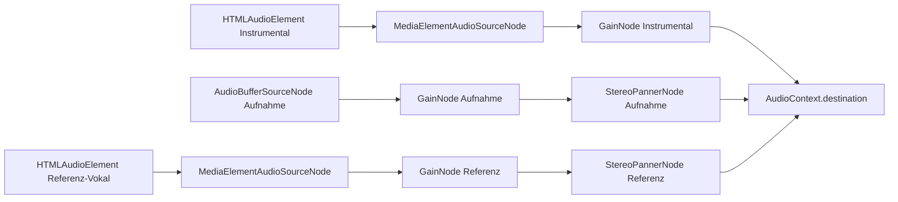

# Design-Dokument: Phrasen-Trainer

## Übersicht

Der Phrasen-Trainer ist eine neue Lernmethode, die es Nutzern ermöglicht, ausgewählte Strophen eines Songs einzusingen und die eigene Aufnahme über eine Mehrkanal-Wiedergabe mit dem Instrumental und optional der Referenz-Vokalspur zu vergleichen. Im Gegensatz zum bestehenden Vocal Trainer (Pitch-/Timing-Analyse des gesamten Songs) fokussiert der Phrasen-Trainer auf:

1. **Gezielte Strophenauswahl** — Nutzer wählen einzelne Abschnitte zum Üben
2. **Synchrone Aufnahme** — Mikrofon-Aufnahme parallel zum Instrumental im ausgewählten Bereich
3. **Hörvergleich statt Analyse** — Keine Pitch-Analyse, sondern Mehrkanal-Wiedergabe mit Lautstärke- und Panning-Kontrolle

Der Workflow folgt einer klaren Zustandsmaschine: **AUSWAHL → BEREIT → AUFNAHME → WIEDERGABE**.

### Designentscheidungen

- **Neue Komponentenstruktur** unter `src/components/phrase-trainer/` — kein Fork des Vocal Trainers, sondern eigenständige Komponenten, die bestehende Shared-Components wiederverwenden
- **Kein Pitch-Analyse-Worker** — der Phrasen-Trainer nutzt keinen Web Worker, da keine Analyse stattfindet
- **Web Audio API Graph** für den Wiedergabe-Mixer — `AudioContext` mit `GainNode` (Lautstärke) und `StereoPannerNode` (Panning) für Echtzeit-Kontrolle
- **Aufnahme als Float32Array** — wird im Speicher gehalten und über `AudioBufferSourceNode` wiedergegeben (kein Blob/Download)
- **HTMLAudioElement + MediaElementAudioSourceNode** für Instrumental und Referenz-Vokal — ermöglicht Seek auf Timecodes und Integration in den AudioContext-Graph

## Architektur

### Komponentenhierarchie

```
PhraseTrainerPage (Next.js Page)
└── PhraseTrainerView (Hauptkomponente, Zustandsmaschine)
    ├── KopfhoererHinweis (wiederverwendet aus vocal-trainer)
    ├── StrophenAuswahl (neue Komponente)
    ├── AufnahmeBereich (neue Komponente)
    │   ├── TextAnzeige (wiederverwendet aus karaoke)
    │   ├── StrophenTitel (wiederverwendet aus karaoke)
    │   ├── VuMeter (wiederverwendet aus vocal-trainer)
    │   └── AufnahmeControlsPT (neue Komponente, angepasst)
    ├── WiedergabeMixer (neue Komponente)
    │   ├── SpurRegler (neue Komponente, pro Spur)
    │   ├── PanningRegler (neue Komponente)
    │   └── WiedergabeControls (neue Komponente)
    ├── GeraeteAuswahl (neue Komponente)
    ├── GainRegler (neue Komponente)
    └── SongInfo (wiederverwendet aus karaoke)
```

### Zustandsmaschine



### Audio-Graph (Aufnahme)



Während der Aufnahme wird das Instrumental über ein separates `HTMLAudioElement` abgespielt (nicht über den AudioContext geroutet), damit es nicht in den ScriptProcessorNode gelangt. Der Nutzer hört das Instrumental über Kopfhörer.

### Audio-Graph (Wiedergabe)



## Komponenten und Schnittstellen

### PhraseTrainerView (Hauptkomponente)

Die zentrale Komponente, die den gesamten Workflow steuert.

```typescript
interface PhraseTrainerViewProps {
  song: SongDetail;
  onZurueck: () => void;
}
```

**Verantwortlichkeiten:**
- Zustandsmaschine (AUSWAHL → BEREIT → AUFNAHME → WIEDERGABE)
- Kopfhörer-Bestätigung (Session-basiert, wiederverwendet `KopfhoererHinweis`)
- Koordination zwischen Strophenauswahl, Aufnahme und Wiedergabe
- aria-live-Region für Zustandsänderungen

### StrophenAuswahl

```typescript
interface StrophenAuswahlProps {
  strophen: StropheDetail[];
  ausgewaehlteIds: Set<string>;
  onAuswahlAendern: (ids: Set<string>) => void;
  onStarten: () => void;
}
```

**Verantwortlichkeiten:**
- Anzeige aller Strophen mit Checkbox
- Strophen ohne Timecode als nicht auswählbar markieren (mit Hinweistext)
- Start-Button nur aktiv, wenn mindestens eine Strophe ausgewählt
- Auswahl bleibt zwischen Übungsdurchgängen erhalten

**Timecode-Prüfung:** Eine Strophe hat einen Timecode, wenn in `strophe.markups` ein Eintrag mit `typ === 'TIMECODE'` und `ziel === 'STROPHE'` und `timecodeMs != null` existiert.

### AufnahmeBereich

```typescript
interface AufnahmeBereichProps {
  song: SongDetail;
  ausgewaehlteStrophenIds: Set<string>;
  instrumentalUrl: string;
  selectedDeviceId: string;
  gainWert: number;
  onAufnahmeAbgeschlossen: (buffer: Float32Array, sampleRate: number) => void;
  onAbbrechen: () => void;
}
```

**Verantwortlichkeiten:**
- Instrumental ab Start-Timecode abspielen
- Mikrofon-Aufnahme synchron starten (Mono, 44.1 kHz, keine Echounterdrückung)
- Latenz messen und kompensieren (wiederverwendet `messeLatenz`, `kompensiere`)
- Automatischer Stopp am End-Timecode
- Karaoke-Textanzeige synchron zum Timecode (wiederverwendet `TextAnzeige`)
- VU-Meter anzeigen (wiederverwendet `VuMeter`)

### WiedergabeMixer

```typescript
interface WiedergabeMixerProps {
  aufnahmeBuffer: Float32Array;
  aufnahmeSampleRate: number;
  instrumentalUrl: string;
  referenzVokalUrl: string | null;
  startTimeMs: number;
  endTimeMs: number;
  onNeueAufnahme: () => void;
  onZurueckZurAuswahl: () => void;
}
```

**Verantwortlichkeiten:**
- Drei-Kanal-Wiedergabe: Instrumental, Aufnahme, Referenz-Vokal (optional)
- Lautstärkeregler pro Spur (0–100%, GainNode)
- Panning-Regler für Stereo-Trennung (0–100%, StereoPannerNode)
- Play/Pause/Stopp-Steuerung
- Wiedergabe auf Übungsbereich beschränkt
- Automatischer Stopp am Ende des Übungsbereichs

### SpurRegler

```typescript
interface SpurReglerProps {
  label: string;
  lautstaerke: number;        // 0–1
  onLautstaerkeAendern: (wert: number) => void;
  stumm?: boolean;
  onStummschalten?: () => void;
  deaktiviert?: boolean;
}
```

### PanningRegler

```typescript
interface PanningReglerProps {
  wert: number;                // 0–1 (0 = mono/mitte, 1 = voll getrennt)
  onWertAendern: (wert: number) => void;
  sichtbar: boolean;
}
```

**Mapping:** Der Panning-Wert (0–1) wird auf StereoPannerNode-Werte gemappt:
- Aufnahme: `pan = -wert` (links)
- Referenz-Vokal: `pan = +wert` (rechts)
- Bei `wert = 0`: beide mittig (mono)
- Bei `wert = 1`: Aufnahme voll links (-1), Referenz voll rechts (+1)

### Übungsbereich-Berechnung

```typescript
/**
 * Berechnet den Übungsbereich (Start- und End-Timecode) basierend auf
 * den ausgewählten Strophen.
 */
function berechneUebungsbereich(
  strophen: StropheDetail[],
  ausgewaehlteIds: Set<string>,
  instrumentalDauerMs: number
): { startMs: number; endMs: number }
```

**Logik:**
1. Alle Strophen nach `orderIndex` sortieren
2. `startMs` = Timecode der ersten ausgewählten Strophe
3. `endMs` = Timecode der nächsten Strophe nach der letzten ausgewählten Strophe
4. Falls die letzte ausgewählte Strophe die letzte im Song ist: `endMs` = Dauer der Instrumental-Spur
5. Nicht-zusammenhängende Auswahlen werden als ein durchgehender Bereich behandelt (vom ersten bis zum letzten ausgewählten)

### Hilfsfunktionen

```typescript
/**
 * Findet die Instrumental-AudioQuelle eines Songs.
 */
function findeInstrumental(audioQuellen: AudioQuelleResponse[]): AudioQuelleResponse | null

/**
 * Findet die Referenz-Vokal-AudioQuelle eines Songs.
 */
function findeReferenzVokal(audioQuellen: AudioQuelleResponse[]): AudioQuelleResponse | null

/**
 * Prüft ob eine Strophe einen gültigen Timecode hat.
 */
function hatTimecode(strophe: StropheDetail): boolean

/**
 * Berechnet den Panning-Wert für StereoPannerNode aus dem Regler-Wert (0–1).
 * Aufnahme: -wert, Referenz: +wert
 */
function berechnePanning(reglerWert: number): { aufnahme: number; referenz: number }
```

## Datenmodelle

### Zustandstypen

```typescript
/** Zustände des Phrasen-Trainers */
type PhrasenTrainerZustand = 'AUSWAHL' | 'BEREIT' | 'AUFNAHME' | 'WIEDERGABE';

/** Mixer-Zustand für die Wiedergabe */
interface MixerZustand {
  istAbspielend: boolean;
  instrumentalLautstaerke: number;  // 0–1, initial 1.0
  aufnahmeLautstaerke: number;      // 0–1, initial 1.0
  referenzLautstaerke: number;      // 0–1, initial 0.7
  referenzAktiv: boolean;           // Toggle für Referenz-Vokalspur
  panningWert: number;              // 0–1, initial 0.5
}

/** Aufnahme-Daten */
interface AufnahmeDaten {
  buffer: Float32Array;
  sampleRate: number;
  dauerMs: number;
}

/** Übungsbereich */
interface Uebungsbereich {
  startMs: number;
  endMs: number;
}
```

### Bestehende Typen (wiederverwendet)

- `SongDetail` — Song mit Strophen, AudioQuellen, etc. (`src/types/song.ts`)
- `StropheDetail` — Strophe mit Zeilen und Markups (`src/types/song.ts`)
- `AudioQuelleResponse` — AudioQuelle mit `rolle: AudioRolle` (`src/types/audio.ts`)
- `FlatLine`, `DisplayMode` — Karaoke-Typen (`src/types/karaoke.ts`)
- `AudioRolle` — Enum: `STANDARD | INSTRUMENTAL | REFERENZ_VOKAL` (Prisma)

### Kein neues Datenbankmodell

Der Phrasen-Trainer benötigt kein neues Prisma-Modell. Die Aufnahme wird nur im Speicher gehalten (Float32Array) und nicht persistiert. Alle benötigten Daten (Song, Strophen, AudioQuellen) kommen aus dem bestehenden `SongDetail`.


## Correctness Properties

*Eine Property ist eine Eigenschaft oder ein Verhalten, das über alle gültigen Ausführungen eines Systems hinweg gelten sollte — im Wesentlichen eine formale Aussage darüber, was das System tun soll. Properties bilden die Brücke zwischen menschenlesbaren Spezifikationen und maschinenverifizierbaren Korrektheitsgarantien.*

### Property 1: Start-Button-Aktivierung korreliert mit Auswahl

*Für jede* Menge ausgewählter Strophen gilt: Der Start-Button ist genau dann aktiviert, wenn mindestens eine Strophe ausgewählt ist, und deaktiviert, wenn die Auswahl leer ist.

**Validates: Requirements 1.3, 1.4**

### Property 2: Strophen ohne Timecode sind nicht auswählbar

*Für jede* Strophe eines Songs gilt: Die Strophe ist genau dann auswählbar, wenn sie einen Markup-Eintrag mit `typ === 'TIMECODE'`, `ziel === 'STROPHE'` und `timecodeMs != null` besitzt.

**Validates: Requirements 1.5**

### Property 3: Übungsbereich-Berechnung

*Für jede* gültige Auswahl von Strophen (mindestens eine, alle mit Timecode) und jede Instrumental-Dauer gilt: `berechneUebungsbereich` liefert `startMs` gleich dem Timecode der ersten ausgewählten Strophe (nach `orderIndex`) und `endMs` gleich dem Timecode der nächsten nicht-ausgewählten Strophe nach der letzten ausgewählten — oder gleich der Instrumental-Dauer, falls die letzte ausgewählte Strophe die letzte im Song ist. Dies gilt unabhängig davon, ob die Auswahl zusammenhängend oder nicht-zusammenhängend ist.

**Validates: Requirements 4.2, 12.1, 12.2, 12.3**

### Property 4: Referenz-Toggle-Sichtbarkeit

*Für jeden* Song gilt: Der Toggle-Schalter für die Referenz-Vokalspur ist genau dann sichtbar, wenn der Song eine AudioQuelle mit `rolle === 'REFERENZ_VOKAL'` besitzt, und ausgeblendet, wenn keine solche AudioQuelle vorhanden ist.

**Validates: Requirements 5.1, 5.4**

### Property 5: Panning-Mapping und Instrumental-Invariante

*Für jeden* Panning-Regler-Wert `v` im Bereich [0, 1] gilt: Die Aufnahme-Spur erhält `pan = -v` (links), die Referenz-Vokalspur erhält `pan = +v` (rechts), und die Instrumental-Spur bleibt immer bei `pan = 0` (Mitte).

**Validates: Requirements 7.2, 7.6**

### Property 6: Wiedergabe-Lautstärke-Mapping

*Für jeden* Lautstärkeregler-Wert `v` im Bereich [0, 1] und jede Spur (Instrumental, Aufnahme, Referenz) gilt: Der zugehörige `GainNode.gain.value` entspricht exakt dem Regler-Wert `v`.

**Validates: Requirements 6.2**

### Property 7: Mikrofon-Gain-Mapping

*Für jeden* Gain-Regler-Wert `v` im Bereich [0, 3] gilt: Der `GainNode.gain.value` des Mikrofon-Eingangs entspricht exakt dem Regler-Wert `v`.

**Validates: Requirements 9.2**

### Property 8: aria-live-Region spiegelt Zustand wider

*Für jeden* Zustand des Phrasen-Trainers (AUSWAHL, BEREIT, AUFNAHME, WIEDERGABE) gilt: Die aria-live-Region enthält den korrekten, zustandsspezifischen Beschreibungstext.

**Validates: Requirements 11.7**

## Fehlerbehandlung

### Mikrofon-Fehler

| Fehler | Ursache | Nutzer-Nachricht |
|--------|---------|------------------|
| `NotAllowedError` | Mikrofon-Berechtigung verweigert | „Mikrofon-Berechtigung wurde verweigert. Bitte erlaube den Zugriff in den Browser-Einstellungen." |
| `NotFoundError` | Kein Mikrofon angeschlossen | „Kein Mikrofon gefunden. Bitte schließe ein Mikrofon an und versuche es erneut." |
| Sonstiger Fehler | Unbekannter Fehler | „Fehler beim Zugriff auf das Mikrofon." |

### Audio-Wiedergabe-Fehler

| Fehler | Ursache | Nutzer-Nachricht |
|--------|---------|------------------|
| Audio-Play-Fehler | Instrumental kann nicht abgespielt werden | „Fehler beim Abspielen des Instrumentals." |
| AudioContext-Fehler | Browser blockiert AudioContext | „Audio-Wiedergabe nicht möglich. Bitte interagiere zuerst mit der Seite." |

### Fehlende Daten

| Situation | Verhalten |
|-----------|-----------|
| Kein Instrumental vorhanden | Phrasen-Trainer nicht verfügbar, Hinweis anzeigen |
| Keine Strophen mit Timecode | Alle Strophen als nicht auswählbar markieren, Start-Button dauerhaft deaktiviert |
| Song ohne Strophen | Hinweis „Keine Texte vorhanden" anzeigen |

### Cleanup

- Bei Zustandswechsel oder Unmount: alle MediaStreams stoppen, AudioContext schließen, Intervalle aufräumen
- Bei Fehler während der Aufnahme: Aufnahme abbrechen, Ressourcen freigeben, Fehlermeldung anzeigen
- `useEffect`-Cleanup-Funktionen für alle Subscriptions und Event-Listener

## Teststrategie

### Property-Based Tests (fast-check)

Die Property-Tests verwenden [fast-check](https://github.com/dubzzz/fast-check) als PBT-Bibliothek (bereits im Projekt vorhanden). Jeder Test läuft mit mindestens 100 Iterationen.

| Property | Testdatei | Beschreibung |
|----------|-----------|--------------|
| Property 1 | `start-button-activation.property.test.ts` | Generiert zufällige Strophen-Auswahlen, prüft Button-Zustand |
| Property 2 | `timecode-selectable.property.test.ts` | Generiert zufällige Strophen mit/ohne Timecodes, prüft Auswählbarkeit |
| Property 3 | `uebungsbereich-berechnung.property.test.ts` | Generiert zufällige Strophen-Listen und Auswahlen, prüft Start/End-Berechnung |
| Property 4 | `referenz-toggle-sichtbarkeit.property.test.ts` | Generiert zufällige Songs mit/ohne REFERENZ_VOKAL, prüft Toggle-Sichtbarkeit |
| Property 5 | `panning-mapping.property.test.ts` | Generiert zufällige Panning-Werte [0,1], prüft pan-Werte und Instrumental-Invariante |
| Property 6 | `lautstaerke-mapping.property.test.ts` | Generiert zufällige Lautstärke-Werte [0,1], prüft GainNode-Werte |
| Property 7 | `mikrofon-gain-mapping.property.test.ts` | Generiert zufällige Gain-Werte [0,3], prüft GainNode-Werte |
| Property 8 | `aria-live-zustand.property.test.ts` | Iteriert über alle Zustände, prüft aria-live-Text |

**Tag-Format:** `Feature: phrase-trainer, Property {number}: {property_text}`

**Konfiguration:** Minimum 100 Iterationen pro Property-Test (`fc.assert(fc.property(...), { numRuns: 100 })`).

### Unit-Tests (Beispiel-basiert)

| Testbereich | Beschreibung |
|-------------|--------------|
| StrophenAuswahl Rendering | Alle Strophen werden angezeigt, Checkboxen funktionieren |
| Kopfhörer-Dialog | Dialog erscheint beim ersten Öffnen, wird nach Bestätigung nicht erneut angezeigt |
| Zustandsübergänge | Alle Transitionen der Zustandsmaschine (AUSWAHL→BEREIT→AUFNAHME→WIEDERGABE) |
| Initiale Werte | Lautstärke 100%/100%/70%, Panning 50%, Gain 100% |
| Geräteauswahl | Dropdown erscheint bei >1 Gerät, erstes Gerät vorausgewählt |
| Panning-Reset | Bei Deaktivierung der Referenz wird Aufnahme auf Mitte zurückgesetzt |

### Integrationstests

| Testbereich | Beschreibung |
|-------------|--------------|
| Aufnahme-Workflow | Kompletter Durchlauf: Strophen auswählen → Aufnahme starten → Auto-Stopp → Wiedergabe |
| Audio-Graph | Web Audio API Nodes korrekt verbunden (GainNode, StereoPannerNode, MediaElementAudioSourceNode) |
| Timecode-Sync | Textanzeige wechselt synchron zum Audio-Timecode |
| Fehlerbehandlung | Mikrofon-Fehler werden korrekt angezeigt |

### Edge-Case-Tests

| Testbereich | Beschreibung |
|-------------|--------------|
| Mikrofon verweigert | NotAllowedError → Fehlermeldung |
| Kein Mikrofon | NotFoundError → Fehlermeldung |
| Letzte Strophe ausgewählt | End-Timecode = Instrumental-Dauer |
| Einzelne Strophe | Übungsbereich mit nur einer Strophe |
| Alle Strophen ohne Timecode | Start-Button dauerhaft deaktiviert |
