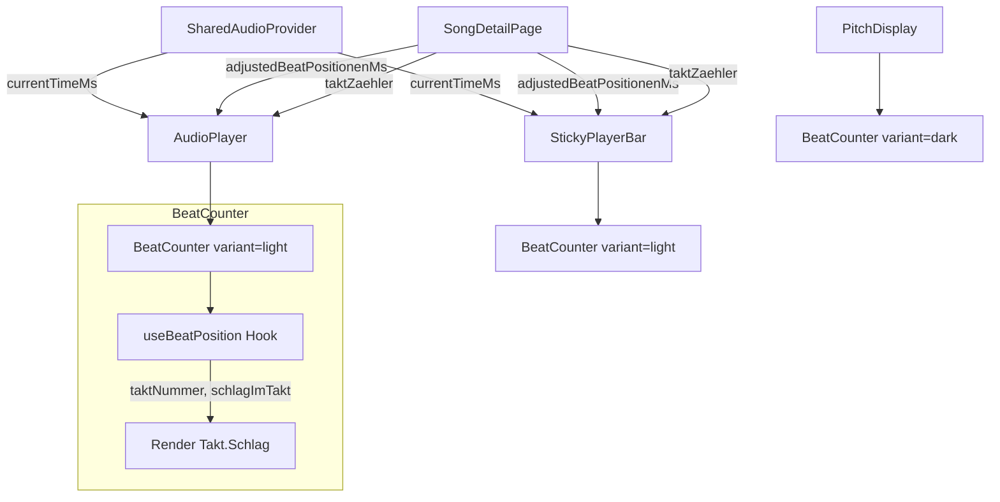

# Design-Dokument: Takt-Counter im Player

## Übersicht

Der bestehende Audio-Player und die StickyPlayerBar zeigen bereits Beat-Marker auf dem Fortschrittsbalken, aber keine numerische Takt/Schlag-Anzeige. Im Karaoke-Modus existiert bereits ein `BeatCounter` als private Funktion innerhalb von `pitch-display.tsx`, der Taktnummer und Schlagposition anzeigt (z.B. "4.2" = Takt 4, Schlag 2).

Dieses Feature extrahiert die bestehende BeatCounter-Logik in eine eigenständige, wiederverwendbare Komponente und integriert sie in den normalen Audio-Player und die StickyPlayerBar. Die Komponente unterstützt zwei visuelle Varianten: hell (für den normalen Player) und dunkel (für den Karaoke-Modus / PitchDisplay).

### Designentscheidungen

- **Extraktion statt Neuentwicklung** — Die Berechnungslogik (`floor(beatIndex / taktZaehler) + 1` für Takt, `(beatIndex % taktZaehler) + 1` für Schlag) existiert bereits in `pitch-display.tsx`. Sie wird in eine eigene Komponente extrahiert, um Duplikation zu vermeiden.
- **Reine Berechnung als Hook** — Die Taktpositions-Berechnung wird als reiner Hook `useBeatPosition` extrahiert, der `beatPositionenMs`, `currentTimeMs` und `taktZaehler` entgegennimmt. Das ermöglicht einfaches Testen der Logik unabhängig von der UI.
- **Varianten-Prop für Styling** — Eine `variant`-Prop (`"light" | "dark"`) steuert die visuelle Darstellung. `"light"` für den normalen Player (dunkler Text auf hellem Hintergrund), `"dark"` für den Karaoke-Modus (heller Text auf transparentem Hintergrund, wie bisher).
- **Offset-Korrektur auf Aufruferseite** — Die Song-Detail-Seite berechnet bereits `adjustedBeatPositionenMs` (mit Offset). Der BeatCounter erhält die bereits korrigierten Positionen, genau wie der bestehende `BeatMarkerOverlay`. Kein separater `offsetMs`-Prop nötig.
- **SharedAudioProvider als Datenquelle** — `currentTimeMs` kommt aus dem `SharedAudioProvider`, der bereits von AudioPlayer und StickyPlayerBar genutzt wird. Kein zusätzlicher State-Management-Aufwand.

## Architektur

### Komponentenhierarchie

```
SongDetailPage (bestehend)
└── SharedAudioProvider (bestehend)
    ├── AudioPlayer (bestehend, erweitert um BeatCounter)
    │   ├── BeatMarkerOverlay (bestehend)
    │   └── BeatCounter (neu, variant="light")
    ├── StickyPlayerBar (bestehend, erweitert um BeatCounter)
    │   ├── BeatMarkerOverlay (bestehend)
    │   └── BeatCounter (neu, variant="light")
    └── BeatEinstellungen (bestehend)

PitchDisplay (bestehend, refactored)
└── BeatCounter (extrahiert, variant="dark")
```

### Datenfluss



## Komponenten und Schnittstellen

### 1. `useBeatPosition` Hook (neu)

**Pfad:** `src/hooks/use-beat-position.ts`

Extrahiert die reine Berechnungslogik aus dem bestehenden `BeatCounter` in `pitch-display.tsx`.

```typescript
interface BeatPosition {
  taktNummer: number;    // 1-basiert
  schlagImTakt: number;  // 1-basiert
  beatIndex: number;     // 0-basiert
}

function useBeatPosition(
  beatPositionenMs: number[],
  currentTimeMs: number,
  taktZaehler?: number,  // Standard: 4
): BeatPosition | null;
```

**Rückgabe:** `null` wenn `currentTimeMs` vor dem ersten Beat liegt oder `beatPositionenMs` leer ist. Sonst ein `BeatPosition`-Objekt.

**Algorithmus:**
1. Binäre Suche (oder rückwärts-lineare Suche wie im Original) nach dem letzten Beat ≤ `currentTimeMs`
2. `taktNummer = Math.floor(beatIndex / taktZaehler) + 1`
3. `schlagImTakt = (beatIndex % taktZaehler) + 1`

### 2. `BeatCounter` Komponente (neu)

**Pfad:** `src/components/songs/beat-counter.tsx`

```typescript
interface BeatCounterProps {
  beatPositionenMs: number[];
  currentTimeMs: number;
  taktZaehler?: number;       // Standard: 4
  variant?: "light" | "dark"; // Standard: "light"
}
```

**Varianten:**
- `"light"` — Kompakte Inline-Darstellung für den normalen Player: `rounded-md bg-neutral-100 px-2 py-0.5 text-sm tabular-nums font-mono text-neutral-700`
- `"dark"` — Runde Overlay-Darstellung für den Karaoke-Modus (wie bisher): `rounded-full bg-white/10 px-4 py-2 text-lg font-bold text-white/90`

**Verhalten:**
- Zeigt `"—"` mit `aria-label="Kein aktiver Takt"` wenn keine aktive Position
- Zeigt `"{taktNummer}.{schlagImTakt}"` mit `aria-label="Takt {X}, Schlag {Y}"` sonst

### 3. `AudioPlayer` Erweiterung (bestehend)

**Änderungen an `src/components/songs/audio-player.tsx`:**

- Neue Props: `taktZaehler?: number`
- BeatCounter wird neben der Zeitanzeige eingefügt (nur wenn `beatPositionenMs` vorhanden und nicht leer)
- Platzierung: nach dem Zeitanzeige-`<span>`, innerhalb der `flex items-center gap-3`-Zeile

### 4. `StickyPlayerBar` Erweiterung (bestehend)

**Änderungen an `src/components/songs/sticky-player-bar.tsx`:**

- Neue Props: `taktZaehler?: number`
- BeatCounter wird neben der Zeitanzeige eingefügt (gleiche Bedingung wie AudioPlayer)
- Platzierung: vor dem Zeitanzeige-`<span>` in der Controls-Zeile

### 5. `PitchDisplay` Refactoring (bestehend)

**Änderungen an `src/components/pitch-display/pitch-display.tsx`:**

- Die private `BeatCounter`-Funktion wird entfernt
- Import der neuen `BeatCounter`-Komponente mit `variant="dark"`
- Keine funktionale Änderung, nur Extraktion

### 6. `SongDetailPage` Erweiterung (bestehend)

**Änderungen an `src/app/(main)/songs/[id]/page.tsx`:**

- `taktZaehler` aus `song.beatErgebnis` an `AudioPlayer` und `StickyPlayerBar` durchreichen

## Datenmodelle

Keine neuen Datenmodelle nötig. Die bestehenden Typen werden wiederverwendet:

### Bestehende Typen

```typescript
// aus src/types/beat-detection.ts
interface BeatErgebnisResponse {
  beatPositionenMs: number[];  // Beat-Zeitpunkte in ms
  offsetMs: number;            // Offset-Korrektur
  taktZaehler: number;         // Schläge pro Takt (z.B. 4)
  taktNenner: number;          // Notenwert (z.B. 4 für Viertelnote)
  // ... weitere Felder
}
```

### Neuer Typ (Hook-Rückgabe)

```typescript
// in src/hooks/use-beat-position.ts
interface BeatPosition {
  taktNummer: number;    // floor(beatIndex / taktZaehler) + 1
  schlagImTakt: number;  // (beatIndex % taktZaehler) + 1
  beatIndex: number;     // Index des letzten Beats ≤ currentTimeMs
}
```

## Correctness Properties

*A property is a characteristic or behavior that should hold true across all valid executions of a system — essentially, a formal statement about what the system should do. Properties serve as the bridge between human-readable specifications and machine-verifiable correctness guarantees.*

### Property 1: Taktpositions-Berechnung ist korrekt

*For any* array of sorted beat positions (in ms), any currentTimeMs ≥ first beat position, and any taktZaehler ≥ 1, the computed taktNummer SHALL equal `floor(beatIndex / taktZaehler) + 1` and schlagImTakt SHALL equal `(beatIndex % taktZaehler) + 1`, where beatIndex is the index of the last beat position ≤ currentTimeMs.

**Validates: Requirements 1.3, 1.4, 3.1, 3.2**

### Property 2: Bedingte Anzeige basierend auf Beat-Daten

*For any* BeatCounter input, the component SHALL render the takt/schlag display if and only if beatPositionenMs contains at least one entry and currentTimeMs ≥ the first beat position. When beatPositionenMs is empty or currentTimeMs is before the first beat, the component SHALL render the placeholder "—".

**Validates: Requirements 1.1, 1.2, 1.5**

### Property 3: Aria-Label stimmt mit angezeigtem Wert überein

*For any* BeatCounter rendering that shows a takt/schlag value "{X}.{Y}", the aria-label SHALL be "Takt {X}, Schlag {Y}". When the placeholder "—" is shown, the aria-label SHALL be "Kein aktiver Takt".

**Validates: Requirements 4.1, 4.2**

### Property 4: SchlagImTakt bleibt im gültigen Bereich

*For any* array of beat positions and any taktZaehler ≥ 1, the computed schlagImTakt SHALL always be in the range [1, taktZaehler] and taktNummer SHALL always be ≥ 1.

**Validates: Requirements 3.1, 3.2, 3.4**

## Fehlerbehandlung

| Szenario | Verhalten |
|---|---|
| `beatPositionenMs` ist `undefined` oder leer | BeatCounter wird nicht gerendert |
| `currentTimeMs` vor erstem Beat | Platzhalter "—" mit aria-label "Kein aktiver Takt" |
| `taktZaehler` nicht angegeben | Standardwert 4 (4/4-Takt) |
| `taktZaehler` ist 0 oder negativ | Fallback auf Standardwert 4 |
| Nicht-MP3-Quelle aktiv | AudioPlayer zeigt keinen BeatCounter (kein `currentTimeMs` verfügbar) |

## Testing-Strategie

### Property-Based Tests (fast-check + vitest)

Die Berechnungslogik im `useBeatPosition`-Hook eignet sich hervorragend für Property-Based Testing, da sie eine reine Funktion mit klar definierten mathematischen Eigenschaften ist.

**Bibliothek:** `fast-check` (bereits im Projekt als devDependency vorhanden)

**Konfiguration:** Minimum 100 Iterationen pro Property-Test

**Tag-Format:** `Feature: player-beat-counter, Property {number}: {property_text}`

**Testdatei:** `__tests__/player-beat-counter/beat-position.property.test.ts`

Jede der 4 Correctness Properties wird als einzelner Property-Based Test implementiert:

1. **Property 1** — Generiere sortierte Beat-Arrays, zufällige `currentTimeMs` und `taktZaehler`. Verifiziere die Formeln.
2. **Property 2** — Generiere Beat-Arrays (inkl. leere) und `currentTimeMs` (inkl. vor erstem Beat). Verifiziere bedingte Anzeige.
3. **Property 3** — Generiere gültige Beat-Daten, rendere die Komponente, verifiziere aria-label-Konsistenz.
4. **Property 4** — Generiere Beat-Arrays mit verschiedenen `taktZaehler`-Werten. Verifiziere Wertebereiche.

### Unit Tests (vitest + testing-library)

Ergänzend zu den Property-Tests, für spezifische Beispiele und Integration:

- **BeatCounter Rendering:** Snapshot-Tests für beide Varianten (`light`/`dark`)
- **AudioPlayer Integration:** Verifiziere, dass BeatCounter neben der Zeitanzeige erscheint wenn Beat-Daten vorhanden
- **StickyPlayerBar Integration:** Verifiziere, dass BeatCounter in der Controls-Zeile erscheint
- **PitchDisplay Refactoring:** Verifiziere, dass die extrahierte Komponente identisch zum Original rendert
- **Default taktZaehler:** Verifiziere Standardwert 4 wenn nicht angegeben
