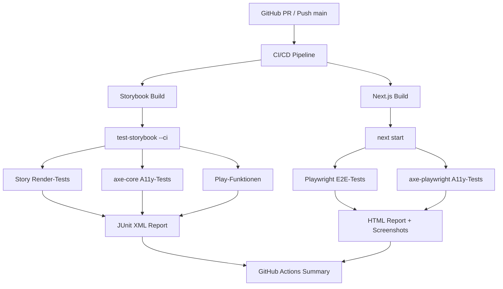

# Design-Dokument: Playwright & Storybook Regressionstests

## Overview

Die Regressionstestinfrastruktur für Lyco kombiniert zwei komplementäre Teststufen:

1. **Storybook Test Runner** – komponentenbasierte Regressionstests für alle 54 Stories, inklusive axe-core-Barrierefreiheitsprüfungen und Play-Funktionen
2. **Playwright E2E-Tests** – vollständige User-Flow-Tests gegen die laufende Next.js-Anwendung, inklusive axe-playwright-Barrierefreiheitsprüfungen auf Seitenebene

Beide Teststufen werden in einer GitHub Actions CI/CD-Pipeline integriert und bei jedem Pull Request sowie Push auf `main` ausgeführt.

### Designentscheidungen

- **Kein neues Test-Framework**: Das Projekt nutzt bereits `@storybook/test-runner`, `axe-playwright` und `@playwright/test`. Das Design baut ausschließlich auf diesen bestehenden Abhängigkeiten auf.
- **Zentrale axe-Konfiguration**: Die Barrierefreiheitsprüfung für Storybook wird in `.storybook/test-runner.ts` zentral konfiguriert, sodass keine Änderungen an einzelnen Story-Dateien nötig sind.
- **Verzeichnistrennung**: E2E-Regressionstests (`e2e/regression/`) und Barrierefreiheitstests (`e2e/a11y/`) sind von den bestehenden Smoke-Tests (`e2e/smoke.spec.ts`) getrennt.
- **Play-Funktionen mit `@storybook/test`**: Alle Play-Funktionen verwenden ausschließlich `userEvent` und `expect` aus `@storybook/test`, ohne externe Test-Frameworks.

---

## Architecture

```text
lyco/
├── .storybook/
│   ├── main.ts                    # Bestehend – Storybook-Konfiguration
│   ├── preview.ts                 # Bestehend – globale Parameter
│   └── test-runner.ts             # NEU – axe-core-Integration für alle Stories
│
├── e2e/
│   ├── smoke.spec.ts              # Bestehend – Smoke-Tests (unverändert)
│   ├── regression/                # NEU – E2E-Regressionstests
│   │   ├── login.spec.ts          # Login-Flow
│   │   ├── songs.spec.ts          # Song-Listenansicht
│   │   └── navigation.spec.ts     # Navigation zwischen Hauptbereichen
│   ├── a11y/                      # NEU – Barrierefreiheitstests
│   │   └── pages.a11y.spec.ts     # axe-playwright für Login, Home, Songs
│   ├── playwright-report/         # Generiert – HTML-Berichte
│   ├── test-results/              # Generiert – Screenshots, Traces
│   └── README.md                  # NEU – Dokumentation der Testinfrastruktur
│
├── src/components/
│   ├── cloze/
│   │   ├── gap-input.stories.tsx       # Erweitert – Play-Funktion hinzufügen
│   │   └── hint-button.stories.tsx     # Erweitert – Play-Funktion hinzufügen
│   ├── karaoke/
│   │   ├── play-pause-button.stories.tsx  # Erweitert – Play-Funktion
│   │   └── modus-umschalter.stories.tsx   # Erweitert – Play-Funktion
│   └── quiz/
│       ├── multiple-choice-card.stories.tsx  # Erweitert – Play-Funktion
│       └── score-screen.stories.tsx          # Erweitert – Play-Funktion
│
├── .github/workflows/
│   └── regression-tests.yml       # NEU – CI/CD-Workflow
│
└── playwright.config.ts           # Erweitert – Reporter-Konfiguration anpassen
```

### Datenfluss



---

## Components and Interfaces

### 1. Storybook Test Runner Konfiguration (`.storybook/test-runner.ts`)

Der Test Runner wird über eine `TestRunnerConfig` konfiguriert. Die `postVisit`-Hook-Funktion wird nach jedem Story-Rendering aufgerufen und führt die axe-core-Prüfung durch.

```typescript
import type { TestRunnerConfig } from "@storybook/test-runner";
import { checkA11y, injectAxe } from "axe-playwright";

const config: TestRunnerConfig = {
  async preVisit(page) {
    await injectAxe(page);
  },
  async postVisit(page, context) {
    await checkA11y(page, "#storybook-root", {
      detailedReport: true,
      detailedReportOptions: { html: true },
      axeOptions: {
        runOnly: {
          type: "tag",
          values: ["wcag2a", "wcag2aa", "wcag21a", "wcag21aa"],
        },
      },
      // Nur critical und serious als Fehler werten
      includedImpacts: ["critical", "serious"],
    });
  },
};

export default config;
```

**Schnittstelle**: `TestRunnerConfig` aus `@storybook/test-runner`

- `preVisit(page)`: Wird vor dem Story-Rendering aufgerufen – injiziert axe-core
- `postVisit(page, context)`: Wird nach dem Story-Rendering aufgerufen – führt axe-Prüfung durch

**Ausnahmen pro Story**: Stories können Barrierefreiheitsprüfungen für bestimmte Regeln über Story-Parameter deaktivieren:

```typescript
export const MeineStory: Story = {
  parameters: {
    a11y: {
      config: {
        rules: [{ id: "color-contrast", enabled: false }],
      },
    },
  },
};
```

### 2. Playwright E2E-Regressionstests (`e2e/regression/`)

#### `e2e/regression/login.spec.ts`

Testet den vollständigen Login-Flow:

- Aufruf der Login-Seite
- Eingabe von Benutzername und Passwort
- Klick auf den Login-Button
- Prüfung der erfolgreichen Weiterleitung (z.B. auf `/songs` oder `/`)

```typescript
import { test, expect } from "@playwright/test";

test.describe("Login-Flow Regression", () => {
  test("Erfolgreicher Login leitet weiter", async ({ page }) => {
    await page.goto("/login");
    await page.getByLabel(/benutzername|email/i).fill(process.env.TEST_USER!);
    await page.getByLabel(/passwort/i).fill(process.env.TEST_PASSWORD!);
    await page.getByRole("button", { name: /anmelden|login/i }).click();
    await expect(page).not.toHaveURL(/\/login/);
  });
});
```

**Umgebungsvariablen**: `TEST_USER`, `TEST_PASSWORD` – werden in CI als GitHub Secrets gesetzt.

#### `e2e/regression/songs.spec.ts`

Testet die Song-Listenansicht:

- Aufruf der Songs-Seite (nach Login)
- Prüfung dass Songs angezeigt werden

#### `e2e/regression/navigation.spec.ts`

Testet die Navigation zwischen Hauptbereichen:

- Navigation zu verschiedenen Routen
- Prüfung dass die Seiten korrekt laden

### 3. Playwright Barrierefreiheitstests (`e2e/a11y/`)

#### `e2e/a11y/pages.a11y.spec.ts`

```typescript
import { test, expect } from "@playwright/test";
import AxeBuilder from "@axe-core/playwright";

test.describe("Barrierefreiheit – Seiten", () => {
  test("Login-Seite hat keine critical/serious Verstöße", async ({ page }) => {
    await page.goto("/login");
    await page.waitForLoadState("networkidle");
    const results = await new AxeBuilder({ page })
      .withTags(["wcag2a", "wcag2aa"])
      .analyze();
    const violations = results.violations.filter(
      (v) => v.impact === "critical" || v.impact === "serious"
    );
    expect(violations).toEqual([]);
  });
  // Analog für Startseite und Song-Listenansicht
});
```

**Abhängigkeit**: `axe-playwright` ist bereits installiert. Die API wird über `AxeBuilder` aus `@axe-core/playwright` genutzt (axe-playwright re-exportiert dies).

### 4. Play-Funktionen für bestehende Stories

Play-Funktionen werden zu ausgewählten Stories in den Kategorien `cloze`, `karaoke` und `quiz` hinzugefügt. Sie verwenden ausschließlich `userEvent` und `expect` aus `@storybook/test`.

#### Beispiel: `gap-input.stories.tsx` – Play-Funktion für Texteingabe

```typescript
import { userEvent, within, expect } from "@storybook/test";

export const WithInteraction: Story = {
  args: { /* ... */ },
  play: async ({ canvasElement }) => {
    const canvas = within(canvasElement);
    const input = canvas.getByRole("textbox");
    await userEvent.type(input, "hello");
    await expect(input).toHaveValue("hello");
  },
};
```

#### Geplante Play-Funktionen

| Story-Datei | Story-Name | Interaktion | Assertion |
| --- | --- | --- | --- |
| `cloze/gap-input.stories.tsx` | `WithInteraction` | Texteingabe in Lücke | Input hat eingegebenen Wert |
| `cloze/hint-button.stories.tsx` | `ClickEnabled` | Klick auf aktivierten Button | onClick wurde aufgerufen |
| `karaoke/play-pause-button.stories.tsx` | `TogglePlay` | Klick auf Play-Button | onToggle wurde aufgerufen |
| `karaoke/modus-umschalter.stories.tsx` | `SwitchMode` | Klick auf anderen Modus | onChange wurde aufgerufen |
| `quiz/multiple-choice-card.stories.tsx` | `SelectAnswer` | Klick auf Antwortoption | onAnswer wurde aufgerufen |
| `quiz/score-screen.stories.tsx` | `ClickRepeat` | Klick auf Wiederholen | onRepeat wurde aufgerufen |

### 5. GitHub Actions Workflow (`.github/workflows/regression-tests.yml`)

Der Workflow läuft bei Pull Requests und Pushes auf `main`. Er besteht aus zwei parallelen Jobs:

```yaml
name: Regression Tests

on:
  push:
    branches: [main]
  pull_request:
    branches: [main]

jobs:
  storybook-tests:
    runs-on: ubuntu-latest
    steps:
      - uses: actions/checkout@v4
      - uses: actions/setup-node@v4
        with:
          node-version: 20
          cache: npm
      - run: npm ci
      - name: Storybook bauen und Tests ausführen
        run: npm run test:stories:ci
      - name: Storybook-Testergebnisse hochladen
        if: always()
        uses: actions/upload-artifact@v4
        with:
          name: storybook-test-results
          path: storybook-test-results/
          retention-days: 7

  playwright-tests:
    runs-on: ubuntu-latest
    steps:
      - uses: actions/checkout@v4
      - uses: actions/setup-node@v4
        with:
          node-version: 20
          cache: npm
      - run: npm ci
      - run: npx playwright install --with-deps chromium
      - name: Next.js bauen und E2E-Tests ausführen
        run: npm run test:e2e
        env:
          TEST_USER: ${{ secrets.TEST_USER }}
          TEST_PASSWORD: ${{ secrets.TEST_PASSWORD }}
      - name: Playwright-Ergebnisse hochladen
        if: always()
        uses: actions/upload-artifact@v4
        with:
          name: playwright-results
          path: |
            e2e/playwright-report/
            e2e/test-results/
          retention-days: 7
      - name: Job-Summary ausgeben
        if: always()
        run: |
          echo "## Playwright Testergebnisse" >> $GITHUB_STEP_SUMMARY
          echo "Siehe Artefakte für den vollständigen HTML-Bericht." >> $GITHUB_STEP_SUMMARY
```

### 6. npm Scripts in `package.json`

Die bestehenden Scripts `test:stories` und `test:stories:ci` sind bereits vorhanden. Der `test:stories:ci`-Befehl wird um das JUnit-Reporter-Flag ergänzt:

```json
"test:stories:ci": "storybook build -o storybook-static && npx -y http-server storybook-static -p 6006 --silent & npx -y wait-on tcp:6006 && npm run test:stories -- --url http://localhost:6006 --junit"
```

Vollständige Script-Übersicht:

| Script | Beschreibung |
| --- | --- |
| `test:stories` | Stories testen (Storybook muss auf Port 6006 laufen) |
| `test:stories:ci` | Stories testen im CI-Modus (baut Storybook automatisch, JUnit-Output) |
| `test:e2e` | Alle Playwright E2E-Tests ausführen |
| `test:e2e:ui` | E2E-Tests mit interaktiver UI ausführen |

---

## Data Models

### Playwright-Konfiguration (Erweiterung von `playwright.config.ts`)

Die bestehende Konfiguration wird um den JUnit-Reporter für CI ergänzt:

```typescript
reporter: process.env.CI
  ? [["github"], ["junit", { outputFile: "e2e/test-results/results.xml" }]]
  : [["html", { outputFolder: "e2e/playwright-report" }]],

use: {
  baseURL: process.env.PLAYWRIGHT_BASE_URL || "http://localhost:3000",
  screenshot: "only-on-failure",  // Bereits vorhanden
  trace: "on-first-retry",        // Bereits vorhanden
},
```

### axe-core Konfiguration

Die axe-core-Konfiguration für den Storybook Test Runner:

```typescript
interface AxeConfig {
  includedImpacts: ("critical" | "serious" | "moderate" | "minor")[];
  axeOptions: {
    runOnly: {
      type: "tag";
      values: string[];  // WCAG-Tags: wcag2a, wcag2aa, wcag21a, wcag21aa
    };
  };
}
```

Standardkonfiguration: Nur `critical` und `serious` Verstöße führen zu Testfehlern. WCAG 2.0 A/AA und WCAG 2.1 A/AA werden geprüft.

### Story-Parameter für Barrierefreiheitsausnahmen

```typescript
interface A11yStoryParameters {
  a11y?: {
    config?: {
      rules?: Array<{
        id: string;
        enabled: boolean;
      }>;
    };
    options?: {
      runOnly?: {
        type: string;
        values: string[];
      };
    };
  };
}
```

---

## Correctness Properties

*Eine Property ist eine Eigenschaft oder ein Verhalten, das für alle gültigen Ausführungen eines Systems gelten soll – im Wesentlichen eine formale Aussage darüber, was das System tun soll. Properties dienen als Brücke zwischen menschenlesbaren Spezifikationen und maschinell verifizierbaren Korrektheitsnachweisen.*

Die Prework-Analyse zeigt, dass die meisten Anforderungen dieser Infrastruktur Konfigurationseigenschaften (SMOKE), Integrationstests (INTEGRATION) oder konkrete Beispieltests (EXAMPLE) sind. Drei Anforderungen eignen sich für universelle Properties:

### Property 1: Barrierefreiheitsverstöße führen zu Testfehlern

*Für jede* Story oder Seite, die von axe-core einen Verstoß der Schwere `critical` oder `serious` enthält, soll der zugehörige Test als fehlgeschlagen markiert werden.

**Validates: Requirements 2.2, 4.2**

### Property 2: Play-Funktionen prüfen Zustand nach Interaktion

*Für jede* Play-Funktion, die eine Benutzerinteraktion simuliert, soll der resultierende Komponentenzustand gegen die definierten Assertions geprüft werden – unabhängig von den konkreten Eingabewerten.

**Validates: Requirements 6.2**

### Property 3: Vollständiges Laden vor Barrierefreiheitsprüfung

*Für jeden* Playwright-Barrierefreiheitstest soll die axe-Prüfung erst nach dem vollständigen Laden der Seite (`networkidle`) durchgeführt werden, sodass dynamisch gerenderte Inhalte in die Prüfung einbezogen werden.

**Validates: Requirements 4.4**

---

## Error Handling

### Storybook Test Runner

| Fehlerfall | Verhalten |
| --- | --- |
| Story wirft Render-Fehler | Test schlägt fehl, Fehler mit Komponenten- und Story-Name wird ausgegeben |
| axe-core findet `critical`/`serious` Verstoß | Test schlägt fehl, Verstoß mit Regel-ID, Beschreibung und DOM-Elementen wird ausgegeben |
| axe-core findet `moderate`/`minor` Verstoß | Test läuft weiter, Verstoß wird im Bericht ausgegeben (kein Fehler) |
| Play-Funktion verletzt Assertion | Test schlägt fehl, Story-Name und fehlgeschlagene Assertion werden ausgegeben |
| Storybook nicht erreichbar | Alle Tests schlagen fehl mit Verbindungsfehler |

### Playwright E2E-Tests

| Fehlerfall | Verhalten |
| --- | --- |
| Test schlägt fehl | Screenshot wird in `e2e/test-results/` gespeichert |
| Screenshot-Speicherung schlägt fehl | Verbleibende Tests werden weiterhin ausgeführt |
| Trace-Speicherung schlägt fehl | Verbleibende Tests werden weiterhin ausgeführt |
| Next.js nicht erreichbar | `webServer`-Konfiguration startet die App automatisch |
| Build-Schritt schlägt fehl | `webServer` startet nicht, alle Tests schlagen fehl |

### CI/CD-Pipeline

| Fehlerfall | Verhalten |
| --- | --- |
| Storybook-Test schlägt fehl | Build wird als fehlgeschlagen markiert, Merge wird blockiert |
| Playwright-Test schlägt fehl | Build wird als fehlgeschlagen markiert, Merge wird blockiert |
| Artefakt-Upload schlägt fehl | Build schlägt nicht fehl (nur Warnung) |
| Job-Summary-Generierung schlägt fehl | Build schlägt nicht fehl, wenn Tests selbst erfolgreich waren |

---

## Testing Strategy

### Teststufen

Die Teststrategie kombiniert drei Ebenen:

1. **Storybook Story-Tests** (komponentenbasiert): Alle 54 Stories werden automatisch auf Rendering-Fehler und Barrierefreiheitsverstöße geprüft. Ausgewählte Stories erhalten Play-Funktionen für Interaktionstests.
2. **Playwright E2E-Regressionstests** (flow-basiert): Kritische User-Flows werden gegen die laufende Anwendung getestet.
3. **Playwright Barrierefreiheitstests** (seitenbasiert): Die wichtigsten Seiten werden auf WCAG-Verstöße geprüft.

### Warum kein Property-Based Testing?

Diese Infrastruktur eignet sich nicht für klassisches Property-Based Testing (PBT):

- **Storybook-Tests** sind Konfigurationstests und Integrationstests – sie prüfen ob der Test-Runner korrekt konfiguriert ist und ob konkrete Komponenten korrekt rendern. Es gibt keine sinnvolle Eingabevarianz für PBT.
- **E2E-Tests** testen externe Dienste (Next.js-App, Browser) und konkrete User-Flows. 100 Iterationen würden nicht mehr Fehler finden als 1-3 Iterationen.
- **Barrierefreiheitstests** prüfen konkrete Seiten gegen axe-core-Regeln. Die Eingabevarianz ist die Menge der Seiten, nicht beliebige Eingaben.

Stattdessen werden verwendet:

- **Smoke-Tests**: Konfigurationsprüfungen (Verzeichnisstruktur, npm-Scripts, CI-Workflow)
- **Integrationstests**: Konkrete E2E-Tests für Login, Songs, Navigation
- **Beispieltests**: Konkrete a11y-Tests für die drei Hauptseiten

### Testausführung lokal

```bash
# Storybook-Tests (Storybook muss auf Port 6006 laufen)
npm run storybook          # In separatem Terminal starten
npm run test:stories       # Stories testen

# Storybook-Tests (CI-Modus, baut Storybook automatisch)
npm run test:stories:ci

# E2E-Tests (Next.js wird automatisch gestartet)
npm run test:e2e

# E2E-Tests mit interaktiver UI
npm run test:e2e:ui

# HTML-Bericht anzeigen
npx playwright show-report e2e/playwright-report
```

### Testausführung in CI/CD

Die CI-Pipeline führt beide Test-Suites parallel aus:

- `storybook-tests` Job: Baut Storybook, startet HTTP-Server, führt Story-Tests aus
- `playwright-tests` Job: Baut Next.js, startet App, führt E2E-Tests aus

### Testabdeckung

| Bereich | Testtyp | Anzahl Tests |
| --- | --- | --- |
| Storybook Stories (Rendering) | Integration | 54 (automatisch) |
| Storybook Stories (A11y) | Integration | 54 (automatisch) |
| Storybook Stories (Play-Funktionen) | Integration | 6 (manuell) |
| E2E Login-Flow | Integration | ~3 |
| E2E Song-Listenansicht | Integration | ~2 |
| E2E Navigation | Integration | ~3 |
| A11y Login-Seite | Integration | 1 |
| A11y Startseite | Integration | 1 |
| A11y Song-Listenansicht | Integration | 1 |

### Implementierung der Properties

Da PBT für diese Infrastruktur nicht anwendbar ist, werden die identifizierten Properties als Integrationstests implementiert:

- **Property 1** (Barrierefreiheitsverstöße → Testfehler): Implementiert durch `checkA11y` mit `includedImpacts: ["critical", "serious"]` in `.storybook/test-runner.ts` und `AxeBuilder` mit Impact-Filter in `e2e/a11y/pages.a11y.spec.ts`
- **Property 2** (Play-Funktionen prüfen Zustand): Implementiert durch Play-Funktionen in den 6 ausgewählten Stories mit `userEvent` und `expect` aus `@storybook/test`
- **Property 3** (Vollständiges Laden vor A11y-Prüfung): Implementiert durch `waitForLoadState("networkidle")` in jedem a11y-Test vor der axe-Analyse
