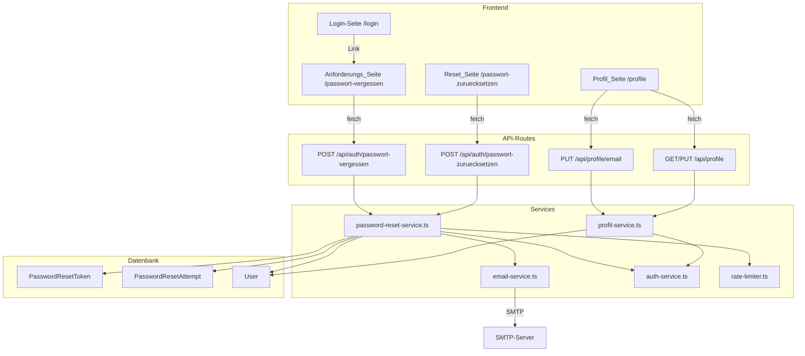
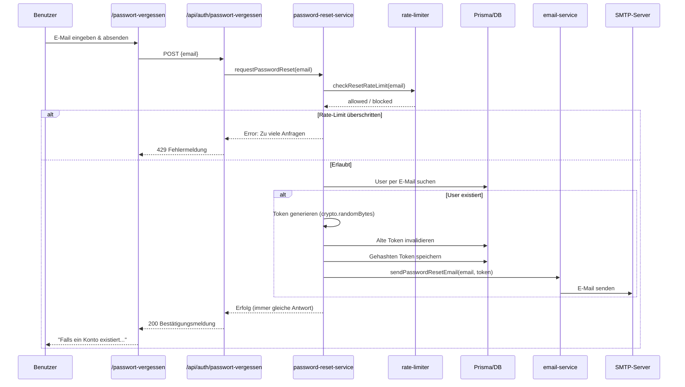
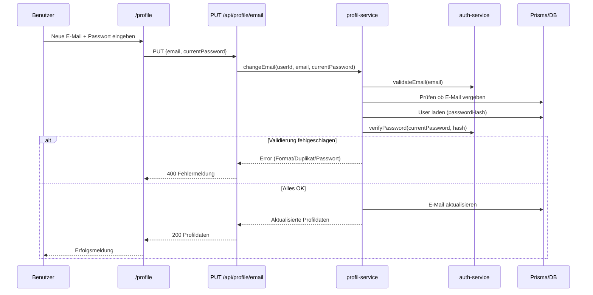

# Design: Passwort-Rücksetzung per E-Mail & E-Mail-Verwaltung im Profil

## Übersicht

Dieses Design beschreibt die technische Umsetzung der Self-Service-Passwort-Rücksetzung per E-Mail sowie der E-Mail-Anzeige und -Änderung auf der Profilseite für die Lyco-Anwendung.

Die Lösung umfasst:

1. **Neues Prisma-Modell `PasswordResetToken`** zur sicheren Speicherung gehashter Reset-Tokens mit Ablaufzeit.
2. **Neuer `password-reset-service.ts`** für Token-Erzeugung, Validierung und Passwort-Aktualisierung.
3. **Neuer `email-service.ts`** für SMTP-basierten E-Mail-Versand via `nodemailer`.
4. **Neue API-Routes** `/api/auth/passwort-vergessen` und `/api/auth/passwort-zuruecksetzen` (öffentlich, ohne Auth).
5. **Neue Frontend-Seiten** `/passwort-vergessen` und `/passwort-zuruecksetzen` unter dem `(auth)`-Layout.
6. **Rate-Limiting** für Rücksetzungsanfragen und Token-Validierungen (eigenes Modell `PasswordResetAttempt`).
7. **E-Mail-Feld auf der Profilseite** mit Anzeige und Änderungsmöglichkeit (Passwort-Bestätigung erforderlich).
8. **Login-Seite**: Neuer „Passwort vergessen?"-Link.
9. **SMTP-Umgebungsvariablen** in `.env.example` dokumentiert.

Die Implementierung folgt den bestehenden Architekturmustern: Next.js App Router, Prisma ORM, Service-Layer-Pattern, NextAuth.js mit JWT-Sessions.

## Architektur

### Gesamtarchitektur



### Datenfluss: Passwort-Rücksetzung anfordern



### Datenfluss: Neues Passwort setzen

```mermaid
sequenceDiagram
    participant U as Benutzer
    participant FE as /passwort-zuruecksetzen
    participant API as /api/auth/passwort-zuruecksetzen
    participant PRS as password-reset-service
    participant RL as rate-limiter
    participant AS as auth-service
    participant DB as Prisma/DB

    U->>FE: Link aus E-Mail öffnen
    FE-->>U: Formular anzeigen (Neues Passwort + Bestätigung)
    U->>FE: Passwort eingeben & absenden
    FE->>API: POST {token, password, confirmPassword}
    API->>PRS: resetPassword(token, password, confirmPassword)
    PRS->>RL: checkResetValidationRateLimit(token)
    RL-->>PRS: allowed / blocked
    PRS->>PRS: Token hashen (SHA-256)
    PRS->>DB: Token suchen (gehashter Wert)
    alt Token ungültig/abgelaufen/benutzt
        PRS-->>API: Error mit spezifischer Meldung
        API-->>FE: 400 Fehlermeldung
    else Token gültig
        PRS->>AS: validatePassword(password)
        PRS->>AS: hashPassword(password)
        PRS->>DB: User-Passwort aktualisieren
        PRS->>DB: Token als benutzt markieren
        PRS-->>API: Erfolg
        API-->>FE: 200 Erfolgsmeldung
        FE-->>U: "Passwort zurückgesetzt" + Link zu /login
    end
```



### Datenfluss: E-Mail-Änderung im Profil



### Design-Entscheidungen

1. **SHA-256 für Token-Hashing**: Der Klartext-Token wird nur per E-Mail an den Benutzer gesendet. In der Datenbank wird nur der SHA-256-Hash gespeichert. Dadurch kann ein Datenbank-Leak keine gültigen Reset-Links offenlegen. SHA-256 ist hier ausreichend (kein bcrypt nötig), da die Tokens kryptographisch zufällig und nicht erratbar sind.

2. **Eigenes Rate-Limiting-Modell `PasswordResetAttempt`**: Statt das bestehende `LoginAttempt`-Modell zu erweitern, wird ein separates Modell verwendet. Dies hält die Concerns getrennt und erlaubt unterschiedliche Limits (3 Anfragen/15 Min für Requests, 5 Versuche/15 Min für Validierungen).

3. **Einheitliche Antwort bei Anforderung**: Unabhängig davon, ob die E-Mail existiert, wird immer dieselbe Bestätigungsmeldung angezeigt. Dies verhindert E-Mail-Enumeration.

4. **Separater API-Endpunkt für E-Mail-Änderung**: `/api/profile/email` statt Integration in den bestehenden PUT `/api/profile`, da die E-Mail-Änderung eine Passwort-Bestätigung erfordert und eine andere Validierungslogik hat.

5. **Token-Invalidierung bei Neuanforderung**: Wenn ein neuer Token angefordert wird, werden alle vorherigen ungenutzten Tokens des Benutzers invalidiert. Dies verhindert Token-Akkumulation und stellt sicher, dass nur der neueste Token gültig ist.

6. **Nodemailer für E-Mail-Versand**: Bewährte, gut getestete Bibliothek für SMTP-Versand in Node.js. Wird als einzige neue Dependency eingeführt.

7. **Seiten unter `(auth)`-Layout**: Die neuen Seiten `/passwort-vergessen` und `/passwort-zuruecksetzen` nutzen das bestehende `(auth)`-Layout mit zentriertem Card-Design, konsistent mit Login und Registrierung.

## Komponenten und Schnittstellen

### Neue Services

#### password-reset-service.ts

**Pfad:** `src/lib/services/password-reset-service.ts`

```typescript
// Passwort-Rücksetzung anfordern: Token erzeugen, alte invalidieren, E-Mail senden
export async function requestPasswordReset(email: string): Promise<void>

// Passwort zurücksetzen: Token validieren, Passwort hashen und speichern
export async function resetPassword(
  token: string,
  newPassword: string,
  confirmPassword: string
): Promise<void>

// Token hashen (SHA-256) — intern
function hashToken(token: string): string

// Kryptographisch sicheren Token generieren — intern
function generateToken(): string
```

Logik in `requestPasswordReset`:
1. Rate-Limit prüfen (3 Anfragen / 15 Min pro E-Mail)
2. User per E-Mail suchen
3. Falls User existiert: Token generieren, alte Tokens invalidieren, gehashten Token speichern, E-Mail senden
4. Falls User nicht existiert: Keine Aktion, aber gleiche Antwort (kein Fehler)

Logik in `resetPassword`:
1. Rate-Limit prüfen (5 Versuche / 15 Min pro Token-Hash)
2. Token hashen und in DB suchen
3. Prüfen: nicht benutzt (`usedAt === null`), nicht abgelaufen (`expiresAt > now`)
4. Passwort validieren (min. 8 Zeichen) und Bestätigung prüfen
5. Passwort hashen (bcrypt) und im User-Modell speichern
6. Token als benutzt markieren (`usedAt = now`)

#### email-service.ts

**Pfad:** `src/lib/services/email-service.ts`

```typescript
// E-Mail über SMTP versenden
export async function sendEmail(options: SendEmailOptions): Promise<void>

// Passwort-Rücksetzungs-E-Mail senden (Convenience-Funktion)
export async function sendPasswordResetEmail(
  to: string,
  resetToken: string
): Promise<void>

interface SendEmailOptions {
  to: string;
  subject: string;
  html: string;
  text?: string;
}
```

Konfiguration über Umgebungsvariablen:
- `SMTP_HOST` — SMTP-Server-Hostname
- `SMTP_PORT` — SMTP-Port (Standard: 587)
- `SMTP_USER` — SMTP-Benutzername
- `SMTP_PASS` — SMTP-Passwort
- `EMAIL_FROM` — Absenderadresse (z.B. `noreply@lyco.app`)

### Neue API-Routes

#### /api/auth/passwort-vergessen/route.ts

**Pfad:** `src/app/api/auth/passwort-vergessen/route.ts`

| Methode | Beschreibung | Auth | Request Body | Response |
| ------- | ------------ | ---- | ------------ | -------- |
| POST | Rücksetzungslink anfordern | Nein | `{ email: string }` | `{ message: string }` |

Fehler-Responses:
- 400: Ungültiges E-Mail-Format
- 429: Rate-Limit überschritten
- 500: SMTP-Konfigurationsfehler

#### /api/auth/passwort-zuruecksetzen/route.ts

**Pfad:** `src/app/api/auth/passwort-zuruecksetzen/route.ts`

| Methode | Beschreibung | Auth | Request Body | Response |
| ------- | ------------ | ---- | ------------ | -------- |
| POST | Neues Passwort setzen | Nein | `{ token: string, password: string, confirmPassword: string }` | `{ message: string }` |

Fehler-Responses:
- 400: Ungültiger/abgelaufener/benutzter Token, Passwort-Validierungsfehler
- 429: Rate-Limit überschritten
- 500: Interner Fehler

#### /api/profile/email/route.ts

**Pfad:** `src/app/api/profile/email/route.ts`

| Methode | Beschreibung | Auth | Request Body | Response |
| ------- | ------------ | ---- | ------------ | -------- |
| PUT | E-Mail-Adresse ändern | Ja | `{ email: string, currentPassword: string }` | `{ profile: ProfileData }` |

Fehler-Responses:
- 400: Ungültiges Format, E-Mail vergeben, falsches Passwort
- 401: Nicht authentifiziert
- 500: Interner Fehler

### Neue Frontend-Seiten

#### Anforderungs_Seite (Passwort vergessen)

**Pfad:** `src/app/(auth)/passwort-vergessen/page.tsx`

Client-Komponente im `(auth)`-Layout mit:
- Überschrift: „Passwort vergessen"
- E-Mail-Eingabefeld
- Absende-Button
- Bestätigungsmeldung nach Absenden
- Link zurück zur Login-Seite

State:
- `email: string`
- `loading: boolean`
- `submitted: boolean` — nach erfolgreichem Absenden wird das Formular durch die Bestätigungsmeldung ersetzt
- `error: string | null`

#### Reset_Seite (Passwort zurücksetzen)

**Pfad:** `src/app/(auth)/passwort-zuruecksetzen/page.tsx`

Client-Komponente im `(auth)`-Layout mit:
- Token aus URL-Query-Parameter `?token=...` lesen
- Falls kein Token: Fehlermeldung „Ungültiger oder abgelaufener Rücksetzungslink."
- Formular: „Neues Passwort" + „Neues Passwort bestätigen"
- Absende-Button
- Erfolgsmeldung mit Link zur Login-Seite

State:
- `password: string`
- `confirmPassword: string`
- `loading: boolean`
- `success: boolean`
- `error: string | null`

### Geänderte Komponenten

#### Login-Seite

**Pfad:** `src/app/(auth)/login/page.tsx`

Änderung: Neuer Link „Passwort vergessen?" zwischen dem Passwort-Feld und dem Anmelde-Button, der auf `/passwort-vergessen` verweist.

#### Profil-Seite

**Pfad:** `src/app/(main)/profile/page.tsx`

Änderungen:
- Neues E-Mail-Anzeigefeld im Profildaten-Formular (read-only Anzeige der aktuellen E-Mail)
- Neuer Abschnitt „E-Mail-Adresse ändern" mit Feldern: Neue E-Mail, Aktuelles Passwort
- Separater Submit für E-Mail-Änderung

Neuer State:
- `emailForm: { email: string, currentPassword: string }`
- `emailSaving: boolean`
- `emailError: string | null`
- `emailSuccess: string | null`

#### profil-service.ts

**Pfad:** `src/lib/services/profil-service.ts`

Neue Funktion:

```typescript
// E-Mail-Adresse ändern (mit Passwort-Bestätigung)
export async function changeEmail(
  userId: string,
  newEmail: string,
  currentPassword: string
): Promise<ProfileData>
```

Logik:
1. E-Mail-Format validieren (`validateEmail`)
2. Prüfen ob E-Mail bereits vergeben (`isEmailTaken`)
3. User laden und Passwort verifizieren (`verifyPassword`)
4. E-Mail im User-Modell aktualisieren
5. Aktualisierte Profildaten zurückgeben

## Datenmodelle

### Prisma-Schema-Erweiterungen

#### Neues Modell: PasswordResetToken

```prisma
model PasswordResetToken {
  id        String    @id @default(cuid())
  token     String    // SHA-256-Hash des Klartext-Tokens
  userId    String
  expiresAt DateTime
  usedAt    DateTime?
  createdAt DateTime  @default(now())

  user User @relation(fields: [userId], references: [id], onDelete: Cascade)

  @@index([token])
  @@index([userId])
  @@map("password_reset_tokens")
}
```

#### Neues Modell: PasswordResetAttempt

```prisma
model PasswordResetAttempt {
  id        String   @id @default(cuid())
  email     String   // E-Mail oder Token-Hash als Identifier
  type      String   // "request" oder "validation"
  createdAt DateTime @default(now())

  @@index([email, type, createdAt])
  @@map("password_reset_attempts")
}
```

#### User-Modell (Erweiterung der Relation)

```prisma
model User {
  // ... bestehende Felder ...
  passwordResetTokens PasswordResetToken[]
}
```

### TypeScript-Typen

#### Neue Typen in `src/types/password-reset.ts`

```typescript
export interface RequestPasswordResetInput {
  email: string;
}

export interface ResetPasswordInput {
  token: string;
  password: string;
  confirmPassword: string;
}
```

#### Erweiterung in `src/types/profile.ts`

```typescript
export interface ChangeEmailInput {
  email: string;
  currentPassword: string;
}
```

### Umgebungsvariablen

Neue Einträge in `.env.example`:

```env
# E-Mail / SMTP
SMTP_HOST=smtp.example.com
SMTP_PORT=587
SMTP_USER=
SMTP_PASS=
EMAIL_FROM=noreply@lyco.app
```


## Correctness Properties

*Eine Property ist eine Eigenschaft oder ein Verhalten, das über alle gültigen Ausführungen eines Systems hinweg gelten sollte — im Wesentlichen eine formale Aussage darüber, was das System tun soll. Properties dienen als Brücke zwischen menschenlesbaren Spezifikationen und maschinenverifizierbaren Korrektheitsgarantien.*

### Property 1: Token wird als Hash gespeichert, nicht als Klartext

*Für jeden* zufällig generierten Reset-Token soll der in der Datenbank gespeicherte Wert dem SHA-256-Hash des Klartext-Tokens entsprechen und NICHT dem Klartext-Token selbst.

**Validates: Requirements 1.2**

### Property 2: Token-Ablaufzeit ist 60 Minuten nach Erstellung

*Für jeden* erstellten PasswordResetToken soll die Differenz zwischen `expiresAt` und `createdAt` genau 60 Minuten betragen.

**Validates: Requirements 1.3**

### Property 3: Neuer Token invalidiert alle vorherigen Token

*Für jeden* Benutzer mit beliebig vielen bestehenden ungenutzten Tokens soll nach Erstellung eines neuen Tokens nur der neueste Token gültig sein — alle vorherigen Tokens sollen als ungültig markiert sein (d.h. `usedAt` ist gesetzt).

**Validates: Requirements 1.4**

### Property 4: Einheitliche Antwort verhindert E-Mail-Enumeration

*Für jede* E-Mail-Adresse (registriert oder nicht registriert) soll der Endpunkt `/api/auth/passwort-vergessen` denselben HTTP-Statuscode und dieselbe Antwortnachricht zurückgeben.

**Validates: Requirements 2.3, 2.4**

### Property 5: Reset-E-Mail enthält korrekten Betreff und Link-Format

*Für jeden* ausgelösten Passwort-Reset soll die versendete E-Mail den Betreff „Lyco – Passwort zurücksetzen" haben und der Body soll einen Link im Format `{BASE_URL}/passwort-zuruecksetzen?token={token}` enthalten, wobei `{token}` der Klartext-Token ist.

**Validates: Requirements 2.5**

### Property 6: Ungültiges E-Mail-Format wird abgelehnt

*Für jeden* String, der kein gültiges E-Mail-Format hat (gemäß der bestehenden `validateEmail`-Regex), soll sowohl der Reset-Anforderungs-Endpunkt als auch die E-Mail-Änderung im Profil die Anfrage mit einem Validierungsfehler ablehnen.

**Validates: Requirements 4.3, 7.2**

### Property 7: Passwort-Reset Round-Trip

*Für jeden* gültigen Token und jedes gültige Passwort (≥ 8 Zeichen) soll nach erfolgreichem Reset das neue Passwort per `verifyPassword` gegen den gespeicherten Hash verifizierbar sein.

**Validates: Requirements 3.3**

### Property 8: Ungültiges Passwort wird beim Reset abgelehnt

*Für jedes* Passwort-Paar, bei dem entweder das Passwort kürzer als 8 Zeichen ist oder Passwort und Bestätigung nicht übereinstimmen, soll der Reset abgelehnt werden und der bestehende Passwort-Hash des Benutzers unverändert bleiben.

**Validates: Requirements 3.4, 3.5**

### Property 9: Token ist nur einmal verwendbar

*Für jeden* erfolgreich verwendeten Token soll ein zweiter Verwendungsversuch mit demselben Token abgelehnt werden, unabhängig davon, ob ein gültiges Passwort angegeben wird.

**Validates: Requirements 3.6**

### Property 10: Rate-Limiting für Reset-Anforderungen

*Für jede* E-Mail-Adresse sollen nach 3 Rücksetzungsanfragen innerhalb von 15 Minuten alle weiteren Anfragen abgelehnt werden, bis das Zeitfenster abgelaufen ist.

**Validates: Requirements 5.1**

### Property 11: Rate-Limiting für Token-Validierungen

*Für jeden* Token sollen nach 5 fehlgeschlagenen Validierungsversuchen innerhalb von 15 Minuten alle weiteren Versuche abgelehnt werden, bis das Zeitfenster abgelaufen ist.

**Validates: Requirements 5.2**

### Property 12: E-Mail-Änderung wird bei falschem Passwort oder Duplikat abgelehnt

*Für jede* E-Mail-Änderungsanfrage, bei der entweder das angegebene Passwort nicht korrekt ist oder die neue E-Mail-Adresse bereits von einem anderen Benutzer verwendet wird, soll die Änderung abgelehnt werden und die E-Mail-Adresse des Benutzers unverändert bleiben.

**Validates: Requirements 7.3, 7.5, 7.6**

### Property 13: E-Mail-Änderung Round-Trip

*Für jede* gültige, noch nicht vergebene E-Mail-Adresse und korrektes Passwort soll nach erfolgreicher Änderung die E-Mail-Adresse im Profil der neuen Adresse entsprechen.

**Validates: Requirements 7.4**

## Fehlerbehandlung

### API-Fehler-Responses

Alle API-Endpunkte folgen dem bestehenden Fehler-Pattern der Anwendung:

| Szenario | HTTP-Status | Antwort |
| -------- | ----------- | ------- |
| Ungültiges E-Mail-Format (Reset-Anforderung) | 400 | `{ error: "Ungültige E-Mail-Adresse" }` |
| Rate-Limit überschritten (Anforderung) | 429 | `{ error: "Zu viele Anfragen. Bitte warte einige Minuten und versuche es erneut." }` |
| Rate-Limit überschritten (Validierung) | 429 | `{ error: "Zu viele Versuche. Bitte warte einige Minuten." }` |
| Token ungültig/nicht gefunden | 400 | `{ error: "Ungültiger oder abgelaufener Rücksetzungslink." }` |
| Token abgelaufen | 400 | `{ error: "Der Rücksetzungslink ist abgelaufen. Bitte fordere einen neuen Link an." }` |
| Token bereits verwendet | 400 | `{ error: "Dieser Rücksetzungslink wurde bereits verwendet." }` |
| Passwörter stimmen nicht überein | 400 | `{ error: "Passwörter stimmen nicht überein." }` |
| Passwort zu kurz | 400 | `{ error: "Passwort muss mindestens 8 Zeichen lang sein" }` |
| E-Mail bereits vergeben (Profil) | 400 | `{ error: "Diese E-Mail-Adresse wird bereits verwendet." }` |
| Falsches Passwort (E-Mail-Änderung) | 400 | `{ error: "Passwort ist falsch." }` |
| Nicht authentifiziert (Profil-Endpunkte) | 401 | `{ error: "Nicht authentifiziert" }` |
| SMTP-Konfiguration fehlt | 500 | `{ error: "Interner Serverfehler" }` (Details nur im Server-Log) |

### Service-Level-Fehler

- **password-reset-service.ts**: Wirft `Error` mit beschreibenden Meldungen, die von den API-Routes in HTTP-Responses übersetzt werden.
- **email-service.ts**: Wirft `Error` bei fehlender SMTP-Konfiguration oder Sendefehler. Fehler werden im Server-Log protokolliert, dem Benutzer wird nur „Interner Serverfehler" angezeigt.
- **profil-service.ts** (changeEmail): Wirft `Error` bei Validierungsfehlern (Format, Duplikat, falsches Passwort).

### Sicherheitsaspekte

- Keine Preisgabe, ob eine E-Mail registriert ist (einheitliche Antwort)
- Token-Hashing in der Datenbank (SHA-256)
- Rate-Limiting gegen Brute-Force und Spam
- Passwort-Bestätigung bei E-Mail-Änderung
- SMTP-Credentials nur in Umgebungsvariablen, nie im Code

## Teststrategie

### Dualer Testansatz

Die Teststrategie kombiniert Unit-Tests und Property-Based-Tests für umfassende Abdeckung:

- **Unit-Tests**: Spezifische Beispiele, Edge-Cases, Integrationspunkte
- **Property-Tests**: Universelle Eigenschaften über alle gültigen Eingaben

### Property-Based Testing

**Bibliothek:** `fast-check` (bereits im Projekt als Dependency vorhanden)

**Konfiguration:**
- Minimum 100 Iterationen pro Property-Test
- Jeder Test referenziert die zugehörige Design-Property per Kommentar

**Tag-Format:** `Feature: profile-email-password-reset, Property {number}: {property_text}`

Jede Correctness Property (1–13) wird durch genau einen Property-Based-Test implementiert.

### Unit-Tests

Unit-Tests decken folgende Bereiche ab:

- **API-Route-Tests**: HTTP-Statuscode und Response-Format für jeden Endpunkt (passwort-vergessen, passwort-zuruecksetzen, profile/email)
- **Edge-Cases**: Fehlende Token-Parameter, abgelaufene Tokens, bereits verwendete Tokens, fehlende SMTP-Konfiguration
- **UI-Beispiele**: Login-Seite enthält „Passwort vergessen?"-Link, Reset-Seite zeigt Formular/Fehlermeldung korrekt an
- **Integration**: E-Mail-Service wird bei gültiger Anfrage aufgerufen, Token wird in DB gespeichert

### Testdateien

```
__tests__/
  auth/
    password-reset-request-api.test.ts      # Unit: POST /api/auth/passwort-vergessen
    password-reset-api.test.ts              # Unit: POST /api/auth/passwort-zuruecksetzen
    password-reset-token-hash.property.test.ts    # Property 1: Token-Hashing
    password-reset-token-expiry.property.test.ts  # Property 2: Token-Ablaufzeit
    password-reset-token-invalidation.property.test.ts # Property 3: Token-Invalidierung
    password-reset-enumeration.property.test.ts   # Property 4: Keine E-Mail-Enumeration
    password-reset-email-format.property.test.ts  # Property 5: E-Mail-Format
    email-validation.property.test.ts             # Property 6: E-Mail-Validierung
    password-reset-roundtrip.property.test.ts     # Property 7: Reset Round-Trip
    password-reset-validation.property.test.ts    # Property 8: Passwort-Validierung
    password-reset-single-use.property.test.ts    # Property 9: Einmalverwendung
    password-reset-rate-limit-request.property.test.ts  # Property 10: Rate-Limit Anforderung
    password-reset-rate-limit-validation.property.test.ts # Property 11: Rate-Limit Validierung
  profile/
    email-change-api.test.ts                # Unit: PUT /api/profile/email
    email-change-rejection.property.test.ts # Property 12: E-Mail-Änderung Ablehnung
    email-change-roundtrip.property.test.ts # Property 13: E-Mail-Änderung Round-Trip
```
