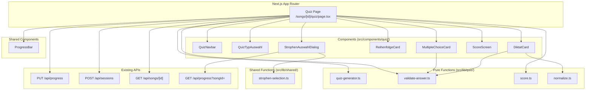
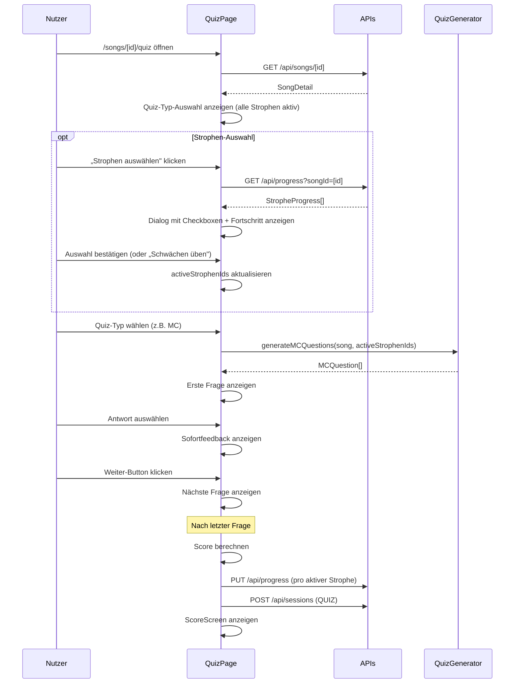
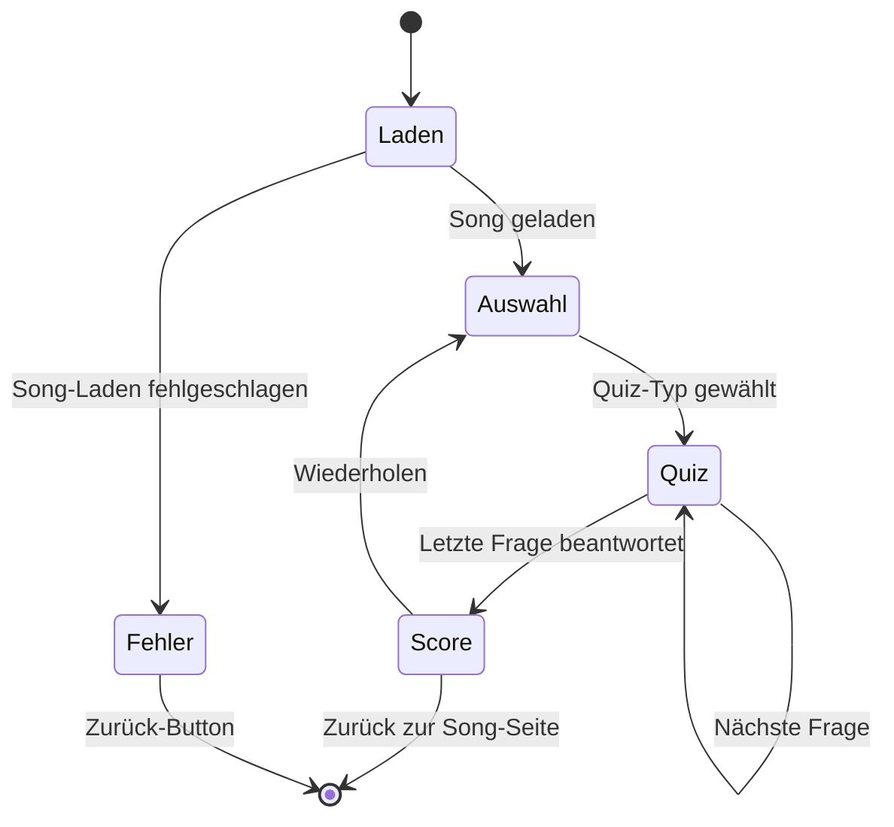

# Design-Dokument: Quiz-Lernmodus

## Übersicht

Der Quiz-Lernmodus ergänzt die bestehenden Lernmethoden (Lückentext, Emotional, Rückwärts, Zeile-für-Zeile, Spaced Repetition) um drei interaktive Quiz-Typen: **Multiple Choice**, **Reihenfolge (Drag & Drop)** und **Diktat**. Jeder Typ adressiert eine andere kognitive Ebene des Textlernens.

Die Architektur folgt dem etablierten Muster der Cloze-Lernmethode:
- Eine `"use client"` Page-Komponente unter `/songs/[id]/quiz`
- Reine Funktionen im `src/lib/quiz/`-Verzeichnis für die Fragengenerierung und Auswertung
- UI-Komponenten unter `src/components/quiz/`
- Integration mit den bestehenden Progress- und Session-APIs

### Designentscheidungen

1. **Quiz-Generator als reine Funktionen**: Alle Algorithmen zur Fragengenerierung, Antwortvalidierung und Score-Berechnung werden als reine, zustandslose Funktionen implementiert. Das ermöglicht einfaches Property-Based Testing und Determinismus durch Seeded Random.
2. **State-Management via useState/useCallback**: Wie bei der Cloze-Seite wird der gesamte Quiz-State lokal in der Page-Komponente verwaltet. Kein globaler State-Store nötig.
3. **Bestehende APIs wiederverwenden**: Fortschritt (`PUT /api/progress`) und Sessions (`POST /api/sessions`) werden unverändert genutzt. Kein neues Backend nötig.
4. **Drag & Drop mit Tastatur-Alternative**: Die Reihenfolge-Karte nutzt native HTML Drag & Drop Events mit einer Pfeil-Tasten-Alternative für Barrierefreiheit.
5. **Strophen-Auswahl wie Cloze**: Die Strophen-Auswahl wird als wiederverwendbarer Dialog implementiert, analog zum bestehenden `StrophenAuswahlDialog` der Cloze-Methode. Freie Auswahl per Checkbox und fortschrittsbasierte Auswahl („Schwächen üben") werden unterstützt. Die Auswahl-Logik (`getWeakStrophenIds`, `hasWeaknesses`) aus `src/lib/cloze/strophen-selection.ts` wird nach `src/lib/shared/strophen-selection.ts` verschoben und von beiden Lernmethoden genutzt.

## Architektur



### Datenfluss



## Komponenten und Schnittstellen

### Seite

**`src/app/(main)/songs/[id]/quiz/page.tsx`** — Client-Komponente

State:
```typescript
const [song, setSong] = useState<SongDetail | null>(null);
const [quizTyp, setQuizTyp] = useState<QuizTyp | null>(null);
const [questions, setQuestions] = useState<QuizQuestion[]>([]);
const [currentIndex, setCurrentIndex] = useState(0);
const [answers, setAnswers] = useState<QuizAnswer[]>([]);
const [phase, setPhase] = useState<'auswahl' | 'quiz' | 'score'>('auswahl');
const [loading, setLoading] = useState(true);
const [error, setError] = useState<string | null>(null);
const [activeStrophenIds, setActiveStrophenIds] = useState<Set<string> | null>(null);
const [dialogOpen, setDialogOpen] = useState(false);
```

### Komponenten

| Komponente | Pfad | Props |
|---|---|---|
| `QuizNavbar` | `src/components/quiz/quiz-navbar.tsx` | `songId, songTitle` |
| `QuizTypAuswahl` | `src/components/quiz/quiz-typ-auswahl.tsx` | `onSelect: (typ: QuizTyp) => void` |
| `MultipleChoiceCard` | `src/components/quiz/multiple-choice-card.tsx` | `question: MCQuestion, onAnswer: (optionIndex: number) => void, onWeiter: () => void` |
| `ReihenfolgeCard` | `src/components/quiz/reihenfolge-card.tsx` | `question: ReihenfolgeQuestion, onSubmit: (order: string[]) => void, onWeiter: () => void` |
| `DiktatCard` | `src/components/quiz/diktat-card.tsx` | `question: DiktatQuestion, onSubmit: (text: string) => void, onWeiter: () => void` |
| `ScoreScreen` | `src/components/quiz/score-screen.tsx` | `correct: number, total: number, songId: string, onRepeat: () => void` |
| `StrophenAuswahlDialog` | `src/components/quiz/strophen-auswahl-dialog.tsx` | `songId: string, strophen: StropheDetail[], activeStrophenIds: Set<string>, open: boolean, onConfirm: (selectedIds: Set<string>) => void, onCancel: () => void` |

### Reine Funktionen

| Funktion | Pfad | Signatur |
|---|---|---|
| `generateMCQuestions` | `src/lib/quiz/quiz-generator.ts` | `(song: SongDetail, activeStrophenIds?: Set<string>, seed?: number) => MCQuestion[]` |
| `generateReihenfolgeQuestions` | `src/lib/quiz/quiz-generator.ts` | `(song: SongDetail, activeStrophenIds?: Set<string>, seed?: number) => ReihenfolgeQuestion[]` |
| `generateDiktatQuestions` | `src/lib/quiz/quiz-generator.ts` | `(song: SongDetail, activeStrophenIds?: Set<string>, seed?: number) => DiktatQuestion[]` |
| `shuffleArray` | `src/lib/quiz/quiz-generator.ts` | `<T>(arr: T[], rng: () => number) => T[]` |
| `collectWords` | `src/lib/quiz/quiz-generator.ts` | `(song: SongDetail, activeStrophenIds?: Set<string>) => string[]` |
| `filterActiveStrophen` | `src/lib/quiz/quiz-generator.ts` | `(song: SongDetail, activeStrophenIds?: Set<string>) => StropheDetail[]` |
| `normalizeText` | `src/lib/quiz/normalize.ts` | `(text: string) => string` |
| `validateDiktat` | `src/lib/quiz/validate-answer.ts` | `(input: string, target: string) => { correct: boolean, diff: DiffSegment[] }` |
| `calculateScore` | `src/lib/quiz/score.ts` | `(answers: QuizAnswer[]) => { correct: number, total: number, prozent: number }` |
| `calculateStropheScores` | `src/lib/quiz/score.ts` | `(answers: QuizAnswer[], song: SongDetail) => Map<string, number>` |
| `getEmpfehlung` | `src/lib/quiz/score.ts` | `(prozent: number) => 'nochmal' \| 'weiter'` |
| `getWeakStrophenIds` | `src/lib/shared/strophen-selection.ts` | `(progress: StropheProgress[]) => Set<string>` |
| `hasWeaknesses` | `src/lib/shared/strophen-selection.ts` | `(progress: StropheProgress[]) => boolean` |

## Datenmodelle

### Quiz-Typen

```typescript
// src/types/quiz.ts

export type QuizTyp = 'multiple-choice' | 'reihenfolge' | 'diktat';

export interface MCQuestion {
  id: string;
  stropheId: string;
  zeileId: string;
  /** Der Zeilentext bis zur Lücke, z.B. "I walk a lonely ___" */
  prompt: string;
  /** Die 4 Antwortoptionen (gemischt) */
  options: string[];
  /** Index der korrekten Antwort in options[] */
  correctIndex: number;
}

export interface ReihenfolgeQuestion {
  id: string;
  stropheId: string;
  stropheName: string;
  /** Zeilen in zufälliger Reihenfolge */
  shuffledZeilen: { zeileId: string; text: string }[];
  /** Korrekte Reihenfolge der zeileIds */
  correctOrder: string[];
}

export interface DiktatQuestion {
  id: string;
  stropheId: string;
  stropheName: string;
  zeileId: string;
  /** Der Originaltext der Zeile */
  originalText: string;
}

export type QuizQuestion = MCQuestion | ReihenfolgeQuestion | DiktatQuestion;

export interface QuizAnswer {
  questionId: string;
  stropheId: string;
  correct: boolean;
}

export interface DiffSegment {
  text: string;
  type: 'correct' | 'incorrect' | 'missing';
}
```

### State-Maschine



### Algorithmus: Multiple-Choice-Generierung

1. Aktive Strophen filtern (nur `activeStrophenIds`, falls gesetzt; sonst alle)
2. Alle Zeilen der aktiven Strophen sammeln (Strophen ohne Zeilen überspringen)
3. Alle einzigartigen Wörter der aktiven Strophen sammeln (Wortpool für Distraktoren)
4. Pro Zeile: zufällige Position wählen → Prompt = Text bis Position, korrekte Antwort = Wort an Position
5. 3 Distraktoren aus dem Wortpool wählen (nicht identisch mit korrektem Wort)
6. Falls Wortpool < 4 einzigartige Wörter: Distraktoren durch Wiederholung auffüllen
7. 4 Optionen mischen (seeded random für Determinismus)

### Algorithmus: Reihenfolge-Generierung

1. Aktive Strophen filtern (nur `activeStrophenIds`, falls gesetzt; sonst alle)
2. Strophen mit ≥ 2 Zeilen filtern
3. Pro Strophe: Zeilen per seeded random mischen
4. Korrekte Reihenfolge = `orderIndex`-Sortierung

### Algorithmus: Diktat-Generierung

1. Aktive Strophen filtern (nur `activeStrophenIds`, falls gesetzt; sonst alle)
2. Alle Zeilen der aktiven Strophen sammeln (leere Strophen überspringen)
3. Pro Zeile: Strophen-Name als Kontext, Originaltext als Ziel

### Algorithmus: Diktat-Vergleich (Diff)

1. Eingabe und Original normalisieren (trim, lowercase)
2. Wortweiser Vergleich: Eingabe-Wörter gegen Original-Wörter
3. Übereinstimmende Wörter → `correct`, abweichende → `incorrect`, fehlende → `missing`
4. Gesamtbewertung: korrekt wenn normalisierter Text exakt übereinstimmt

### Algorithmus: Fortschrittsberechnung

1. Pro aktiver Strophe: Anteil korrekt beantworteter Fragen berechnen → `prozent`
2. `PUT /api/progress` nur für aktive (ausgewählte) Strophen mit dem berechneten Prozentwert
3. `POST /api/sessions` mit `lernmethode: "QUIZ"`

### Algorithmus: Strophen-Auswahl

1. Beim Laden: alle Strophen-IDs als `activeStrophenIds` setzen
2. Dialog öffnen: `GET /api/progress?songId=[id]` laden → Fortschritt pro Strophe anzeigen
3. „Schwächen üben": `getWeakStrophenIds(progress)` aufrufen (Schwelle: 80%) → nur schwache Strophen auswählen
4. Bestätigung: `activeStrophenIds` aktualisieren → Quiz-Generator nutzt nur aktive Strophen
5. Auswahl bleibt bei Quiz-Typ-Wechsel und Wiederholung erhalten

