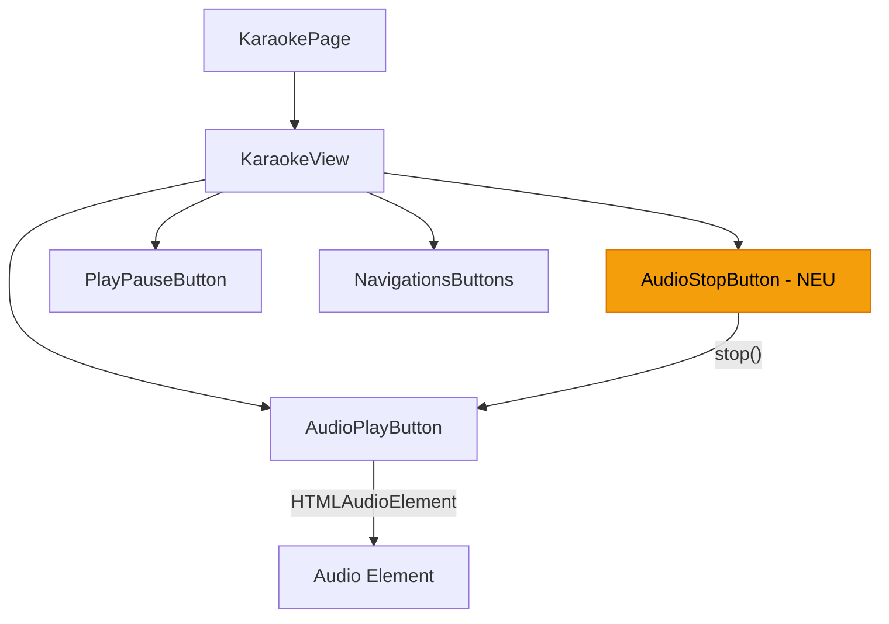
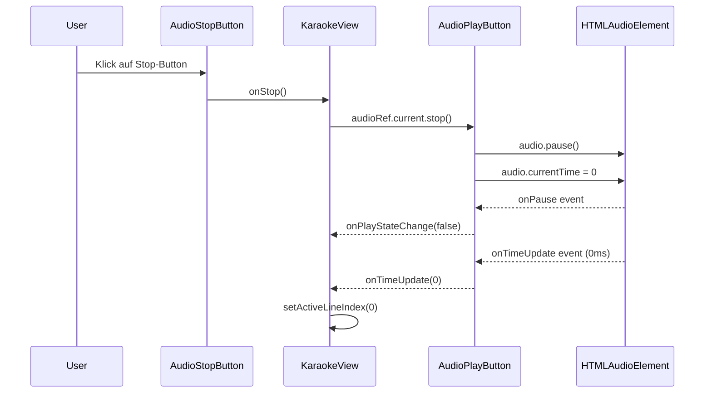

# Design Document: Reading Mode Stop Button (Lesemodus Stopp-Button)

## Overview

Die Player-Steuerung im Lesemodus (Karaoke-Ansicht) erhält einen Stop-Button mit Viereck-Icon (■), der die Audio-Wiedergabe stoppt und die Abspielposition auf den Anfang (0 ms) zurücksetzt. Dieser Button unterscheidet sich vom bestehenden Pause-Button, der die Wiedergabe nur unterbricht, ohne die Position zu verändern.

Der Stop-Button wird in die bestehende Steuerungsleiste der `KaraokeView`-Komponente integriert, direkt neben dem vorhandenen `AudioPlayButton`. Die Implementierung erweitert das `AudioPlayButtonHandle`-Interface um eine `stop()`-Methode und fügt einen neuen `AudioStopButton`-Komponenten hinzu, der dem visuellen Stil der bestehenden Karaoke-Buttons folgt (runde, 44×44px Touch-Targets, weiße Icons auf transparentem Hintergrund).

## Architecture



## Sequence Diagrams

### Stop-Button Interaktion



## Components and Interfaces

### Component 1: AudioStopButton (NEU)

**Purpose**: Rendert einen Stop-Button (■-Icon) für die Karaoke-Steuerungsleiste. Ruft die übergebene `onStop`-Callback-Funktion auf.

**Interface**:
```typescript
interface AudioStopButtonProps {
  onStop: () => void;
  disabled?: boolean;
}

export function AudioStopButton({ onStop, disabled = false }: AudioStopButtonProps): JSX.Element;
```

**Responsibilities**:
- Rendert einen Button mit Viereck-Icon (■) im Karaoke-Button-Stil
- Ruft `onStop` bei Klick auf
- Unterstützt `disabled`-Zustand (wenn keine MP3-Quelle vorhanden)
- Erfüllt Accessibility-Anforderungen (aria-label, min 44×44px Touch-Target)

### Component 2: AudioPlayButton (Erweiterung)

**Purpose**: Bestehende Komponente wird um eine `stop()`-Methode im imperativen Handle erweitert.

**Interface-Erweiterung**:
```typescript
export interface AudioPlayButtonHandle {
  seekTo: (ms: number) => boolean;
  getCurrentTimeMs: () => number;
  getDurationMs: () => number;
  getIsPlaying: () => boolean;
  stop: () => void;  // NEU
}
```

**Neue Methode**:
- `stop()`: Pausiert die Wiedergabe und setzt `currentTime` auf 0

### Component 3: KaraokeView (Erweiterung)

**Purpose**: Bestehende Komponente wird um den Stop-Button in der Steuerungsleiste erweitert.

**Interface-Erweiterung**:
```typescript
interface KaraokeViewProps {
  // ... bestehende Props ...
  onStop: () => void;  // NEU
}
```

### Component 4: KaraokePage (Erweiterung)

**Purpose**: Bestehende Seite wird um die Stop-Handler-Logik erweitert.

**Neue Callback-Funktion**:
```typescript
const handleAudioStop = useCallback(() => {
  // 1. Stop audio via ref
  audioRef.current?.stop();
  // 2. Reset line index to beginning
  setActiveLineIndex(0);
  // 3. Pause auto-scroll if active
  pause();
}, [pause]);
```

## Data Models

Keine neuen Datenmodelle erforderlich. Die Änderung betrifft ausschließlich UI-Komponenten und deren Interaktion mit dem bestehenden `HTMLAudioElement`.

## Algorithmic Pseudocode

### Stop-Algorithmus

```typescript
function stop(): void {
  // Precondition: audioRef.current ist ein gültiges HTMLAudioElement
  const audio = audioRef.current;
  if (!audio) return;

  // 1. Wiedergabe pausieren (falls aktiv)
  if (!audio.paused) {
    audio.pause();
  }

  // 2. Position auf Anfang zurücksetzen
  audio.currentTime = 0;

  // Postcondition: audio.paused === true && audio.currentTime === 0
}
```

### KaraokePage Stop-Handler

```typescript
function handleAudioStop(): void {
  // Precondition: audioRef ist eine gültige Ref auf AudioPlayButtonHandle

  // 1. Audio stoppen und zurücksetzen
  audioRef.current?.stop();

  // 2. Aktive Zeile auf Anfang zurücksetzen
  setActiveLineIndex(0);

  // 3. Auto-Scroll pausieren
  pause();

  // Postcondition: 
  //   - Audio ist pausiert bei Position 0
  //   - Anzeige zeigt erste Zeile
  //   - Auto-Scroll ist deaktiviert
}
```

## Key Functions with Formal Specifications

### Function 1: AudioPlayButtonHandle.stop()

```typescript
stop(): void
```

**Preconditions:**
- `audioRef.current` ist ein gültiges `HTMLAudioElement` (oder null)
- Wenn `audioRef.current` null ist, ist die Funktion ein No-Op

**Postconditions:**
- `audio.paused === true`
- `audio.currentTime === 0`
- `isPlaying`-State ist `false`
- `onPlayStateChange` wurde mit `false` aufgerufen (via `onPause`-Event)
- `onTimeUpdate` wurde mit `0` aufgerufen (via `onTimeUpdate`-Event)

**Loop Invariants:** N/A

### Function 2: handleAudioStop()

```typescript
handleAudioStop(): void
```

**Preconditions:**
- `audioRef` ist eine gültige React-Ref
- `pause` (Auto-Scroll) ist eine gültige Callback-Funktion

**Postconditions:**
- Audio-Wiedergabe ist gestoppt und bei Position 0
- `activeLineIndex === 0`
- Auto-Scroll ist deaktiviert (`isPlaying === false`)

**Loop Invariants:** N/A

## Example Usage

### AudioStopButton in KaraokeView

```typescript
// In der Controls-Row der KaraokeView, neben dem AudioPlayButton:
<div className="flex items-center justify-center gap-3">
  {/* Audio play/pause button (MP3 only) */}
  <AudioPlayButton
    ref={ref}
    audioQuellen={song.audioQuellen}
    activeQuelleId={activeAudioQuelleId}
    onTimeUpdate={handleAudioTimeUpdate}
    onPlayStateChange={setIsAudioPlaying}
  />

  {/* NEU: Audio stop button */}
  <AudioStopButton
    onStop={onStop}
    disabled={!song.audioQuellen.some((q) => q.typ === "MP3")}
  />

  <PlayPauseButton
    isPlaying={isAutoScrolling}
    onToggle={onToggleAutoScroll}
  />

  <NavigationsButtons ... />
</div>
```

### Stop-Button SVG-Icon (Viereck)

```typescript
// Konsistent mit dem bestehenden Icon-Stil in AudioPlayButton
<svg
  width="24"
  height="24"
  viewBox="0 0 24 24"
  fill="currentColor"
  aria-hidden="true"
>
  <rect x="4" y="4" width="16" height="16" rx="2" />
</svg>
```

## Correctness Properties

1. **Stop setzt Position zurück**: ∀ Zustand s: nach `stop()` gilt `audio.currentTime === 0`
2. **Stop pausiert Wiedergabe**: ∀ Zustand s: nach `stop()` gilt `audio.paused === true`
3. **Stop ist idempotent**: Mehrfaches Aufrufen von `stop()` hat denselben Effekt wie einmaliges Aufrufen
4. **Stop setzt Zeilenanzeige zurück**: ∀ Zustand s: nach `handleAudioStop()` gilt `activeLineIndex === 0`
5. **Stop deaktiviert Auto-Scroll**: ∀ Zustand s: nach `handleAudioStop()` gilt `isAutoScrolling === false`
6. **Stop ohne Audio ist No-Op**: Wenn keine MP3-Quelle vorhanden ist, hat `stop()` keinen Effekt und wirft keinen Fehler
7. **Button-Sichtbarkeit**: Der Stop-Button wird nur angezeigt, wenn eine MP3-Audioquelle vorhanden ist (konsistent mit AudioPlayButton)

## Error Handling

### Error Scenario 1: Keine Audio-Quelle vorhanden

**Condition**: `audioQuellen` enthält keine MP3-Quelle
**Response**: `AudioStopButton` wird mit `disabled={true}` gerendert oder nicht angezeigt (konsistent mit `AudioPlayButton`, der `null` zurückgibt)
**Recovery**: Kein Recovery nötig — normaler Zustand

### Error Scenario 2: Audio-Element nicht geladen

**Condition**: `audioRef.current` ist `null` (Audio noch nicht initialisiert)
**Response**: `stop()` ist ein No-Op (Guard-Clause `if (!audio) return`)
**Recovery**: Automatisch — sobald Audio geladen ist, funktioniert der Button

### Error Scenario 3: Audio bereits gestoppt

**Condition**: Audio ist bereits pausiert und bei Position 0
**Response**: `stop()` setzt die Werte erneut (idempotent), keine sichtbare Änderung
**Recovery**: Kein Recovery nötig

## Testing Strategy

### Unit Testing Approach

- **AudioStopButton**: Rendert korrekt, ruft `onStop` bei Klick auf, respektiert `disabled`-Prop
- **AudioPlayButtonHandle.stop()**: Pausiert Audio und setzt `currentTime` auf 0
- **handleAudioStop**: Ruft `stop()`, setzt `activeLineIndex` auf 0, pausiert Auto-Scroll

### Property-Based Testing Approach

**Property Test Library**: fast-check

- **Idempotenz**: Für beliebige Ausgangszustände (playing/paused, beliebige Position) führt `stop()` immer zu `paused === true && currentTime === 0`
- **Zustandskonsistenz**: Nach `handleAudioStop()` sind Audio-Position, Zeilenanzeige und Auto-Scroll alle im Anfangszustand

### Integration Testing Approach

- Vollständiger Flow: Play → Stop → Verify Position 0 und erste Zeile angezeigt
- Stop während Auto-Scroll aktiv → Auto-Scroll wird deaktiviert
- Stop bei verschiedenen Abspiel-Positionen → Position immer 0

## Accessibility Considerations

- **aria-label**: `"Stopp"` (deutsch, konsistent mit bestehenden Labels)
- **Touch-Target**: Mindestens 44×44px (konsistent mit allen Karaoke-Buttons)
- **Tastatur**: Button ist per Tab erreichbar und per Enter/Space aktivierbar (Standard-Button-Verhalten)
- **Screen Reader**: Zustandsänderung wird über das bestehende `aria-live="polite"` Region kommuniziert

## Dependencies

- Keine neuen externen Abhängigkeiten
- Nutzt bestehende Patterns: `AudioPlayButtonHandle`, Karaoke-Button-Styling, SVG-Icons inline
