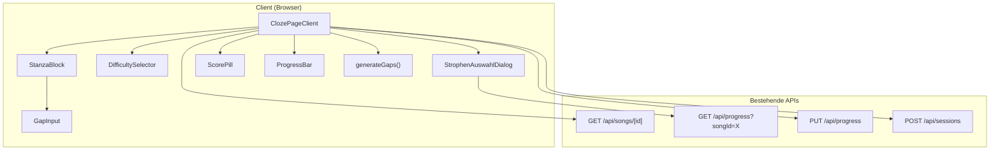
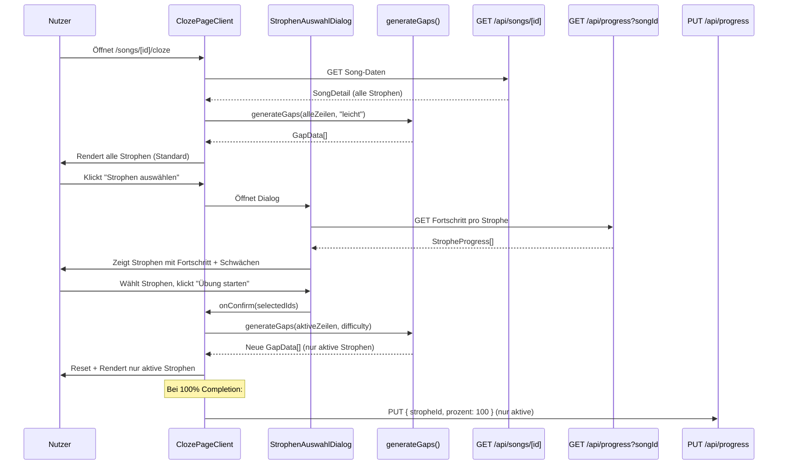

# Design Document – Selektive Lückentext-Übung (Selective Cloze Practice)

## Übersicht (Overview)

Das Feature erweitert die bestehende Cloze_Page um die Möglichkeit, gezielt einzelne Strophen für die Lückentext-Übung auszuwählen. Aktuell werden immer alle Strophen eines Songs geübt. Mit diesem Feature kann der Nutzer über einen modalen Strophen_Auswahl_Dialog Strophen an-/abwählen und erhält eine schwächenbasierte Empfehlung basierend auf dem gespeicherten Fortschritt.

### Kernentscheidungen

- **Client-seitiger State für Auswahl**: Die Strophen-Auswahl wird als `Set<string>` (Strophen-IDs) im Client-State der Cloze_Page verwaltet. Keine Persistierung der Auswahl nötig – sie gilt nur für die aktuelle Session.
- **Fortschritt via bestehende API**: Der Strophen_Auswahl_Dialog lädt den Fortschritt pro Strophe über `GET /api/progress?songId=X`. Die bestehende `StropheProgress`-Antwort enthält bereits `stropheId`, `stropheName` und `prozent` – genau das, was der Dialog braucht.
- **Keine neuen API-Routen**: Alle Daten sind über bestehende Endpunkte verfügbar. Der Dialog nutzt `GET /api/progress?songId=X` für Fortschrittsdaten und die Cloze_Page nutzt weiterhin `PUT /api/progress` und `POST /api/sessions`.
- **Neue Komponente, minimale Änderung an bestehender Page**: Der Strophen_Auswahl_Dialog wird als eigenständige Komponente implementiert. Die Cloze_Page erhält einen neuen State `activeStrophenIds` und filtert Strophen/Gaps entsprechend.
- **Schwelle als Konstante**: Die Fortschritts_Schwelle (80%) wird als exportierte Konstante definiert, damit sie in Tests referenziert werden kann.

## Architektur



### Datenfluss



## Komponenten und Schnittstellen (Components and Interfaces)

### Neue Komponente: StrophenAuswahlDialog

**Datei:** `src/components/cloze/strophen-auswahl-dialog.tsx`

```typescript
interface StrophenAuswahlDialogProps {
  songId: string;
  strophen: StropheDetail[];
  activeStrophenIds: Set<string>;
  open: boolean;
  onConfirm: (selectedIds: Set<string>) => void;
  onCancel: () => void;
}

export function StrophenAuswahlDialog(props: StrophenAuswahlDialogProps): JSX.Element
```

Verantwortlich für:
- Fortschritt pro Strophe laden via `GET /api/progress?songId=X`
- Strophen als Checkbox-Liste anzeigen (sortiert nach `orderIndex`)
- Schwächen_Indikator (orangefarbenes Label) bei Fortschritt < 80%
- „Alle auswählen" / „Alle abwählen" / „Schwächen üben" Buttons
- Validierung: mindestens 1 Strophe muss ausgewählt sein
- ARIA-Dialog mit Focus-Trap und Escape-Handling
- Responsive: Vollbild unter 640px, zentrierter Modal ab 640px

#### Interner State

```typescript
// Innerhalb der Komponente
const [localSelection, setLocalSelection] = useState<Set<string>>(activeStrophenIds);
const [progress, setProgress] = useState<StropheProgress[] | null>(null);
const [loadingProgress, setLoadingProgress] = useState(false);
const [validationError, setValidationError] = useState<string | null>(null);
```

### Neue Konstante

**Datei:** `src/lib/cloze/constants.ts`

```typescript
/** Strophen mit Fortschritt unter diesem Wert gelten als Schwäche */
export const WEAKNESS_THRESHOLD = 80;
```

### Änderungen an bestehender ClozePageClient

**Datei:** `src/app/(main)/songs/[id]/cloze/page.tsx`

Neue State-Variablen:
```typescript
const [activeStrophenIds, setActiveStrophenIds] = useState<Set<string> | null>(null);
const [dialogOpen, setDialogOpen] = useState(false);
```

Änderungen:
1. **Initialisierung**: Nach Song-Laden wird `activeStrophenIds` auf alle Strophen-IDs gesetzt (Standardverhalten beibehalten)
2. **Filterung**: `getZeilenFromSong` filtert nach `activeStrophenIds`
3. **Rendering**: `sortedStrophen` wird nach `activeStrophenIds` gefiltert
4. **Completion**: `persistCompletion` iteriert nur über aktive Strophen
5. **Schwierigkeitswechsel**: `handleDifficultyChange` behält `activeStrophenIds` bei
6. **Neuer Button**: „Strophen auswählen" oberhalb der StanzaBlocks
7. **Dialog-Integration**: `StrophenAuswahlDialog` wird eingebunden

Neue Handler:
```typescript
const handleStrophenConfirm = useCallback((selectedIds: Set<string>) => {
  setActiveStrophenIds(selectedIds);
  setDialogOpen(false);
  // Reset: Gaps neu generieren, Antworten/Feedback/Hints/Score zurücksetzen
  if (!song) return;
  const zeilen = song.strophen
    .filter(s => selectedIds.has(s.id))
    .flatMap(s => s.zeilen.map(z => ({ id: z.id, text: z.text })));
  const newGaps = generateGaps(zeilen, difficulty);
  setGaps(newGaps);
  setAnswers({});
  setFeedback({});
  setHints(new Set());
  completionFired.current = false;
  const totalGaps = newGaps.filter(g => g.isGap).length;
  setScore({ correct: 0, total: totalGaps });
}, [song, difficulty]);
```

### Hilfsfunktionen

**Datei:** `src/lib/cloze/strophen-selection.ts`

```typescript
import { WEAKNESS_THRESHOLD } from "./constants";
import type { StropheProgress } from "@/types/song";

/** Gibt die IDs aller Strophen mit Fortschritt < WEAKNESS_THRESHOLD zurück */
export function getWeakStrophenIds(progress: StropheProgress[]): Set<string> {
  return new Set(
    progress
      .filter(p => p.prozent < WEAKNESS_THRESHOLD)
      .map(p => p.stropheId)
  );
}

/** Prüft ob mindestens eine Strophe unter der Schwelle liegt */
export function hasWeaknesses(progress: StropheProgress[]): boolean {
  return progress.some(p => p.prozent < WEAKNESS_THRESHOLD);
}
```

## Datenmodelle (Data Models)

### Erweiterter Client-seitiger State

Der bestehende `ClozePageState` wird um folgende Felder erweitert:

```typescript
interface ClozePageState {
  // ... bestehende Felder ...
  activeStrophenIds: Set<string> | null;  // null = alle (Initialzustand)
  dialogOpen: boolean;
}
```

### Bestehende Typen (unverändert genutzt)

| Typ | Quelle | Verwendung |
|---|---|---|
| `SongDetail` | `src/types/song.ts` | Song mit allen Strophen |
| `StropheDetail` | `src/types/song.ts` | Strophe mit Zeilen, `progress`-Feld |
| `StropheProgress` | `src/types/song.ts` | Fortschritt pro Strophe (`stropheId`, `stropheName`, `prozent`) |
| `GapData` | `src/types/cloze.ts` | Lücken-Daten |
| `DifficultyLevel` | `src/types/cloze.ts` | Schwierigkeitsstufe |

### API-Interaktionen

| Endpunkt | Methode | Verwendung im Feature |
|---|---|---|
| `/api/songs/[id]` | GET | Song-Daten laden (bestehend) |
| `/api/progress?songId=X` | GET | Fortschritt pro Strophe für Dialog laden (bestehend) |
| `/api/progress` | PUT | Fortschritt nur für aktive Strophen speichern (bestehend, Aufruf-Logik geändert) |
| `/api/sessions` | POST | Session tracken (bestehend, unverändert) |

### Dialog-Datenfluss

```typescript
// Daten die der Dialog empfängt/lädt:
interface DialogData {
  strophen: StropheDetail[];           // aus Song-Daten (Props)
  progress: StropheProgress[];          // via GET /api/progress?songId
  activeStrophenIds: Set<string>;       // aktuelle Auswahl (Props)
}

// Daten die der Dialog zurückgibt:
type DialogResult = Set<string>;        // neue Auswahl an Strophen-IDs
```


## Correctness Properties

*Eine Property ist eine Eigenschaft oder ein Verhalten, das über alle gültigen Ausführungen eines Systems hinweg gelten sollte – im Wesentlichen eine formale Aussage darüber, was das System tun soll. Properties bilden die Brücke zwischen menschenlesbaren Spezifikationen und maschinell verifizierbaren Korrektheitsgarantien.*

### Property 1: Dialog zeigt alle Strophen mit korrekter Vorauswahl

*Für jeden* Song mit beliebig vielen Strophen und *jede* Menge aktiver Strophen-IDs soll der Strophen_Auswahl_Dialog genau eine Checkbox pro Strophe rendern, wobei genau die aktiven Strophen als checked dargestellt werden und alle anderen als unchecked.

**Validates: Requirements 1.3, 1.4**

### Property 2: Initiale Auswahl umfasst alle Strophen

*Für jeden* Song mit mindestens einer Strophe soll beim erstmaligen Laden der Cloze_Page die Menge `activeStrophenIds` exakt alle Strophen-IDs des Songs enthalten.

**Validates: Requirements 1.5**

### Property 3: Alle auswählen / Alle abwählen

*Für jede* beliebige Teilmenge ausgewählter Strophen soll „Alle auswählen" dazu führen, dass alle Strophen ausgewählt sind, und „Alle abwählen" soll dazu führen, dass keine Strophe ausgewählt ist. Bei null ausgewählten Strophen soll das Bestätigen verhindert werden.

**Validates: Requirements 2.2, 2.3, 2.4**

### Property 4: Strophen-Reihenfolge nach orderIndex

*Für jede* Liste von Strophen mit beliebigen orderIndex-Werten soll der Strophen_Auswahl_Dialog die Strophen aufsteigend nach orderIndex sortiert anzeigen.

**Validates: Requirements 2.5**

### Property 5: Lücken nur für aktive Strophen

*Für jeden* Song und *jede* nicht-leere Teilmenge ausgewählter Strophen sollen nach Bestätigung der Auswahl alle generierten GapData-Einträge ausschließlich zu Zeilen gehören, die Teil der aktiven Strophen sind. Nicht-aktive Strophen sollen nicht als StanzaBlock gerendert werden.

**Validates: Requirements 3.2, 3.3**

### Property 6: State-Reset bei Auswahl-Bestätigung

*Für jeden* beliebigen Cloze-State mit vorhandenen Antworten, Feedback und Hints soll nach Bestätigung einer neuen Strophen-Auswahl gelten: alle Antworten sind leer, alle Feedback-Zustände sind `null`, die Hints-Menge ist leer, und der Score steht auf `{ correct: 0, total: M }` wobei M die Anzahl der Lücken in den neu aktiven Strophen ist.

**Validates: Requirements 3.4, 3.5**

### Property 7: Schwächen-Indikator bei Fortschritt unter Schwelle

*Für jede* Strophe mit einem Fortschrittswert (einschließlich 0% bei fehlendem Fortschritt) soll der Schwächen_Indikator genau dann angezeigt werden, wenn der Fortschritt unter 80% liegt. Der Indikator soll ein `aria-label` mit dem Text „Schwäche – Fortschritt unter 80%" besitzen.

**Validates: Requirements 4.2, 4.3, 7.6**

### Property 8: Schwächen üben selektiert korrekt

*Für jede* Liste von Strophen-Fortschritten soll „Schwächen üben" genau die Strophen mit Fortschritt unter 80% auswählen und alle anderen abwählen. Wenn keine Strophe unter 80% liegt, soll der Button deaktiviert sein.

**Validates: Requirements 4.4, 4.5**

### Property 9: Fortschritt nur für aktive Strophen persistiert

*Für jeden* Song mit aktiver Strophen-Auswahl soll bei 100% Completion der Fortschritt (PUT /api/progress) ausschließlich für die aktiven Strophen aufgerufen werden. Für nicht-aktive Strophen soll kein API-Aufruf erfolgen.

**Validates: Requirements 5.1, 5.2**

### Property 10: Strophen-Auswahl bleibt bei Schwierigkeitswechsel erhalten

*Für jede* aktive Strophen-Auswahl und *jeden* Schwierigkeitswechsel soll die Menge `activeStrophenIds` nach dem Wechsel identisch zur Menge vor dem Wechsel sein.

**Validates: Requirements 6.1**

## Fehlerbehandlung (Error Handling)

| Szenario | Verhalten |
|---|---|
| Fortschritts-API (`GET /api/progress`) schlägt fehl | Dialog zeigt Strophen ohne Fortschrittswerte an; Schwächen_Indikator und „Schwächen üben"-Button werden ausgeblendet; Fehlermeldung im Dialog |
| Fortschritts-API gibt 401 zurück | Weiterleitung zu `/login` (analog zur Song-API) |
| Song hat nur eine Strophe | Dialog wird angezeigt, aber „Alle abwählen" führt sofort zur Validierungsmeldung; Nutzer kann nur „Alle auswählen" oder die eine Strophe behalten |
| Nutzer bestätigt mit 0 Strophen | Fehlermeldung „Mindestens eine Strophe muss ausgewählt sein"; Dialog bleibt offen |
| Netzwerkfehler beim Fortschritt-Laden | Loading-Spinner im Dialog, nach Timeout Fehlermeldung mit Retry-Option |
| Bestehende Fehlerbehandlung der Cloze_Page | Bleibt unverändert (401 → Login, 403/404 → Dashboard, 500 → Fehlermeldung) |

## Teststrategie (Testing Strategy)

### Dualer Testansatz

Das Feature wird mit einer Kombination aus Unit-Tests und Property-Based Tests getestet.

### Property-Based Tests

**Bibliothek:** `fast-check` (bereits als devDependency im Projekt vorhanden)

**Konfiguration:** Minimum 100 Iterationen pro Property-Test.

**Tagging-Format:** Jeder Test wird mit einem Kommentar referenziert:
```
// Feature: selective-cloze-practice, Property N: <Property-Text>
```

**Testdateien:**

| Datei | Property |
|---|---|
| `__tests__/cloze/dialog-checkbox-preselection.property.test.ts` | Property 1: Dialog zeigt alle Strophen mit korrekter Vorauswahl |
| `__tests__/cloze/initial-all-selected.property.test.ts` | Property 2: Initiale Auswahl umfasst alle Strophen |
| `__tests__/cloze/select-all-none.property.test.ts` | Property 3: Alle auswählen / Alle abwählen |
| `__tests__/cloze/dialog-strophe-order.property.test.ts` | Property 4: Strophen-Reihenfolge nach orderIndex |
| `__tests__/cloze/gaps-active-only.property.test.ts` | Property 5: Lücken nur für aktive Strophen |
| `__tests__/cloze/selection-state-reset.property.test.ts` | Property 6: State-Reset bei Auswahl-Bestätigung |
| `__tests__/cloze/weakness-indicator.property.test.ts` | Property 7: Schwächen-Indikator bei Fortschritt unter Schwelle |
| `__tests__/cloze/practice-weaknesses.property.test.ts` | Property 8: Schwächen üben selektiert korrekt |
| `__tests__/cloze/progress-active-only.property.test.ts` | Property 9: Fortschritt nur für aktive Strophen persistiert |
| `__tests__/cloze/selection-preserved-difficulty.property.test.ts` | Property 10: Strophen-Auswahl bleibt bei Schwierigkeitswechsel erhalten |

Jede Property wird durch genau einen Property-Based Test implementiert.

### Unit-Tests

Unit-Tests decken spezifische Beispiele, Edge Cases und Integrationspunkte ab:

| Datei | Fokus |
|---|---|
| `__tests__/cloze/strophen-auswahl-dialog.test.ts` | Dialog-Rendering, ARIA-Attribute, Focus-Trap, Escape-Handling, Cancel-Button |
| `__tests__/cloze/strophen-selection.test.ts` | `getWeakStrophenIds` und `hasWeaknesses` Hilfsfunktionen |
| `__tests__/cloze/cloze-page-selection.test.ts` | Integration: Button „Strophen auswählen", Dialog-Öffnung, Fortschritts-Persistierung nur für aktive Strophen |

### Generatoren für Property-Tests

```typescript
// Beispiel-Generatoren für fast-check
const arbStropheProgress = fc.record({
  stropheId: fc.uuid(),
  stropheName: fc.string({ minLength: 1, maxLength: 30 }),
  prozent: fc.integer({ min: 0, max: 100 }),
});

const arbStropheDetail = fc.record({
  id: fc.uuid(),
  name: fc.string({ minLength: 1, maxLength: 30 }),
  orderIndex: fc.nat({ max: 100 }),
  progress: fc.integer({ min: 0, max: 100 }),
  notiz: fc.constant(null),
  zeilen: fc.array(
    fc.record({
      id: fc.uuid(),
      text: fc.array(fc.stringOf(fc.char(), { minLength: 1 }), { minLength: 1, maxLength: 10 })
        .map(words => words.join(" ")),
      uebersetzung: fc.constant(null),
      orderIndex: fc.nat({ max: 50 }),
      markups: fc.constant([]),
    }),
    { minLength: 1, maxLength: 8 }
  ),
  markups: fc.constant([]),
});

const arbActiveSubset = (strophen: { id: string }[]) =>
  fc.subarray(strophen.map(s => s.id), { minLength: 1 })
    .map(ids => new Set(ids));
```
