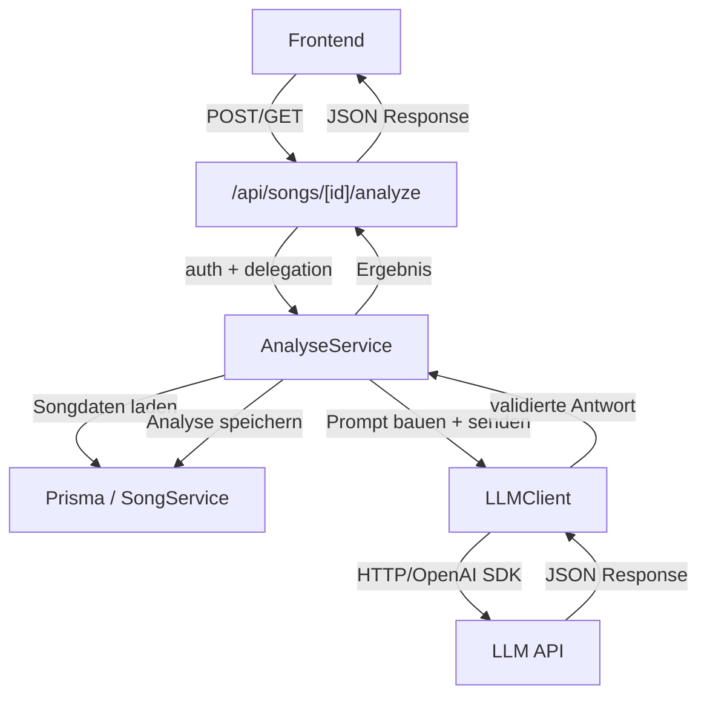

# Design-Dokument: Smarte Song-Analyse

## Übersicht

Dieses Design beschreibt die serverseitige LLM-Integration für die automatische Song-Analyse in Lyco. Das Feature erweitert das bestehende Datenmodell um Analyse-Felder, führt einen LLM-Client und einen Analyse-Service ein und stellt API-Endpunkte bereit, über die das Frontend die Analyse auslösen und abrufen kann.

Die Architektur folgt den bestehenden Mustern der Anwendung: Next.js App Router API-Routes delegieren an Service-Funktionen, die über Prisma mit der Datenbank kommunizieren. Der neue `analyse-service` orchestriert die LLM-Kommunikation über einen dedizierten `llm-client` und speichert die Ergebnisse über Prisma.

Das `openai`-SDK ist bereits als Dependency vorhanden und wird als LLM-Client-Grundlage verwendet.

## Architektur



### Schichtenmodell

1. **API-Schicht** (`src/app/api/songs/[id]/analyze/route.ts`): Authentifizierung, Request-Handling, HTTP-Statuscodes
2. **Service-Schicht** (`src/lib/services/analyse-service.ts`): Orchestrierung der Analyse, Prompt-Aufbau, Ergebnis-Speicherung, Concurrency-Guard
3. **LLM-Client** (`src/lib/services/llm-client.ts`): OpenAI-SDK-Wrapper, Konfiguration, Retry-Logik, Antwort-Parsing
4. **Daten-Schicht** (Prisma): Erweiterte Song- und Strophe-Modelle mit `analyse`-Feld

## Komponenten und Schnittstellen

### 1. LLM-Client (`src/lib/services/llm-client.ts`)

Wrapper um das `openai`-SDK mit Konfiguration aus Umgebungsvariablen.

```typescript
interface LLMClientConfig {
  apiKey: string;       // LLM_API_KEY
  baseURL?: string;     // LLM_API_URL (optional, default: OpenAI)
  model: string;        // LLM_MODEL (default: "gpt-4o-mini")
  timeoutMs: number;    // 30000
  maxRetries: number;   // 2
}

interface LLMMessage {
  role: "system" | "user";
  content: string;
}

interface LLMClient {
  chat(messages: LLMMessage[]): Promise<string>;
}
```


**Umgebungsvariablen:**
- `LLM_API_KEY` (erforderlich): API-Schlüssel für den LLM-Anbieter
- `LLM_API_URL` (optional): Base-URL, falls nicht OpenAI
- `LLM_MODEL` (optional, default: `gpt-4o-mini`): Modellname

**Verhalten:**
- Verwendet das `openai`-SDK mit `timeout: 30000` und `maxRetries: 2`
- Exponentielles Backoff wird vom SDK automatisch gehandhabt
- Fehler werden mit HTTP-Statuscode und Nachricht geloggt und als beschreibende Fehlermeldung weitergegeben
- Die Antwort wird als roher String zurückgegeben; das JSON-Parsing erfolgt im Analyse-Service

### 2. Analyse-Service (`src/lib/services/analyse-service.ts`)

Orchestriert die gesamte Analyse-Pipeline.

```typescript
// Ergebnis-Typen
interface SongAnalyseResult {
  songAnalyse: string;
  emotionsTags: string[];
  strophenAnalysen: StropheAnalyseResult[];
}

interface StropheAnalyseResult {
  stropheId: string;
  analyse: string;
}

// Öffentliche API
async function analyzeSong(userId: string, songId: string): Promise<SongAnalyseResult>;
async function getAnalysis(userId: string, songId: string): Promise<SongAnalyseResult | null>;
```

**Ablauf von `analyzeSong`:**
1. Song mit Strophen und Zeilen laden (via Prisma)
2. Ownership prüfen (userId === song.userId)
3. Prüfen ob Song Strophen mit Zeilen hat (sonst Fehler)
4. Concurrency-Guard prüfen (In-Memory-Set mit aktiven Song-IDs)
5. Vollständigen Songtext zusammenstellen
6. Einen einzelnen LLM-Aufruf mit kombiniertem Prompt senden (Song-Analyse + alle Strophen-Analysen in einer Anfrage)
7. JSON-Antwort parsen und validieren
8. Song-Analyse und emotionsTags am Song speichern
9. Strophen-Analysen an den jeweiligen Strophen speichern
10. Concurrency-Guard freigeben
11. Ergebnis zurückgeben

**Design-Entscheidung: Ein LLM-Aufruf statt N+1:**
Statt einen Aufruf für die Song-Analyse und je einen pro Strophe zu machen, wird ein einzelner Prompt gesendet, der sowohl die Song-Analyse als auch alle Strophen-Analysen anfordert. Das reduziert Latenz, Kosten und Fehleranfälligkeit erheblich. Der Prompt weist das LLM an, ein JSON-Objekt mit allen Analysen zurückzugeben.

**Concurrency-Guard:**
Ein In-Memory-`Set<string>` speichert die Song-IDs, für die gerade eine Analyse läuft. Vor dem Start wird geprüft, ob die ID bereits enthalten ist (→ 409). Nach Abschluss (auch bei Fehler) wird die ID entfernt. Dies ist ausreichend für eine Single-Instance-Deployment.

### 3. Prompt-Builder (`src/lib/services/analyse-service.ts`)

Die Prompt-Logik ist Teil des Analyse-Service (keine separate Datei nötig).

**System-Prompt:**
```
Du bist ein erfahrener Songtext-Analyst mit Fokus auf emotionale Bedeutung.
Analysiere den folgenden Songtext und liefere deine Analyse als JSON-Objekt.
Antworte in der Sprache des Songtextes.
```

**User-Prompt-Struktur:**
```
Titel: {titel}
Künstler: {kuenstler}

Songtext:
[Strophe 1: {name}]
{zeile1}
{zeile2}
...

[Strophe 2: {name}]
{zeile1}
...

Liefere ein JSON-Objekt mit folgender Struktur:
{
  "songAnalyse": "Allgemeine Analyse: emotionaler Hintergrund, zentrale Botschaft, Stimmung",
  "emotionsTags": ["Tag1", "Tag2", ...],
  "strophenAnalysen": [
    { "stropheIndex": 0, "analyse": "Emotionale Bedeutung, Beitrag zur Gesamtbotschaft, Stilmittel" },
    ...
  ]
}
```

**Antwort-Validierung:**
Die LLM-Antwort wird als JSON geparst und gegen folgende Regeln validiert:
- `songAnalyse` muss ein nicht-leerer String sein
- `emotionsTags` muss ein Array von Strings sein
- `strophenAnalysen` muss ein Array sein mit Objekten, die `stropheIndex` (number) und `analyse` (string) enthalten
- Die Anzahl der `strophenAnalysen` muss der Anzahl der analysierten Strophen entsprechen

Bei Validierungsfehler wird die Antwort verworfen und eine Fehlermeldung zurückgegeben.

### 4. API-Route (`src/app/api/songs/[id]/analyze/route.ts`)

Folgt dem bestehenden Muster der App (siehe `src/app/api/songs/[id]/route.ts`).

**POST `/api/songs/[id]/analyze`** — Analyse auslösen:
- Auth-Check via `auth()` → 401
- `analyzeSong(userId, id)` aufrufen
- Erfolg: 200 mit `SongAnalyseResult`
- Fehler-Mapping: 403, 404, 409, 500 je nach Fehlertyp

**GET `/api/songs/[id]/analyze`** — Gespeicherte Analyse abrufen:
- Auth-Check via `auth()` → 401
- `getAnalysis(userId, id)` aufrufen
- Erfolg: 200 mit `SongAnalyseResult` oder `null`
- Fehler-Mapping: 403, 404, 500

## Datenmodell

### Prisma-Schema-Erweiterungen

```prisma
model Song {
  // ... bestehende Felder ...
  analyse      String?   // NEU: LLM-generierte Song-Analyse
  // emotionsTags String[] @default([])  — bereits vorhanden
}

model Strophe {
  // ... bestehende Felder ...
  analyse      String?   // NEU: LLM-generierte Strophen-Analyse
}
```

Beide Felder sind optional (`String?`) mit implizitem Default `null`. Bestehende Datensätze bleiben unverändert. Die Migration fügt lediglich zwei Spalten hinzu — kein Datenverlust.

### Typen-Erweiterungen (`src/types/song.ts`)

```typescript
// Analyse-spezifische Typen
export interface SongAnalyseResult {
  songAnalyse: string;
  emotionsTags: string[];
  strophenAnalysen: StropheAnalyseResult[];
}

export interface StropheAnalyseResult {
  stropheId: string;
  analyse: string;
}

// Erweiterung bestehender Typen
export interface SongDetail {
  // ... bestehende Felder ...
  analyse: string | null;  // NEU
}

export interface StropheDetail {
  // ... bestehende Felder ...
  analyse: string | null;  // NEU
}
```


## Correctness Properties

*Eine Property ist eine Eigenschaft oder ein Verhalten, das über alle gültigen Ausführungen eines Systems hinweg gelten sollte — im Wesentlichen eine formale Aussage darüber, was das System tun soll. Properties bilden die Brücke zwischen menschenlesbaren Spezifikationen und maschinell überprüfbaren Korrektheitsgarantien.*

### Property 1: Prompt-Vollständigkeit

*Für jedes* Song-Objekt mit Strophen und Zeilen soll der generierte Prompt folgendes enthalten: (a) eine System-Nachricht mit der Rolle als Songtext-Analyst und Fokus auf emotionale Bedeutung, (b) eine User-Nachricht mit Songtitel, Künstler (falls vorhanden), dem vollständigen Text aller Zeilen aller Strophen, und Anweisungen zur JSON-Antwortstruktur inkl. emotionalem Hintergrund, Botschaft, Stimmung, Emotions-Tags und Strophen-Analysen mit Stilmitteln.

**Validates: Requirements 3.1, 3.2, 3.3, 4.2, 4.3, 6.1, 6.2, 6.3, 6.4**

### Property 2: Antwort-Validierung lehnt ungültiges JSON ab

*Für jeden* beliebigen String, der kein gültiges JSON ist oder nicht dem erwarteten Schema entspricht (fehlende Felder, falsche Typen, falsche Anzahl Strophen-Analysen), soll die Validierungsfunktion den String ablehnen und eine beschreibende Fehlermeldung zurückgeben.

**Validates: Requirements 6.5, 6.6**

### Property 3: Analyse-Round-Trip

*Für jedes* gültige Song-Objekt mit Strophen und Zeilen und jede schema-konforme LLM-Antwort soll die Analyse-Pipeline ein konsistentes Ergebnisobjekt liefern, das `songAnalyse` (nicht-leerer String), `emotionsTags` (String-Array) und `strophenAnalysen` (Array mit je einer Analyse pro analysierter Strophe, korrekt zugeordnet via stropheId) enthält.

**Validates: Requirements 3.4, 3.5, 4.1, 4.4, 5.2, 5.3, 6.6**

### Property 4: Analyse-Überschreibung (Idempotenz)

*Für jeden* Song mit einer bestehenden Analyse soll eine erneute Analyse die vorherige Song-Analyse und alle Strophen-Analysen vollständig überschreiben, sodass nur die neuen Werte gespeichert sind.

**Validates: Requirements 3.7, 4.6**

### Property 5: Zugriffskontrolle

*Für jede* Analyse-Anfrage (POST oder GET) soll der Zugriff nur gewährt werden, wenn der Benutzer authentifiziert ist UND der Eigentümer des Songs ist. Unauthentifizierte Anfragen erhalten 401, Anfragen auf fremde Songs erhalten 403.

**Validates: Requirements 5.5, 5.6**

### Property 6: 404 bei nicht-existierender Song-ID

*Für jede* Song-ID, die nicht in der Datenbank existiert, sollen sowohl POST als auch GET auf `/api/songs/[id]/analyze` den HTTP-Statuscode 404 zurückgeben.

**Validates: Requirements 5.7**

### Property 7: Concurrency-Guard

*Für jeden* Song, für den gerade eine Analyse läuft, soll eine gleichzeitige Analyse-Anfrage mit HTTP-Statuscode 409 und der Meldung „Eine Analyse läuft bereits für diesen Song." abgelehnt werden.

**Validates: Requirements 7.4**

### Property 8: Fehler-Logging

*Für jeden* LLM-Fehler (Timeout, Rate-Limit, Parse-Fehler, Netzwerkfehler) soll der Analyse-Service den Fehler mit Zeitstempel, Song-ID und Fehlerdetails protokollieren und eine beschreibende, benutzerfreundliche Fehlermeldung an den Aufrufer zurückgeben.

**Validates: Requirements 2.4, 7.1, 7.2, 7.3, 7.5**

## Fehlerbehandlung

### Fehler-Mapping im Analyse-Service

| Fehlertyp | Quelle | Benutzer-Meldung | HTTP-Status |
|---|---|---|---|
| Timeout | LLM-Client | „Die Analyse konnte nicht abgeschlossen werden. Bitte versuche es später erneut." | 500 |
| Rate-Limit (429) | LLM-Client | „Zu viele Anfragen. Bitte warte einen Moment und versuche es erneut." | 429 |
| Ungültiges JSON | Antwort-Validierung | „Die Analyse konnte nicht verarbeitet werden. Bitte versuche es erneut." | 500 |
| Song nicht gefunden | Prisma | „Song nicht gefunden" | 404 |
| Zugriff verweigert | Ownership-Check | „Zugriff verweigert" | 403 |
| Nicht authentifiziert | Auth-Check | „Nicht authentifiziert" | 401 |
| Concurrent Analysis | Concurrency-Guard | „Eine Analyse läuft bereits für diesen Song." | 409 |
| Leerer Song | Validierung | „Der Song enthält keine Strophen oder Zeilen zur Analyse." | 400 |
| Sonstiger LLM-Fehler | LLM-Client | „Die Analyse konnte nicht abgeschlossen werden. Bitte versuche es später erneut." | 500 |

### Logging

Alle LLM-Fehler werden mit `console.error` geloggt im Format:
```
[AnalyseService] Fehler bei Song {songId}: {fehlerTyp} - {details}
```

Der Zeitstempel wird automatisch von der Laufzeitumgebung hinzugefügt.

### Concurrency-Guard Cleanup

Der Concurrency-Guard wird in einem `finally`-Block freigegeben, sodass auch bei Fehlern die Song-ID aus dem aktiven Set entfernt wird.

## Testing-Strategie

### Dualer Testansatz

Das Feature wird mit einer Kombination aus Unit-Tests und Property-Based Tests getestet.

**Property-Based Tests** (via `fast-check` + `vitest`):
- Jeder Property-Test referenziert die zugehörige Design-Property
- Minimum 100 Iterationen pro Test
- Tag-Format: `Feature: smart-song-analysis, Property {N}: {Titel}`
- Jede Correctness Property wird durch genau einen Property-Based Test implementiert

**Unit-Tests** (via `vitest`):
- Spezifische Beispiele und Edge Cases
- Integrationstests für API-Endpunkte
- Fehler-Mapping-Tests (Timeout → korrekte Meldung, 429 → korrekte Meldung)

### Teststruktur

```
__tests__/
  smart-analysis/
    prompt-completeness.property.test.ts      # Property 1
    response-validation.property.test.ts      # Property 2
    analysis-roundtrip.property.test.ts       # Property 3
    analysis-overwrite.property.test.ts       # Property 4
    access-control.property.test.ts           # Property 5
    not-found.property.test.ts                # Property 6
    concurrency-guard.property.test.ts        # Property 7
    error-logging.property.test.ts            # Property 8
    analyse-api.test.ts                       # Unit/Integration Tests
```

### Generatoren für Property-Tests

Für die Property-Tests werden `fast-check`-Generatoren benötigt:

- **Song-Generator**: Erzeugt zufällige Song-Objekte mit Titel, optionalem Künstler, 1-5 Strophen mit je 1-10 Zeilen
- **LLM-Response-Generator**: Erzeugt schema-konforme JSON-Antworten passend zur Strophen-Anzahl
- **Invalid-JSON-Generator**: Erzeugt ungültige Strings (kein JSON, fehlendes Feld, falsche Typen)
- **Error-Generator**: Erzeugt verschiedene Fehlertypen (Timeout, 429, Netzwerkfehler)

### Mocking-Strategie

- Der LLM-Client wird in Service-Tests gemockt (kein echter API-Aufruf)
- Prisma wird für reine Logik-Tests gemockt, für Integrationstests wird eine Test-DB verwendet
- Die `auth()`-Funktion wird für API-Route-Tests gemockt

### PBT-Bibliothek

- **Bibliothek**: `fast-check` (bereits als devDependency vorhanden)
- **Test-Runner**: `vitest` (bereits konfiguriert)
- **Konfiguration**: `fc.assert(fc.property(...), { numRuns: 100 })`
