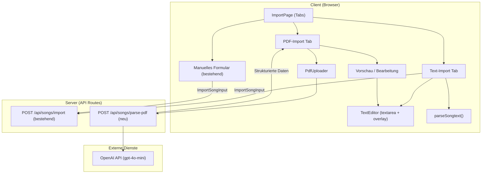
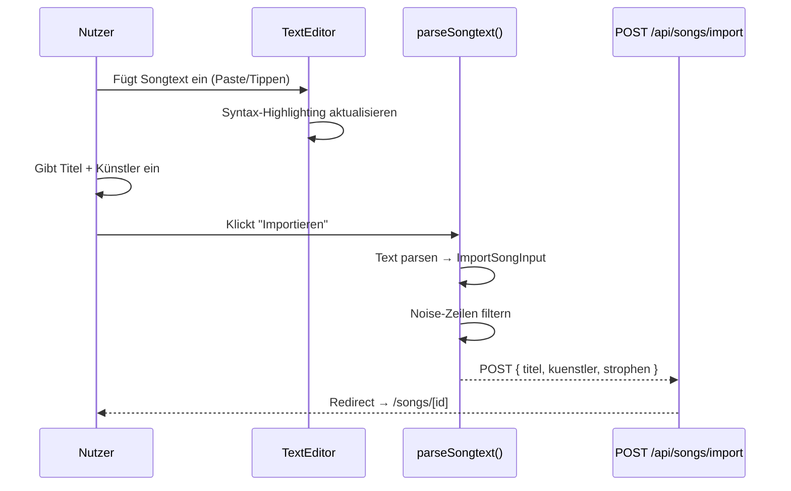
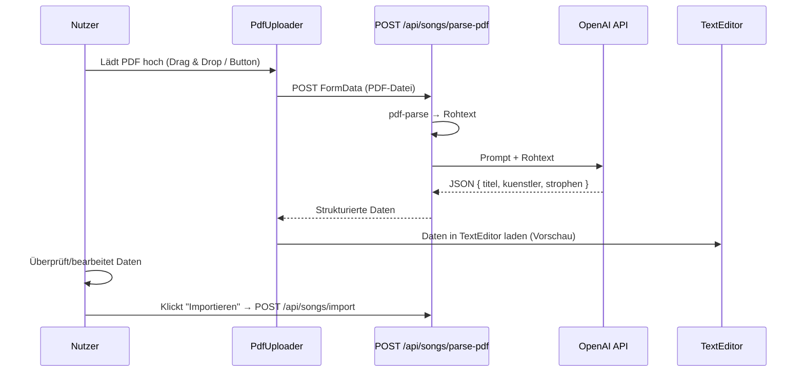

# Design Document – Smart Song Import

## Übersicht (Overview)

Das Smart-Song-Import-Feature ersetzt die bisherige manuelle Strophe-für-Strophe-Eingabe durch zwei schnellere Import-Wege: (1) Text einfügen mit automatischer Strophen-Erkennung und (2) PDF-Upload mit LLM-basierter Extraktion. Die bestehende Import-Seite (`/songs/import`) wird um eine Tab-Navigation erweitert, die zwischen „Manuell" (bestehend), „Text einfügen" und „PDF Upload" umschaltet.

### Kernentscheidungen

- **Client-seitiger Songtext_Parser**: Der Parser läuft vollständig im Browser. Er erkennt `[Section Name]`-Marker, gruppiert Zeilen zu Strophen und filtert Noise-Zeilen. Kein API-Call nötig für Text-Parsing.
- **Leichtgewichtiger Text_Editor**: Statt CodeMirror/Monaco wird ein `<textarea>` mit einer darüberliegenden Highlight-Schicht (Overlay-Div) verwendet. Das Overlay rendert den gleichen Text mit farblich hervorgehobenen `[Section]`-Markern. Dies vermeidet schwere Abhängigkeiten und ist einfacher zu implementieren als `contenteditable`.
- **LLM für PDF-Parsing**: Ein neuer API-Endpunkt `POST /api/songs/parse-pdf` extrahiert via `pdf-parse` den Rohtext aus der PDF und sendet ihn an OpenAI (gpt-4o-mini) zur strukturierten Extraktion von Titel, Künstler und Strophen.
- **Keine Akkord-Extraktion**: PDF-Import extrahiert ausschließlich Lyrics, Strophen-Struktur, Titel und Künstler. Gitarren-/Akkord-Annotationen werden explizit ignoriert.
- **Vorschau vor Import**: Nach PDF-Extraktion werden die Daten im Text_Editor angezeigt, sodass der Nutzer vor dem endgültigen Import korrigieren kann.

## Architektur



### Datenfluss – Text-Import



### Datenfluss – PDF-Import



## Komponenten und Schnittstellen (Components and Interfaces)

### Seitenkomponente

**Datei:** `src/app/(main)/songs/import/page.tsx` (Überarbeitung der bestehenden Seite)

```typescript
// "use client" – Client Component
// Tabs: "manuell" | "text" | "pdf"
export default function SongImportPage(): JSX.Element
```

Verantwortlich für:
- Tab-State-Management (aktiver Tab)
- Weiterleitung an bestehende Import-API nach erfolgreichem Parsen
- Fehleranzeige

### UI-Komponenten

**Verzeichnis:** `src/components/import/`

#### ImportTabs

```typescript
// src/components/import/import-tabs.tsx
type ImportMode = "manuell" | "text" | "pdf";

interface ImportTabsProps {
  active: ImportMode;
  onChange: (mode: ImportMode) => void;
}
export function ImportTabs({ active, onChange }: ImportTabsProps): JSX.Element
```

- Rendert 3 Tabs als `role="tablist"` mit `aria-label="Import-Methode"`
- Jeder Tab hat `role="tab"`, `aria-selected`, `aria-controls`

#### TextEditor

```typescript
// src/components/import/text-editor.tsx
interface TextEditorProps {
  value: string;
  onChange: (value: string) => void;
}
export function TextEditor({ value, onChange }: TextEditorProps): JSX.Element
```

- `<textarea>` mit transparentem Text als Eingabe-Layer
- Darüberliegendes `<div>` (pointer-events: none) rendert den gleichen Text mit Highlighting
- `[Section Name]`-Zeilen werden im Overlay farblich hervorgehoben (z.B. `text-purple-600 font-bold`)
- `aria-label="Songtext eingeben"`
- Paste-Event: `e.clipboardData.getData('text/plain')` für Plain-Text-Only

#### PdfUploader

```typescript
// src/components/import/pdf-uploader.tsx
interface PdfUploaderProps {
  onResult: (data: { titel: string; kuenstler: string; text: string }) => void;
  onError: (message: string) => void;
}
export function PdfUploader({ onResult, onError }: PdfUploaderProps): JSX.Element
```

- Drag-and-Drop-Zone mit `onDragOver`, `onDrop`
- Hidden `<input type="file" accept=".pdf">`
- Zeigt Upload-Status (idle, uploading, success, error)
- `aria-live="polite"` für Status-Updates
- Max 5MB Client-seitige Validierung vor Upload

### Logik-Module

**Verzeichnis:** `src/lib/import/`

#### Songtext Parser

```typescript
// src/lib/import/songtext-parser.ts

interface ParsedSong {
  strophen: ParsedStrophe[];
}

interface ParsedStrophe {
  name: string;
  zeilen: string[];
}

function parseSongtext(text: string): ParsedSong
```

Algorithmus:
1. Text in Zeilen aufteilen (`split('\n')`)
2. Jede Zeile trimmen
3. Noise-Zeilen filtern (via `isNoiseLine()`)
4. Zeilen durchlaufen:
   - `[Section Name]` → neue Strophe mit Name starten
   - Leerzeile → aktuelle Strophe abschließen (falls Zeilen vorhanden)
   - Textzeile → zur aktuellen Strophe hinzufügen
5. Falls keine `[Section]`-Marker und keine Leerzeilen-Trennung: alles als eine Strophe „Verse"
6. Falls Leerzeilen-Trennung ohne Marker: Strophen automatisch als „Verse 1", „Verse 2", etc. benennen

#### Noise Filter

```typescript
// src/lib/import/noise-filter.ts

const NOISE_PATTERNS: RegExp[] = [
  /^you might also like$/i,
  /^\d+\s*(embed|contributors?)$/i,
  /^see .+ live$/i,
  /^get tickets as low as/i,
  /^\[.*\]$/, // Wird NICHT gefiltert – das sind Section-Marker
];

function isNoiseLine(line: string): boolean
```

Bekannte Noise-Patterns von Lyrics-Websites (Genius, AZLyrics, etc.):
- "You might also like"
- "N Embed" / "N Contributors"
- Künstler-Empfehlungen (Zeilen die nur aus Künstlername bestehen, direkt nach "You might also like")
- "See [Artist] live" / "Get tickets as low as"

#### Songtext Printer (für Round-Trip)

```typescript
// src/lib/import/songtext-printer.ts

function printSongtext(parsed: ParsedSong): string
```

Konvertiert eine `ParsedSong`-Struktur zurück in Textformat:
- `[Strophen-Name]` als Marker-Zeile
- Zeilen darunter
- Leerzeile zwischen Strophen

### Neue API-Route

**Datei:** `src/app/api/songs/parse-pdf/route.ts`

```typescript
export async function POST(request: NextRequest): Promise<NextResponse>
```

Ablauf:
1. Auth-Check (Session erforderlich)
2. FormData lesen, PDF-Datei extrahieren
3. Validierung: Dateityp (application/pdf), Größe (≤ 5MB)
4. `pdf-parse` → Rohtext
5. OpenAI API Call mit strukturiertem Prompt
6. JSON-Antwort validieren
7. Rückgabe: `{ titel, kuenstler, text }` (text im Songtext-Format mit `[Section]`-Markern)

#### OpenAI Prompt (Entwurf)

```
Du erhältst den extrahierten Text aus einer PDF-Datei mit einem Songtext.
Extrahiere folgende Informationen:
- titel: Der Titel des Songs
- kuenstler: Der Künstler/die Band
- text: Der Songtext im folgenden Format:
  [Strophen-Name]
  Zeile 1
  Zeile 2
  ...

Regeln:
- Ignoriere Akkorde, Gitarren-Tabulaturen und musikalische Annotationen
- Behalte nur den reinen Liedtext
- Verwende Standard-Strophen-Namen: Verse 1, Verse 2, Chorus, Bridge, Pre-Chorus, Outro, Intro
- Trenne Strophen mit einer Leerzeile

Antworte ausschließlich im JSON-Format:
{ "titel": "...", "kuenstler": "...", "text": "..." }
```

## Datenmodelle (Data Models)

### Bestehende Typen (unverändert)

Die folgenden Typen aus `src/types/song.ts` werden direkt wiederverwendet:

- `ImportSongInput` – Payload für den bestehenden Import-Endpunkt
- `ImportStropheInput` – Strophe mit Name und Zeilen
- `ImportZeileInput` – Zeile mit Text und optionaler Übersetzung

### Neue Typen

```typescript
// src/types/import.ts

export type ImportMode = "manuell" | "text" | "pdf";

export interface ParsedSong {
  strophen: ParsedStrophe[];
}

export interface ParsedStrophe {
  name: string;
  zeilen: string[];
}

export interface PdfParseResult {
  titel: string;
  kuenstler: string;
  text: string;  // Songtext im [Section]-Format
}
```

### Konvertierung ParsedSong → ImportSongInput

```typescript
// src/lib/import/to-import-input.ts

function toImportSongInput(
  titel: string,
  kuenstler: string,
  parsed: ParsedSong
): ImportSongInput {
  return {
    titel,
    kuenstler: kuenstler || undefined,
    strophen: parsed.strophen.map((s) => ({
      name: s.name,
      zeilen: s.zeilen.map((text) => ({ text })),
    })),
  };
}
```

### API-Interaktionen

| Endpunkt | Methode | Body | Verwendung |
| --- | --- | --- | --- |
| `/api/songs/import` | POST | `ImportSongInput` (JSON) | Bestehend – Song in DB speichern |
| `/api/songs/parse-pdf` | POST | `FormData` (PDF-Datei) | Neu – PDF via LLM parsen |

### Neue Dependencies

| Paket | Zweck |
| --- | --- |
| `pdf-parse` | PDF-Text-Extraktion (Server-seitig) |
| `openai` | OpenAI API Client (Server-seitig) |

### Umgebungsvariablen

```env
OPENAI_API_KEY=sk-...  # Neu in .env
```
