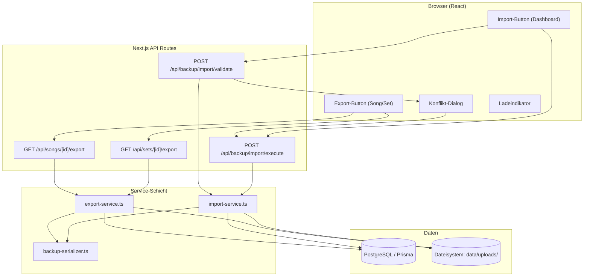

# Design-Dokument: Song Backup — Export & Import

## Übersicht

Dieses Feature erweitert die bestehende Next.js-Anwendung (Lyco) um die Möglichkeit, Songs und Sets als ZIP-Archive zu exportieren und wieder zu importieren. Der Export sammelt alle relevanten Daten eines Songs (Metadaten, Strophen, Zeilen, Markups, Übersetzungen, Interpretationen, Notizen, Coaching-Daten, Audio-Quellen-Metadaten) sowie zugehörige Upload-Dateien (Cover-Bilder, MP3-Audio, Referenz-Daten) und verpackt sie in ein versioniertes ZIP-Archiv mit definierter Ordnerstruktur. Der Import liest dieses Archiv, validiert das Format, erkennt Konflikte anhand bestehender Song-IDs und bietet dem Nutzer die Wahl zwischen Überschreiben und Neu-Importieren.

### Designentscheidungen

- **ZIP-Bibliothek**: `archiver` (Export) und `yauzl` bzw. `unzipper` werden evaluiert. Da die Anwendung serverseitig in Node.js läuft, wird `archiver` für die Erstellung und die native `AdmZip`-Bibliothek (`adm-zip`) für das Lesen verwendet. `adm-zip` ist synchron und einfach zu nutzen, was für die Validierung und das Parsen des Archivs ideal ist.
- **Versionierung**: Das Export-Format erhält ein `exportVersion`-Feld (Startwert `"1.0"`), um zukünftige Migrationen zu ermöglichen.
- **Transaktionale Imports**: Alle Datenbankoperationen eines Imports laufen in einer Prisma-`$transaction`, damit bei Fehlern ein vollständiger Rollback erfolgt.
- **Dateigrößenlimit**: Das Upload-Limit für ZIP-Archive wird auf 100 MB gesetzt (konfigurierbar über Umgebungsvariable).

## Architektur



### Ablauf Export (Song)

1. Client ruft `GET /api/songs/{id}/export` auf
2. API-Route prüft Authentifizierung und Eigentümerschaft
3. `ExportService` lädt Song mit allen Relationen aus der DB
4. `BackupSerializer.serializeSong()` erzeugt das Song-Manifest (JSON)
5. `ExportService` erstellt ZIP-Archiv mit Manifest + Upload-Dateien
6. ZIP wird als `application/zip` Response gestreamt

### Ablauf Import

1. Client lädt ZIP über `POST /api/backup/import/validate` hoch
2. `ImportService` parst das Archiv, validiert Schema und prüft Konflikte
3. Bei Konflikten: Response mit Konflikt-Liste → Client zeigt Konflikt-Dialog
4. Client sendet Auflösungsentscheidungen an `POST /api/backup/import/execute`
5. `ImportService` führt Import in einer DB-Transaktion durch
6. Upload-Dateien werden ins Dateisystem kopiert

## Komponenten und Schnittstellen

### Neue Dateien

| Datei | Beschreibung |
|---|---|
| `src/lib/services/export-service.ts` | Serverseitige Logik für Song- und Set-Export |
| `src/lib/services/import-service.ts` | Serverseitige Logik für Import, Validierung, Konflikterkennung |
| `src/lib/backup/backup-serializer.ts` | Serialisierung/Deserialisierung des Song/Set-Manifests |
| `src/lib/backup/backup-types.ts` | TypeScript-Interfaces für das Export-Format |
| `src/lib/backup/backup-schema.ts` | Validierungsfunktionen für das Import-Schema |
| `src/app/api/songs/[id]/export/route.ts` | API-Route: Song-Export |
| `src/app/api/sets/[id]/export/route.ts` | API-Route: Set-Export |
| `src/app/api/backup/import/validate/route.ts` | API-Route: Import-Validierung + Konflikterkennung |
| `src/app/api/backup/import/execute/route.ts` | API-Route: Import-Ausführung |
| `src/components/songs/export-button.tsx` | Export-Button-Komponente für Song-Detailansicht |
| `src/components/songs/set-export-button.tsx` | Export-Button-Komponente für Set-Detailansicht |
| `src/components/import/backup-import-button.tsx` | Import-Button für Dashboard |
| `src/components/import/konflikt-dialog.tsx` | Dialog zur Konfliktauflösung beim Import |

### API-Schnittstellen

#### `GET /api/songs/[id]/export`

- **Auth**: Erforderlich (401 wenn nicht authentifiziert)
- **Autorisierung**: Nur Eigentümer (403 wenn nicht Eigentümer)
- **Response**: `application/zip` mit Content-Disposition Header
- **Fehler**: 404 wenn Song nicht gefunden

#### `GET /api/sets/[id]/export`

- **Auth**: Erforderlich (401)
- **Autorisierung**: Nur Eigentümer (403)
- **Response**: `application/zip` mit Content-Disposition Header

#### `POST /api/backup/import/validate`

- **Auth**: Erforderlich (401)
- **Body**: `multipart/form-data` mit ZIP-Datei
- **Response (kein Konflikt)**:
```json
{
  "conflicts": [],
  "songs": [{ "title": "...", "originalId": "..." }],
  "set": null | { "name": "...", "songCount": 3 },
  "ready": true
}
```
- **Response (mit Konflikten)**:
```json
{
  "conflicts": [
    { "originalId": "abc123", "title": "Song A", "existingTitle": "Song A" }
  ],
  "songs": [...],
  "set": null,
  "ready": false
}
```

#### `POST /api/backup/import/execute`

- **Auth**: Erforderlich (401)
- **Body**: `multipart/form-data` mit ZIP-Datei + JSON-Feld `resolutions`
```json
{
  "resolutions": {
    "abc123": "overwrite" | "new"
  }
}
```
- **Response**:
```json
{
  "imported": 3,
  "message": "3 Songs erfolgreich importiert"
}
```

### Service-Schnittstellen

```typescript
// export-service.ts
export async function exportSong(userId: string, songId: string): Promise<Buffer>
export async function exportSet(userId: string, setId: string): Promise<Buffer>

// import-service.ts
export async function validateImport(userId: string, zipBuffer: Buffer): Promise<ImportValidationResult>
export async function executeImport(
  userId: string,
  zipBuffer: Buffer,
  resolutions: Record<string, 'overwrite' | 'new'>
): Promise<ImportResult>

// backup-serializer.ts
export function serializeSong(song: SongExportData): SongManifest
export function deserializeSong(manifest: SongManifest): SongExportData
export function serializeSet(set: SetExportData): SetManifest
export function deserializeSet(manifest: SetManifest): SetExportData
```

## Datenmodelle

### Song-Manifest (`song.json`)

```typescript
interface SongManifest {
  exportVersion: string;           // "1.0"
  originalId: string;              // Original-Song-ID für Konflikterkennung
  titel: string;
  kuenstler: string | null;
  sprache: string | null;
  emotionsTags: string[];
  coverUrl: string | null;         // Relativer Pfad im ZIP oder externe URL
  analyse: string | null;
  coachTipp: string | null;
  strophen: StropheManifest[];
  audioQuellen: AudioQuelleManifest[];
}

interface StropheManifest {
  originalId: string;
  name: string;
  orderIndex: number;
  analyse: string | null;
  interpretation: string | null;   // Text der Interpretation des Nutzers
  notiz: string | null;            // Text der Notiz des Nutzers
  zeilen: ZeileManifest[];
  markups: MarkupManifest[];       // Strophe-Level Markups (ziel=STROPHE)
}

interface ZeileManifest {
  originalId: string;
  text: string;
  uebersetzung: string | null;
  orderIndex: number;
  markups: MarkupManifest[];       // Zeile-Level Markups (ziel=ZEILE/WORT)
}

interface MarkupManifest {
  typ: string;                     // MarkupTyp Enum-Wert
  ziel: string;                    // MarkupZiel Enum-Wert
  wert: string | null;
  timecodeMs: number | null;
  wortIndex: number | null;
}

interface AudioQuelleManifest {
  url: string;                     // Relativer Pfad im ZIP (MP3) oder externe URL
  typ: string;                     // AudioTyp Enum-Wert
  label: string;
  orderIndex: number;
  rolle: string;                   // AudioRolle Enum-Wert
}
```

### Set-Manifest (`set.json`)

```typescript
interface SetManifest {
  exportVersion: string;           // "1.0"
  name: string;
  description: string | null;
  songs: SetSongEntry[];
}

interface SetSongEntry {
  folder: string;                  // Ordnername im ZIP, z.B. "01_song-titel"
  orderIndex: number;
}
```

### ZIP-Ordnerstruktur

**Einzelner Song:**
```
song-titel.zip
├── song.json
└── uploads/
    ├── covers/
    │   └── cover.jpg
    ├── audio/
    │   └── audio-file.mp3
    └── referenz-daten/
        └── referenz.json
```

**Set:**
```
set-name.zip
├── set.json
├── 01_erster-song/
│   ├── song.json
│   └── uploads/
│       ├── covers/
│       └── audio/
├── 02_zweiter-song/
│   ├── song.json
│   └── uploads/
│       └── ...
```

### Import-Validierungsergebnis

```typescript
interface ImportValidationResult {
  valid: boolean;
  error?: string;                  // Fehlermeldung bei ungültigem Archiv
  isSet: boolean;
  songs: ImportSongPreview[];
  set?: { name: string; description: string | null };
  conflicts: ImportConflict[];
}

interface ImportSongPreview {
  originalId: string;
  titel: string;
  kuenstler: string | null;
  strophenCount: number;
}

interface ImportConflict {
  originalId: string;
  titel: string;                   // Titel aus dem Archiv
  existingTitle: string;           // Titel des bestehenden Songs
}

interface ImportResult {
  imported: number;
  message: string;
}
```


## Correctness Properties

*Eine Property ist eine Eigenschaft oder ein Verhalten, das über alle gültigen Ausführungen eines Systems hinweg gelten sollte — im Wesentlichen eine formale Aussage darüber, was das System tun soll. Properties dienen als Brücke zwischen menschenlesbaren Spezifikationen und maschinenverifizierbaren Korrektheitsgarantien.*

### Property 1: Song-Export/Import Round-Trip

*Für alle* gültigen Songs mit beliebigen Strophen, Zeilen, Markups, Übersetzungen, Interpretationen, Notizen, Analyse-Daten, Coach-Tipps, Emotions-Tags und Audio-Quellen-Metadaten gilt: Wenn der Song exportiert und anschließend im Neu_Importieren_Modus importiert wird, dann stimmen die Inhalte des importierten Songs (Titel, Künstler, Sprache, Emotions-Tags, Strophen mit Namen und Reihenfolge, Zeilen mit Text und Übersetzung, Markups mit Typ/Ziel/Wert/Timecode/Wort-Index, Interpretationen, Notizen, Analyse, Coach-Tipp, Audio-Quellen mit URL/Typ/Label/Reihenfolge/Rolle) mit den Originaldaten überein.

**Validates: Requirements 1.1, 1.2, 1.6, 3.1, 7.1, 7.2, 7.3, 7.4**

### Property 2: Upload-Dateien Round-Trip

*Für alle* Songs mit lokal hochgeladenen Dateien (Cover-Bilder, MP3-Audio, Referenz-Daten) gilt: Wenn der Song exportiert wird, enthält das ZIP-Archiv die Dateien in den korrekten Unterordnern (`uploads/covers/`, `uploads/audio/`, `uploads/referenz-daten/`), und nach dem Import befinden sich die Dateien in den entsprechenden Server-Verzeichnissen mit identischem Inhalt.

**Validates: Requirements 1.3, 1.4, 1.5, 3.2**

### Property 3: Export-Eigentümerschaft

*Für alle* Songs und Sets und *für alle* Nutzer, die nicht der Eigentümer sind, gilt: Der Export-Versuch wird mit HTTP-Statuscode 403 abgelehnt. Nur der Eigentümer kann einen Export durchführen.

**Validates: Requirements 1.7, 2.5, 9.2, 9.4**

### Property 4: Authentifizierungspflicht

*Für alle* Export- und Import-API-Endpunkte gilt: Ein Request ohne gültige Authentifizierung wird mit HTTP-Statuscode 401 abgelehnt.

**Validates: Requirements 9.1**

### Property 5: Konflikterkennung

*Für alle* ZIP-Archive mit Songs, deren Original-IDs bereits in der Datenbank des importierenden Nutzers existieren, gilt: Die Validierung erkennt genau diese Songs als Konflikte und gibt sie mit korrektem Titel und ID zurück. Songs anderer Nutzer mit gleicher ID werden nicht als Konflikte erkannt. Wenn keine Konflikte existieren, ist die Konflikt-Liste leer.

**Validates: Requirements 4.1, 4.2, 4.3, 4.4**

### Property 6: Überschreiben-Modus

*Für alle* konflikthaften Songs gilt: Wenn der Nutzer den Überschreiben_Modus wählt, wird die Song-ID beibehalten, aber alle Inhalte (Strophen, Zeilen, Markups, Interpretationen, Notizen, Metadaten, Audio-Quellen, Upload-Dateien) werden vollständig durch die Daten aus dem Archiv ersetzt. Nach dem Überschreiben stimmen die Song-Inhalte mit den Archiv-Daten überein.

**Validates: Requirements 5.1, 5.2, 5.3, 5.4, 5.5**

### Property 7: Neu-Import generiert neue IDs mit korrekten Referenzen

*Für alle* konflikthaften Songs gilt: Wenn der Nutzer den Neu_Importieren_Modus wählt, erhalten Song, Strophen, Zeilen, Markups, Interpretationen und Notizen neue IDs, die sich von den Original-IDs unterscheiden. Alle internen Referenzen (stropheId in Markups, zeileId in Markups, stropheId in Interpretationen/Notizen) verweisen auf die korrekten neuen IDs. Upload-Dateien werden mit neuen Dateinamen gespeichert.

**Validates: Requirements 6.1, 6.2, 6.3**

### Property 8: Set-Export/Import Round-Trip

*Für alle* Sets mit beliebig vielen Songs gilt: Wenn das Set exportiert und importiert wird, enthält das resultierende Set denselben Namen, dieselbe Beschreibung und dieselbe Anzahl Songs in der korrekten Reihenfolge (orderIndex). Jeder Song im Set enthält ein vollständiges Song-Manifest mit allen Daten gemäß Property 1.

**Validates: Requirements 2.1, 2.2, 2.3, 2.4, 3.3, 6.4**

### Property 9: Import-Eigentümerzuordnung

*Für alle* importierten Songs und Sets gilt: Der importierte Song/Set wird dem aktuell authentifizierten Nutzer als Eigentümer zugeordnet, unabhängig davon, wer den ursprünglichen Export durchgeführt hat.

**Validates: Requirements 3.6, 9.3**

### Property 10: Export-Resilienz bei fehlenden Dateien

*Für alle* Songs, bei denen eine referenzierte Upload-Datei (Cover, Audio, Referenz-Daten) auf dem Dateisystem nicht existiert, gilt: Der Export wird trotzdem erfolgreich durchgeführt, und die fehlende Datei wird im Manifest als nicht vorhanden markiert.

**Validates: Requirements 10.1**

### Property 11: Import-Datenintegritätsvalidierung

*Für alle* importierten Song-Manifeste gilt: Der Import validiert, dass Strophen-Referenzen in Markups auf tatsächlich im Manifest vorhandene Strophen verweisen. Bei ungültigen Referenzen wird der Import mit einer Fehlermeldung abgelehnt.

**Validates: Requirements 10.5**

## Fehlerbehandlung

| Szenario | Verhalten | HTTP-Status |
|---|---|---|
| Nicht authentifiziert | Fehlermeldung "Nicht authentifiziert" | 401 |
| Nicht Eigentümer (Export) | Fehlermeldung "Zugriff verweigert" | 403 |
| Song/Set nicht gefunden | Fehlermeldung "Song/Set nicht gefunden" | 404 |
| Ungültiges ZIP-Format | Fehlermeldung "Archiv konnte nicht gelesen werden" | 400 |
| Kein gültiges Manifest | Fehlermeldung "Ungültiges Archiv-Format" | 400 |
| Unbekannte exportVersion | Fehlermeldung "Export-Version wird nicht unterstützt" | 400 |
| ZIP zu groß (>100 MB) | Fehlermeldung "Datei zu groß" | 413 |
| Fehlende Upload-Datei (Export) | Export fortsetzen, Datei als fehlend markieren | 200 |
| Fehlende Upload-Datei (Import) | Import fortsetzen, Datei überspringen | 200 |
| Datenbankfehler beim Import | Transaktion rollback, Fehlermeldung | 500 |
| Ungültige Referenzen im Manifest | Fehlermeldung "Ungültige Datenreferenzen" | 400 |

### Fehlerbehandlungsstrategie

- **Export**: Fehlende Upload-Dateien werden toleriert (graceful degradation). Der Export schlägt nur bei DB-Fehlern oder Zugriffsverletzungen fehl.
- **Import**: Zweistufiger Prozess (Validate → Execute) ermöglicht frühzeitige Fehlererkennung. Die Execute-Phase läuft in einer DB-Transaktion. Bei Fehlern nach dem Kopieren von Dateien werden bereits kopierte Dateien im Catch-Block aufgeräumt.
- **Validierung**: Schema-Validierung des Manifests erfolgt vor dem eigentlichen Import. Pflichtfelder (titel, strophen) werden geprüft, Enum-Werte (MarkupTyp, AudioTyp etc.) werden validiert.

## Teststrategie

### Property-Based Testing

- **Bibliothek**: `fast-check` (bereits im Projekt vorhanden)
- **Test-Runner**: `vitest` (bereits konfiguriert)
- **Mindestiterationen**: 100 pro Property-Test
- **Tag-Format**: `Feature: song-backup-export-import, Property {number}: {property_text}`

Jede der oben definierten Correctness Properties wird durch genau einen Property-Based Test implementiert. Die Generatoren erzeugen zufällige Song-Daten mit variierenden Strophen-Anzahlen, Zeilen-Texten, Markup-Typen, Audio-Quellen-Konfigurationen und Emotions-Tags.

### Unit Tests

Unit Tests ergänzen die Property Tests für spezifische Szenarien:

- **Edge Cases**: Leere Strophen-Listen, Songs ohne Audio-Quellen, Songs ohne Cover, beschädigte ZIP-Archive, ungültige JSON-Manifeste, unbekannte exportVersion
- **Spezifische Beispiele**: Export eines konkreten Songs mit bekannten Daten, Import mit bekanntem Konflikt
- **Integrationstests**: API-Route-Tests für Authentifizierung (401), Autorisierung (403), erfolgreichen Export/Import
- **UI-Tests**: Vorhandensein von Export-Button in Song-Detailansicht, Import-Button im Dashboard, Konflikt-Dialog mit korrekten Optionen

### Testdateien

| Testdatei | Beschreibung |
|---|---|
| `__tests__/backup/export-import-roundtrip.property.test.ts` | Property 1: Song Round-Trip |
| `__tests__/backup/upload-files-roundtrip.property.test.ts` | Property 2: Upload-Dateien Round-Trip |
| `__tests__/backup/export-ownership.property.test.ts` | Property 3: Export-Eigentümerschaft |
| `__tests__/backup/auth-enforcement.property.test.ts` | Property 4: Authentifizierungspflicht |
| `__tests__/backup/conflict-detection.property.test.ts` | Property 5: Konflikterkennung |
| `__tests__/backup/overwrite-mode.property.test.ts` | Property 6: Überschreiben-Modus |
| `__tests__/backup/new-import-ids.property.test.ts` | Property 7: Neue IDs bei Neu-Import |
| `__tests__/backup/set-roundtrip.property.test.ts` | Property 8: Set Round-Trip |
| `__tests__/backup/import-ownership.property.test.ts` | Property 9: Import-Eigentümerzuordnung |
| `__tests__/backup/export-resilience.property.test.ts` | Property 10: Export-Resilienz |
| `__tests__/backup/import-integrity.property.test.ts` | Property 11: Datenintegritätsvalidierung |
| `__tests__/backup/export-api.test.ts` | Unit Tests: Export-API-Routen |
| `__tests__/backup/import-api.test.ts` | Unit Tests: Import-API-Routen |
| `__tests__/backup/backup-serializer.test.ts` | Unit Tests: Serialisierung Edge Cases |
