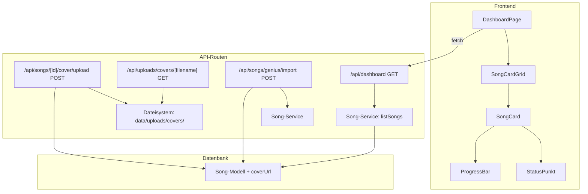

# Design-Dokument: Song-Kartenansicht (Card View)

## Übersicht

Dieses Feature erweitert das Dashboard um eine visuell ansprechende Kartenansicht für Songs. Jede Song-Karte zeigt ein Album-Cover als Hintergrund, den Titel, den Künstler, einen StatusPunkt und eine ProgressBar. Das Layout nutzt ein responsives CSS-Grid (1–4 Spalten je nach Bildschirmbreite). Zusätzlich wird das Song-Modell um ein optionales `coverUrl`-Feld erweitert, das per manuellem Upload oder automatisch beim Genius-Import befüllt wird.

### Zentrale Design-Entscheidungen

1. **Lokale Dateispeicherung** für Cover-Bilder – analog zum bestehenden Audio-Upload-Pattern (`data/uploads/covers/`), ausgeliefert über eine eigene API-Route `/api/uploads/covers/[filename]`.
2. **Prisma-Schema-Erweiterung** mit einem optionalen `coverUrl`-Feld am `Song`-Modell.
3. **Wiederverwendung bestehender Komponenten** (`StatusPunkt`, `ProgressBar`) innerhalb der neuen `SongCard`-Komponente.
4. **Genius-Import-Erweiterung**: Die bereits vorhandene `albumArt`-URL aus `GeniusSearchResult` wird beim Import als `coverUrl` gespeichert.

## Architektur



### Datenfluss

1. **Cover-Upload**: Nutzer lädt Bild hoch → API validiert Format/Größe → Datei wird in `data/uploads/covers/` gespeichert → `coverUrl` wird am Song aktualisiert.
2. **Genius-Import**: Genius-Suche liefert `albumArt`-URL → Import-Route speichert diese als `coverUrl` am neuen Song.
3. **Dashboard-Anzeige**: Dashboard-API liefert `coverUrl` pro Song → `SongCardGrid` rendert `SongCard`-Komponenten mit Cover-Hintergrund.

## Komponenten und Schnittstellen

### 1. `SongCard`-Komponente

**Datei:** `src/components/songs/song-card.tsx`

```typescript
interface SongCardProps {
  song: SongWithProgress; // erweitert um coverUrl
}
```

- Rendert eine Karte mit Cover-Hintergrundbild (oder Gradient-Platzhalter)
- Halbtransparentes Overlay für Textlesbarkeit
- Titel und Künstler im unteren Bereich
- `StatusPunkt` oben rechts
- `ProgressBar` am unteren Rand (bündig, ohne Abstand)
- Klick navigiert zu `/songs/{id}`
- `aria-label` mit Titel, Künstler und Fortschrittsstatus

### 2. `SongCardGrid`-Komponente

**Datei:** `src/components/songs/song-card-grid.tsx`

```typescript
interface SongCardGridProps {
  songs: SongWithProgress[];
}
```

- Responsives CSS-Grid mit Tailwind:
  - `grid-cols-1` (< 640px)
  - `sm:grid-cols-2` (≥ 640px)
  - `md:grid-cols-3` (≥ 768px)
  - `lg:grid-cols-4` (≥ 1024px)
- Gleichmäßiger `gap-4` zwischen Karten

### 3. Cover-Upload API-Route

**Datei:** `src/app/api/songs/[id]/cover/upload/route.ts`

- **Methode:** POST
- **Authentifizierung:** Erforderlich (401 bei fehlender Auth)
- **Validierung:**
  - Nur JPEG, PNG, WebP (MIME-Types + Dateiendung)
  - Max. 5 MB
- **Speicherung:** `data/uploads/covers/{uuid}.{ext}`
- **Response:** `{ coverUrl: "/api/uploads/covers/{filename}" }`
- **Fehler:** 400 bei ungültigem Format/Größe, 404 bei unbekanntem Song, 403 bei fremdem Song

### 4. Cover-Auslieferungs-Route

**Datei:** `src/app/api/uploads/covers/[...path]/route.ts`

- **Methode:** GET
- Liefert die Bilddatei mit korrektem `Content-Type`
- Analog zur bestehenden Audio-Auslieferungs-Route

### 5. Genius-Import-Erweiterung

**Datei:** `src/app/api/songs/genius/import/route.ts`

- `GeniusImportRequest` wird um optionales `albumArt`-Feld erweitert
- Import-Route übergibt `albumArt` als `coverUrl` an `importSong`

## Datenmodelle

### Prisma-Schema-Änderung

```prisma
model Song {
  // ... bestehende Felder ...
  coverUrl  String?   // NEU: optionale Cover-Bild-URL
}
```

**Migration:** `ALTER TABLE songs ADD COLUMN "coverUrl" TEXT;`

### TypeScript-Typ-Erweiterungen

```typescript
// src/types/song.ts – SongWithProgress
export interface SongWithProgress {
  // ... bestehende Felder ...
  coverUrl: string | null;  // NEU
}

// src/types/song.ts – SongDetail
export interface SongDetail {
  // ... bestehende Felder ...
  coverUrl: string | null;  // NEU
}

// src/types/song.ts – ImportSongInput
export interface ImportSongInput {
  // ... bestehende Felder ...
  coverUrl?: string;  // NEU
}

// src/types/genius.ts – GeniusImportRequest
export interface GeniusImportRequest {
  geniusId: number;
  title: string;
  artist: string;
  geniusUrl: string;
  albumArt?: string;  // NEU
}
```

### Song-Service-Anpassungen

- `listSongs()`: `coverUrl` in die Rückgabe aufnehmen
- `importSong()`: `coverUrl` aus `data.coverUrl` beim `song.create` übergeben
- `getSongDetail()`: `coverUrl` in die Rückgabe aufnehmen

