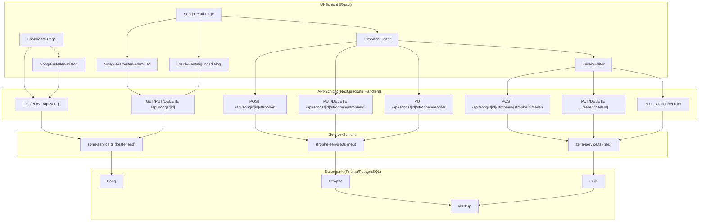

# Design-Dokument — Song CRUD UI

## Übersicht

Dieses Design beschreibt die Implementierung vollständiger CRUD-Funktionalität für Songs, Strophen und Zeilen im SongText Trainer. Die bestehende API deckt Song-Metadaten bereits ab (`/api/songs`, `/api/songs/[id]`). Für Strophen und Zeilen müssen neue Service-Funktionen und API-Routen erstellt werden. Auf der UI-Seite werden ein Song-Erstellen-Dialog auf dem Dashboard, ein Bearbeitungs-/Lösch-Bereich auf der Song-Detail-Seite sowie Strophen- und Zeilen-Editoren implementiert.

### Designentscheidungen

1. **Inline-Editing statt separater Seiten**: Strophen und Zeilen werden direkt auf der Song-Detail-Seite bearbeitet, um den Workflow flüssig zu halten.
2. **Modale Dialoge für Song-Erstellung und Lösch-Bestätigung**: Konsistent mit dem bestehenden Admin-Dialog-Pattern (`user-create-dialog`, `user-delete-dialog`).
3. **Optimistic UI mit Server-Bestätigung**: Die UI aktualisiert sich nach erfolgreicher API-Antwort, nicht optimistisch, um Datenkonsistenz zu gewährleisten.
4. **Reorder via Swap**: Strophen/Zeilen werden paarweise getauscht (Hoch/Runter-Buttons), nicht per Drag-and-Drop, um die Implementierung einfach und barrierefrei zu halten.
5. **Bestehende Patterns wiederverwenden**: Dialog-Struktur, Fehlerbehandlung und Ladezustände folgen den etablierten Mustern in `src/components/admin/`.

## Architektur



### Dateistruktur (neue Dateien)

```
src/
├── lib/services/
│   ├── strophe-service.ts          (neu)
│   └── zeile-service.ts            (neu)
├── app/api/songs/[id]/
│   ├── strophen/
│   │   ├── route.ts                (POST - Strophe erstellen)
│   │   ├── reorder/
│   │   │   └── route.ts            (PUT - Strophen umsortieren)
│   │   └── [stropheId]/
│   │       ├── route.ts            (PUT/DELETE - Strophe bearbeiten/löschen)
│   │       └── zeilen/
│   │           ├── route.ts        (POST - Zeile erstellen)
│   │           ├── reorder/
│   │           │   └── route.ts    (PUT - Zeilen umsortieren)
│   │           └── [zeileId]/
│   │               └── route.ts    (PUT/DELETE - Zeile bearbeiten/löschen)
├── components/songs/
│   ├── song-create-dialog.tsx      (neu)
│   ├── song-edit-form.tsx          (neu)
│   ├── song-delete-dialog.tsx      (neu)
│   ├── strophe-editor.tsx          (neu)
│   └── zeile-editor.tsx            (neu)
```

## Komponenten und Schnittstellen

### 1. Song-Erstellen-Dialog (`song-create-dialog.tsx`)

Modaler Dialog, der vom Dashboard aus geöffnet wird. Folgt dem Pattern von `user-create-dialog.tsx`.

```typescript
interface SongCreateDialogProps {
  open: boolean;
  onClose: () => void;
  onCreated: (song: SongWithProgress) => void;
}
```

- Felder: Titel (Pflicht), Künstler, Sprache, Emotions-Tags (kommagetrennt)
- POST an `/api/songs`
- Fokus-Management: Fokus auf Titel-Feld beim Öffnen, zurück zum auslösenden Button beim Schließen
- Escape-Taste schließt den Dialog
- `aria-required`, `aria-invalid`, `aria-describedby` für Validierungsfehler

### 2. Song-Bearbeiten-Formular (`song-edit-form.tsx`)

Inline-Formular auf der Song-Detail-Seite, das die Song-Metadaten bearbeitbar macht.

```typescript
interface SongEditFormProps {
  song: SongDetail;
  onSaved: (updated: SongDetail) => void;
  onCancel: () => void;
}
```

- Vorausgefüllte Felder mit aktuellen Werten
- PUT an `/api/songs/[id]`
- Validierung: Titel darf nicht leer sein
- `aria-required`, `aria-invalid`, `aria-describedby` für Pflichtfelder und Fehler

### 3. Lösch-Bestätigungsdialog (`song-delete-dialog.tsx`)

Modaler Dialog, der den Song-Titel und eine Warnung anzeigt. Folgt dem Pattern von `user-delete-dialog.tsx`.

```typescript
interface SongDeleteDialogProps {
  open: boolean;
  song: SongDetail | null;
  onClose: () => void;
  onDeleted: () => void;
}
```

- DELETE an `/api/songs/[id]`
- Fokus auf Abbrechen-Button beim Öffnen
- Weiterleitung zum Dashboard nach erfolgreichem Löschen
- Escape-Taste schließt den Dialog

### 4. Strophen-Editor (`strophe-editor.tsx`)

Bereich auf der Song-Detail-Seite, der alle Strophen mit CRUD- und Reorder-Funktionalität anzeigt.

```typescript
interface StropheEditorProps {
  songId: string;
  strophen: StropheDetail[];
  onStrophenChanged: (strophen: StropheDetail[]) => void;
}
```

- „+ Strophe hinzufügen"-Button am Ende der Liste
- Inline-Bearbeitung des Strophen-Namens
- Löschen mit Bestätigungsdialog
- Hoch/Runter-Buttons mit `aria-label` (z.B. „Strophe Verse 1 nach oben verschieben")
- Erster Hoch-Button und letzter Runter-Button deaktiviert
- `aria-live="polite"` Statusmeldungen bei Änderungen

### 5. Zeilen-Editor (`zeile-editor.tsx`)

Bereich innerhalb jeder Strophe, der alle Zeilen mit CRUD- und Reorder-Funktionalität anzeigt.

```typescript
interface ZeileEditorProps {
  songId: string;
  stropheId: string;
  zeilen: ZeileDetail[];
  onZeilenChanged: (zeilen: ZeileDetail[]) => void;
}
```

- „+ Zeile hinzufügen"-Button am Ende der Zeilen-Liste
- Felder: Text (Pflicht), Übersetzung (optional)
- Inline-Bearbeitung mit Bestätigen/Abbrechen
- Löschen mit Bestätigung
- Hoch/Runter-Buttons mit `aria-label`
- `aria-live="polite"` Statusmeldungen

### 6. Strophe-Service (`strophe-service.ts`)

```typescript
// Neue Strophe erstellen
async function createStrophe(userId: string, songId: string, data: { name: string }): Promise<StropheDetail>

// Strophe aktualisieren (Name)
async function updateStrophe(userId: string, songId: string, stropheId: string, data: { name: string }): Promise<StropheDetail>

// Strophe löschen (Cascade: Zeilen + Markups)
async function deleteStrophe(userId: string, songId: string, stropheId: string): Promise<void>

// Strophen umsortieren
async function reorderStrophen(userId: string, songId: string, order: { id: string; orderIndex: number }[]): Promise<void>
```

Jede Funktion prüft:
1. Song existiert und gehört dem Nutzer (Ownership-Check)
2. Strophe existiert und gehört zum Song (bei Update/Delete)
3. Validierung der Eingabedaten

### 7. Zeile-Service (`zeile-service.ts`)

```typescript
// Neue Zeile erstellen
async function createZeile(userId: string, songId: string, stropheId: string, data: { text: string; uebersetzung?: string }): Promise<ZeileDetail>

// Zeile aktualisieren
async function updateZeile(userId: string, songId: string, stropheId: string, zeileId: string, data: { text?: string; uebersetzung?: string }): Promise<ZeileDetail>

// Zeile löschen (Cascade: Markups)
async function deleteZeile(userId: string, songId: string, stropheId: string, zeileId: string): Promise<void>

// Zeilen umsortieren
async function reorderZeilen(userId: string, songId: string, stropheId: string, order: { id: string; orderIndex: number }[]): Promise<void>
```

Jede Funktion prüft:
1. Song existiert und gehört dem Nutzer
2. Strophe existiert und gehört zum Song
3. Zeile existiert und gehört zur Strophe (bei Update/Delete)
4. Validierung der Eingabedaten

### 8. API-Routen

Alle Routen folgen dem bestehenden Pattern aus `src/app/api/songs/[id]/route.ts`:
- Auth-Check via `auth()` → 401 bei fehlendem Session
- Ownership-Check im Service → 403 bei fremdem Song
- Not-Found → 404
- Validierungsfehler → 400
- Erfolg → 200/201 mit JSON-Body

| Endpunkt | Methode | Beschreibung |
|---|---|---|
| `/api/songs/[id]/strophen` | POST | Strophe erstellen |
| `/api/songs/[id]/strophen/[stropheId]` | PUT | Strophe aktualisieren |
| `/api/songs/[id]/strophen/[stropheId]` | DELETE | Strophe löschen |
| `/api/songs/[id]/strophen/reorder` | PUT | Strophen umsortieren |
| `/api/songs/[id]/strophen/[stropheId]/zeilen` | POST | Zeile erstellen |
| `/api/songs/[id]/strophen/[stropheId]/zeilen/[zeileId]` | PUT | Zeile aktualisieren |
| `/api/songs/[id]/strophen/[stropheId]/zeilen/[zeileId]` | DELETE | Zeile löschen |
| `/api/songs/[id]/strophen/[stropheId]/zeilen/reorder` | PUT | Zeilen umsortieren |

## Datenmodelle

### Bestehende Prisma-Modelle (unverändert)

Die Prisma-Modelle `Song`, `Strophe`, `Zeile` und `Markup` existieren bereits mit Cascade-Delete-Beziehungen. Es sind keine Schema-Änderungen erforderlich.

### Neue TypeScript-Typen (`src/types/song.ts` — Erweiterungen)

```typescript
// Eingabe-Typen für Strophen-CRUD
export interface CreateStropheInput {
  name: string;
}

export interface UpdateStropheInput {
  name?: string;
}

export interface ReorderItem {
  id: string;
  orderIndex: number;
}

// Eingabe-Typen für Zeilen-CRUD
export interface CreateZeileInput {
  text: string;
  uebersetzung?: string;
}

export interface UpdateZeileInput {
  text?: string;
  uebersetzung?: string;
}
```

### API-Request/Response-Formate

**POST `/api/songs/[id]/strophen`**
```json
// Request
{ "name": "Verse 3" }
// Response (201)
{ "strophe": { "id": "...", "name": "Verse 3", "orderIndex": 2, "zeilen": [], "markups": [] } }
```

**PUT `/api/songs/[id]/strophen/[stropheId]`**
```json
// Request
{ "name": "Chorus 2" }
// Response (200)
{ "strophe": { "id": "...", "name": "Chorus 2", "orderIndex": 1, "zeilen": [...], "markups": [...] } }
```

**PUT `/api/songs/[id]/strophen/reorder`**
```json
// Request
{ "order": [{ "id": "abc", "orderIndex": 0 }, { "id": "def", "orderIndex": 1 }] }
// Response (200)
{ "success": true }
```

**POST `/api/songs/[id]/strophen/[stropheId]/zeilen`**
```json
// Request
{ "text": "Hello world", "uebersetzung": "Hallo Welt" }
// Response (201)
{ "zeile": { "id": "...", "text": "Hello world", "uebersetzung": "Hallo Welt", "orderIndex": 3, "markups": [] } }
```

**PUT `.../zeilen/[zeileId]`**
```json
// Request
{ "text": "Updated text", "uebersetzung": "Aktualisierter Text" }
// Response (200)
{ "zeile": { "id": "...", "text": "Updated text", "uebersetzung": "Aktualisierter Text", "orderIndex": 0, "markups": [] } }
```

**PUT `.../zeilen/reorder`**
```json
// Request
{ "order": [{ "id": "x1", "orderIndex": 0 }, { "id": "x2", "orderIndex": 1 }] }
// Response (200)
{ "success": true }
```

**Fehler-Responses (alle Endpunkte)**
```json
// 400
{ "error": "Name ist erforderlich", "field": "name" }
// 401
{ "error": "Nicht authentifiziert" }
// 403
{ "error": "Zugriff verweigert" }
// 404
{ "error": "Song nicht gefunden" }
// 404
{ "error": "Strophe nicht gefunden" }
// 404
{ "error": "Zeile nicht gefunden" }
```
