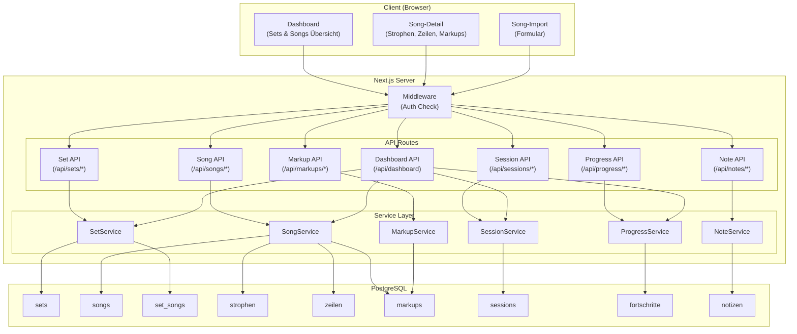
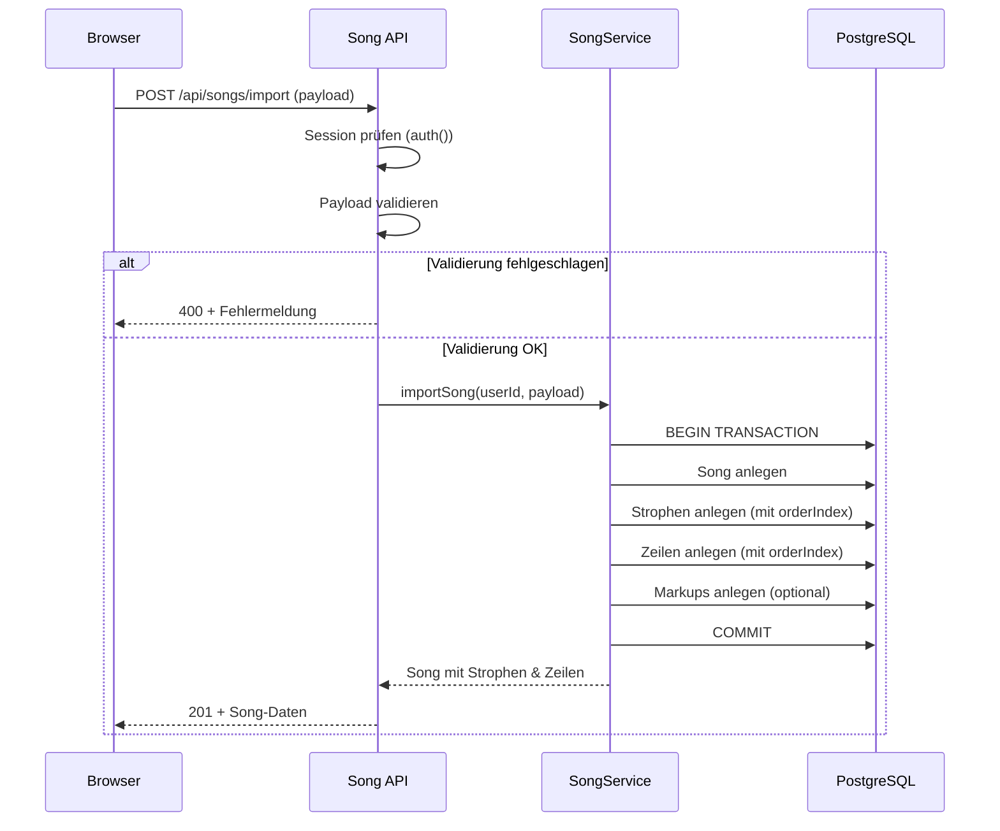
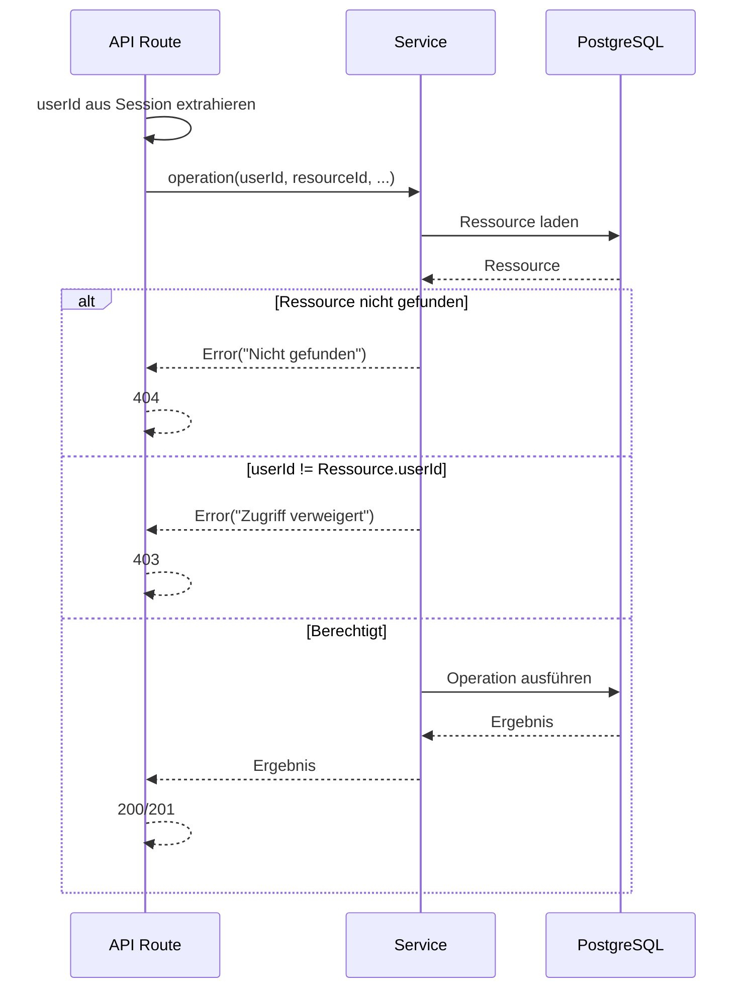

# Technisches Design: Song-Datenverwaltung

## Übersicht

Dieses Dokument beschreibt das technische Design für die Song-Datenverwaltung der Songtext-Lern-Webanwendung "Lyco". Das Feature erweitert das bestehende Prisma-Schema um die Modelle Set, Song, Strophe, Zeile, Markup, Session, Fortschritt und Notiz und stellt CRUD-Operationen über eine Service-Schicht und REST-API bereit.

Das Design umfasst:

- Prisma-Schema-Erweiterung mit 8 neuen Modellen und 2 neuen Enums (MarkupTyp, MarkupZiel, Lernmethode)
- Many-to-Many-Beziehung zwischen Set und Song über eine explizite Zwischentabelle (SetSong)
- Song-Import mit transaktionalem Anlegen von Song, Strophen, Zeilen und Markups
- Service Layer (song-service.ts, set-service.ts, session-service.ts, progress-service.ts, note-service.ts, markup-service.ts) nach bestehendem Muster
- API-Routen unter `/api/sets/*`, `/api/songs/*`, `/api/sessions/*`, `/api/progress/*`, `/api/notes/*`, `/api/markups/*`
- Ownership-Prüfung auf Service-Ebene (Benutzer darf nur eigene Daten lesen/schreiben)
- Dashboard-Aggregations-Endpunkt für Sets, Songs, Fortschritt und Session-Zähler
- Responsive Song-Detailansicht mit Tailwind CSS (320px–1440px)

Referenz: [Planungsdokument](.planning/key_features.md), [Anforderungen](requirements.md)

## Architektur

### Systemübersicht



### Song-Import-Flow



### Ownership-Prüfung



## Komponenten und Schnittstellen

### Frontend-Komponenten

| Komponente | Pfad | Beschreibung |
| --- | --- | --- |
| `DashboardPage` | `app/(main)/dashboard/page.tsx` | Dashboard mit Sets, Songs, Fortschritt |
| `SongDetailPage` | `app/(main)/songs/[id]/page.tsx` | Song-Detailansicht mit Strophen und Zeilen |
| `SongImportPage` | `app/(main)/songs/import/page.tsx` | Song-Import-Formular |
| `SetCard` | `components/songs/set-card.tsx` | Auf-/zuklappbare Set-Karte mit Song-Zeilen |
| `SongRow` | `components/songs/song-row.tsx` | Song-Zeile mit Fortschrittsbalken und Status |
| `StropheCard` | `components/songs/strophe-card.tsx` | Strophen-Karte mit Zeilen und Markups |
| `ProgressBar` | `components/songs/progress-bar.tsx` | Fortschrittsbalken (4px, grün) |
| `MainLayout` | `app/(main)/layout.tsx` | Layout für authentifizierte Hauptseiten |

### API-Endpunkte

| Methode | Pfad | Auth | Beschreibung |
| --- | --- | --- | --- |
| GET | `/api/sets` | ✓ | Alle Sets des Benutzers |
| POST | `/api/sets` | ✓ | Neues Set erstellen |
| PUT | `/api/sets/[id]` | ✓ | Set umbenennen |
| DELETE | `/api/sets/[id]` | ✓ | Set löschen (Songs bleiben) |
| POST | `/api/sets/[id]/songs` | ✓ | Song zu Set hinzufügen |
| DELETE | `/api/sets/[id]/songs/[songId]` | ✓ | Song aus Set entfernen |
| GET | `/api/songs` | ✓ | Alle Songs des Benutzers |
| POST | `/api/songs` | ✓ | Neuen Song erstellen (nur Metadaten) |
| POST | `/api/songs/import` | ✓ | Song mit Strophen, Zeilen, Markups importieren |
| GET | `/api/songs/[id]` | ✓ | Song-Detail mit Strophen, Zeilen, Markups, Fortschritt |
| PUT | `/api/songs/[id]` | ✓ | Song-Metadaten bearbeiten |
| DELETE | `/api/songs/[id]` | ✓ | Song löschen (Cascade) |
| POST | `/api/sessions` | ✓ | Neue Session anlegen |
| GET | `/api/sessions?songId=X` | ✓ | Session-Anzahl für einen Song |
| PUT | `/api/progress` | ✓ | Fortschritt einer Strophe aktualisieren |
| GET | `/api/progress?songId=X` | ✓ | Fortschritt je Strophe für einen Song |
| POST | `/api/notes` | ✓ | Notiz erstellen/aktualisieren (Upsert) |
| DELETE | `/api/notes/[id]` | ✓ | Notiz löschen |
| POST | `/api/markups` | ✓ | Markup erstellen |
| PUT | `/api/markups/[id]` | ✓ | Markup bearbeiten |
| DELETE | `/api/markups/[id]` | ✓ | Markup löschen |
| GET | `/api/dashboard` | ✓ | Dashboard-Aggregation (Sets, Songs, Fortschritt, Sessions) |

### Service Layer

```typescript
// SetService – Set-Verwaltung
interface SetService {
  listSets(userId: string): Promise<SetWithSongCount[]>;
  createSet(userId: string, name: string): Promise<Set>;
  updateSet(userId: string, setId: string, name: string): Promise<Set>;
  deleteSet(userId: string, setId: string): Promise<void>;
  addSongToSet(userId: string, setId: string, songId: string): Promise<void>;
  removeSongFromSet(userId: string, setId: string, songId: string): Promise<void>;
}

// SongService – Song-Verwaltung und Import
interface SongService {
  listSongs(userId: string): Promise<SongWithProgress[]>;
  createSong(userId: string, data: CreateSongInput): Promise<Song>;
  importSong(userId: string, data: ImportSongInput): Promise<SongDetail>;
  getSongDetail(userId: string, songId: string): Promise<SongDetail>;
  updateSong(userId: string, songId: string, data: UpdateSongInput): Promise<Song>;
  deleteSong(userId: string, songId: string): Promise<void>;
}

// SessionService – Session-Tracking
interface SessionService {
  createSession(userId: string, songId: string, method: Lernmethode): Promise<Session>;
  getSessionCount(userId: string, songId: string): Promise<number>;
  getTotalSessionCount(userId: string): Promise<number>;
}

// ProgressService – Fortschritts-Verwaltung
interface ProgressService {
  updateProgress(userId: string, stropheId: string, percent: number): Promise<Fortschritt>;
  getSongProgress(userId: string, songId: string): Promise<StropheProgress[]>;
  getOverallSongProgress(userId: string, songId: string): Promise<number>;
  getAverageProgress(userId: string): Promise<number>;
}

// NoteService – Notizen-Verwaltung
interface NoteService {
  upsertNote(userId: string, stropheId: string, text: string): Promise<Notiz>;
  deleteNote(userId: string, noteId: string): Promise<void>;
  getNotesForSong(userId: string, songId: string): Promise<Notiz[]>;
}

// MarkupService – Markup-Verwaltung
interface MarkupService {
  createMarkup(userId: string, data: CreateMarkupInput): Promise<Markup>;
  updateMarkup(userId: string, markupId: string, data: UpdateMarkupInput): Promise<Markup>;
  deleteMarkup(userId: string, markupId: string): Promise<void>;
  getMarkupsForSong(userId: string, songId: string): Promise<MarkupGrouped>;
}
```

### Middleware-Erweiterung

Die bestehende Middleware in `middleware.ts` muss um die neuen API-Pfade erweitert werden. Alle `/api/sets/*`, `/api/songs/*`, `/api/sessions/*`, `/api/progress/*`, `/api/notes/*`, `/api/markups/*` und `/api/dashboard` Routen erfordern eine gültige Session. Es gibt keine Admin-Beschränkung – jeder authentifizierte Benutzer kann seine eigenen Daten verwalten. Die Ownership-Prüfung erfolgt auf Service-Ebene.

```typescript
// Keine Änderung an der Middleware nötig:
// Die bestehende Middleware leitet alle nicht-öffentlichen Routen
// an die Auth-Prüfung weiter. Da /api/sets/*, /api/songs/* etc.
// nicht in publicApiPrefixes stehen, werden sie automatisch geschützt.
// Die Ownership-Prüfung (403) erfolgt im Service Layer.
```

## Datenmodelle

### Prisma Schema (Erweiterung)

Das bestehende Schema wird um folgende Modelle und Enums erweitert. Die bestehenden Modelle `User` und `LoginAttempt` bleiben unverändert.

```prisma
// Neue Enums
enum Lernmethode {
  EMOTIONAL
  LUECKENTEXT
  ZEILE_FUER_ZEILE
  RUECKWAERTS
  SPACED_REPETITION
  QUIZ
}

enum MarkupTyp {
  PAUSE
  WIEDERHOLUNG
  ATMUNG
  KOPFSTIMME
  BRUSTSTIMME
  BELT
  FALSETT
  TIMECODE
}

enum MarkupZiel {
  STROPHE
  ZEILE
  WORT
}

// Neue Modelle
model Set {
  id        String    @id @default(cuid())
  name      String
  userId    String
  createdAt DateTime  @default(now())
  updatedAt DateTime  @updatedAt

  user  User      @relation(fields: [userId], references: [id], onDelete: Cascade)
  songs SetSong[]

  @@map("sets")
}

model SetSong {
  id        String   @id @default(cuid())
  setId     String
  songId    String
  createdAt DateTime @default(now())

  set  Set  @relation(fields: [setId], references: [id], onDelete: Cascade)
  song Song @relation(fields: [songId], references: [id], onDelete: Cascade)

  @@unique([setId, songId])
  @@map("set_songs")
}

model Song {
  id           String   @id @default(cuid())
  titel        String
  kuenstler    String?
  sprache      String?
  emotionsTags String[] @default([])
  userId       String
  createdAt    DateTime @default(now())
  updatedAt    DateTime @updatedAt

  user      User        @relation(fields: [userId], references: [id], onDelete: Cascade)
  strophen  Strophe[]
  sets      SetSong[]
  sessions  Session[]

  @@map("songs")
}

model Strophe {
  id         String   @id @default(cuid())
  name       String
  orderIndex Int
  songId     String
  createdAt  DateTime @default(now())

  song         Song          @relation(fields: [songId], references: [id], onDelete: Cascade)
  zeilen       Zeile[]
  markups      Markup[]
  fortschritte Fortschritt[]
  notizen      Notiz[]

  @@map("strophen")
}

model Zeile {
  id           String  @id @default(cuid())
  text         String
  uebersetzung String?
  orderIndex   Int
  stropheId    String

  strophe Strophe  @relation(fields: [stropheId], references: [id], onDelete: Cascade)
  markups Markup[]

  @@map("zeilen")
}

model Markup {
  id         String    @id @default(cuid())
  typ        MarkupTyp
  ziel       MarkupZiel
  wert       String?
  timecodeMs Int?
  wortIndex  Int?
  stropheId  String?
  zeileId    String?
  createdAt  DateTime  @default(now())

  strophe Strophe? @relation(fields: [stropheId], references: [id], onDelete: Cascade)
  zeile   Zeile?   @relation(fields: [zeileId], references: [id], onDelete: Cascade)

  @@map("markups")
}

model Session {
  id          String      @id @default(cuid())
  userId      String
  songId      String
  lernmethode Lernmethode
  createdAt   DateTime    @default(now())

  user User @relation(fields: [userId], references: [id], onDelete: Cascade)
  song Song @relation(fields: [songId], references: [id], onDelete: Cascade)

  @@map("sessions")
}

model Fortschritt {
  id        String   @id @default(cuid())
  userId    String
  stropheId String
  prozent   Int      @default(0)
  updatedAt DateTime @updatedAt

  user    User    @relation(fields: [userId], references: [id], onDelete: Cascade)
  strophe Strophe @relation(fields: [stropheId], references: [id], onDelete: Cascade)

  @@unique([userId, stropheId])
  @@map("fortschritte")
}

model Notiz {
  id        String   @id @default(cuid())
  userId    String
  stropheId String
  text      String
  updatedAt DateTime @updatedAt

  user    User    @relation(fields: [userId], references: [id], onDelete: Cascade)
  strophe Strophe @relation(fields: [stropheId], references: [id], onDelete: Cascade)

  @@unique([userId, stropheId])
  @@map("notizen")
}
```

Hinweis: Das `User`-Modell muss um die Relationen zu den neuen Modellen erweitert werden:

```prisma
model User {
  // ... bestehende Felder ...
  sets         Set[]
  songs        Song[]
  sessions     Session[]
  fortschritte Fortschritt[]
  notizen      Notiz[]
}
```

### TypeScript-Typen

```typescript
// types/song.ts

// --- Eingabe-Typen ---

interface CreateSetInput {
  name: string;
}

interface CreateSongInput {
  titel: string;
  kuenstler?: string;
  sprache?: string;
  emotionsTags?: string[];
}

interface UpdateSongInput {
  titel?: string;
  kuenstler?: string;
  sprache?: string;
  emotionsTags?: string[];
}

interface ImportStropheInput {
  name: string;
  zeilen: ImportZeileInput[];
  markups?: ImportMarkupInput[];
}

interface ImportZeileInput {
  text: string;
  uebersetzung?: string;
  markups?: ImportMarkupInput[];
}

interface ImportMarkupInput {
  typ: MarkupTyp;
  ziel: MarkupZiel;
  wert?: string;
  timecodeMs?: number;
  wortIndex?: number;
}

interface ImportSongInput {
  titel: string;
  kuenstler?: string;
  sprache?: string;
  emotionsTags?: string[];
  strophen: ImportStropheInput[];
}

interface CreateMarkupInput {
  typ: MarkupTyp;
  ziel: MarkupZiel;
  stropheId?: string;
  zeileId?: string;
  wortIndex?: number;
  wert?: string;
  timecodeMs?: number;
}

interface UpdateMarkupInput {
  wert?: string;
  timecodeMs?: number;
}

// --- Ausgabe-Typen ---

interface SetWithSongCount {
  id: string;
  name: string;
  songCount: number;
  lastActivity: string | null;
  createdAt: string;
}

interface SongWithProgress {
  id: string;
  titel: string;
  kuenstler: string | null;
  sprache: string | null;
  emotionsTags: string[];
  progress: number; // 0–100
  sessionCount: number;
  status: "neu" | "aktiv" | "gelernt";
}

interface SongDetail {
  id: string;
  titel: string;
  kuenstler: string | null;
  sprache: string | null;
  emotionsTags: string[];
  progress: number;
  sessionCount: number;
  strophen: StropheDetail[];
}

interface StropheDetail {
  id: string;
  name: string;
  orderIndex: number;
  progress: number;
  notiz: string | null;
  zeilen: ZeileDetail[];
  markups: MarkupResponse[];
}

interface ZeileDetail {
  id: string;
  text: string;
  uebersetzung: string | null;
  orderIndex: number;
  markups: MarkupResponse[];
}

interface MarkupResponse {
  id: string;
  typ: MarkupTyp;
  ziel: MarkupZiel;
  wert: string | null;
  timecodeMs: number | null;
  wortIndex: number | null;
}

interface StropheProgress {
  stropheId: string;
  stropheName: string;
  prozent: number;
}

// --- Dashboard ---

interface DashboardData {
  sets: DashboardSet[];
  totalSongs: number;
  totalSessions: number;
  averageProgress: number;
}

interface DashboardSet {
  id: string;
  name: string;
  songs: SongWithProgress[];
}
```

## Correctness Properties

*Eine Property ist eine Eigenschaft oder ein Verhalten, das über alle gültigen Ausführungen eines Systems hinweg gelten muss – im Wesentlichen eine formale Aussage darüber, was das System tun soll. Properties bilden die Brücke zwischen menschenlesbaren Spezifikationen und maschinell verifizierbaren Korrektheitsgarantien.*

### Property 1: Song-Import Round-Trip

*Für jeden* gültigen Import-Payload (mit zufälligem Titel, Künstler, Sprache, Emotions_Tags, Strophen mit Namen und Zeilen mit Text und optionaler Übersetzung, sowie optionalen Markups) gilt: Nach dem Import über `importSong` muss `getSongDetail` einen Song zurückgeben, bei dem alle Strophen in der Reihenfolge des Payloads vorliegen (orderIndex entspricht Position), alle Zeilen innerhalb jeder Strophe in der Reihenfolge des Payloads vorliegen, alle Texte und Übersetzungen übereinstimmen, und alle Markups vorhanden sind.

**Validates: Requirements 1.3, 1.4, 1.5, 4.1, 4.2, 4.3, 4.4, 4.9**

### Property 2: Song-CRUD Round-Trip

*Für jede* gültige Kombination aus Titel (nicht leer), optionalem Künstler, optionaler Sprache und optionalen Emotions_Tags gilt: Nach dem Erstellen eines Songs über `createSong` und anschließendem Abrufen über `listSongs` muss der Song mit identischen Metadaten enthalten sein. Nach dem Aktualisieren über `updateSong` müssen die geänderten Felder die neuen Werte enthalten und unveränderte Felder unverändert bleiben.

**Validates: Requirements 3.1, 3.3, 3.7**

### Property 3: Song Cascade Delete

*Für jeden* importierten Song mit Strophen, Zeilen, Markups, Sessions, Fortschritten und Notizen gilt: Nach dem Löschen des Songs über `deleteSong` dürfen keine zugehörigen Strophen, Zeilen, Markups, Sessions, Fortschritte oder Notizen mehr in der Datenbank existieren.

**Validates: Requirements 1.9, 1.13, 3.4**

### Property 4: Set-CRUD Round-Trip

*Für jeden* gültigen Set-Namen (nicht leer) gilt: Nach dem Erstellen eines Sets über `createSet` muss das Set in `listSets` erscheinen. Nach dem Umbenennen über `updateSet` muss der neue Name zurückgegeben werden.

**Validates: Requirements 2.1, 2.3**

### Property 5: Set-Song-Zuordnung Round-Trip

*Für jeden* Song und jedes Set desselben Benutzers gilt: Nach dem Hinzufügen des Songs zum Set über `addSongToSet` muss der Song in der Song-Liste des Sets erscheinen. Nach dem Entfernen über `removeSongFromSet` darf der Song nicht mehr im Set erscheinen, muss aber weiterhin als eigenständiger Song existieren. Ein Song kann mehreren Sets zugeordnet werden.

**Validates: Requirements 1.2, 2.7, 2.8**

### Property 6: Set löschen erhält Songs

*Für jedes* Set mit zugeordneten Songs gilt: Nach dem Löschen des Sets über `deleteSet` müssen alle zuvor zugeordneten Songs weiterhin über `listSongs` abrufbar sein.

**Validates: Requirements 2.4**

### Property 7: Ownership-Prüfung

*Für jede* Ressource (Set, Song, Notiz, Fortschritt, Markup) und jeden Benutzer, der nicht der Eigentümer ist, muss jeder Versuch, die Ressource zu lesen, zu bearbeiten oder zu löschen, mit einem Fehler abgelehnt werden (HTTP 403 auf API-Ebene).

**Validates: Requirements 2.5, 3.5, 5.4, 6.5, 8.4, 9.2, 9.3, 12.8**

### Property 8: Pflichtfeld-Validierung

*Für jeden* leeren oder nur aus Whitespace bestehenden String als Set-Name oder Song-Titel muss die Erstellung abgelehnt werden und die Datenbank darf sich nicht verändern.

**Validates: Requirements 2.6, 3.6**

### Property 9: Song-Detail Vollständigkeit und Sortierung

*Für jeden* importierten Song mit Strophen, Zeilen, Markups, Sessions und Fortschritten gilt: `getSongDetail` muss alle Strophen sortiert nach `orderIndex` zurückgeben, alle Zeilen innerhalb jeder Strophe sortiert nach `orderIndex`, den Gesamtfortschritt und Fortschritt je Strophe, die Session-Anzahl, und alle zugehörigen Markups.

**Validates: Requirements 5.1, 5.2, 5.3, 12.9**

### Property 10: Notiz Upsert Round-Trip

*Für jeden* Benutzer und jede Strophe eines eigenen Songs gilt: Das Erstellen einer Notiz über `upsertNote` und anschließendes Abrufen muss den gleichen Text zurückgeben. Ein erneuter Aufruf von `upsertNote` für dieselbe Kombination muss den Text aktualisieren (nicht duplizieren), sodass pro Benutzer und Strophe maximal eine Notiz existiert.

**Validates: Requirements 6.1, 6.2, 6.3, 6.4**

### Property 11: Session Round-Trip

*Für jede* gültige Lernmethode (EMOTIONAL, LUECKENTEXT, ZEILE_FUER_ZEILE, RUECKWAERTS, SPACED_REPETITION, QUIZ) und jeden eigenen Song gilt: Nach dem Anlegen von N Sessions über `createSession` muss `getSessionCount` den Wert N zurückgeben.

**Validates: Requirements 7.1, 7.2, 7.3**

### Property 12: Fortschritt Round-Trip mit Begrenzung

*Für jeden* ganzzahligen Wert gilt: Nach dem Aktualisieren des Fortschritts einer Strophe über `updateProgress` muss der gespeicherte Wert auf den Bereich [0, 100] begrenzt sein (Werte < 0 werden auf 0 gesetzt, Werte > 100 auf 100). Das anschließende Abrufen über `getSongProgress` muss den begrenzten Wert zurückgeben.

**Validates: Requirements 8.1, 8.3**

### Property 13: Fortschritts-Berechnung

*Für jeden* Song mit N Strophen und zufälligen Fortschrittswerten (0–100) je Strophe gilt: `getOverallSongProgress` muss das arithmetische Mittel aller Strophen-Fortschritte zurückgeben (gerundet). `getAverageProgress` über alle Songs muss das arithmetische Mittel aller Song-Fortschritte zurückgeben.

**Validates: Requirements 8.2, 8.5**

### Property 14: Authentifizierung erforderlich

*Für jede* Song-bezogene API-Route gilt: Ein Request ohne gültige Session muss mit HTTP 401 abgelehnt werden.

**Validates: Requirements 9.1**

### Property 15: Eingabevalidierung

*Für jeden* ungültigen Eingabe-Payload (fehlende Pflichtfelder, falsche Typen, ungültige Enum-Werte) an eine Song-bezogene API-Route muss die Antwort HTTP 400 mit einer beschreibenden Fehlermeldung sein.

**Validates: Requirements 9.4**

### Property 16: Dashboard-Aggregation

*Für jeden* Benutzer mit Sets, Songs, Sessions und Fortschritten gilt: Der Dashboard-Endpunkt muss alle Sets mit ihren Songs zurückgeben, wobei jeder Song einen Fortschrittswert und eine Session-Anzahl hat. Die Aggregatwerte (totalSongs, totalSessions, averageProgress) müssen konsistent mit den Einzelwerten sein.

**Validates: Requirements 10.1, 10.2**

### Property 17: Song-Status-Ableitung

*Für jeden* Fortschrittswert im Bereich [0, 100] gilt: Der abgeleitete Status muss deterministisch sein: 0 → "neu", 1–99 → "aktiv", 100 → "gelernt".

**Validates: Requirements 10.4**

### Property 18: ARIA-Labels auf Song-Komponenten

*Für jedes* interaktive Element in der Song-Detail-Ansicht (Buttons, Formularfelder, Links) muss ein `aria-label` oder `aria-labelledby`-Attribut vorhanden sein.

**Validates: Requirements 11.5**

### Property 19: Markup Round-Trip

*Für jeden* gültigen Markup_Typ und jedes gültige Markup_Ziel gilt: Nach dem Erstellen eines Markups über `createMarkup` und anschließendem Abrufen über `getMarkupsForSong` muss das Markup mit identischem Typ, Ziel, Wert und Timecode vorhanden sein. Nach dem Aktualisieren über `updateMarkup` müssen die geänderten Felder die neuen Werte enthalten. Nach dem Löschen über `deleteMarkup` darf das Markup nicht mehr abrufbar sein.

**Validates: Requirements 12.1, 12.2, 12.3, 12.4, 12.5, 12.6**

### Property 20: Markup-Gruppierung

*Für jeden* Song mit Markups auf verschiedenen Ebenen (Strophe, Zeile, Wort) gilt: `getMarkupsForSong` muss alle Markups gruppiert nach Strophe und Zeile zurückgeben, sodass jedes Markup seiner korrekten Strophe bzw. Zeile zugeordnet ist.

**Validates: Requirements 12.7**

### Property 21: Markup-Validierung

*Für jedes* Markup gilt: Wenn das Markup_Ziel STROPHE ist, muss eine stropheId gesetzt sein. Wenn das Ziel ZEILE ist, muss eine zeileId gesetzt sein. Wenn das Ziel WORT ist, muss eine zeileId und ein wortIndex gesetzt sein, wobei der wortIndex innerhalb des gültigen Bereichs der Zeile liegen muss (0 bis Anzahl Wörter - 1). Markups mit ungültigem Ziel-Referenz-Mapping müssen abgelehnt werden.

**Validates: Requirements 1.12, 12.10**

## Fehlerbehandlung

### Set-Operationen

| Fehlerfall | HTTP-Status | Verhalten |
| --- | --- | --- |
| Nicht authentifiziert | 401 | `{ error: "Nicht authentifiziert" }` |
| Set nicht gefunden | 404 | `{ error: "Set nicht gefunden" }` |
| Fremdes Set bearbeiten/löschen | 403 | `{ error: "Zugriff verweigert" }` |
| Set ohne Name | 400 | `{ error: "Name ist erforderlich", field: "name" }` |
| Song bereits im Set | 409 | `{ error: "Song ist bereits im Set" }` |

### Song-Operationen

| Fehlerfall | HTTP-Status | Verhalten |
| --- | --- | --- |
| Nicht authentifiziert | 401 | `{ error: "Nicht authentifiziert" }` |
| Song nicht gefunden | 404 | `{ error: "Song nicht gefunden" }` |
| Fremden Song bearbeiten/löschen | 403 | `{ error: "Zugriff verweigert" }` |
| Song ohne Titel | 400 | `{ error: "Titel ist erforderlich", field: "titel" }` |
| Import ohne Strophen | 400 | `{ error: "Mindestens eine Strophe erforderlich", field: "strophen" }` |
| Strophe ohne Zeilen | 400 | `{ error: "Jede Strophe muss mindestens eine Zeile enthalten", field: "strophen[N].zeilen" }` |
| Ungültiger Import-Payload | 400 | `{ error: "Validierungsfehler", details: [...] }` |

### Markup-Operationen

| Fehlerfall | HTTP-Status | Verhalten |
| --- | --- | --- |
| Markup nicht gefunden | 404 | `{ error: "Markup nicht gefunden" }` |
| Fremdes Markup bearbeiten/löschen | 403 | `{ error: "Zugriff verweigert" }` |
| Ungültiges Markup_Ziel-Referenz-Mapping | 400 | `{ error: "Für Ziel STROPHE muss stropheId gesetzt sein" }` |
| Wort-Index außerhalb des Bereichs | 400 | `{ error: "Wort-Index außerhalb des gültigen Bereichs", field: "wortIndex" }` |
| Ungültiger Markup_Typ | 400 | `{ error: "Ungültiger Markup-Typ", field: "typ" }` |

### Fortschritt & Session

| Fehlerfall | HTTP-Status | Verhalten |
| --- | --- | --- |
| Strophe nicht gefunden | 404 | `{ error: "Strophe nicht gefunden" }` |
| Fremde Strophe | 403 | `{ error: "Zugriff verweigert" }` |
| Ungültiger Prozentwert (kein Integer) | 400 | `{ error: "Prozentwert muss eine Ganzzahl sein", field: "prozent" }` |
| Ungültige Lernmethode | 400 | `{ error: "Ungültige Lernmethode", field: "lernmethode" }` |

### Notizen

| Fehlerfall | HTTP-Status | Verhalten |
| --- | --- | --- |
| Notiz nicht gefunden | 404 | `{ error: "Notiz nicht gefunden" }` |
| Fremde Notiz bearbeiten/löschen | 403 | `{ error: "Zugriff verweigert" }` |
| Leerer Notiztext | 400 | `{ error: "Notiztext ist erforderlich", field: "text" }` |

### Allgemeine Fehlerbehandlung

- Alle API-Routen fangen unerwartete Fehler ab und geben HTTP 500 mit `{ error: "Interner Serverfehler" }` zurück
- Sensible Fehlerdetails (Stack Traces, DB-Fehler) werden nur serverseitig geloggt (`console.error`)
- Prisma-spezifische Fehler (z.B. `P2002` für Unique-Constraint, `P2025` für Record not found) werden in benutzerfreundliche Meldungen übersetzt
- Alle Fehlerantworten folgen dem Format `{ error: string, field?: string, details?: string[] }`

## Testing-Strategie

### Property-Based Testing

**Library:** [fast-check](https://github.com/dubzzz/fast-check) (bereits im Projekt als devDependency)

Jede Correctness Property wird als einzelner Property-Based Test implementiert mit mindestens 100 Iterationen. Jeder Test referenziert die zugehörige Design-Property im Kommentar.

**Konfiguration:**

```typescript
import fc from "fast-check";

// Mindestens 100 Iterationen pro Property-Test
const PBT_CONFIG = { numRuns: 100 };
```

**Property-Test-Mapping:**

| Property | Test-Datei | Tag |
| --- | --- | --- |
| Property 1 | `__tests__/songs/song-import.property.test.ts` | Feature: song-data-management, Property 1: Song-Import Round-Trip |
| Property 2 | `__tests__/songs/song-crud.property.test.ts` | Feature: song-data-management, Property 2: Song-CRUD Round-Trip |
| Property 3 | `__tests__/songs/song-cascade-delete.property.test.ts` | Feature: song-data-management, Property 3: Song Cascade Delete |
| Property 4 | `__tests__/songs/set-crud.property.test.ts` | Feature: song-data-management, Property 4: Set-CRUD Round-Trip |
| Property 5 | `__tests__/songs/set-song-association.property.test.ts` | Feature: song-data-management, Property 5: Set-Song-Zuordnung Round-Trip |
| Property 6 | `__tests__/songs/set-delete-preserves-songs.property.test.ts` | Feature: song-data-management, Property 6: Set löschen erhält Songs |
| Property 7 | `__tests__/songs/ownership.property.test.ts` | Feature: song-data-management, Property 7: Ownership-Prüfung |
| Property 8 | `__tests__/songs/required-fields.property.test.ts` | Feature: song-data-management, Property 8: Pflichtfeld-Validierung |
| Property 9 | `__tests__/songs/song-detail.property.test.ts` | Feature: song-data-management, Property 9: Song-Detail Vollständigkeit und Sortierung |
| Property 10 | `__tests__/songs/note-upsert.property.test.ts` | Feature: song-data-management, Property 10: Notiz Upsert Round-Trip |
| Property 11 | `__tests__/songs/session-tracking.property.test.ts` | Feature: song-data-management, Property 11: Session Round-Trip |
| Property 12 | `__tests__/songs/progress-clamping.property.test.ts` | Feature: song-data-management, Property 12: Fortschritt Round-Trip mit Begrenzung |
| Property 13 | `__tests__/songs/progress-calculation.property.test.ts` | Feature: song-data-management, Property 13: Fortschritts-Berechnung |
| Property 14 | `__tests__/songs/auth-required.property.test.ts` | Feature: song-data-management, Property 14: Authentifizierung erforderlich |
| Property 15 | `__tests__/songs/input-validation.property.test.ts` | Feature: song-data-management, Property 15: Eingabevalidierung |
| Property 16 | `__tests__/songs/dashboard.property.test.ts` | Feature: song-data-management, Property 16: Dashboard-Aggregation |
| Property 17 | `__tests__/songs/song-status.property.test.ts` | Feature: song-data-management, Property 17: Song-Status-Ableitung |
| Property 18 | `__tests__/ui/song-accessibility.property.test.ts` | Feature: song-data-management, Property 18: ARIA-Labels auf Song-Komponenten |
| Property 19 | `__tests__/songs/markup-crud.property.test.ts` | Feature: song-data-management, Property 19: Markup Round-Trip |
| Property 20 | `__tests__/songs/markup-grouping.property.test.ts` | Feature: song-data-management, Property 20: Markup-Gruppierung |
| Property 21 | `__tests__/songs/markup-validation.property.test.ts` | Feature: song-data-management, Property 21: Markup-Validierung |

### Unit Tests

Unit Tests ergänzen die Property-Tests für spezifische Beispiele, Edge Cases und Integrationspunkte:

| Test-Datei | Fokus |
| --- | --- |
| `__tests__/songs/song-service.test.ts` | Song-Service: Import mit konkretem Beispiel, leerer Import, Metadaten-Update |
| `__tests__/songs/set-service.test.ts` | Set-Service: Erstellen, Umbenennen, Löschen, Song-Zuordnung |
| `__tests__/songs/song-api.test.ts` | Song-API: HTTP-Statuscodes, Fehlerformate, Validierung |
| `__tests__/songs/set-api.test.ts` | Set-API: HTTP-Statuscodes, Fehlerformate |
| `__tests__/songs/progress-service.test.ts` | Fortschritt: Konkretes Berechnungsbeispiel, Grenzwerte 0 und 100 |
| `__tests__/songs/session-service.test.ts` | Session: Anlegen, Zählen, Enum-Werte |
| `__tests__/songs/note-service.test.ts` | Notizen: Upsert-Verhalten, Löschen |
| `__tests__/songs/markup-service.test.ts` | Markup: Erstellen, Validierung, Wort-Index-Prüfung |
| `__tests__/songs/dashboard-api.test.ts` | Dashboard: Aggregation mit konkreten Testdaten |

### Test-Infrastruktur

- **Test-Runner:** Vitest (bereits konfiguriert)
- **PBT-Library:** fast-check (bereits als devDependency)
- **Datenbank:** Prisma Client wird für Unit Tests gemockt, Integrationstests nutzen echte DB
- **Mocking:** Service-Funktionen werden in API-Route-Tests gemockt, Prisma wird in Service-Tests gemockt
- **UI-Tests:** React Testing Library für Komponenten-Tests (ARIA-Labels, Rendering)
