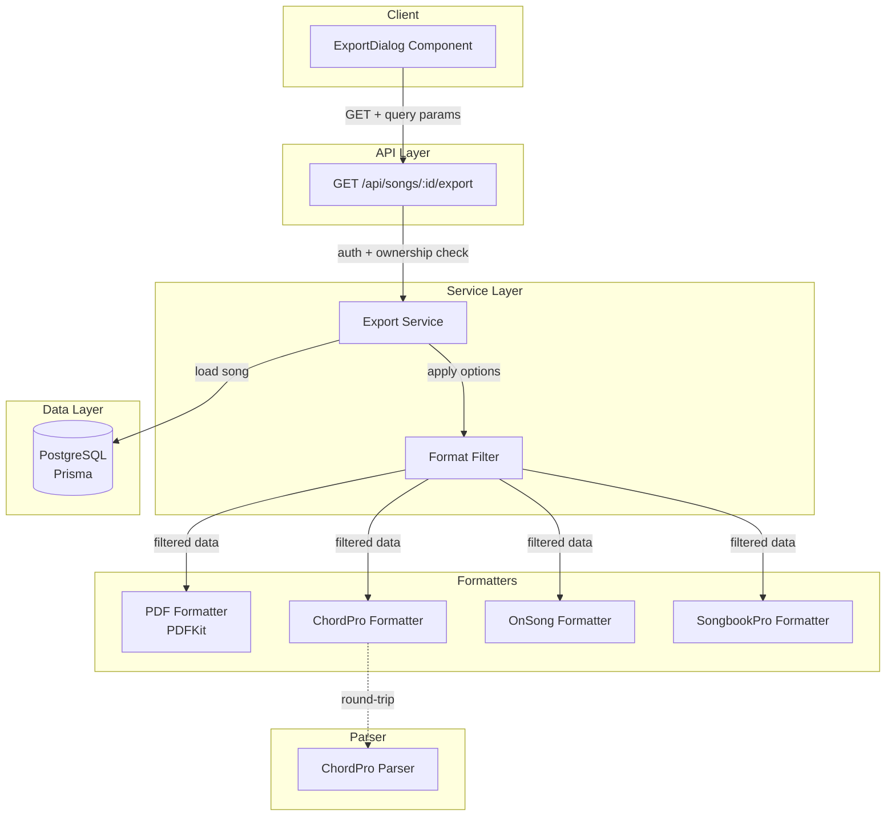

# Design Document: Song Export

## Overview

Das Song-Export-Feature erweitert die bestehende ZIP-basierte Backup-Export-Infrastruktur um vier zusätzliche Ausgabeformate: PDF, ChordPro, OnSong und SongbookPro. Jedes Format bedient einen spezifischen Anwendungsfall in der Musiker-Workflow-Kette — PDF für Ausdruck und digitale Weitergabe, ChordPro als offener Austauschstandard, OnSong und SongbookPro für die Kompatibilität mit den gleichnamigen Musiker-Apps.

Der Export wird über einen neuen Export-Dialog gesteuert, der dem Benutzer Format- und Optionsauswahl bietet. Drei unabhängige Toggles steuern, ob Vocal-Tags, Instrumental-Sektionen und Kommentare in der Ausgabe enthalten sind. Die Formatierung erfolgt serverseitig über dedizierte Formatter-Module, die über den bestehenden API-Endpunkt `/api/songs/[id]/export` angesprochen werden.

### Design-Entscheidungen

1. **Serverseitige Formatierung**: Alle Formatter laufen auf dem Server (Node.js), da PDF-Generierung eine Node.js-Bibliothek erfordert und konsistente Ausgabe über alle Formate gewährleistet wird.
2. **PDFKit für PDF-Generierung**: PDFKit ist eine bewährte, reine Node.js-Bibliothek ohne Browser-Abhängigkeit. Sie bietet eine Canvas-ähnliche API für präzise Kontrolle über Layout, Schriften und Farben — ideal für die strukturierte Darstellung von Songtexten mit Markup-Annotationen.
3. **Einzeldatei-Download statt ZIP**: Im Gegensatz zum bestehenden Backup-Export (ZIP mit Manifest + Dateien) liefern die neuen Formate jeweils eine einzelne Datei (.pdf, .cho, .onsong, .sbp) direkt als Download.
4. **Formatter als reine Funktionen**: Jeder Formatter ist eine reine Funktion `(SongExportData, ExportOptions) → Buffer|string`, die unabhängig testbar ist und keine Seiteneffekte hat.
5. **ChordPro Round-Trip**: Der ChordPro-Formatter wird mit einem komplementären Parser implementiert, der die Round-Trip-Eigenschaft `parse(format(song)) ≅ song` garantiert. Dies ermöglicht zukünftigen ChordPro-Import.

## Architecture



### Ablauf

1. Benutzer öffnet den Export-Dialog auf der Song-Detail-Seite
2. Benutzer wählt Format und konfiguriert Optionen (Vocal-Tags, Instrumental, Kommentare)
3. Client sendet GET-Request an `/api/songs/[id]/export?format=...&vocalTags=...&instrumental=...&kommentare=...`
4. API-Route prüft Authentifizierung und Eigentümerschaft
5. Export-Service lädt Song-Daten mit allen Relationen via Prisma
6. Format-Filter wendet Export-Optionen an (entfernt Markups, Strophen, Kommentare je nach Toggle)
7. Ausgewählter Formatter konvertiert gefilterte Daten in das Zielformat
8. Response wird mit korrektem Content-Type und Content-Disposition-Header zurückgegeben

## Components and Interfaces

### 1. ExportDialog (React Component)

```typescript
// src/components/songs/export-dialog.tsx

interface ExportDialogProps {
  open: boolean;
  songId: string;
  songTitel: string;
  songKuenstler: string | null;
  onClose: () => void;
}

type ExportFormat = "pdf" | "chordpro" | "onsong" | "songbookpro";

interface ExportOptions {
  vocalTags: boolean;      // default: true
  instrumental: boolean;   // default: true
  kommentare: boolean;     // default: true
}
```

Der Dialog folgt dem bestehenden Dialog-Pattern (vgl. `SetEditDialog`): Modal-Overlay mit `role="dialog"`, `aria-modal="true"`, Escape-zum-Schließen, Fokus-Management. Er zeigt vier Format-Buttons (Radio-Auswahl) und drei Toggle-Switches für die Export-Optionen. Die Export-Schaltfläche ist deaktiviert, solange kein Format ausgewählt ist.

### 2. Export Service (Erweiterung)

```typescript
// src/lib/services/export-service.ts (erweitert)

interface ExportOptions {
  vocalTags: boolean;
  instrumental: boolean;
  kommentare: boolean;
}

/**
 * Exportiert einen Song im angegebenen Format.
 * Gibt einen Buffer (PDF) oder String (Text-Formate) zurück.
 */
function exportSongFormatted(
  userId: string,
  songId: string,
  format: ExportFormat,
  options: ExportOptions
): Promise<{ data: Buffer; filename: string; contentType: string }>;
```

### 3. Format Filter

```typescript
// src/lib/export/format-filter.ts

/**
 * Wendet Export-Optionen auf Song-Daten an.
 * Reine Funktion: entfernt Markups, instrumentale Strophen und Kommentare
 * basierend auf den Optionen.
 */
function applyExportOptions(
  song: SongExportData,
  options: ExportOptions
): SongExportData;
```

Filterlogik:
- `vocalTags=false`: Entfernt alle Markup-Einträge mit Typ ∈ {ATMUNG, KOPFSTIMME, BRUSTSTIMME, BELT, FALSETT, PAUSE, WIEDERHOLUNG} aus Strophen und Zeilen. TIMECODE-Markups bleiben erhalten.
- `instrumental=false`: Entfernt alle Strophen mit `istInstrumental=true`.
- `kommentare=false`: Entfernt alle Zeilen mit `istKommentar=true` und setzt `analyse` auf `null` bei allen Strophen.

### 4. Formatter Interfaces

```typescript
// src/lib/export/formatters/types.ts

interface FormatterResult {
  data: Buffer;
  filename: string;
  contentType: string;
  extension: string;
}

type SongFormatter = (
  song: SongExportData,
  options: ExportOptions
) => FormatterResult | Promise<FormatterResult>;
```

### 5. PDF Formatter

```typescript
// src/lib/export/formatters/pdf-formatter.ts

/**
 * Erzeugt ein PDF-Dokument mit:
 * - Kopfzeile: Titel + Künstler
 * - Strophen mit Namen als Überschrift
 * - Zeilen mit optionalen Vocal-Tag-Markierungen (farbig, inline)
 * - Instrumentale Strophen mit "[Instrumental]"-Label
 * - Kommentar-Zeilen kursiv, Analyse-Texte eingerückt
 * - Übersetzungen unterhalb der Original-Zeile
 */
function formatPdf(song: SongExportData, options: ExportOptions): Promise<FormatterResult>;
```

Verwendet PDFKit (neue Dependency). Layout:
- A4-Format, Ränder 50pt
- Titel: 20pt bold, Künstler: 14pt regular darunter
- Strophen-Name: 12pt bold, Zeilen: 11pt regular
- Vocal-Tags: 9pt, farbig (Farbe je nach MarkupTyp), vor dem zugehörigen Text
- Kommentare: 11pt italic
- Analyse: 10pt, 20pt eingerückt
- Übersetzungen: 10pt, grau, direkt unter der Original-Zeile

### 6. ChordPro Formatter + Parser

```typescript
// src/lib/export/formatters/chordpro-formatter.ts

/**
 * Serialisiert Song-Daten in ChordPro-Format.
 * Escaped geschweifte Klammern in Liedtexten.
 */
function formatChordPro(song: SongExportData, options: ExportOptions): FormatterResult;

// src/lib/export/parsers/chordpro-parser.ts

/**
 * Parst eine ChordPro-Datei zurück in SongExportData.
 * Garantiert Round-Trip: parse(format(song)) ≅ song
 */
function parseChordPro(content: string): SongExportData;
```

ChordPro-Mapping:
- `{title: ...}` / `{artist: ...}` für Metadaten
- Sektions-Direktiven basierend auf Strophen-Name:
  - Name enthält "Chorus"/"Refrain" → `{start_of_chorus}`/`{end_of_chorus}`
  - Name enthält "Bridge" → `{start_of_bridge}`/`{end_of_bridge}`
  - Sonst → `{start_of_verse: <Name>}`/`{end_of_verse}`
- Instrumentale Strophen → `{start_of_tab}`/`{end_of_tab}` + `{comment: [Instrumental]}`
- Vocal-Tags → `{comment: [<MarkupTyp>] <Wert>}` vor der zugehörigen Zeile
- Kommentar-Zeilen → `{comment: <Text>}`
- Übersetzungen → `{comment: ↳ <Übersetzung>}` nach der Zeile
- Escaping: `{` → `\{`, `}` → `\}` in Liedtexten

### 7. OnSong Formatter

```typescript
// src/lib/export/formatters/onsong-formatter.ts

function formatOnSong(song: SongExportData, options: ExportOptions): FormatterResult;
```

OnSong-Mapping:
- Zeile 1: Titel, Zeile 2: Künstler, Zeile 3: leer
- Sektions-Header: `Verse 1:`, `Chorus:`, `Bridge:` etc. basierend auf Strophen-Name
- Instrumentale Strophen → `Instrumental:` als Sektions-Header
- Vocal-Tags → `;[<MarkupTyp>] <Wert>` (Kommentarzeile mit `;`)
- Kommentar-Zeilen → `;<Text>`
- Übersetzungen → `; ↳ <Übersetzung>` nach der Zeile

### 8. SongbookPro Formatter

```typescript
// src/lib/export/formatters/songbookpro-formatter.ts

function formatSongbookPro(song: SongExportData, options: ExportOptions): FormatterResult;
```

SongbookPro-Mapping:
- Metadaten-Header: `Title: ...`, `Artist: ...`
- Sektions-Tags: `[Verse 1]`, `[Chorus]`, `[Bridge]` etc.
- Instrumentale Strophen → `[Instrumental]`
- Vocal-Tags → `# [<MarkupTyp>] <Wert>` (Kommentarzeile mit `#`)
- Kommentar-Zeilen → `# <Text>`
- Übersetzungen → `# ↳ <Übersetzung>` nach der Zeile

### 9. Dateinamen-Generator

```typescript
// src/lib/export/filename-generator.ts

/**
 * Generiert einen sicheren Dateinamen nach dem Muster:
 * "{Titel} - {Künstler}.{ext}" oder "{Titel}.{ext}" wenn kein Künstler.
 * Entfernt ungültige Dateisystem-Zeichen: / \ : * ? " < > |
 */
function generateExportFilename(
  titel: string,
  kuenstler: string | null,
  extension: string
): string;
```

### 10. API-Endpunkt (Erweiterung)

```typescript
// src/app/api/songs/[id]/export/route.ts (erweitert)

// Bestehende GET-Route wird erweitert:
// - Neuer Query-Parameter: format (pdf|chordpro|onsong|songbookpro)
// - Neue Query-Parameter: vocalTags, instrumental, kommentare (true|false)
// - Ohne format-Parameter: bestehender ZIP-Export (Rückwärtskompatibilität)
// - Mit format-Parameter: neuer Format-Export
```

Rückwärtskompatibilität: Wenn kein `format`-Parameter angegeben wird, verhält sich der Endpunkt wie bisher und liefert den ZIP-Backup-Export.

## Data Models

### Bestehende Modelle (unverändert)

Die Export-Funktion nutzt die bestehenden Prisma-Modelle ohne Schema-Änderungen:

```
Song (titel, kuenstler, sprache, emotionsTags, coverUrl, analyse, coachTipp)
  └── Strophe (name, orderIndex, analyse, istInstrumental, startTakt, endTakt)
       └── Zeile (text, uebersetzung, orderIndex, istKommentar, startTakt, endTakt)
            └── Markup (typ: MarkupTyp, ziel: MarkupZiel, wert, timecodeMs, wortIndex)
       └── Markup (typ: MarkupTyp, ziel: MarkupZiel, wert, timecodeMs, wortIndex)
  └── AudioQuelle (url, typ, label, orderIndex, rolle)
```

### Export-spezifische Typen

```typescript
// src/lib/export/export-types.ts

/** Unterstützte Export-Formate */
type ExportFormat = "pdf" | "chordpro" | "onsong" | "songbookpro";

/** Export-Optionen vom Client */
interface ExportOptions {
  vocalTags: boolean;
  instrumental: boolean;
  kommentare: boolean;
}

/** Ergebnis eines Formatter-Aufrufs */
interface FormatterResult {
  data: Buffer;
  filename: string;
  contentType: string;
  extension: string;
}

/** Mapping von Format zu Content-Type und Dateiendung */
const FORMAT_CONFIG: Record<ExportFormat, { contentType: string; extension: string }> = {
  pdf:         { contentType: "application/pdf",       extension: "pdf" },
  chordpro:    { contentType: "text/plain; charset=utf-8", extension: "cho" },
  onsong:      { contentType: "text/plain; charset=utf-8", extension: "onsong" },
  songbookpro: { contentType: "text/plain; charset=utf-8", extension: "sbp" },
};

/** Vocal-Tag MarkupTypen (alle außer TIMECODE) */
const VOCAL_TAG_TYPES: MarkupTyp[] = [
  "ATMUNG", "KOPFSTIMME", "BRUSTSTIMME", "BELT", "FALSETT", "PAUSE", "WIEDERHOLUNG"
];
```

### ChordPro Sektions-Mapping

```typescript
/** Mapping von Strophen-Namen zu ChordPro-Sektionstypen */
type ChordProSectionType = "verse" | "chorus" | "bridge" | "tab";

function mapStropheToSection(name: string, istInstrumental: boolean): ChordProSectionType {
  if (istInstrumental) return "tab";
  const lower = name.toLowerCase();
  if (lower.includes("chorus") || lower.includes("refrain")) return "chorus";
  if (lower.includes("bridge") || lower.includes("brücke")) return "bridge";
  return "verse";
}
```

### Markup-Farben für PDF

```typescript
/** Farb-Mapping für Vocal-Tags im PDF */
const MARKUP_COLORS: Record<string, string> = {
  ATMUNG:      "#2196F3",  // Blau
  KOPFSTIMME:  "#9C27B0",  // Lila
  BRUSTSTIMME: "#F44336",  // Rot
  BELT:        "#FF9800",  // Orange
  FALSETT:     "#00BCD4",  // Cyan
  PAUSE:       "#607D8B",  // Grau-Blau
  WIEDERHOLUNG:"#4CAF50",  // Grün
};
```

## Correctness Properties

*A property is a characteristic or behavior that should hold true across all valid executions of a system — essentially, a formal statement about what the system should do. Properties serve as the bridge between human-readable specifications and machine-verifiable correctness guarantees.*

### Property 1: ChordPro Round-Trip

*For any* valid SongExportData with all options enabled (vocalTags=true, instrumental=true, kommentare=true), formatting to ChordPro and then parsing the result back should produce a semantically equivalent SongExportData object. Specifically: titel, kuenstler, strophe names, strophe order, zeile texts, zeile order, markup types/values, istInstrumental flags, istKommentar flags, and uebersetzung values must be preserved.

**Validates: Requirements 5.1, 5.2, 5.3, 4.1, 4.2, 4.3, 4.4, 4.5, 4.6**

### Property 2: Format Filter Correctness

*For any* valid SongExportData and any combination of ExportOptions, applying the format filter should satisfy all of the following:
- When vocalTags=false: no Markup with typ ∈ {ATMUNG, KOPFSTIMME, BRUSTSTIMME, BELT, FALSETT, PAUSE, WIEDERHOLUNG} remains in any strophe or zeile, and all TIMECODE markups are preserved.
- When instrumental=false: no Strophe with istInstrumental=true remains.
- When kommentare=false: no Zeile with istKommentar=true remains, and all Strophe.analyse values are null.
- Non-targeted data (regular zeilen, non-vocal markups, non-instrumental strophen) is never removed.

**Validates: Requirements 2.3, 2.4, 2.5**

### Property 3: Filename Generation

*For any* titel string, any kuenstler string (including null and empty), and any file extension, the generated filename should:
- Follow the pattern "{Titel} - {Künstler}.{ext}" when kuenstler is non-null and non-empty
- Follow the pattern "{Titel}.{ext}" when kuenstler is null or empty
- Contain none of the invalid filesystem characters: / \ : * ? " < > |

**Validates: Requirements 9.1, 9.2, 9.3**

### Property 4: OnSong Formatter Structure

*For any* valid SongExportData, the OnSong formatter output should:
- Have the song title as the first line and the artist as the second line (or empty if null)
- Contain a section header line (ending with ":") for each strophe, in order
- For each strophe with istInstrumental=true (when instrumental option enabled): use "Instrumental:" as the section header
- For each Zeile with istKommentar=true (when kommentare option enabled): output a line starting with ";"
- For each vocal-tag Markup (when vocalTags option enabled): output a line starting with ";"
- For each Zeile with a non-null uebersetzung: output a translation line after the original

**Validates: Requirements 6.1, 6.2, 6.3, 6.4, 6.5, 6.6, 11.1**

### Property 5: SongbookPro Formatter Structure

*For any* valid SongExportData, the SongbookPro formatter output should:
- Start with "Title: {titel}" and "Artist: {kuenstler}" metadata headers
- Contain a section tag line (in square brackets) for each strophe, in order
- For each strophe with istInstrumental=true (when instrumental option enabled): use "[Instrumental]" as the section tag
- For each Zeile with istKommentar=true (when kommentare option enabled): output a line starting with "#"
- For each vocal-tag Markup (when vocalTags option enabled): output a line starting with "#"
- For each Zeile with a non-null uebersetzung: output a translation line after the original

**Validates: Requirements 7.1, 7.2, 7.3, 7.4, 7.5, 7.6, 11.1**

### Property 6: Ordering Preservation

*For any* valid SongExportData where strophen and zeilen have arbitrary orderIndex values, all formatter outputs (ChordPro, OnSong, SongbookPro) should emit strophen in ascending orderIndex order, and zeilen within each strophe in ascending orderIndex order.

**Validates: Requirements 10.1, 10.2**

### Property 7: Strophe Count Monotonicity

*For any* valid SongExportData with N strophen and any combination of ExportOptions, the number of strophen in the filtered output should be less than or equal to N. Filtering can only reduce the number of strophen, never increase it.

**Validates: Requirements 10.3**

## Error Handling

### API-Ebene

| Fehlerfall | HTTP-Status | Fehlermeldung | Behandlung |
|---|---|---|---|
| Nicht authentifiziert | 401 | "Nicht authentifiziert" | Bestehende Auth-Middleware |
| Nicht Eigentümer | 403 | "Zugriff verweigert" | Eigentümerschaftsprüfung |
| Song nicht gefunden | 404 | "Song nicht gefunden" | Prisma-Abfrage liefert null |
| Ungültiges Format | 400 | "Ungültiges Export-Format. Erlaubt: pdf, chordpro, onsong, songbookpro" | Query-Parameter-Validierung |
| Ungültige Optionen | 400 | "Ungültige Export-Optionen" | Query-Parameter-Validierung |
| Interner Fehler | 500 | "Interner Serverfehler" | Try-Catch mit Logging |

### Formatter-Ebene

- **Leerer Song (keine Strophen)**: Formatter erzeugen ein gültiges Dokument mit nur Kopfzeile/Metadaten und leerem Body.
- **Alle Strophen gefiltert**: Wenn alle Strophen durch Export-Optionen entfernt werden, wird ein Dokument mit nur Metadaten erzeugt (kein Fehler).
- **Fehlende Felder**: Null-Werte für kuenstler, sprache, analyse etc. werden graceful behandelt (ausgelassen oder als leerer String).
- **Sehr lange Texte**: PDFKit handhabt automatischen Zeilenumbruch. Text-Formate haben keine Längenbeschränkung.
- **Sonderzeichen in Texten**: ChordPro-Formatter escaped `{` und `}`. Andere Formate benötigen kein spezielles Escaping.

### Client-Ebene

- **Netzwerkfehler**: Export-Dialog zeigt Fehlermeldung und ermöglicht erneuten Versuch.
- **Timeout**: Für große Songs mit vielen Strophen könnte die PDF-Generierung länger dauern. Der Client zeigt einen Lade-Indikator.

## Testing Strategy

### Property-Based Tests (fast-check)

Das Projekt verwendet bereits `fast-check` (v4.6.0) für Property-Based Testing. Jeder Property-Test wird mit mindestens 100 Iterationen konfiguriert.

**Benötigte Generatoren:**
- `arbSongExportData()`: Generiert zufällige SongExportData mit variablen Strophen, Zeilen, Markups (inkl. aller MarkupTyp-Werte), istInstrumental-Flags, istKommentar-Flags, Übersetzungen und Sonderzeichen (inkl. `{`, `}`)
- `arbExportOptions()`: Generiert zufällige Kombinationen von vocalTags, instrumental, kommentare Booleans
- `arbFilenameInput()`: Generiert zufällige Titel und Künstler-Strings mit Sonderzeichen

**Property-Tests:**

| Test | Property | Datei |
|---|---|---|
| ChordPro Round-Trip | Property 1 | `__tests__/song-export/chordpro-roundtrip.property.test.ts` |
| Format Filter Correctness | Property 2 | `__tests__/song-export/format-filter.property.test.ts` |
| Filename Generation | Property 3 | `__tests__/song-export/filename-generation.property.test.ts` |
| OnSong Formatter Structure | Property 4 | `__tests__/song-export/onsong-formatter.property.test.ts` |
| SongbookPro Formatter Structure | Property 5 | `__tests__/song-export/songbookpro-formatter.property.test.ts` |
| Ordering Preservation | Property 6 | `__tests__/song-export/ordering-preservation.property.test.ts` |
| Strophe Count Monotonicity | Property 7 | `__tests__/song-export/strophe-count.property.test.ts` |

Jeder Test wird mit einem Kommentar getaggt:
```
// Feature: song-export, Property 1: ChordPro Round-Trip
```

### Unit Tests (Beispiel-basiert)

| Test | Beschreibung | Datei |
|---|---|---|
| Export-Dialog Rendering | Prüft, dass alle 4 Formate und 3 Toggles angezeigt werden | `__tests__/song-export/export-dialog.test.ts` |
| Export-Dialog Interaktion | Prüft Radio-Auswahl, Toggle-Defaults, Button-Deaktivierung | `__tests__/song-export/export-dialog.test.ts` |
| PDF Formatter Basics | Prüft PDF-Erzeugung mit Beispiel-Song (Titel, Strophen, Markups) | `__tests__/song-export/pdf-formatter.test.ts` |
| API-Route Fehlerbehandlung | Prüft 400/401/403/404/500 Responses | `__tests__/song-export/export-api.test.ts` |
| ChordPro Escaping | Prüft Escaping von `{` und `}` in Liedtexten | `__tests__/song-export/chordpro-formatter.test.ts` |

### Integration Tests

| Test | Beschreibung | Datei |
|---|---|---|
| API Format-Export | End-to-End-Test: API-Request → Formatter → Response mit korrektem Content-Type und Dateinamen | `__tests__/song-export/export-api.test.ts` |
| PDF Content Verification | Prüft, dass generiertes PDF Titel, Künstler und Strophen-Texte enthält (via pdf-parse) | `__tests__/song-export/pdf-formatter.test.ts` |

### Neue Dependency

- **pdfkit** (^0.16.0): Node.js PDF-Generierungsbibliothek für den PDF-Formatter. Wird als `dependency` (nicht devDependency) hinzugefügt, da sie zur Laufzeit benötigt wird.
