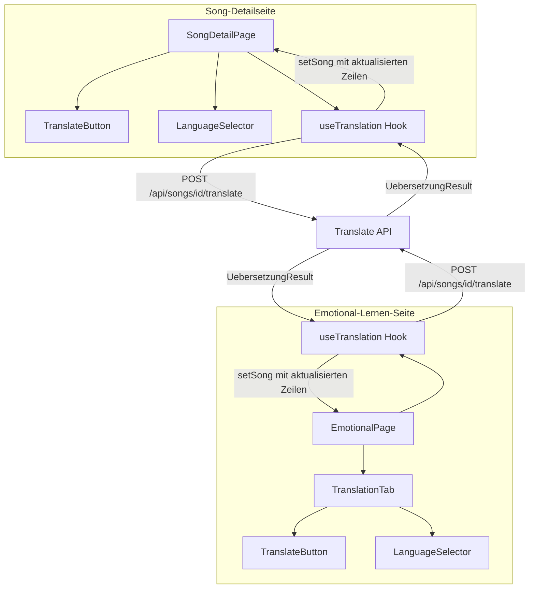
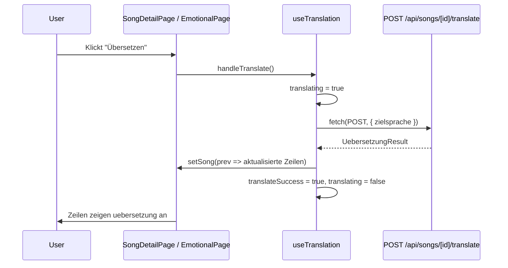

# Design-Dokument: Frontend-Integration Songtext-Übersetzung

## Übersicht

Dieses Design beschreibt die Frontend-Komponenten und deren Integration für die automatische Songtext-Übersetzung in Lyco. Das Backend (API-Route `/api/songs/[id]/translate`, Übersetzungs-Service, Typen) ist bereits vollständig implementiert. Die bestehende Emotional-Lernen-Ansicht enthält bereits einen Übersetzungs-Tab mit Aufdecken-Interaktion (`RevealLine`), der das Feld `uebersetzung` der Zeilen ausliest.

Das Feature ergänzt:
1. Einen **Übersetzungs-Button** (`TranslateButton`) mit Ladezustand und Fehleranzeige, analog zum bestehenden „Analysieren"-Button
2. Einen **Zielsprache-Selektor** (`LanguageSelector`) als `<select>`-Element mit vordefinierten Sprachen
3. Einen **Shared Hook** (`useTranslation`) für die API-Kommunikation und State-Management, der von beiden Seiten (Song-Detail und Emotional-Lernen) wiederverwendet wird
4. Integration in den bestehenden **Übersetzungs-Tab** der Emotional-Lernen-Seite, wenn keine Übersetzungen vorhanden sind

Die Architektur folgt den bestehenden Frontend-Mustern: `useState`/`useCallback` für lokalen State, `fetch`-Aufrufe an die API, optimistisches UI-Update nach Erfolg, Fehleranzeige in einem roten Rahmenbereich.

## Architektur



### Komponentenhierarchie

```
SongDetailPage
├── TranslateButton (neben „Analysieren"-Button)
├── LanguageSelector (neben TranslateButton)
└── useTranslation(songId, setSong)

EmotionalPage
├── TranslationTab
│   ├── [wenn keine Übersetzungen] TranslateButton + LanguageSelector
│   └── StropheCard[] → RevealLine[]
└── useTranslation(songId, setSong)
```

## Komponenten und Schnittstellen

### 1. `useTranslation` Hook (`src/hooks/use-translation.ts`)

Zentraler Hook für die Übersetzungs-Logik. Wird von beiden Seiten verwendet.

```typescript
interface UseTranslationOptions {
  songId: string;
  setSong: React.Dispatch<React.SetStateAction<SongDetail | null>>;
}

interface UseTranslationReturn {
  translating: boolean;
  translateError: string | null;
  translateSuccess: boolean;
  zielsprache: string;
  setZielsprache: (sprache: string) => void;
  handleTranslate: () => Promise<void>;
}

function useTranslation(options: UseTranslationOptions): UseTranslationReturn;
```

**Ablauf von `handleTranslate`:**
1. Guard: Wenn `translating === true` oder `songId` leer → return
2. `translating = true`, `translateError = null`, `translateSuccess = false`
3. `fetch(POST /api/songs/${songId}/translate, { zielsprache })` senden
4. Bei Fehler: Fehlermeldung aus `res.json().error` extrahieren, in `translateError` setzen
5. Bei Erfolg: `UebersetzungResult` parsen, `setSong` aufrufen um `uebersetzung`-Felder der Zeilen zu aktualisieren (Zuordnung über `zeileId`), `translateSuccess = true`
6. `finally`: `translating = false`

**Optimistisches UI-Update (Schritt 5 im Detail):**
```typescript
setSong((prev) => {
  if (!prev) return prev;
  const updatedStrophen = prev.strophen.map((strophe) => {
    const resultStrophe = result.strophen.find((s) => s.stropheId === strophe.id);
    if (!resultStrophe) return strophe;
    const updatedZeilen = strophe.zeilen.map((zeile) => {
      const resultZeile = resultStrophe.zeilen.find((z) => z.zeileId === zeile.id);
      return resultZeile ? { ...zeile, uebersetzung: resultZeile.uebersetzung } : zeile;
    });
    return { ...strophe, zeilen: updatedZeilen };
  });
  return { ...prev, strophen: updatedStrophen };
});
```

### 2. `TranslateButton` Komponente (`src/components/songs/translate-button.tsx`)

Einfacher Button analog zum „Analysieren"-Button.

```typescript
interface TranslateButtonProps {
  translating: boolean;
  onClick: () => void;
}
```

**Rendering:**
- Deaktiviert wenn `translating === true`
- Text: `translating ? "Übersetze…" : "🌐 Übersetzen"`
- `aria-label="Songtext übersetzen"`
- `aria-busy={translating}`
- Mindestgröße 44×44px (konsistent mit bestehenden Touch-Targets)
- Styling: `border-blue-300 text-blue-700 hover:bg-blue-50` (analog zum lila Analysieren-Button, aber in Blau zur visuellen Unterscheidung)

### 3. `LanguageSelector` Komponente (`src/components/songs/language-selector.tsx`)

`<select>`-Element mit vordefinierten Sprachen.

```typescript
interface LanguageSelectorProps {
  value: string;
  onChange: (sprache: string) => void;
  disabled?: boolean;
}

const SPRACHEN = [
  { value: "Deutsch", label: "Deutsch" },
  { value: "Englisch", label: "Englisch" },
  { value: "Spanisch", label: "Spanisch" },
  { value: "Französisch", label: "Französisch" },
  { value: "Italienisch", label: "Italienisch" },
  { value: "Portugiesisch", label: "Portugiesisch" },
];
```

**Rendering:**
- `<label>` mit `htmlFor` oder `aria-label="Zielsprache auswählen"`
- `<select>` mit `id`, `value`, `onChange`, `disabled`
- Standardwert: `"Deutsch"`
- Per Tastatur bedienbar (natives `<select>`)
- Mindestgröße 44px Höhe

### 4. Integration in `SongDetailPage`

Die Song-Detailseite erhält den `useTranslation`-Hook und zeigt `TranslateButton` + `LanguageSelector` in der Aktionsleiste neben dem „Analysieren"-Button.

**Änderungen an `src/app/(main)/songs/[id]/page.tsx`:**
- Import und Aufruf von `useTranslation({ songId: id, setSong })`
- `TranslateButton` und `LanguageSelector` in der Button-Leiste (neben „Analysieren")
- Fehlerbereich für `translateError` (roter Rahmen, analog zu `analyseError`)
- Erfolgsmeldung nach erfolgreicher Übersetzung
- Warnung wenn `song.sprache === zielsprache` (Original- und Zielsprache identisch)

### 5. Integration in `TranslationTab` / `EmotionalPage`

Wenn keine Zeile eine Übersetzung hat, zeigt der Übersetzungs-Tab einen Hinweis und den Übersetzungs-Button mit Sprachauswahl.

**Änderungen an `src/components/emotional/translation-tab.tsx`:**
- Neue Props: `translating`, `translateError`, `translateSuccess`, `zielsprache`, `setZielsprache`, `onTranslate`
- Prüfung ob Übersetzungen vorhanden: `strophen.some(s => s.zeilen.some(z => z.uebersetzung))`
- Wenn keine Übersetzungen: Hinweistext + `TranslateButton` + `LanguageSelector` + Fehler-/Ladezustand
- Wenn Übersetzungen vorhanden: Bestehende `StropheCard`-Darstellung (unverändert)

**Änderungen an `src/app/(main)/songs/[id]/emotional/page.tsx`:**
- Import und Aufruf von `useTranslation({ songId: id, setSong })`
- Weitergabe der Hook-Werte an `TranslationTab`

## Datenmodell

### Bestehende Typen (keine Änderung erforderlich)

Die benötigten Typen existieren bereits in `src/types/song.ts`:

```typescript
// API-Antwort der Übersetzung (bereits definiert)
interface UebersetzungResult {
  songId: string;
  zielsprache: string;
  strophen: StropheUebersetzungResult[];
}

interface StropheUebersetzungResult {
  stropheId: string;
  stropheName: string;
  zeilen: ZeileUebersetzungResult[];
}

interface ZeileUebersetzungResult {
  zeileId: string;
  originalText: string;
  uebersetzung: string;
}

// Zeile enthält bereits das Übersetzungsfeld (bereits definiert)
interface ZeileDetail {
  id: string;
  text: string;
  uebersetzung: string | null;  // ← wird vom Hook aktualisiert
  orderIndex: number;
  markups: MarkupResponse[];
}
```

### Neue Typen

Es werden keine neuen Typen benötigt. Die Sprach-Liste ist eine Konstante im `LanguageSelector`.

### Datenfluss



