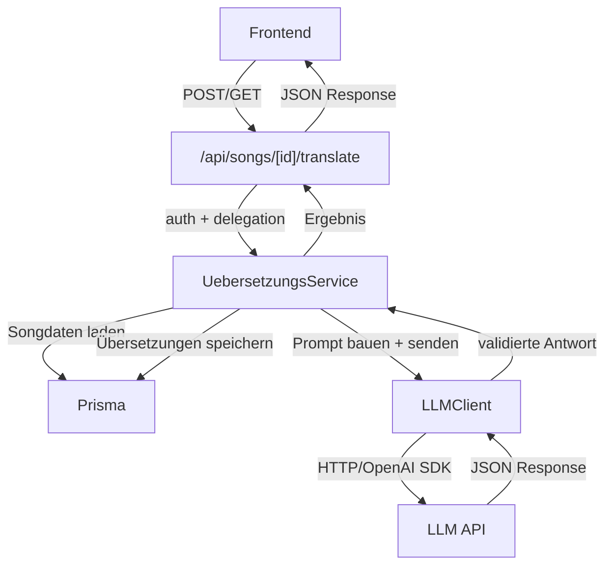

# Design-Dokument: Automatische Songtext-Übersetzung

## Übersicht

Dieses Design beschreibt die serverseitige LLM-Integration für die automatische zeilenweise Übersetzung von Songtexten in Lyco. Das Feature nutzt den bestehenden LLM-Client, um den gesamten Songtext in einem einzelnen LLM-Aufruf in eine konfigurierbare Zielsprache zu übersetzen. Die Übersetzungen werden im bestehenden Feld `uebersetzung` des Zeile-Modells gespeichert und stehen der Emotional-Lernen-Ansicht (Übersetzungs-Tab mit Aufdecken-Interaktion) ohne UI-Änderungen zur Verfügung.

Die Architektur folgt dem bewährten Muster der Smart-Song-Analysis: API-Route → Service → LLM-Client → Prisma. Der bestehende `llm-client.ts` wird wiederverwendet. Es sind keine Prisma-Schema-Änderungen erforderlich, da das Feld `uebersetzung` an der Zeile bereits existiert.

## Architektur



### Schichtenmodell

1. **API-Schicht** (`src/app/api/songs/[id]/translate/route.ts`): Authentifizierung, Request-Handling, HTTP-Statuscodes
2. **Service-Schicht** (`src/lib/services/uebersetzungs-service.ts`): Orchestrierung der Übersetzung, Prompt-Aufbau, Antwort-Validierung, Ergebnis-Speicherung, Concurrency-Guard
3. **LLM-Client** (`src/lib/services/llm-client.ts`): Bestehender OpenAI-SDK-Wrapper (wird wiederverwendet)
4. **Daten-Schicht** (Prisma): Bestehendes Zeile-Modell mit Feld `uebersetzung` (keine Schema-Änderung nötig)

## Komponenten und Schnittstellen

### 1. LLM-Client (`src/lib/services/llm-client.ts`) — bestehend

Der bestehende LLM-Client wird unverändert wiederverwendet. Er bietet:

```typescript
interface LLMClient {
  chat(messages: LLMMessage[]): Promise<string>;
}
```

- `response_format: { type: "json_object" }` ist bereits konfiguriert
- Timeout (30s) und Retry (2x) werden vom SDK gehandhabt
- Fehler werden als beschreibende Fehlermeldungen weitergegeben

### 2. Übersetzungs-Service (`src/lib/services/uebersetzungs-service.ts`)

Orchestriert die gesamte Übersetzungs-Pipeline. Folgt dem gleichen Muster wie `analyse-service.ts`.

```typescript
// Ergebnis-Typen
interface UebersetzungResult {
  songId: string;
  zielsprache: string;
  strophen: StropheUebersetzungResult[];
}

interface StropheUebersetzungResult {
  stropheId: string;
  stropheName: string;
  zeilen: ZeileUebersetzungResult[];
}

interface ZeileUebersetzungResult {
  zeileId: string;
  originalText: string;
  uebersetzung: string;
}

// Custom Error (analog zu AnalyseError)
class UebersetzungsError extends Error {
  statusCode: number;
  constructor(message: string, statusCode: number);
}

// Öffentliche API
async function translateSong(
  userId: string,
  songId: string,
  zielsprache?: string
): Promise<UebersetzungResult>;

async function getTranslation(
  userId: string,
  songId: string
): Promise<UebersetzungResult | null>;
```

**Ablauf von `translateSong`:**
1. Song mit Strophen und Zeilen laden (via Prisma, sortiert nach `orderIndex`)
2. Ownership prüfen (`userId === song.userId`)
3. Prüfen ob Song Strophen mit Zeilen hat (sonst Fehler 400)
4. Zielsprache validieren (leerer String → Fehler 400, `undefined` → Default „Deutsch")
5. Concurrency-Guard prüfen (In-Memory-Set mit aktiven Song-IDs)
6. Vollständigen Songtext mit Strophen-Struktur zusammenstellen
7. Einen einzelnen LLM-Aufruf mit kombiniertem Prompt senden
8. JSON-Antwort parsen und validieren (Zeilenanzahl pro Strophe muss übereinstimmen)
9. Übersetzungen zeilenweise im Feld `uebersetzung` speichern (via Prisma `update`)
10. Concurrency-Guard freigeben (im `finally`-Block)
11. Ergebnis zurückgeben

**Design-Entscheidung: Ein LLM-Aufruf für den gesamten Song:**
Analog zur Smart-Song-Analysis wird ein einzelner Prompt gesendet, der alle Strophen und Zeilen enthält und die Übersetzung als JSON-Objekt anfordert. Das reduziert Latenz, Kosten und Fehleranfälligkeit.

**Concurrency-Guard:**
Ein In-Memory-`Set<string>` speichert die Song-IDs, für die gerade eine Übersetzung läuft. Vor dem Start wird geprüft, ob die ID bereits enthalten ist (→ 409). Nach Abschluss (auch bei Fehler) wird die ID im `finally`-Block entfernt. Ausreichend für Single-Instance-Deployment.

### 3. Prompt-Builder (Teil des Übersetzungs-Service)

Die Prompt-Logik ist Teil des Übersetzungs-Service (keine separate Datei nötig).

**System-Prompt:**
```text
Du bist ein professioneller Songtext-Übersetzer. Übersetze Songtexte zeilenweise und bewahre dabei den poetischen Charakter und die emotionale Bedeutung des Originals.
Antworte ausschließlich als JSON-Objekt.
```

**User-Prompt-Struktur:**
```text
Übersetze den folgenden Songtext ins {zielsprache}.

Titel: {titel}
Künstler: {kuenstler}

Songtext:
[Strophe 1: {name}]
{zeile1}
{zeile2}
...

[Strophe 2: {name}]
{zeile1}
...

Liefere ein JSON-Objekt mit folgender Struktur:
{
  "strophen": [
    {
      "stropheIndex": 0,
      "uebersetzungen": ["Übersetzung Zeile 1", "Übersetzung Zeile 2", ...]
    },
    ...
  ]
}

Wichtig:
- Jede Originalzeile muss genau einer Übersetzungszeile zugeordnet sein.
- Die Reihenfolge der Übersetzungszeilen muss exakt der Reihenfolge der Originalzeilen entsprechen.
- Bewahre den poetischen Charakter und die emotionale Bedeutung.
```

**Antwort-Validierung (`validateUebersetzungResponse`):**
Die LLM-Antwort wird als JSON geparst und gegen folgende Regeln validiert:

- Root-Objekt muss ein `strophen`-Array enthalten
- Jedes Element muss `stropheIndex` (number) und `uebersetzungen` (string[]) enthalten
- Die Anzahl der Elemente in `strophen` muss der Anzahl der nicht-leeren Strophen entsprechen
- Die Anzahl der `uebersetzungen` pro Strophe muss der Anzahl der Originalzeilen entsprechen
- Jede Übersetzungszeile muss ein nicht-leerer String sein

Bei Validierungsfehler wird die Antwort verworfen und eine beschreibende Fehlermeldung zurückgegeben.

### 4. API-Route (`src/app/api/songs/[id]/translate/route.ts`)

Folgt dem bestehenden Muster der Analyse-Route.

**POST `/api/songs/[id]/translate`** — Übersetzung auslösen:
- Auth-Check via `auth()` → 401
- Optionalen `zielsprache`-Parameter aus Request-Body lesen
- `translateSong(userId, id, zielsprache)` aufrufen
- Erfolg: 200 mit `UebersetzungResult`
- Fehler-Mapping: 400, 403, 404, 409, 429, 500 je nach Fehlertyp

**GET `/api/songs/[id]/translate`** — Gespeicherte Übersetzungen abrufen:
- Auth-Check via `auth()` → 401
- `getTranslation(userId, id)` aufrufen
- Erfolg: 200 mit `UebersetzungResult` oder `null`
- Fehler-Mapping: 403, 404, 500

## Datenmodell

### Bestehendes Schema (keine Änderung erforderlich)

Das Feld `uebersetzung` existiert bereits am Zeile-Modell:

```prisma
model Zeile {
  id           String  @id @default(cuid())
  text         String
  uebersetzung String?   // ← wird vom Übersetzungs-Service beschrieben
  orderIndex   Int
  stropheId    String
  strophe      Strophe @relation(fields: [stropheId], references: [id], onDelete: Cascade)
  markups      Markup[]
  @@map("zeilen")
}
```

Es sind keine Prisma-Migrationen erforderlich. Die bestehende Emotional-Lernen-Ansicht liest das Feld `uebersetzung` bereits aus und zeigt es im Übersetzungs-Tab mit Aufdecken-Interaktion an.

### Typen-Erweiterungen (`src/types/song.ts`)

```typescript
// Übersetzungs-spezifische Typen
export interface UebersetzungResult {
  songId: string;
  zielsprache: string;
  strophen: StropheUebersetzungResult[];
}

export interface StropheUebersetzungResult {
  stropheId: string;
  stropheName: string;
  zeilen: ZeileUebersetzungResult[];
}

export interface ZeileUebersetzungResult {
  zeileId: string;
  originalText: string;
  uebersetzung: string;
}
```

Das bestehende `ZeileDetail`-Interface enthält bereits `uebersetzung: string | null` — die GET-Route der Song-Detail-API liefert die Übersetzungen also automatisch mit.

