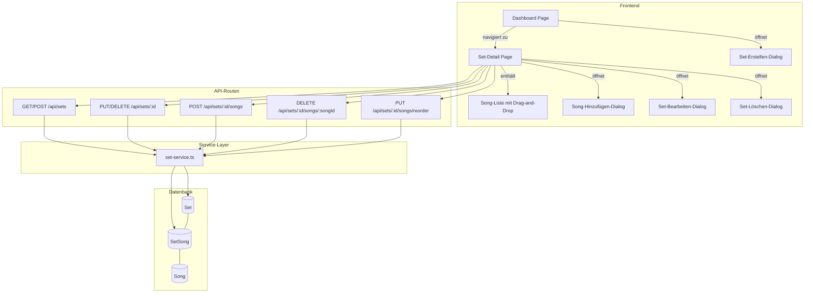

# Design-Dokument: Song-Sets

## Übersicht

Dieses Design erweitert den SongTextTrainer um eine vollständige Set-Verwaltung. Aktuell existiert bereits ein grundlegendes Datenmodell (`Set` → `SetSong` → `Song`) mit einfachen CRUD-Operationen und einer Dashboard-Integration. Es fehlen jedoch wesentliche Funktionen: Set-Beschreibung, Sortierung der Songs innerhalb eines Sets (`orderIndex`), eine dedizierte Set-Detailansicht, Validierungsgrenzen (Name max. 100 Zeichen, Beschreibung max. 500 Zeichen), ein Bestätigungsdialog beim Löschen und ein „+ Neues Set"-Button im Dashboard.

Das Design baut auf den bestehenden Mustern der Codebasis auf:
- **API-Routen**: Next.js App Router unter `src/app/api/sets/...` mit `auth()`-Prüfung
- **Service-Layer**: `src/lib/services/set-service.ts` mit Eigentümerprüfung und Fehler-Throwing
- **Komponenten**: React Client Components unter `src/components/songs/`
- **Typen**: Zentrale Typdefinitionen in `src/types/song.ts`
- **Testing**: Vitest + fast-check für Property-Based Tests

## Architektur

Die Architektur folgt dem bestehenden Schichtmodell der Anwendung:



### Neue Routen und Seiten

| Route | Typ | Beschreibung |
|---|---|---|
| `/sets/[id]` | Seite | Set-Detailansicht |
| `PUT /api/sets/[id]` | API (erweitert) | Name + Beschreibung aktualisieren |
| `POST /api/sets` | API (erweitert) | Name + Beschreibung beim Erstellen |
| `PUT /api/sets/[id]/songs/reorder` | API (neu) | Song-Reihenfolge aktualisieren |

## Komponenten und Schnittstellen

### Neue Komponenten


#### 1. `SetDetailPage` (`src/app/(main)/sets/[id]/page.tsx`)
- Client Component, analog zu `SongDetailPage`
- Lädt Set-Daten via `GET /api/sets/[id]` (erweitert um Songs mit Fortschritt)
- Zeigt Set-Name, Beschreibung, Song-Anzahl, Song-Liste
- Aktionen: Bearbeiten, Löschen, Songs hinzufügen/entfernen, Reihenfolge ändern
- Zurück-Link zum Dashboard

#### 2. `SetEditDialog` (`src/components/songs/set-edit-dialog.tsx`)
- Modal-Dialog zum Erstellen und Bearbeiten von Sets
- Felder: Name (required, max 100 Zeichen), Beschreibung (optional, max 500 Zeichen)
- Validierung im Frontend und Backend
- Wiederverwendbar für Erstellen (POST) und Bearbeiten (PUT)

#### 3. `SetDeleteDialog` (`src/components/songs/set-delete-dialog.tsx`)
- Bestätigungsdialog analog zu `SongDeleteDialog`
- Warnung: „Alle Song-Zuordnungen werden entfernt, die Songs bleiben erhalten"
- Fokus-Management und Escape-Taste wie bei `SongDeleteDialog`

#### 4. `SetSongList` (`src/components/songs/set-song-list.tsx`)
- Sortierbare Song-Liste mit Drag-and-Drop (HTML Drag and Drop API)
- Zeigt pro Song: Titel, Künstler, Fortschrittsbalken, Session-Anzahl, StatusPunkt
- Entfernen-Button pro Song
- Klick auf Song navigiert zur Song-Detailseite

#### 5. `AddSongToSetDialog` (`src/components/songs/add-song-to-set-dialog.tsx`)
- Modal-Dialog zur Auswahl von Songs, die dem Set hinzugefügt werden sollen
- Zeigt alle Songs des Nutzers, die noch nicht im Set sind
- Mehrfachauswahl möglich

### Erweiterte Komponenten

#### `SetCard` (erweitert)
- Wird zu einem Link zur Set-Detailansicht (`/sets/[id]`)
- Zeigt zusätzlich die letzte Aktivität an

#### `DashboardPage` (erweitert)
- „+ Neues Set"-Button neben der Sets-Überschrift
- Sets werden immer angezeigt (auch wenn leer), mit dem Erstellen-Button

### API-Schnittstellen

#### `GET /api/sets/[id]` (neu)
Gibt Set-Details mit allen Songs inkl. Fortschritt zurück.

```typescript
// Response
{
  set: {
    id: string;
    name: string;
    description: string | null;
    songCount: number;
    songs: Array<{
      id: string;
      titel: string;
      kuenstler: string | null;
      sprache: string | null;
      coverUrl: string | null;
      progress: number;
      sessionCount: number;
      status: "neu" | "aktiv" | "gelernt";
      orderIndex: number;
    }>;
  }
}
```

#### `POST /api/sets` (erweitert)
```typescript
// Request Body
{ name: string; description?: string }
```

#### `PUT /api/sets/[id]` (erweitert)
```typescript
// Request Body
{ name: string; description?: string }
```

#### `PUT /api/sets/[id]/songs/reorder` (neu)
```typescript
// Request Body
{ items: Array<{ songId: string; orderIndex: number }> }
```

## Datenmodell

### Schema-Änderungen (Prisma)

Das bestehende `Set`-Modell wird um ein `description`-Feld erweitert, und `SetSong` erhält ein `orderIndex`-Feld:

```prisma
model Set {
  id          String    @id @default(cuid())
  name        String    @db.VarChar(100)
  description String?   @db.VarChar(500)
  userId      String
  createdAt   DateTime  @default(now())
  updatedAt   DateTime  @updatedAt

  user  User      @relation(fields: [userId], references: [id], onDelete: Cascade)
  songs SetSong[]

  @@map("sets")
}

model SetSong {
  id         String   @id @default(cuid())
  setId      String
  songId     String
  orderIndex Int      @default(0)
  createdAt  DateTime @default(now())

  set  Set  @relation(fields: [setId], references: [id], onDelete: Cascade)
  song Song @relation(fields: [songId], references: [id], onDelete: Cascade)

  @@unique([setId, songId])
  @@map("set_songs")
}
```

### Neue Typen (`src/types/song.ts`)

```typescript
// Eingabe
export interface CreateSetInput {
  name: string;
  description?: string;
}

export interface UpdateSetInput {
  name: string;
  description?: string;
}

export interface ReorderSetSongItem {
  songId: string;
  orderIndex: number;
}

// Ausgabe
export interface SetDetail {
  id: string;
  name: string;
  description: string | null;
  songCount: number;
  songs: SetSongWithProgress[];
}

export interface SetSongWithProgress {
  id: string;
  titel: string;
  kuenstler: string | null;
  sprache: string | null;
  coverUrl: string | null;
  progress: number;
  sessionCount: number;
  status: "neu" | "aktiv" | "gelernt";
  orderIndex: number;
}

// Dashboard (erweitert)
export interface SetWithSongCount {
  id: string;
  name: string;
  description: string | null;  // NEU
  songCount: number;
  lastActivity: string | null;
  createdAt: string;
}
```

### Migration

Eine neue Prisma-Migration fügt hinzu:
1. `sets.description` — `VARCHAR(500)`, nullable
2. `set_songs.order_index` — `INT`, default `0`


## Korrektheitseigenschaften

*Eine Korrektheitseigenschaft ist ein Merkmal oder Verhalten, das über alle gültigen Ausführungen eines Systems hinweg gelten sollte — im Wesentlichen eine formale Aussage darüber, was das System tun soll. Eigenschaften bilden die Brücke zwischen menschenlesbaren Spezifikationen und maschinenverifizierbaren Korrektheitsgarantien.*

### Property 1: Set-Erstellung Round-Trip

*Für jedes* gültige Paar aus Name (1–100 Zeichen, nicht nur Leerzeichen) und optionaler Beschreibung (0–500 Zeichen), wenn ein Set erstellt wird, dann soll das zurückgegebene Set denselben Namen (getrimmt) und dieselbe Beschreibung enthalten und dem authentifizierten Nutzer zugeordnet sein.

**Validates: Requirements 1.1, 8.2**

### Property 2: Set-Aktualisierung Round-Trip

*Für jedes* existierende Set und jede gültige Kombination aus neuem Namen und neuer Beschreibung, wenn das Set aktualisiert und anschließend gelesen wird, sollen die gelesenen Werte den aktualisierten Werten entsprechen.

**Validates: Requirements 2.1**

### Property 3: Leere Namen werden abgelehnt

*Für jeden* String, der ausschließlich aus Leerzeichen besteht (einschließlich des leeren Strings), soll das Erstellen oder Aktualisieren eines Sets mit diesem Namen fehlschlagen und das Set unverändert bleiben.

**Validates: Requirements 1.2**

### Property 4: Feldlängen-Validierung

*Für jeden* Namen mit mehr als 100 Zeichen oder jede Beschreibung mit mehr als 500 Zeichen soll die Set-Erstellung oder -Aktualisierung abgelehnt werden.

**Validates: Requirements 1.3, 8.1**

### Property 5: Eigentümerprüfung bei Schreiboperationen

*Für jedes* Set und jeden Nutzer, der nicht der Eigentümer ist, sollen alle Schreiboperationen (Aktualisieren, Löschen, Songs hinzufügen, Songs entfernen, Reihenfolge ändern) mit einem „Zugriff verweigert"-Fehler abgelehnt werden.

**Validates: Requirements 2.2, 3.3, 5.2, 10.3**

### Property 6: Löschen bewahrt Songs

*Für jedes* Set mit beliebig vielen Songs, wenn das Set gelöscht wird, sollen alle Song-Zuordnungen (SetSong) entfernt werden, aber die Songs selbst weiterhin existieren.

**Validates: Requirements 3.1**

### Property 7: Song hinzufügen und entfernen Round-Trip

*Für jedes* Set und jeden Song, wenn der Song zum Set hinzugefügt und anschließend wieder entfernt wird, soll der Song nicht mehr im Set enthalten sein, aber weiterhin als eigenständiger Song existieren.

**Validates: Requirements 4.1, 5.1**

### Property 8: Doppelte Song-Zuordnung wird abgelehnt

*Für jedes* Set und jeden Song, der bereits im Set enthalten ist, soll ein erneutes Hinzufügen desselben Songs fehlschlagen mit der Meldung „Song ist bereits im Set".

**Validates: Requirements 4.2**

### Property 9: Song in mehreren Sets

*Für jeden* Song und je zwei verschiedene Sets desselben Nutzers soll der Song beiden Sets gleichzeitig zugeordnet werden können.

**Validates: Requirements 4.3**

### Property 10: Neuer Song erhält höchsten orderIndex + 1

*Für jedes* Set mit bestehenden Songs, wenn ein neuer Song hinzugefügt wird, soll dessen orderIndex gleich dem höchsten bestehenden orderIndex + 1 sein.

**Validates: Requirements 6.4**

### Property 11: Reihenfolge-Änderung Round-Trip

*Für jedes* Set mit Songs und jede gültige Permutation der orderIndex-Werte, wenn die Reihenfolge aktualisiert und anschließend gelesen wird, sollen die Songs in der neuen Reihenfolge zurückgegeben werden.

**Validates: Requirements 6.2, 6.3**

### Property 12: Set-Detail enthält vollständige Daten

*Für jedes* Set mit Songs soll die Detail-Antwort den Set-Namen, die Beschreibung, die korrekte Song-Anzahl und für jeden Song den Titel, Künstler, Fortschritt, Session-Anzahl und Status enthalten.

**Validates: Requirements 7.1, 7.2, 9.2**

### Property 13: Dashboard-Sets nach Aktualisierungsdatum sortiert

*Für jeden* Nutzer mit mehreren Sets soll die Liste der Sets absteigend nach dem letzten Aktualisierungsdatum sortiert sein.

**Validates: Requirements 9.1**

### Property 14: Nutzer-Isolation

*Für je zwei* verschiedene Nutzer soll das Auflisten der Sets für Nutzer A niemals Sets zurückgeben, die Nutzer B gehören.

**Validates: Requirements 10.1**

### Property 15: Nicht-authentifizierter Zugriff wird abgelehnt

*Für jede* API-Anfrage ohne gültige Authentifizierung soll der HTTP-Statuscode 401 zurückgegeben werden.

**Validates: Requirements 10.2**

## Fehlerbehandlung

| Szenario | HTTP-Status | Fehlermeldung |
|---|---|---|
| Nicht authentifiziert | 401 | „Nicht authentifiziert" |
| Set nicht gefunden | 404 | „Set nicht gefunden" |
| Zugriff verweigert (fremdes Set) | 403 | „Zugriff verweigert" |
| Leerer Name | 400 | „Name ist erforderlich" |
| Name > 100 Zeichen | 400 | „Name darf maximal 100 Zeichen lang sein" |
| Beschreibung > 500 Zeichen | 400 | „Beschreibung darf maximal 500 Zeichen lang sein" |
| Song bereits im Set | 409 | „Song ist bereits im Set" |
| Song nicht gefunden | 404 | „Song nicht gefunden" |
| Interner Fehler | 500 | „Interner Serverfehler" |

Die Fehlerbehandlung folgt dem bestehenden Muster: Service-Funktionen werfen `Error`-Objekte mit spezifischen Meldungen, die API-Routen fangen diese ab und mappen sie auf HTTP-Statuscodes. Frontend-Komponenten zeigen Fehlermeldungen in `role="alert"`-Elementen an.

## Teststrategie

### Dualer Testansatz

Die Teststrategie kombiniert Unit-Tests für spezifische Beispiele und Edge-Cases mit Property-Based Tests für universelle Eigenschaften.

### Unit-Tests

Unit-Tests fokussieren sich auf:
- Spezifische Beispiele für API-Endpunkte (Erstellen, Lesen, Aktualisieren, Löschen)
- Edge-Cases: leerer Name, maximale Feldlängen, nicht existierende IDs
- Integrationspunkte: Dashboard-API mit Set-Daten, Set-Detail mit Song-Fortschritt
- UI-Komponenten: Dialog-Rendering, Fokus-Management, Bestätigungsdialog

### Property-Based Tests

Property-Based Tests verwenden **fast-check** (bereits im Projekt als Dependency vorhanden) mit **Vitest**.

Konfiguration:
- Minimum 100 Iterationen pro Property-Test (via `{ numRuns: 100 }`)
- Jeder Test referenziert die zugehörige Design-Property im Kommentar
- Tag-Format: `Feature: song-sets, Property {number}: {property_text}`

Testdateien:
- `__tests__/sets/set-crud.property.test.ts` — Properties 1–4 (CRUD + Validierung)
- `__tests__/sets/set-access-control.property.test.ts` — Properties 5, 14, 15 (Zugriffskontrolle)
- `__tests__/sets/set-songs.property.test.ts` — Properties 6–9 (Song-Zuordnung)
- `__tests__/sets/set-ordering.property.test.ts` — Properties 10–11 (Reihenfolge)
- `__tests__/sets/set-detail.property.test.ts` — Properties 12–13 (Detail + Dashboard)

Jeder Property-Test wird als einzelner `fc.assert`-Aufruf implementiert, der die entsprechende Eigenschaft über zufällig generierte Eingaben validiert. Die Tests mocken `prisma` analog zu den bestehenden Tests (z.B. `__tests__/admin/user-crud.property.test.ts`).
