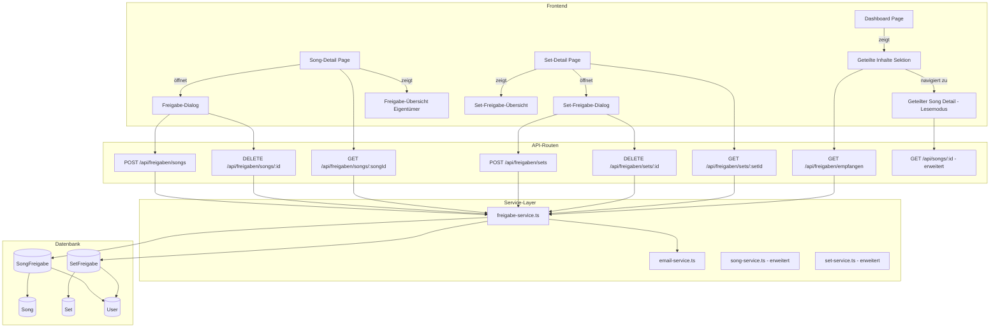

# Design-Dokument: Song-Sharing

## Übersicht

Dieses Design erweitert den SongTextTrainer um ein gezieltes Freigabesystem für Songs und Sets. Nutzer können ihre Inhalte mit anderen registrierten Nutzern teilen — nicht öffentlich, sondern ausschließlich per Nutzer-Auswahl. Empfänger erhalten Lesezugriff auf geteilte Songs (inkl. Songtext, Strophen, Audio-Quellen, Cover), können aber keine Inhalte bearbeiten. Jeder Empfänger erhält eigene, unabhängige Lerndaten (Fortschritt, Sessions, Notizen, Interpretationen).

Das Design führt zwei neue Prisma-Modelle ein (`SongFreigabe`, `SetFreigabe`), einen neuen Service-Layer (`freigabe-service.ts`), API-Routen unter `/api/freigaben/...`, UI-Komponenten für Freigabe-Dialoge und eine neue Dashboard-Sektion „Mit mir geteilt". Set-Freigaben vererben den Zugriff auf alle Songs im Set — auch auf nachträglich hinzugefügte.

Das Design baut auf den bestehenden Mustern der Codebasis auf:

- **API-Routen**: Next.js App Router mit `auth()`-Prüfung
- **Service-Layer**: Eigentümerprüfung und Fehler-Throwing
- **Komponenten**: React Client Components
- **Typen**: Zentrale Typdefinitionen in `src/types/song.ts`
- **Testing**: Vitest + fast-check für Property-Based Tests

## Architektur



### Neue Routen und Seiten

| Route | Typ | Beschreibung |
| --- | --- | --- |
| `POST /api/freigaben/songs` | API | Song-Freigabe erstellen |
| `DELETE /api/freigaben/songs/[id]` | API | Song-Freigabe widerrufen |
| `GET /api/freigaben/songs/[songId]` | API | Freigaben eines Songs auflisten |
| `POST /api/freigaben/sets` | API | Set-Freigabe erstellen |
| `DELETE /api/freigaben/sets/[id]` | API | Set-Freigabe widerrufen |
| `GET /api/freigaben/sets/[setId]` | API | Freigaben eines Sets auflisten |
| `GET /api/freigaben/empfangen` | API | Alle empfangenen Freigaben auflisten |

### Erweiterte Routen

| Route | Änderung |
| --- | --- |
| `GET /api/songs/[id]` | Zugriff auch für Empfänger mit aktiver Freigabe (Lesemodus) |
| `GET /api/dashboard` | Neue Sektion `geteilteInhalte` mit empfangenen Songs/Sets |

## Komponenten und Schnittstellen

### Neue Komponenten

#### 1. `FreigabeDialog` (`src/components/sharing/freigabe-dialog.tsx`)

- Modal-Dialog zum Teilen eines Songs oder Sets
- Eingabefeld für E-Mail-Adresse des Empfängers
- Validierung: E-Mail-Format, Nutzer existiert, keine Selbst-Freigabe, keine Duplikate
- Zeigt Erfolgs-/Fehlermeldung nach Absenden

#### 2. `FreigabeUebersicht` (`src/components/sharing/freigabe-uebersicht.tsx`)

- Liste aller Empfänger einer Freigabe (Name, E-Mail)
- Widerrufen-Button pro Empfänger mit Bestätigungsdialog
- Wird in Song-Detail und Set-Detail eingebettet (nur für Eigentümer sichtbar)

#### 3. `GeteilteInhalteSektion` (`src/components/sharing/geteilte-inhalte-sektion.tsx`)

- Dashboard-Sektion „Mit mir geteilt"
- Zeigt geteilte Sets (aufklappbar mit Songs) und einzeln geteilte Songs
- Gleiche Struktur wie eigene Sets/Songs, aber mit Eigentümer-Name
- Nur sichtbar wenn mindestens eine aktive Freigabe vorhanden

#### 4. `GeteilterSongBadge` (`src/components/sharing/geteilter-song-badge.tsx`)

- Kleines Badge/Label das anzeigt „Geteilt von [Name]"
- Wird in der Song-Detail-Ansicht für geteilte Songs angezeigt

### Erweiterte Komponenten

#### `DashboardPage` (erweitert)

- Neue Sektion nach „Ohne Set": `GeteilteInhalteSektion`
- Daten kommen aus erweiterter Dashboard-API

#### `SongDetailPage` (erweitert)

- Eigentümer: Zeigt `FreigabeUebersicht` + „Teilen"-Button
- Empfänger: Zeigt `GeteilterSongBadge`, blendet Bearbeitungsfunktionen aus
- Zugriffsprüfung erweitert: Eigentümer ODER aktive Freigabe

#### `SetDetailPage` (erweitert)

- Eigentümer: Zeigt `FreigabeUebersicht` + „Teilen"-Button für Set

### API-Schnittstellen

#### `POST /api/freigaben/songs`

```typescript
// Request Body
{ songId: string; empfaengerEmail: string }

// Response 201
{ id: string; songId: string; empfaengerId: string; erstelltAm: string }
```

#### `DELETE /api/freigaben/songs/[id]`

```typescript
// Response 204 (kein Body)
```

#### `GET /api/freigaben/songs/[songId]`

```typescript
// Response 200
{
  freigaben: Array<{
    id: string;
    empfaenger: { id: string; name: string; email: string };
    erstelltAm: string;
  }>
}
```

#### `POST /api/freigaben/sets`

```typescript
// Request Body
{ setId: string; empfaengerEmail: string }

// Response 201
{ id: string; setId: string; empfaengerId: string; erstelltAm: string }
```

#### `DELETE /api/freigaben/sets/[id]`

```typescript
// Response 204 (kein Body)
```

#### `GET /api/freigaben/sets/[setId]`

```typescript
// Response 200
{
  freigaben: Array<{
    id: string;
    empfaenger: { id: string; name: string; email: string };
    erstelltAm: string;
  }>
}
```

#### `GET /api/freigaben/empfangen`

```typescript
// Response 200
{
  sets: Array<{
    freigabeId: string;
    set: { id: string; name: string; description: string | null };
    eigentuemerName: string;
    songs: Array<SongWithProgress>;
  }>;
  songs: Array<{
    freigabeId: string;
    song: SongWithProgress;
    eigentuemerName: string;
  }>;
}
```

#### `GET /api/songs/[id]` (erweitert)

Bestehende Route wird erweitert: Wenn der anfragende Nutzer nicht Eigentümer ist, wird geprüft ob eine aktive Song- oder Set-Freigabe besteht. Falls ja, wird der Song im Lesemodus zurückgegeben (zusätzliches Feld `istFreigabe: true`, `eigentuemerName: string`).

#### `GET /api/dashboard` (erweitert)

Response wird um `geteilteInhalte` erweitert:

```typescript
// Zusätzlich in DashboardData
{
  geteilteInhalte: {
    sets: Array<{
      freigabeId: string;
      set: { id: string; name: string; description: string | null };
      eigentuemerName: string;
      songs: Array<SongWithProgress>;
    }>;
    songs: Array<{
      freigabeId: string;
      song: SongWithProgress;
      eigentuemerName: string;
    }>;
  }
}
```

## Datenmodell

### Neue Prisma-Modelle

```prisma
model SongFreigabe {
  id            String   @id @default(cuid())
  songId        String
  eigentuemerId String
  empfaengerId  String
  createdAt     DateTime @default(now())

  song        Song @relation(fields: [songId], references: [id], onDelete: Cascade)
  eigentuemer User @relation("SongFreigabenAlsEigentuemer", fields: [eigentuemerId], references: [id], onDelete: Cascade)
  empfaenger  User @relation("SongFreigabenAlsEmpfaenger", fields: [empfaengerId], references: [id], onDelete: Cascade)

  @@unique([songId, empfaengerId])
  @@map("song_freigaben")
}

model SetFreigabe {
  id            String   @id @default(cuid())
  setId         String
  eigentuemerId String
  empfaengerId  String
  createdAt     DateTime @default(now())

  set         Set  @relation(fields: [setId], references: [id], onDelete: Cascade)
  eigentuemer User @relation("SetFreigabenAlsEigentuemer", fields: [eigentuemerId], references: [id], onDelete: Cascade)
  empfaenger  User @relation("SetFreigabenAlsEmpfaenger", fields: [empfaengerId], references: [id], onDelete: Cascade)

  @@unique([setId, empfaengerId])
  @@map("set_freigaben")
}
```

### Schema-Erweiterungen (bestehende Modelle)

```prisma
// User — neue Relationen
model User {
  // ... bestehende Felder ...
  songFreigabenAlsEigentuemer SongFreigabe[] @relation("SongFreigabenAlsEigentuemer")
  songFreigabenAlsEmpfaenger SongFreigabe[] @relation("SongFreigabenAlsEmpfaenger")
  setFreigabenAlsEigentuemer  SetFreigabe[]  @relation("SetFreigabenAlsEigentuemer")
  setFreigabenAlsEmpfaenger  SetFreigabe[]  @relation("SetFreigabenAlsEmpfaenger")
}

// Song — neue Relation
model Song {
  // ... bestehende Felder ...
  freigaben SongFreigabe[]
}

// Set — neue Relation
model Set {
  // ... bestehende Felder ...
  freigaben SetFreigabe[]
}
```

### Neue TypeScript-Typen (`src/types/song.ts`)

```typescript
// Freigabe-Eingabe
export interface CreateSongFreigabeInput {
  songId: string;
  empfaengerEmail: string;
}

export interface CreateSetFreigabeInput {
  setId: string;
  empfaengerEmail: string;
}

// Freigabe-Ausgabe
export interface FreigabeEmpfaenger {
  id: string;
  empfaenger: { id: string; name: string; email: string };
  erstelltAm: string;
}

// Empfangene Freigaben
export interface EmpfangenesSet {
  freigabeId: string;
  set: { id: string; name: string; description: string | null };
  eigentuemerName: string;
  songs: SongWithProgress[];
}

export interface EmpfangenerSong {
  freigabeId: string;
  song: SongWithProgress;
  eigentuemerName: string;
}

export interface GeteilteInhalte {
  sets: EmpfangenesSet[];
  songs: EmpfangenerSong[];
}

// DashboardData erweitert
export interface DashboardData {
  // ... bestehende Felder ...
  geteilteInhalte: GeteilteInhalte;
}
```

### Designentscheidungen

1. **Set-Freigabe vererbt dynamisch**: Kein separates `SongFreigabe`-Record pro Song im Set. Stattdessen prüft die Zugriffskontrolle: „Hat der Nutzer eine direkte `SongFreigabe` ODER gehört der Song zu einem Set mit aktiver `SetFreigabe`?" Das vermeidet Synchronisationsprobleme beim Hinzufügen/Entfernen von Songs.

2. **`eigentuemerId` in Freigabe-Tabelle**: Redundant zum `Song.userId` / `Set.userId`, aber ermöglicht effiziente Queries ohne Join auf Song/Set und macht die Eigentümerschaft zum Zeitpunkt der Freigabe explizit.

3. **Lerndaten bleiben unberührt**: Fortschritt, Sessions, Notizen und Interpretationen sind bereits über `userId` nutzerspezifisch. Keine Schema-Änderung nötig — der Empfänger erstellt einfach eigene Records mit seiner `userId`.

4. **Kein öffentliches Link-Sharing**: Bewusste Entscheidung für gezielte Freigabe per E-Mail. Kein Token-basierter Zugriff, keine öffentlichen URLs.

5. **E-Mail-Service optional**: Der `email-service.ts` prüft ob SMTP-Umgebungsvariablen gesetzt sind. Falls nicht, wird die Freigabe trotzdem erstellt und der E-Mail-Versand übersprungen. Fehler beim Versand werden geloggt, blockieren aber nicht die Freigabe.

### Migration

Eine neue Prisma-Migration erstellt:

1. Tabelle `song_freigaben` mit Unique-Constraint auf `[songId, empfaengerId]`
2. Tabelle `set_freigaben` mit Unique-Constraint auf `[setId, empfaengerId]`
3. Foreign Keys mit `onDelete: Cascade` zu Song, Set und User


## Korrektheitseigenschaften

*Eine Korrektheitseigenschaft ist ein Merkmal oder Verhalten, das über alle gültigen Ausführungen eines Systems hinweg gelten sollte — im Wesentlichen eine formale Aussage darüber, was das System tun soll. Eigenschaften bilden die Brücke zwischen menschenlesbaren Spezifikationen und maschinenverifizierbaren Korrektheitsgarantien.*

### Property 1: Freigabe-Erstellung Round-Trip

*Für jeden* Song (oder Set) und jeden gültigen Empfänger, wenn der Eigentümer eine Freigabe erstellt und anschließend die Freigaben des Songs (oder Sets) abfragt, soll der Empfänger in der Liste enthalten sein und der Empfänger soll Lesezugriff auf den Song (oder das Set) haben.

**Validates: Requirements 1.1, 2.1**

### Property 2: Keine doppelten Freigaben

*Für jeden* Song (oder Set) und jeden Empfänger, wenn bereits eine aktive Freigabe besteht, soll ein erneuter Freigabe-Versuch mit einem Fehler abgelehnt werden und die Anzahl der Freigaben unverändert bleiben.

**Validates: Requirements 1.2, 2.3**

### Property 3: Selbst-Freigabe wird abgelehnt

*Für jeden* Nutzer und jeden Song (oder Set), den dieser Nutzer besitzt, soll der Versuch, den Song (oder das Set) an sich selbst freizugeben, mit der Fehlermeldung „Freigabe an sich selbst ist nicht möglich" abgelehnt werden.

**Validates: Requirements 1.3, 2.4**

### Property 4: Nur der Eigentümer kann Freigaben verwalten

*Für jeden* Song (oder Set) und jeden Nutzer, der nicht der Eigentümer ist, sollen alle Freigabe-Verwaltungsoperationen (Erstellen, Widerrufen, Auflisten) mit einem Zugriffsfehler abgelehnt werden.

**Validates: Requirements 1.5, 2.5, 3.3, 9.2**

### Property 5: Set-Freigabe gewährt Zugriff auf alle Songs im Set

*Für jedes* Set mit beliebig vielen Songs, wenn das Set freigegeben wird, soll der Empfänger Lesezugriff auf jeden einzelnen Song im Set haben.

**Validates: Requirements 2.1**

### Property 6: Neuer Song in geteiltem Set erbt Zugriff

*Für jedes* geteilte Set, wenn der Eigentümer einen neuen Song zum Set hinzufügt, soll der Empfänger automatisch Lesezugriff auf den neuen Song haben, ohne dass eine separate Freigabe erstellt werden muss.

**Validates: Requirements 2.2**

### Property 7: Widerruf einer Song-Freigabe entzieht Zugriff

*Für jede* aktive Song-Freigabe, wenn der Eigentümer die Freigabe widerruft, soll der Empfänger keinen Zugriff mehr auf den Song haben (sofern keine Set-Freigabe den Zugriff gewährt).

**Validates: Requirements 3.1**

### Property 8: Widerruf einer Set-Freigabe entzieht Zugriff auf Set und Songs

*Für jede* aktive Set-Freigabe, wenn der Eigentümer die Freigabe widerruft, soll der Empfänger keinen Zugriff mehr auf das Set und alle Songs haben, die ausschließlich über diese Set-Freigabe zugänglich waren.

**Validates: Requirements 3.2**

### Property 9: Widerruf bewahrt Lerndaten

*Für jede* Freigabe, die widerrufen wird, sollen alle Lerndaten des Empfängers (Fortschritt, Sessions, Notizen, Interpretationen) für den betroffenen Song erhalten bleiben.

**Validates: Requirements 3.4**

### Property 10: Geteilte Inhalte im Dashboard enthalten vollständige Daten

*Für jeden* Empfänger mit aktiven Freigaben soll die Dashboard-API geteilte Sets mit Name, Beschreibung, Song-Anzahl und geteilte Songs mit Titel, Künstler, Cover und dem eigenen Fortschritt des Empfängers zurückgeben.

**Validates: Requirements 4.1, 4.3, 4.4, 6.5**

### Property 11: Geteilter Song-Detail enthält vollständigen Inhalt und Eigentümer-Name

*Für jeden* geteilten Song soll die Detail-Antwort den Songtext, die Strophen, die Zeilen, die Audio-Quellen, das Cover und den Namen des Eigentümers enthalten.

**Validates: Requirements 5.1, 5.4**

### Property 12: Schreiboperationen auf geteilte Songs werden abgelehnt

*Für jeden* geteilten Song und jede Schreiboperation (Aktualisieren, Löschen, Strophen bearbeiten, Audio-Quellen ändern), soll der Empfänger den HTTP-Statuscode 403 erhalten.

**Validates: Requirements 5.3**

### Property 13: Empfänger erstellen unabhängige Lerndaten

*Für jeden* geteilten Song soll der Empfänger eigene Sessions, Fortschritt, Notizen und Interpretationen erstellen können, die seiner eigenen `userId` zugeordnet sind.

**Validates: Requirements 6.1, 6.2**

### Property 14: Lerndaten-Isolation zwischen Eigentümer und Empfänger

*Für jeden* geteilten Song sollen die Lerndaten (Fortschritt, Notizen, Interpretationen) des Eigentümers und des Empfängers vollständig voneinander isoliert sein — das Abfragen der Lerndaten für Nutzer A darf niemals Daten von Nutzer B zurückgeben.

**Validates: Requirements 6.3, 6.4**

### Property 15: Freigabe-Übersicht listet alle Empfänger mit Details

*Für jeden* Song (oder Set) mit beliebig vielen Freigaben soll die Freigabe-Übersicht alle Empfänger mit Name und E-Mail-Adresse auflisten.

**Validates: Requirements 7.1, 7.2, 7.3**

### Property 16: E-Mail-Benachrichtigung bei Freigabe-Erstellung

*Für jede* neue Freigabe, wenn SMTP konfiguriert ist, soll eine E-Mail an den Empfänger gesendet werden, die den Namen des Eigentümers und den Titel des Songs (oder Sets) enthält.

**Validates: Requirements 8.1**

### Property 17: Zugriff ohne Freigabe oder Eigentümerschaft wird abgelehnt

*Für jeden* Song (oder Set) und jeden Nutzer, der weder Eigentümer ist noch eine aktive Freigabe hat, soll der Zugriff mit HTTP-Statuscode 403 abgelehnt werden.

**Validates: Requirements 9.3, 9.4**

### Property 18: Entfernen eines Songs aus geteiltem Set entzieht Zugriff

*Für jedes* geteilte Set, wenn ein Song aus dem Set entfernt wird, soll der Empfänger keinen Zugriff mehr auf diesen Song über die Set-Freigabe haben (sofern keine separate Song-Freigabe besteht).

**Validates: Requirements 9.5**

### Property 19: Kaskadierendes Löschen entfernt alle Freigaben

*Für jeden* Song (oder Set) mit beliebig vielen Freigaben, wenn der Song (oder das Set) gelöscht wird, sollen alle zugehörigen Freigaben automatisch gelöscht werden.

**Validates: Requirements 10.1, 10.2**

### Property 20: Löschen eines Songs aus geteiltem Set bewahrt Set-Freigabe

*Für jedes* geteilte Set mit mehreren Songs, wenn ein Song gelöscht wird, soll die Set-Freigabe bestehen bleiben und der Empfänger weiterhin Zugriff auf die verbleibenden Songs haben.

**Validates: Requirements 10.3**

## Fehlerbehandlung

| Szenario | HTTP-Status | Fehlermeldung |
| --- | --- | --- |
| Nicht authentifiziert | 401 | „Nicht authentifiziert" |
| Song/Set nicht gefunden | 404 | „Song nicht gefunden" / „Set nicht gefunden" |
| Zugriff verweigert (kein Eigentümer) | 403 | „Zugriff verweigert" |
| Empfänger nicht gefunden | 404 | „Nutzer nicht gefunden" |
| Freigabe an sich selbst | 400 | „Freigabe an sich selbst ist nicht möglich" |
| Song bereits freigegeben | 409 | „Song ist bereits für diesen Nutzer freigegeben" |
| Set bereits freigegeben | 409 | „Set ist bereits für diesen Nutzer freigegeben" |
| Freigabe nicht gefunden | 404 | „Freigabe nicht gefunden" |
| Schreibzugriff auf geteilten Song | 403 | „Zugriff verweigert" |
| SMTP nicht konfiguriert | — | Freigabe wird erstellt, E-Mail übersprungen (kein Fehler für den Nutzer) |
| E-Mail-Versand fehlgeschlagen | — | Fehler wird geloggt, Freigabe bleibt bestehen (kein Fehler für den Nutzer) |
| Interner Fehler | 500 | „Interner Serverfehler" |

Die Fehlerbehandlung folgt dem bestehenden Muster: Service-Funktionen werfen `Error`-Objekte mit spezifischen Meldungen, die API-Routen fangen diese ab und mappen sie auf HTTP-Statuscodes. Der E-Mail-Service fängt Fehler intern ab und propagiert sie nicht an den Aufrufer.

## Teststrategie

### Dualer Testansatz

Die Teststrategie kombiniert Unit-Tests für spezifische Beispiele und Edge-Cases mit Property-Based Tests für universelle Eigenschaften.

### Unit-Tests

Unit-Tests fokussieren sich auf:

- Spezifische Beispiele für API-Endpunkte (Freigabe erstellen, widerrufen, auflisten)
- Edge-Cases: nicht existierender Empfänger, ungültige E-Mail, SMTP nicht konfiguriert, E-Mail-Versand fehlgeschlagen
- Integrationspunkte: Dashboard-API mit geteilten Inhalten, Song-Detail mit Freigabe-Prüfung
- UI-Komponenten: FreigabeDialog-Rendering, Bestätigungsdialog beim Widerrufen

### Property-Based Tests

Property-Based Tests verwenden **fast-check** mit **Vitest**.

Konfiguration:

- Minimum 100 Iterationen pro Property-Test (via `{ numRuns: 100 }`)
- Jeder Test referenziert die zugehörige Design-Property im Kommentar
- Tag-Format: `Feature: song-sharing, Property {number}: {property_text}`
- Jede Korrektheitseigenschaft wird durch genau EINEN Property-Based Test implementiert

Testdateien:

- `__tests__/sharing/freigabe-crud.property.test.ts` — Properties 1–3 (Erstellen, Duplikate, Selbst-Freigabe)
- `__tests__/sharing/freigabe-access-control.property.test.ts` — Properties 4, 12, 17 (Eigentümerprüfung, Schreibschutz, Zugriffskontrolle)
- `__tests__/sharing/set-freigabe-vererbung.property.test.ts` — Properties 5, 6, 18 (Set-Vererbung, dynamischer Zugriff)
- `__tests__/sharing/freigabe-widerruf.property.test.ts` — Properties 7, 8, 9 (Widerruf, Lerndaten-Bewahrung)
- `__tests__/sharing/geteilte-inhalte.property.test.ts` — Properties 10, 11, 15 (Dashboard, Detail, Übersicht)
- `__tests__/sharing/lerndaten-isolation.property.test.ts` — Properties 13, 14 (Unabhängige Lerndaten, Isolation)
- `__tests__/sharing/freigabe-email.property.test.ts` — Property 16 (E-Mail-Benachrichtigung)
- `__tests__/sharing/freigabe-kaskade.property.test.ts` — Properties 19, 20 (Kaskadierendes Löschen)

Jeder Property-Test wird als einzelner `fc.assert`-Aufruf implementiert, der die entsprechende Eigenschaft über zufällig generierte Eingaben validiert. Die Tests mocken `prisma` analog zu den bestehenden Tests im Projekt.
