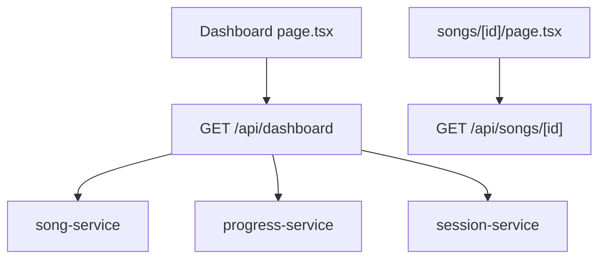
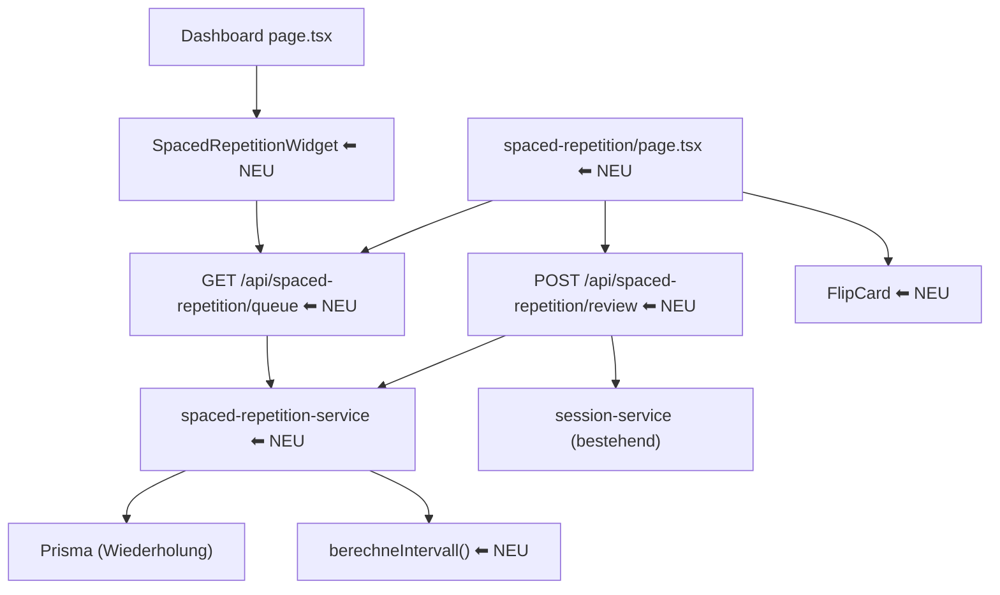

# Design-Dokument: Spaced Repetition

## Übersicht

Dieses Feature implementiert die Lernmethode „Spaced Repetition" für den Song Text Trainer. Strophen, die fehlerfrei abgerufen werden, kommen in zunehmenden Zeitabständen zur Wiederholung. Strophen mit Fehlern werden auf den nächsten Tag zurückgesetzt. Das System plant die nächste Wiederholung automatisch basierend auf einem vereinfachten SM-2-Algorithmus.

Das Feature umfasst:
- Ein neues Prisma-Modell `Wiederholung` für den Lernzustand pro Nutzer/Strophe
- Eine reine Funktion für die Intervallberechnung (SM-2 vereinfacht)
- API-Endpunkte für Queue-Abfrage und Bewertungs-Updates
- Ein Dashboard-Widget „N Strophen heute fällig"
- Eine Session-UI mit Flip-Cards und Selbstbewertung („Gewusst" / „Nicht gewusst")

> **Hinweis:** Die aktuellen Anforderungen (requirements.md) decken nur das Datenmodell und den Algorithmus ab. Das Design berücksichtigt zusätzlich die UI-Aspekte (Dashboard-Widget, Session-Flow, Flip-Cards) aus der Produktspezifikation (key_features.md, Abschnitt 8). Es wird empfohlen, bei Bedarf weitere Anforderungen für die UI-Aspekte formal zu ergänzen.

## Architektur

### Bestehende Struktur



### Erweiterte Struktur mit Spaced Repetition



### Designentscheidungen

1. **Reine Funktion `berechneIntervall()`** in `src/lib/spaced-repetition/algorithmus.ts`: Kein Datenbankzugriff, keine Seiteneffekte. Nimmt `korrektZaehler` und `gewusst: boolean` entgegen, gibt `{ neuerKorrektZaehler, intervallTage }` zurück. Leicht testbar und entspricht Anforderung 2.5.

2. **Eigener Service `spaced-repetition-service.ts`** in `src/lib/services/`: Kapselt alle DB-Operationen (Queue laden, Wiederholung erstellen/aktualisieren). Folgt dem bestehenden Service-Pattern (vgl. `session-service.ts`, `progress-service.ts`).

3. **Zwei API-Endpunkte** statt einem CRUD-Endpunkt:
   - `GET /api/spaced-repetition/queue` — Liefert alle heute fälligen Strophen für den Nutzer
   - `POST /api/spaced-repetition/review` — Verarbeitet eine Bewertung („Gewusst"/„Nicht gewusst")
   
   Diese Trennung spiegelt die zwei Hauptaktionen wider und hält die Endpunkte fokussiert.

4. **Session-Seite unter `/songs/[id]/spaced-repetition`**: Konsistent mit den bestehenden Lernmethoden-Routen (`/songs/[id]/cloze`, `/songs/[id]/zeile-fuer-zeile`, etc.). Die Session wird Song-spezifisch gestartet, zeigt aber nur die fälligen Strophen dieses Songs.

5. **Dashboard-Widget als eigene Komponente**: `SpacedRepetitionWidget` wird in die bestehende Dashboard-Seite integriert. Es zeigt die Gesamtzahl fälliger Strophen über alle Songs und verlinkt auf eine Übersichtsseite oder den ersten Song mit fälligen Strophen.

6. **Streak-Integration über bestehenden Session-Mechanismus**: Eine abgeschlossene Spaced-Repetition-Session erstellt einen `Session`-Eintrag mit `lernmethode: SPACED_REPETITION` (bereits im Enum vorhanden). Der bestehende Streak-Mechanismus zählt Sessions pro Tag.

## Komponenten und Schnittstellen

### Neue Dateien

#### `src/lib/spaced-repetition/algorithmus.ts`

```typescript
export interface IntervallErgebnis {
  neuerKorrektZaehler: number;
  intervallTage: number;
}

/**
 * Berechnet das nächste Wiederholungsintervall basierend auf dem vereinfachten SM-2-Algorithmus.
 * Reine Funktion ohne Seiteneffekte.
 */
export function berechneIntervall(korrektZaehler: number, gewusst: boolean): IntervallErgebnis;
```

Verhalten:
- `gewusst = true` und `korrektZaehler === 0` → `{ neuerKorrektZaehler: 1, intervallTage: 1 }`
- `gewusst = true` und `korrektZaehler === 1` → `{ neuerKorrektZaehler: 2, intervallTage: 3 }`
- `gewusst = true` und `korrektZaehler >= 2` → `{ neuerKorrektZaehler: korrektZaehler + 1, intervallTage: 7 }`
- `gewusst = false` (beliebiger Zähler) → `{ neuerKorrektZaehler: 0, intervallTage: 1 }`

#### `src/lib/services/spaced-repetition-service.ts`

```typescript
export interface FaelligeStrophe {
  wiederholungId: string;
  stropheId: string;
  stropheName: string;
  songTitel: string;
  songId: string;
  korrektZaehler: number;
  zeilen: { text: string; orderIndex: number }[];
}

/** Liefert alle heute fälligen Strophen für einen Nutzer. */
export async function getFaelligeStrophen(userId: string): Promise<FaelligeStrophe[]>;

/** Liefert fällige Strophen für einen bestimmten Song. */
export async function getFaelligeStrophenFuerSong(userId: string, songId: string): Promise<FaelligeStrophe[]>;

/** Liefert die Gesamtzahl fälliger Strophen für einen Nutzer. */
export async function getFaelligeAnzahl(userId: string): Promise<number>;

/** Erstellt einen neuen Wiederholungs-Eintrag (Strophe ins System aufnehmen). */
export async function erstelleWiederholung(userId: string, stropheId: string): Promise<Wiederholung>;

/** Verarbeitet eine Bewertung und aktualisiert den Wiederholungs-Eintrag. */
export async function verarbeiteReview(
  wiederholungId: string,
  userId: string,
  gewusst: boolean
): Promise<{ naechstesFaelligkeitsdatum: Date; intervallTage: number }>;
```

#### `src/app/api/spaced-repetition/queue/route.ts`

```typescript
// GET /api/spaced-repetition/queue
// Query-Parameter: songId (optional) — filtert auf einen Song
// Response: { strophen: FaelligeStrophe[], anzahl: number }
```

#### `src/app/api/spaced-repetition/review/route.ts`

```typescript
// POST /api/spaced-repetition/review
// Body: { wiederholungId: string, gewusst: boolean }
// Response: { naechstesFaelligkeitsdatum: string, intervallTage: number }
```

### Neue UI-Komponenten

#### `src/components/spaced-repetition/spaced-repetition-widget.tsx`

```typescript
interface SpacedRepetitionWidgetProps {
  faelligeAnzahl: number;
}
```

- Zeigt „N Strophen heute fällig" als Karte auf dem Dashboard
- Klick/Tap startet die Session (navigiert zum ersten Song mit fälligen Strophen)
- Wenn `faelligeAnzahl === 0`: Zeigt „Keine Strophen fällig — gut gemacht!" in gedämpfter Farbe

#### `src/components/spaced-repetition/flip-card.tsx`

```typescript
interface FlipCardProps {
  stropheName: string;
  zeilen: { text: string; orderIndex: number }[];
  aufgedeckt: boolean;
  onFlip: () => void;
}
```

- Vorderseite: Strophen-Name zentriert, Aufforderung „Tippe zum Aufdecken"
- Rückseite: Vollständiger Strophentext (alle Zeilen)
- CSS-Flip-Animation (transform: rotateY, 400ms transition)
- `aria-live="polite"` für den aufgedeckten Text

#### `src/components/spaced-repetition/session-view.tsx`

```typescript
interface SessionViewProps {
  strophen: FaelligeStrophe[];
  songTitel: string;
  onComplete: () => void;
}
```

- Fortschrittsindikator oben: „N / M erledigt"
- Zeigt eine FlipCard pro Strophe
- Nach dem Aufdecken: Zwei Buttons „Gewusst" (grün) / „Nicht gewusst" (rot)
- Nach Bewertung: Label „Nächste Wiederholung in X Tagen"
- Nach letzter Strophe: Zusammenfassung + Session wird als abgeschlossen gemeldet

#### `src/app/(main)/songs/[id]/spaced-repetition/page.tsx`

- Lädt fällige Strophen für den Song via `GET /api/spaced-repetition/queue?songId={id}`
- Rendert `SessionView` mit den fälligen Strophen
- Bei Abschluss: Erstellt Session-Eintrag via `POST /api/sessions`
- Navigiert zurück zur Song-Detailseite

### Änderungen an bestehenden Dateien

#### `src/app/(main)/dashboard/page.tsx`

- Integration des `SpacedRepetitionWidget` in das Dashboard-Layout
- Abruf der fälligen Anzahl via `GET /api/spaced-repetition/queue` (nur `anzahl`)

#### `src/app/api/dashboard/route.ts`

- Erweitert die Dashboard-Response um `faelligeStrophenAnzahl: number`

#### `prisma/schema.prisma`

- Neues Modell `Wiederholung` (siehe Datenmodelle)
- Neue Relation `wiederholungen` auf `User` und `Strophe`

## Datenmodelle

### Neues Prisma-Modell: `Wiederholung`

```prisma
model Wiederholung {
  id              String   @id @default(cuid())
  userId          String
  stropheId       String
  korrektZaehler  Int      @default(0)
  faelligAm       DateTime @default(now())
  createdAt       DateTime @default(now())
  updatedAt       DateTime @updatedAt

  user    User    @relation(fields: [userId], references: [id], onDelete: Cascade)
  strophe Strophe @relation(fields: [stropheId], references: [id], onDelete: Cascade)

  @@unique([userId, stropheId])
  @@index([userId, faelligAm])
  @@map("wiederholungen")
}
```

Felder:
| Feld | Typ | Beschreibung |
|---|---|---|
| `id` | `String` | Primärschlüssel (cuid) |
| `userId` | `String` | Fremdschlüssel auf `User` |
| `stropheId` | `String` | Fremdschlüssel auf `Strophe` |
| `korrektZaehler` | `Int` | Anzahl aufeinanderfolgender korrekter Bewertungen (default: 0) |
| `faelligAm` | `DateTime` | Nächstes Fälligkeitsdatum (default: now = sofort fällig) |
| `createdAt` | `DateTime` | Erstellungsdatum |
| `updatedAt` | `DateTime` | Letztes Update |

Constraints:
- `@@unique([userId, stropheId])` — Genau ein Eintrag pro Nutzer/Strophe (Anforderung 1.1, 1.4)
- `@@index([userId, faelligAm])` — Performante Queue-Abfrage

### Relationen (Erweiterungen bestehender Modelle)

```prisma
// In model User:
wiederholungen Wiederholung[]

// In model Strophe:
wiederholungen Wiederholung[]
```

### TypeScript-Interfaces

```typescript
// src/lib/spaced-repetition/algorithmus.ts
export interface IntervallErgebnis {
  neuerKorrektZaehler: number;
  intervallTage: number;
}

// Queue-Response
export interface QueueResponse {
  strophen: FaelligeStrophe[];
  anzahl: number;
}

// Review-Request
export interface ReviewRequest {
  wiederholungId: string;
  gewusst: boolean;
}

// Review-Response
export interface ReviewResponse {
  naechstesFaelligkeitsdatum: string; // ISO-Datum
  intervallTage: number;
}
```

