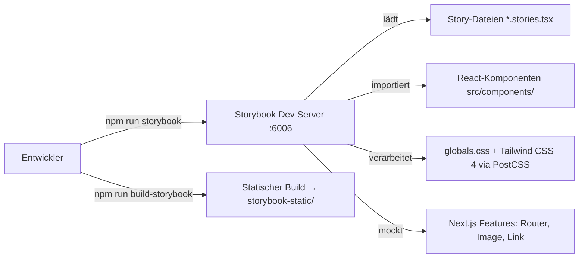

# Design Document – Storybook-Integration

## Übersicht

Dieses Design beschreibt die Integration von Storybook 8 in das bestehende Next.js 16 / React 19 / TypeScript 5.9 / Tailwind CSS 4 Projekt "Lyco". Storybook wird als isolierte Entwicklungsumgebung für UI-Komponenten eingerichtet, inklusive korrektem Tailwind-CSS-Rendering, Next.js-Feature-Mocking und Beispiel-Stories für drei bestehende Komponenten.

### Zentrale Design-Entscheidungen

1. **`@storybook/nextjs` Framework-Adapter**: Bietet automatisches Mocking von `next/image`, `next/link`, `next/navigation` (Router, `usePathname`) – kein manuelles Mocking nötig.
2. **Tailwind CSS 4 via PostCSS**: Die bestehende `postcss.config.mjs` mit `@tailwindcss/postcss` wird von Storybook automatisch übernommen. Die `globals.css` wird als Preview-Import eingebunden.
3. **Co-Location von Stories**: Story-Dateien liegen neben ihren Komponenten (`*.stories.tsx`), was die Auffindbarkeit und Wartbarkeit verbessert.
4. **MDX für Dokumentation**: Die Introduction-Seite wird als MDX-Datei erstellt, um Rich-Content direkt in Storybook darzustellen.

## Architektur

### Systemkontext



### Verzeichnisstruktur

```
.storybook/
├── main.ts              # Storybook-Hauptkonfiguration
└── preview.ts           # Preview-Konfiguration (globale Styles, Decorators)

src/
├── components/
│   ├── cloze/
│   │   ├── score-pill.tsx
│   │   ├── score-pill.stories.tsx        ← NEU
│   │   ├── difficulty-selector.tsx
│   │   └── difficulty-selector.stories.tsx ← NEU
│   └── songs/
│       ├── progress-bar.tsx
│       └── progress-bar.stories.tsx      ← NEU
└── stories/
    └── Introduction.mdx                  ← NEU (Dokumentationsseite)

storybook-static/        # Build-Output (gitignored)
```

## Komponenten und Interfaces

### 1. Storybook-Konfiguration (`.storybook/main.ts`)

Zentrale Konfigurationsdatei, die Framework, Addons und Story-Erkennung definiert.

```typescript
import type { StorybookConfig } from "@storybook/nextjs";

const config: StorybookConfig = {
  stories: ["../src/**/*.mdx", "../src/**/*.stories.@(ts|tsx)"],
  addons: [
    "@storybook/addon-essentials",
    "@storybook/addon-a11y",
    "@storybook/addon-interactions",
  ],
  framework: {
    name: "@storybook/nextjs",
    options: {},
  },
  staticDirs: ["../public"],
};

export default config;
```

**Begründung**:
- `stories`-Glob erfasst sowohl `.stories.tsx` als auch `.mdx`-Dateien aus `src/`.
- `@storybook/nextjs` übernimmt automatisch die PostCSS-Konfiguration und das Mocking von Next.js-Features.
- `staticDirs` stellt statische Assets (falls vorhanden) bereit.

### 2. Preview-Konfiguration (`.storybook/preview.ts`)

Bindet globale Styles ein und konfiguriert Parameter für alle Stories.

```typescript
import type { Preview } from "@storybook/react";
import "../src/app/globals.css";

const preview: Preview = {
  parameters: {
    controls: {
      matchers: {
        color: /(background|color)$/i,
        date: /Date$/i,
      },
    },
  },
};

export default preview;
```

**Begründung**:
- Der Import von `globals.css` stellt sicher, dass `@import "tailwindcss"` verarbeitet wird und alle Utility-Klassen verfügbar sind.
- Die PostCSS-Pipeline mit `@tailwindcss/postcss` wird vom `@storybook/nextjs`-Adapter automatisch genutzt.

### 3. Story-Dateien

#### ScorePill Story (`src/components/cloze/score-pill.stories.tsx`)

```typescript
import type { Meta, StoryObj } from "@storybook/react";
import { ScorePill } from "./score-pill";

const meta: Meta<typeof ScorePill> = {
  title: "Cloze/ScorePill",
  component: ScorePill,
  tags: ["autodocs"],
};
export default meta;

type Story = StoryObj<typeof ScorePill>;

export const Default: Story = { args: { correct: 7, total: 10 } };
export const Perfect: Story = { args: { correct: 10, total: 10 } };
export const Zero: Story = { args: { correct: 0, total: 10 } };
```

#### DifficultySelector Story (`src/components/cloze/difficulty-selector.stories.tsx`)

```typescript
import type { Meta, StoryObj } from "@storybook/react";
import { DifficultySelector } from "./difficulty-selector";

const meta: Meta<typeof DifficultySelector> = {
  title: "Cloze/DifficultySelector",
  component: DifficultySelector,
  tags: ["autodocs"],
};
export default meta;

type Story = StoryObj<typeof DifficultySelector>;

export const Leicht: Story = { args: { active: "leicht" } };
export const Mittel: Story = { args: { active: "mittel" } };
export const Schwer: Story = { args: { active: "schwer" } };
export const Blind: Story = { args: { active: "blind" } };
```

#### ProgressBar Story (`src/components/songs/progress-bar.stories.tsx`)

```typescript
import type { Meta, StoryObj } from "@storybook/react";
import { ProgressBar } from "./progress-bar";

const meta: Meta<typeof ProgressBar> = {
  title: "Songs/ProgressBar",
  component: ProgressBar,
  tags: ["autodocs"],
};
export default meta;

type Story = StoryObj<typeof ProgressBar>;

export const Empty: Story = { args: { value: 0 } };
export const Half: Story = { args: { value: 50 } };
export const Full: Story = { args: { value: 100 } };
export const Overflow: Story = { args: { value: 150 } };
```

### 4. Introduction-Dokumentation (`src/stories/Introduction.mdx`)

MDX-Datei, die als erste Seite in Storybook angezeigt wird und die Konventionen des Projekts beschreibt:
- Dateinamenskonvention: `<component-name>.stories.tsx` neben der Komponente
- Ordnerstruktur: Stories liegen im gleichen Verzeichnis wie die Komponente
- Beispiel einer typischen Story-Datei
- Hinweise zu `tags: ["autodocs"]` für automatische Dokumentation

### 5. NPM-Scripts

```json
{
  "storybook": "storybook dev -p 6006",
  "build-storybook": "storybook build"
}
```

### 6. Abhängigkeiten (devDependencies)

| Paket | Zweck |
|---|---|
| `storybook` | CLI und Core |
| `@storybook/nextjs` | Next.js Framework-Adapter |
| `@storybook/react` | React-Renderer |
| `@storybook/addon-essentials` | Controls, Actions, Viewport, Backgrounds, Docs |
| `@storybook/addon-a11y` | Accessibility-Prüfungen |
| `@storybook/addon-interactions` | Interaktionstests |
| `@storybook/test` | Testing-Utilities für Interactions |

## Datenmodelle

Dieses Feature führt keine neuen Datenmodelle oder Datenbankänderungen ein. Es handelt sich um eine reine Tooling- und Entwicklungsumgebungs-Erweiterung.

Die relevanten bestehenden TypeScript-Interfaces für die Beispiel-Stories sind:

```typescript
// src/types/cloze.ts
type DifficultyLevel = "leicht" | "mittel" | "schwer" | "blind";

// src/components/cloze/score-pill.tsx
interface ScorePillProps { correct: number; total: number }

// src/components/cloze/difficulty-selector.tsx
interface DifficultySelectorProps {
  active: DifficultyLevel;
  onChange: (level: DifficultyLevel) => void;
}

// src/components/songs/progress-bar.tsx
interface ProgressBarProps { value: number; className?: string }
```

