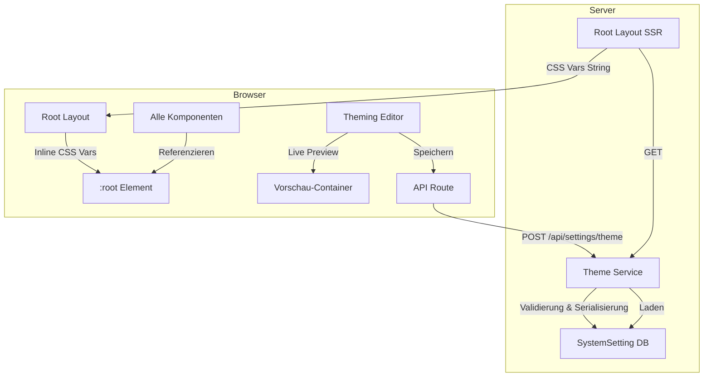

# Design-Dokument: Theming & Customization

## Übersicht

Dieses Design beschreibt die Architektur für ein konfigurierbares Theming-System im Song Text Trainer (Lyco). Die Anwendung verwendet derzeit fest kodierte Tailwind-CSS-Klassen (z.B. `bg-purple-600`, `text-gray-900`, `bg-green-500`) für Farben, Typografie und Komponentenstile. Das neue System ersetzt diese durch CSS-Custom-Properties, die zur Laufzeit über einen visuellen Admin-Editor angepasst werden können.

### Zentrale Design-Entscheidungen

1. **CSS-Custom-Properties als Theming-Grundlage**: Alle Theme-Werte werden als CSS-Variablen auf `:root` definiert. Tailwind-Klassen werden schrittweise durch Referenzen auf diese Variablen ersetzt. Dies ermöglicht Laufzeit-Änderungen ohne Neukompilierung.

2. **HSL-basierte Farbpaletten-Generierung**: Der Farbpaletten-Generator arbeitet im HSL-Farbraum, um aus einer Basisfarbe (Stufe 500) automatisch 11 Abstufungen (50–950) zu erzeugen. HSL ermöglicht intuitive Helligkeits- und Sättigungsanpassungen.

3. **SystemSetting-Tabelle für Persistenz**: Die Theme-Konfiguration wird als JSON-String in der bestehenden `SystemSetting`-Tabelle gespeichert (Key: `theme-config`). Dies vermeidet Schema-Migrationen und nutzt die vorhandene Infrastruktur.

4. **Server-Side-Rendering des Themes**: Das Theme wird beim App-Start serverseitig geladen und als Inline-Style im Root-Layout injiziert, um Flash-of-Unstyled-Content (FOUC) zu vermeiden.

5. **Isolierte Vorschau im Editor**: Der Theming-Editor verwendet einen isolierten CSS-Scope (via `style`-Attribut auf einem Container-Element), sodass Vorschau-Änderungen die restliche Seite nicht beeinflussen, bis gespeichert wird.

## Architektur



### Datenfluss

1. **App-Start**: Root-Layout (`src/app/layout.tsx`) ruft serverseitig den Theme-Service auf → lädt JSON aus `SystemSetting` → konvertiert zu CSS-Custom-Properties-String → injiziert als `style`-Attribut auf `<html>`.
2. **Editor-Vorschau**: Admin ändert Wert im Editor → State-Update → CSS-Variablen werden auf dem Vorschau-Container gesetzt → Referenz-Komponenten aktualisieren sich sofort.
3. **Speichern**: Admin klickt „Speichern" → POST an `/api/settings/theme` → Theme-Service validiert, serialisiert und speichert in DB → Revalidierung des Root-Layouts.
4. **Fallback**: Wenn kein Theme in DB vorhanden → Standard-Theme (aktuelles Purple/Gray-Schema) wird verwendet.

## Komponenten und Schnittstellen

### 1. Theme-Konfigurationstypen (`src/lib/theme/types.ts`)

Zentrale TypeScript-Typen für die Theme-Konfiguration:

```typescript
interface ThemeConfig {
  appName: string;                    // Max 50 Zeichen
  colors: ThemeColors;
  typography: ThemeTypography;
  karaoke: KaraokeTheme;
}

interface ThemeColors {
  primary: string;                    // Hex-Basisfarbe → Palette wird generiert
  accent: string | null;              // Null = Fallback auf Primary
  border: string;
  pageBg: string;
  cardBg: string;
  tabActiveBg: string;
  tabInactiveBg: string;
  controlBg: string;
  success: string;
  warning: string;
  error: string;
  primaryButton: string;
  secondaryButton: string;
  newSongButton: string;
  translationToggle: string;
}

interface ThemeTypography {
  headlineFont: string;
  headlineWeight: string;
  copyFont: string;
  copyWeight: string;
  labelFont: string;
  labelWeight: string;
  songLineFont: string;
  songLineWeight: string;
  songLineSize: string;
  translationLineFont: string;
  translationLineWeight: string;
  translationLineSize: string;
}

interface KaraokeTheme {
  activeLineColor: string;
  readLineColor: string;
  unreadLineColor: string;
  activeLineSize: string;             // 14px–48px
  readLineSize: string;
  unreadLineSize: string;
}

```

### 2. Farbpaletten-Generator (`src/lib/theme/palette-generator.ts`)

Erzeugt aus einer Hex-Basisfarbe eine vollständige Palette mit 11 Abstufungen.

```typescript
// Eingabe: Hex-Farbe (z.B. "#7c3aed")
// Ausgabe: Record<PaletteStep, string> mit Stufen 50–950
type PaletteStep = 50 | 100 | 200 | 300 | 400 | 500 | 600 | 700 | 800 | 900 | 950;

function generatePalette(baseHex: string): Record<PaletteStep, string>;
function hexToHsl(hex: string): { h: number; s: number; l: number };
function hslToHex(h: number, s: number, l: number): string;
```

**Algorithmus**:
- Stufe 500 = Basisfarbe
- Stufen 50–400: Lightness wird schrittweise erhöht (95%, 90%, 82%, 72%, 62%), Saturation leicht reduziert
- Stufen 600–950: Lightness wird schrittweise reduziert (38%, 30%, 22%, 15%, 10%), Saturation leicht erhöht

### 3. Theme-Serializer (`src/lib/theme/serializer.ts`)

Konvertiert zwischen `ThemeConfig`-Objekten und JSON-Strings sowie CSS-Custom-Properties.

```typescript
function serializeTheme(config: ThemeConfig): string;        // → JSON-String
function deserializeTheme(json: string): ThemeConfig;         // → ThemeConfig
function themeToCssVars(config: ThemeConfig): string;         // → CSS-String für style-Attribut
function getDefaultTheme(): ThemeConfig;                      // → Standard-Theme
```

### 4. Theme-Service (`src/lib/services/theme-service.ts`)

Server-seitiger Service für Laden/Speichern der Theme-Konfiguration.

```typescript
async function getThemeConfig(): Promise<ThemeConfig>;
async function saveThemeConfig(config: ThemeConfig): Promise<void>;
```

Nutzt die bestehende `SystemSetting`-Tabelle mit Key `theme-config`.

### 5. Theme-API-Route (`src/app/api/settings/theme/route.ts`)

```typescript
// GET  → Aktuelle ThemeConfig als JSON
// POST → ThemeConfig speichern (nur ADMIN)
```

### 6. Theme-Provider im Root-Layout (`src/app/layout.tsx`)

Das Root-Layout wird zu einer Server-Komponente, die das Theme lädt und als Inline-CSS injiziert:

```tsx
export default async function RootLayout({ children }) {
  const theme = await getThemeConfig();
  const cssVars = themeToCssVars(theme);
  
  return (
    <html lang="de" style={cssVarsToStyleObject(cssVars)}>
      <body>{children}</body>
    </html>
  );
}
```

### 7. Theming-Editor-Seite (`src/app/(admin)/admin/theming/page.tsx`)

Admin-Seite mit:
- Farbwähler-Sektionen (Primär, Akzent, Rahmen, Hintergründe, Signalfarben, Karaoke, Buttons)
- Typografie-Sektionen (Headline, Copy, Label, Song-Zeilen, Übersetzung, Karaoke-Größen)
- Anwendungsname-Textfeld
- Vorschau-Bereich mit Referenz-Komponenten
- Speichern/Zurücksetzen-Buttons
- Unsaved-Changes-Warnung

### 8. Referenz-Komponenten-Vorschau (`src/components/admin/theme-preview.tsx`)

Isolierter Container, der alle Referenz-Komponenten rendert:
- Buttons (primär, sekundär, „+ Neuer Song")
- Cards mit Rahmen
- Tabs (aktiv/inaktiv)
- Progressbar
- Status-Punkte (grau, orange, grün)
- Song-Zeilen-Paar (Original + Übersetzung)
- Karaoke-Zeilen (aktiv, gelesen, ungelesen)
- Toggle
- Eingabefelder
- Score-Pill

## Datenmodell

### Theme-Konfiguration in SystemSetting

Die Theme-Konfiguration wird in der bestehenden `SystemSetting`-Tabelle gespeichert:

| Feld      | Wert                                    |
|-----------|----------------------------------------|
| `key`     | `"theme-config"`                        |
| `value`   | JSON-String der `ThemeConfig`           |

### CSS-Custom-Properties-Mapping

Die `ThemeConfig` wird in folgende CSS-Custom-Properties übersetzt:

```css
:root {
  /* Primärfarben-Palette (generiert) */
  --color-primary-50: #faf5ff;
  --color-primary-100: #f3e8ff;
  /* ... bis 950 */
  --color-primary-500: #7c3aed;
  
  /* Akzentfarben-Palette (generiert) */
  --color-accent-50: ...;
  --color-accent-500: ...;
  /* ... bis 950 */
  
  /* Direkte Farbwerte */
  --color-border: #e5e7eb;
  --color-page-bg: #f9fafb;
  --color-card-bg: #ffffff;
  --color-tab-active-bg: #7c3aed;
  --color-tab-inactive-bg: #f3f4f6;
  --color-control-bg: #f3f4f6;
  --color-success: #22c55e;
  --color-warning: #f97316;
  --color-error: #ef4444;
  --color-btn-primary: #7c3aed;
  --color-btn-secondary: #3b82f6;
  --color-btn-new-song: #7c3aed;
  --color-translation-toggle: #3b82f6;
  
  /* Karaoke */
  --karaoke-active-color: #ffffff;
  --karaoke-read-color: rgba(255,255,255,0.4);
  --karaoke-unread-color: rgba(255,255,255,0.2);
  --karaoke-active-size: 28px;
  --karaoke-read-size: 20px;
  --karaoke-unread-size: 18px;
  
  /* Typografie */
  --font-headline: 'Inter', system-ui, sans-serif;
  --font-headline-weight: 700;
  --font-copy: 'Inter', system-ui, sans-serif;
  --font-copy-weight: 400;
  --font-label: 'Inter', system-ui, sans-serif;
  --font-label-weight: 500;
  --font-song-line: 'Inter', system-ui, sans-serif;
  --font-song-line-weight: 400;
  --font-song-line-size: 16px;
  --font-translation-line: 'Inter', system-ui, sans-serif;
  --font-translation-line-weight: 400;
  --font-translation-line-size: 14px;
  
  /* App-Name */
  --app-name: 'Lyco';
}
```

### Standard-Theme (Fallback)

Das Standard-Theme entspricht dem aktuellen Farbschema der Anwendung:
- Primärfarbe: `#7c3aed` (Purple-600)
- Akzentfarbe: `null` (Fallback auf Primär)
- Rahmenfarbe: `#e5e7eb` (Gray-200)
- Seiten-Hintergrund: `#f9fafb` (Gray-50)
- Card-Hintergrund: `#ffffff` (White)
- Erfolgsfarbe: `#22c55e` (Green-500)
- Warnfarbe: `#f97316` (Orange-400)
- Fehlerfarbe: `#ef4444` (Red-500)
- App-Name: `"Lyco"`

### Validierungsregeln

| Feld | Regel |
|------|-------|
| `appName` | 1–50 Zeichen; leer → `"Song Text Trainer"` |
| Farbwerte | Gültiger Hex-String (`#RRGGBB`) |
| `karaoke.activeLineSize` | 14px–48px |
| `typography.*Weight` | Gültige CSS-Font-Weight-Werte (100–900) |
| `typography.*Font` | Nicht-leerer String |


## Korrektheitseigenschaften

*Eine Korrektheitseigenschaft ist ein Merkmal oder Verhalten, das für alle gültigen Ausführungen eines Systems gelten sollte — im Wesentlichen eine formale Aussage darüber, was das System tun soll. Eigenschaften dienen als Brücke zwischen menschenlesbaren Spezifikationen und maschinell überprüfbaren Korrektheitsgarantien.*

### Eigenschaft 1: Serialisierungs-Round-Trip

*Für jede* gültige `ThemeConfig`, soll das Serialisieren zu JSON und anschließende Deserialisieren ein äquivalentes Objekt erzeugen: `deserializeTheme(serializeTheme(config))` ist deep-equal zu `config`.

**Validiert: Anforderungen 15.4, 15.5, 15.6**

### Eigenschaft 2: CSS-Variablen-Vollständigkeit

*Für jede* gültige `ThemeConfig`, soll `themeToCssVars(config)` einen CSS-String erzeugen, der alle erwarteten Variablennamen enthält (`--color-primary-*`, `--color-accent-*`, `--color-border`, `--color-page-bg`, `--color-card-bg`, `--color-tab-active-bg`, `--color-tab-inactive-bg`, `--color-success`, `--color-warning`, `--color-error`, `--color-btn-primary`, `--color-btn-secondary`, `--font-headline`, `--font-copy`, `--font-label`, `--font-song-line`, `--font-translation-line`, `--karaoke-active-color`, `--karaoke-read-color`, `--karaoke-unread-color`, `--karaoke-active-size`, `--karaoke-read-size`, `--karaoke-unread-size`) und die Werte den konfigurierten Werten entsprechen.

**Validiert: Anforderungen 1.2, 3.3, 4.2, 5.2, 5.3, 6.2, 7.2, 7.3, 7.4, 8.2, 9.2, 9.3, 10.2, 10.3, 10.4, 11.2, 11.3, 12.2, 15.2, 16.1, 16.4**

### Eigenschaft 3: Paletten-Generierung erzeugt 11 Stufen

*Für jede* gültige Hex-Farbe, soll `generatePalette(hex)` ein Objekt mit genau 11 Einträgen (Stufen 50, 100, 200, 300, 400, 500, 600, 700, 800, 900, 950) zurückgeben, wobei jeder Eintrag ein gültiger Hex-Farbwert ist.

**Validiert: Anforderungen 2.2, 3.2**

### Eigenschaft 4: Paletten-Helligkeitsordnung

*Für jede* gültige Hex-Farbe, soll die generierte Palette folgende Invarianten erfüllen: (a) Stufe 500 entspricht der Eingabefarbe, (b) die Helligkeit (Lightness im HSL-Farbraum) ist monoton fallend von Stufe 50 bis Stufe 950.

**Validiert: Anforderung 2.3**

### Eigenschaft 5: Anwendungsname-Längenbegrenzung

*Für jeden* String mit mehr als 50 Zeichen, soll die Validierung der `ThemeConfig` den Wert ablehnen oder auf 50 Zeichen kürzen. *Für jeden* String mit 1–50 Zeichen soll der Wert akzeptiert werden.

**Validiert: Anforderung 1.4**

### Eigenschaft 6: Karaoke-Schriftgrößen-Begrenzung

*Für jeden* numerischen Wert, soll die Validierung der Karaoke-Schriftgröße der aktiven Zeile Werte außerhalb des Bereichs 14px–48px ablehnen oder auf diesen Bereich begrenzen.

**Validiert: Anforderung 12.3**

### Eigenschaft 7: Kontrast zwischen Seiten- und Card-Hintergrund

*Für jede* gültige `ThemeConfig`, soll der Helligkeitsunterschied (im HSL-Farbraum) zwischen `pageBg` und `cardBg` einen Mindestwert überschreiten, sodass ein sichtbarer Kontrast gewährleistet ist.

**Validiert: Anforderung 5.4**

### Eigenschaft 8: Aktiver vs. inaktiver Tab-Zustand unterscheidbar

*Für jede* gültige `ThemeConfig`, soll `tabActiveBg` ungleich `tabInactiveBg` sein.

**Validiert: Anforderung 6.3**

### Eigenschaft 9: Karaoke-Zeilenfarben paarweise verschieden

*Für jede* gültige `ThemeConfig`, sollen die drei Karaoke-Zeilenfarben (`activeLineColor`, `readLineColor`, `unreadLineColor`) paarweise verschieden sein.

**Validiert: Anforderung 8.3**

### Eigenschaft 10: Button-Hover/Focus-Ableitung

*Für jede* gültige Hex-Farbe als Button-Basisfarbe, sollen die abgeleiteten Hover- und Focus-Zustände (a) gültige Hex-Farben sein, (b) sich von der Basisfarbe unterscheiden und (c) der Hover-Zustand dunkler als die Basisfarbe sein.

**Validiert: Anforderung 9.4**

## Fehlerbehandlung

### Ungültige Farbwerte
- Eingaben, die kein gültiger Hex-String sind (`#RRGGBB`), werden vom Editor clientseitig abgelehnt (Color-Picker erzwingt gültiges Format).
- Die API-Route validiert serverseitig alle Farbwerte per Regex (`/^#[0-9a-fA-F]{6}$/`) und gibt HTTP 400 bei ungültigen Werten zurück.

### Ungültige Typografie-Werte
- Leere Schriftart-Strings werden abgelehnt; Fallback auf System-Font.
- Font-Weight-Werte außerhalb von 100–900 werden abgelehnt.

### Ungültiger Anwendungsname
- Leerer String → Fallback auf `"Song Text Trainer"`.
- Strings > 50 Zeichen → Validierungsfehler (HTTP 400).

### Ungültige Karaoke-Schriftgrößen
- Werte außerhalb 14–48px → Validierungsfehler (HTTP 400).

### Datenbank-Fehler
- Wenn das Speichern fehlschlägt → HTTP 500 mit Fehlermeldung; Editor zeigt Fehlermeldung an.
- Wenn das Laden fehlschlägt → Standard-Theme wird verwendet (graceful degradation).

### Ungültiges JSON in der Datenbank
- Wenn der gespeicherte JSON-String nicht deserialisierbar ist → Standard-Theme wird verwendet; Fehler wird geloggt.

### Berechtigungsfehler
- Nur Benutzer mit Rolle `ADMIN` können Theme-Einstellungen ändern.
- Nicht-Admin-Zugriff auf die API-Route → HTTP 403.

## Teststrategie

### Property-Based Testing

**Bibliothek**: `fast-check` (bereits als Dependency im Projekt vorhanden)

**Konfiguration**: Mindestens 100 Iterationen pro Property-Test.

**Tagging-Format**: Jeder Test wird mit einem Kommentar versehen:
```
// Feature: theming-customization, Property {N}: {Eigenschaftstext}
```

**Property-Tests** (je ein Test pro Korrektheitseigenschaft):

1. **Serialisierungs-Round-Trip**: Generiere zufällige `ThemeConfig`-Objekte, serialisiere und deserialisiere, prüfe Deep-Equality.
2. **CSS-Variablen-Vollständigkeit**: Generiere zufällige `ThemeConfig`-Objekte, erzeuge CSS-String, prüfe Vorhandensein aller erwarteten Variablennamen und Werte.
3. **Paletten-Generierung**: Generiere zufällige Hex-Farben, prüfe 11 Stufen mit gültigen Hex-Werten.
4. **Paletten-Helligkeitsordnung**: Generiere zufällige Hex-Farben, prüfe Stufe 500 = Eingabe und monoton fallende Lightness.
5. **Anwendungsname-Längenbegrenzung**: Generiere zufällige Strings verschiedener Längen, prüfe Validierungsverhalten.
6. **Karaoke-Schriftgrößen-Begrenzung**: Generiere zufällige Zahlenwerte, prüfe Validierungsverhalten.
7. **Kontrast Seiten-/Card-Hintergrund**: Generiere zufällige Farbpaare, prüfe Helligkeitsunterschied.
8. **Tab-Zustand unterscheidbar**: Generiere zufällige ThemeConfigs, prüfe Ungleichheit.
9. **Karaoke-Zeilenfarben verschieden**: Generiere zufällige ThemeConfigs, prüfe paarweise Verschiedenheit.
10. **Button-Hover/Focus-Ableitung**: Generiere zufällige Hex-Farben, prüfe abgeleitete Zustände.

### Unit-Tests

Unit-Tests ergänzen die Property-Tests für spezifische Beispiele und Edge-Cases:

- **Edge-Case**: Leerer Anwendungsname → Fallback auf Standard
- **Edge-Case**: Null-Akzentfarbe → Fallback auf Primärfarbe
- **Edge-Case**: Keine Theme-Konfiguration in DB → Standard-Theme
- **Edge-Case**: Ungültiges JSON in DB → Standard-Theme
- **Beispiel**: Standard-Theme erzeugt erwartete CSS-Variablen
- **Beispiel**: API-Route gibt 403 für Nicht-Admin zurück
- **Beispiel**: API-Route gibt 400 für ungültige Hex-Farbe zurück
- **Integration**: Speichern und Laden über Theme-Service

### Testdateien-Struktur

```
__tests__/theming/
  serializer-roundtrip.property.test.ts
  css-vars-completeness.property.test.ts
  palette-generation.property.test.ts
  palette-lightness.property.test.ts
  app-name-validation.property.test.ts
  karaoke-size-validation.property.test.ts
  contrast-check.property.test.ts
  tab-distinction.property.test.ts
  karaoke-colors-distinct.property.test.ts
  button-hover-derivation.property.test.ts
  theme-service.test.ts
  theme-api.test.ts
  theme-edge-cases.test.ts
```
