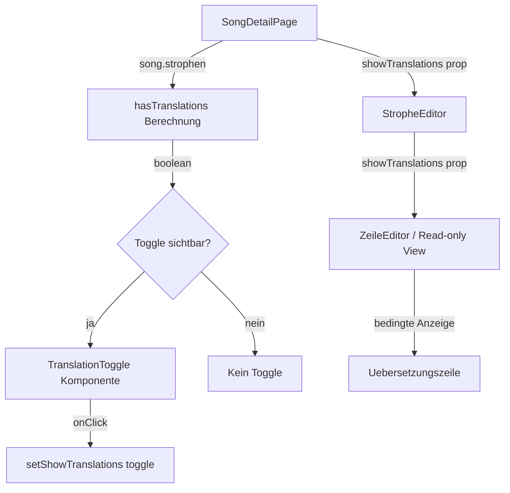

# Design: Übersetzung ein-/ausblenden (Translation Visibility Toggle)

## Übersicht

Dieses Feature fügt einen Toggle-Schalter auf der Song-Detailseite (`/songs/[id]`) hinzu, mit dem der Benutzer die Sichtbarkeit aller Übersetzungszeilen (`zeile.uebersetzung`) steuern kann. Der Toggle erscheint in der Aktionsleiste neben den bestehenden Buttons (Analysieren, Übersetzen, Bearbeiten, Löschen) und ist nur sichtbar, wenn mindestens eine Zeile eine nicht-leere Übersetzung besitzt.

Das Feature ist rein clientseitig. Es wird kein neuer API-Endpunkt benötigt. Der Sichtbarkeitszustand wird als React-State in der `SongDetailPage`-Komponente verwaltet und als Prop an `StropheEditor` weitergegeben.

## Architektur

### Datenfluss



### Zustandsverwaltung

Der Sichtbarkeitszustand (`showTranslations: boolean`) lebt in `SongDetailPage` und wird top-down weitergegeben:

1. `SongDetailPage` berechnet `hasTranslations` aus `song.strophen`
2. `SongDetailPage` verwaltet `showTranslations` State (Standardwert: `true`)
3. Toggle wird nur gerendert wenn `hasTranslations === true`
4. `showTranslations` wird als Prop an `StropheEditor` übergeben
5. `StropheEditor` gibt den Wert an seine Zeilen-Rendering-Logik weiter

### Entscheidung: Kein separater Hook

Da der Zustand ein einfacher Boolean ist und nur in einer Komponente verwaltet wird, ist ein eigener Hook (`useTranslationVisibility`) unnötig. Ein `useState` in `SongDetailPage` reicht aus. Die `hasTranslations`-Berechnung erfolgt inline mit `useMemo`.

## Komponenten und Schnittstellen

### Neue Komponente: TranslationToggle

**Pfad:** `src/components/songs/translation-toggle.tsx`

```typescript
interface TranslationToggleProps {
  checked: boolean;
  onChange: (checked: boolean) => void;
}
```

Die Komponente rendert einen barrierefreien Toggle-Schalter mit:
- `role="switch"` und `aria-checked`
- `aria-label="Übersetzung ein-/ausblenden"`
- Beschriftung „Übersetzung"
- Mindestgröße 44×44px Touch-Target
- Blau im aktivierten Zustand, Grau im deaktivierten Zustand
- Tastatursteuerung über Space und Enter

### Geänderte Komponente: SongDetailPage

**Pfad:** `src/app/(main)/songs/[id]/page.tsx`

Änderungen:
- Neuer State: `const [showTranslations, setShowTranslations] = useState(true)`
- Neue Berechnung: `const hasTranslations = useMemo(...)` — prüft ob mindestens eine Zeile in allen Strophen eine nicht-leere `uebersetzung` hat
- `TranslationToggle` wird in der Aktionsleiste gerendert (nur wenn `hasTranslations && !editing`)
- `showTranslations` wird als Prop an `StropheEditor` übergeben

### Geänderte Komponente: StropheEditor

**Pfad:** `src/components/songs/strophe-editor.tsx`

Änderungen:
- Neue optionale Prop: `showTranslations?: boolean` (Standard: `true`)
- In der Read-only-Ansicht: `zeile.uebersetzung` wird nur gerendert wenn `showTranslations` true ist
- In der Editing-Ansicht: `showTranslations` wird an `ZeileEditor` weitergegeben

### Geänderte Komponente: ZeileEditor

**Pfad:** `src/components/songs/zeile-editor.tsx`

Änderungen:
- Neue optionale Prop: `showTranslations?: boolean` (Standard: `true`)
- In der Display-Ansicht (nicht-editierend): `zeile.uebersetzung` wird nur gerendert wenn `showTranslations` true ist
- In der Edit-Form: Übersetzungsfeld bleibt immer sichtbar (Bearbeitung soll nicht eingeschränkt werden)

### Hilfsfunktion: hasAnyTranslation

**Pfad:** Inline in `SongDetailPage` oder als exportierte Utility

```typescript
function hasAnyTranslation(strophen: StropheDetail[]): boolean {
  return strophen.some(s => 
    s.zeilen.some(z => z.uebersetzung != null && z.uebersetzung.trim() !== "")
  );
}
```

Diese Funktion wird verwendet um zu bestimmen, ob der Toggle angezeigt wird und ob er nach einer Übersetzung eingeblendet werden soll.

## Datenmodelle

Es werden keine neuen Datenmodelle eingeführt. Das Feature nutzt ausschließlich bestehende Typen:

- `SongDetail` — enthält `strophen: StropheDetail[]`
- `StropheDetail` — enthält `zeilen: ZeileDetail[]`
- `ZeileDetail` — enthält `uebersetzung: string | null`

### Neuer UI-State

| State | Typ | Ort | Standard |
|-------|-----|-----|----------|
| `showTranslations` | `boolean` | `SongDetailPage` | `true` |
| `hasTranslations` | `boolean` (abgeleitet) | `SongDetailPage` (useMemo) | berechnet |

