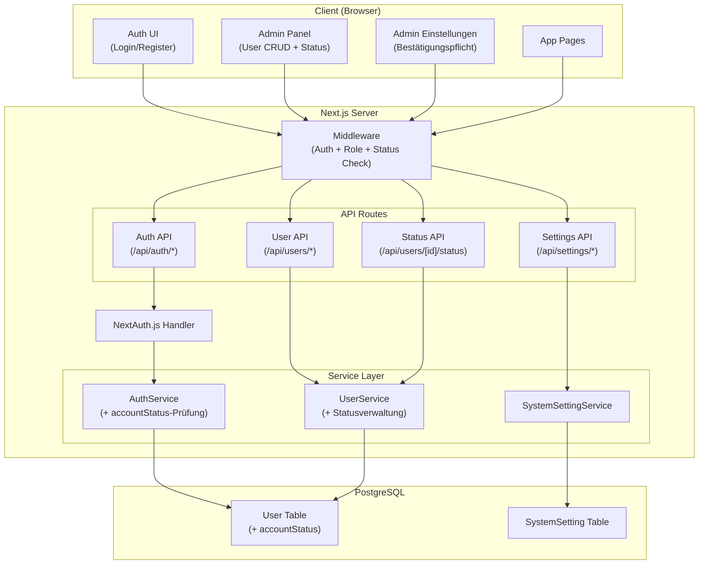
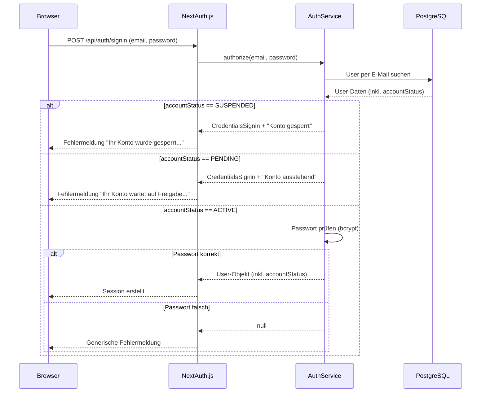
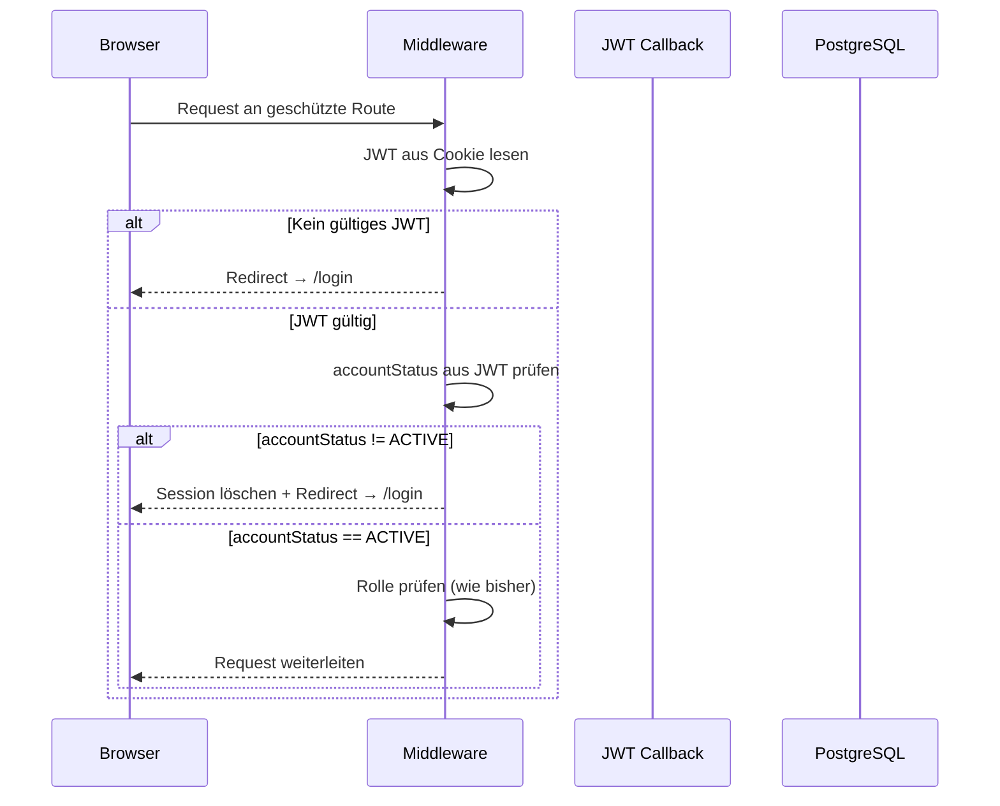
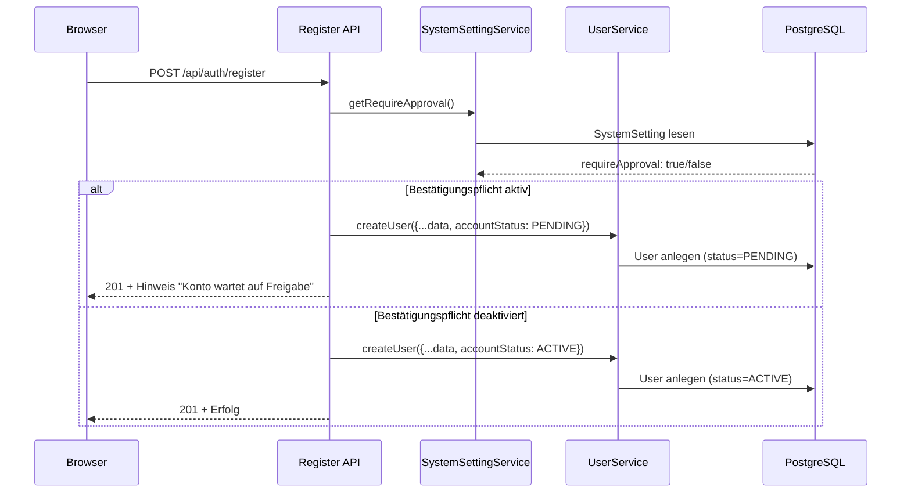

# Technisches Design: Benutzerkonto-Steuerung (Sperren & Bestätigung)

## Übersicht

Dieses Dokument beschreibt das technische Design für die erweiterte Benutzerkonto-Steuerung der Songtext-Lern-Webanwendung. Das Feature erweitert das bestehende User-Management (`user-management-auth`) um Kontostatus-Verwaltung (Aktiv, Gesperrt, Ausstehend), eine optionale Bestätigungspflicht für neue Registrierungen und die zugehörige Admin-Oberfläche.

Das Design umfasst:

- Erweiterung des Prisma-User-Modells um ein `accountStatus`-Feld (Enum: `ACTIVE`, `SUSPENDED`, `PENDING`)
- Neues `SystemSetting`-Modell für die Bestätigungspflicht-Einstellung
- Erweiterung des `UserService` um Statusverwaltungs-Methoden
- Neuer `SystemSettingService` für Systemeinstellungen
- Anpassung der `AuthService.authorize()`-Methode zur Prüfung des Kontostatus
- Anpassung der Middleware zur Prüfung des Kontostatus bei jeder Anfrage (aktive Session-Invalidierung)
- Neue API-Endpunkte für Statusänderungen und Einstellungen
- Erweiterung des Admin-Panels um Status-Badges, Sperr-/Entsperr-Aktionen, Bestätigungs-/Ablehnungs-Aktionen, Ausstehend-Badge in der Navigation und Einstellungsseite

## Architektur

### Systemübersicht (Erweiterung)



### Login-Flow mit Kontostatus-Prüfung



### Middleware-Flow mit Session-Invalidierung



### Registrierungs-Flow mit Bestätigungspflicht



## Komponenten und Schnittstellen

### Frontend-Komponenten (Erweiterungen)

| Komponente | Pfad | Beschreibung |
|---|---|---|
| `AdminUsersPage` | `app/(admin)/admin/users/page.tsx` | Erweitert: Status-Badge, Sperr-/Entsperr-Buttons, Bestätigungs-/Ablehnungs-Buttons |
| `AdminSettingsPage` | `app/(admin)/admin/settings/page.tsx` | Neu: Einstellungsseite mit Bestätigungspflicht-Toggle |
| `AdminLayout` | `app/(admin)/layout.tsx` | Erweitert: "Einstellungen"-Link in Navigation, Ausstehend-Badge |
| `StatusBadge` | `components/admin/status-badge.tsx` | Neu: Farblich gekennzeichnetes Badge für Kontostatus |
| `UserStatusActions` | `components/admin/user-status-actions.tsx` | Neu: Sperren/Entsperren/Bestätigen/Ablehnen-Buttons je nach Status |
| `RejectUserDialog` | `components/admin/reject-user-dialog.tsx` | Neu: Bestätigungsdialog zum Ablehnen (Löschen) eines ausstehenden Benutzers |
| `PendingCountBadge` | `components/admin/pending-count-badge.tsx` | Neu: Badge mit Anzahl ausstehender Benutzer in der Navigation |

### StatusBadge-Farbschema

| Status | Farbe | CSS-Klassen |
|---|---|---|
| `ACTIVE` | Grün | `bg-green-100 text-green-800` |
| `SUSPENDED` | Rot | `bg-red-100 text-red-800` |
| `PENDING` | Gelb | `bg-yellow-100 text-yellow-800` |

### API-Endpunkte (Erweiterungen)

| Methode | Pfad | Auth | Rolle | Beschreibung |
|---|---|---|---|---|
| PATCH | `/api/users/[id]/status` | ✓ | Admin | Kontostatus ändern (suspend/activate) |
| POST | `/api/users/[id]/approve` | ✓ | Admin | Ausstehenden Benutzer bestätigen |
| POST | `/api/users/[id]/reject` | ✓ | Admin | Ausstehenden Benutzer ablehnen (löschen) |
| GET | `/api/users/pending/count` | ✓ | Admin | Anzahl ausstehender Benutzer |
| GET | `/api/settings/require-approval` | ✓ | Admin | Bestätigungspflicht-Einstellung lesen |
| PUT | `/api/settings/require-approval` | ✓ | Admin | Bestätigungspflicht-Einstellung ändern |

### Service Layer (Erweiterungen)

```typescript
// UserService – Neue Methoden für Statusverwaltung
interface UserServiceExtensions {
  suspendUser(id: string, requestingUserId: string): Promise<User>;
  activateUser(id: string): Promise<User>;
  approveUser(id: string): Promise<User>;
  rejectUser(id: string): Promise<void>; // löscht den Benutzer
  getPendingCount(): Promise<number>;
  getUserAccountStatus(id: string): Promise<AccountStatus | null>;
}

// SystemSettingService – Systemeinstellungen
interface SystemSettingService {
  getRequireApproval(): Promise<boolean>;
  setRequireApproval(value: boolean): Promise<void>;
}

// AuthService – Erweiterte authorize()-Methode
// Die bestehende authorize()-Funktion wird um eine accountStatus-Prüfung erweitert.
// Rückgabe enthält nun auch accountStatus.
// Bei SUSPENDED oder PENDING wird ein spezifischer Fehler geworfen
// (nicht null, damit die Fehlermeldung differenziert werden kann).
```

### Middleware-Erweiterung

```typescript
// middleware.ts – Erweiterung
// 
// Zusätzlich zur bestehenden Auth- und Rollen-Prüfung:
// 1. accountStatus wird im JWT-Token gespeichert (jwt-Callback)
// 2. Bei jeder Anfrage prüft die Middleware den accountStatus aus dem JWT
// 3. Wenn accountStatus != ACTIVE → Session invalidieren, Redirect auf /login
//
// Für die aktive Session-Invalidierung (Anforderung 3.4):
// - Der jwt-Callback in auth.config.ts wird erweitert, um bei Token-Refresh
//   den aktuellen accountStatus aus der DB zu laden
// - updateAge (5 Min) sorgt dafür, dass spätestens nach 5 Minuten
//   der gesperrte Status erkannt wird
// - Für sofortige Invalidierung: Die Middleware prüft den accountStatus
//   aus dem JWT und leitet bei != ACTIVE auf /login weiter
```

### Anpassung der Registrierung

```typescript
// app/api/auth/register/route.ts – Erweiterung
//
// Vor dem Erstellen des Benutzers:
// 1. SystemSettingService.getRequireApproval() aufrufen
// 2. Wenn true → accountStatus: "PENDING" setzen
// 3. Wenn false → accountStatus: "ACTIVE" setzen (bisheriges Verhalten)
// 4. Bei PENDING: Hinweismeldung in der Response zurückgeben
```

## Datenmodelle

### Prisma Schema (Erweiterungen)

```prisma
// Neuer Enum für Kontostatus
enum AccountStatus {
  ACTIVE
  SUSPENDED
  PENDING
}

// Erweiterung des bestehenden User-Modells
model User {
  id              String           @id @default(cuid())
  email           String           @unique
  name            String?
  passwordHash    String
  role            Role             @default(USER)
  accountStatus   AccountStatus    @default(ACTIVE)  // NEU
  // ... bestehende Felder bleiben unverändert ...

  @@map("users")
}

// Neues Modell für Systemeinstellungen
model SystemSetting {
  id        String   @id @default(cuid())
  key       String   @unique
  value     String
  updatedAt DateTime @updatedAt

  @@map("system_settings")
}
```

### Migrationsstrategie

```sql
-- 1. Enum-Typ erstellen
CREATE TYPE "AccountStatus" AS ENUM ('ACTIVE', 'SUSPENDED', 'PENDING');

-- 2. Spalte mit Default-Wert hinzufügen (bestehende Benutzer werden ACTIVE)
ALTER TABLE "users" ADD COLUMN "accountStatus" "AccountStatus" NOT NULL DEFAULT 'ACTIVE';

-- 3. SystemSetting-Tabelle erstellen
CREATE TABLE "system_settings" (
    "id" TEXT NOT NULL,
    "key" TEXT NOT NULL,
    "value" TEXT NOT NULL,
    "updatedAt" TIMESTAMP(3) NOT NULL,
    CONSTRAINT "system_settings_pkey" PRIMARY KEY ("id")
);
CREATE UNIQUE INDEX "system_settings_key_key" ON "system_settings"("key");
```

### TypeScript-Typen (Erweiterungen)

```typescript
// Erweiterung der bestehenden Typen in src/types/auth.ts

export type AccountStatus = "ACTIVE" | "SUSPENDED" | "PENDING";

// UserResponse erweitert um accountStatus
export interface UserResponse {
  id: string;
  email: string;
  name: string | null;
  role: "ADMIN" | "USER";
  accountStatus: AccountStatus;  // NEU
  createdAt: string;
  updatedAt: string;
}

// SessionUser erweitert um accountStatus
export interface SessionUser {
  id: string;
  email: string;
  name: string | null;
  role: "ADMIN" | "USER";
  accountStatus: AccountStatus;  // NEU
}

// Neue Typen
export interface StatusChangeInput {
  status: "ACTIVE" | "SUSPENDED";
}

export interface SystemSettingResponse {
  key: string;
  value: string;
}
```

### NextAuth.js Konfiguration (Erweiterungen)

```typescript
// auth.config.ts – Erweiterung der Callbacks
callbacks: {
  jwt: async ({ token, user, trigger }) => {
    if (user) {
      token.id = user.id;
      token.role = (user as { role: "ADMIN" | "USER" }).role;
      token.accountStatus = (user as { accountStatus: AccountStatus }).accountStatus;
    }
    // Bei Token-Refresh: accountStatus aus DB nachladen
    // (ermöglicht Session-Invalidierung bei Sperrung)
    if (trigger === "update" || !user) {
      // accountStatus wird beim nächsten updateAge-Zyklus aktualisiert
      // Die Middleware prüft den Status und invalidiert bei Bedarf
    }
    return token;
  },
  session: async ({ session, token }) => {
    if (token) {
      session.user.id = token.id as string;
      (session.user as SessionUser).role = token.role as string;
      (session.user as SessionUser).accountStatus = token.accountStatus as AccountStatus;
    }
    return session;
  },
}
```


## Correctness Properties

*Eine Property ist eine Eigenschaft oder ein Verhalten, das über alle gültigen Ausführungen eines Systems hinweg gelten muss – im Wesentlichen eine formale Aussage darüber, was das System tun soll. Properties bilden die Brücke zwischen menschenlesbaren Spezifikationen und maschinell verifizierbaren Korrektheitsgarantien.*

### Property 1: Admin-Erstellung setzt Status ACTIVE

*Für alle* gültigen `CreateUserInput`-Daten, die über die Admin-API erstellt werden, muss der resultierende Benutzer den `accountStatus` `ACTIVE` haben.

**Validates: Requirements 1.2**

### Property 2: Registrierungs-Status abhängig von Bestätigungspflicht

*Für alle* gültigen Registrierungsdaten (gültige E-Mail, Passwort ≥ 8 Zeichen) und jeden Wert der Bestätigungspflicht-Einstellung gilt: Der `accountStatus` des neu erstellten Benutzers muss `PENDING` sein, wenn die Bestätigungspflicht aktiviert ist, und `ACTIVE`, wenn sie deaktiviert ist.

**Validates: Requirements 1.3, 1.4, 4.5**

### Property 3: Sperren setzt Status SUSPENDED

*Für jeden* Benutzer mit `accountStatus` `ACTIVE`, der von einem anderen Admin gesperrt wird, muss der `accountStatus` danach `SUSPENDED` sein.

**Validates: Requirements 2.1**

### Property 4: Entsperren/Bestätigen setzt Status ACTIVE

*Für jeden* Benutzer mit `accountStatus` `SUSPENDED` oder `PENDING`, der von einem Admin entsperrt bzw. bestätigt wird, muss der `accountStatus` danach `ACTIVE` sein.

**Validates: Requirements 2.2, 2.5, 5.2**

### Property 5: Selbstsperrung ist verboten

*Für jeden* Admin-Benutzer muss der Versuch, den eigenen Account zu sperren, abgelehnt werden, und der `accountStatus` muss unverändert `ACTIVE` bleiben.

**Validates: Requirements 2.3**

### Property 6: Login-Ergebnis abhängig vom Kontostatus

*Für jeden* Benutzer mit gültigen Credentials gilt: `authorize()` gibt genau dann ein User-Objekt zurück, wenn `accountStatus == ACTIVE`. Bei `SUSPENDED` oder `PENDING` wird die Anmeldung abgelehnt mit einer statusspezifischen Fehlermeldung.

**Validates: Requirements 3.1, 3.2, 3.3**

### Property 7: Aktive Session-Invalidierung bei Sperrung

*Für jeden* Benutzer mit einer aktiven Session, dessen `accountStatus` auf `SUSPENDED` geändert wird, muss die nächste Anfrage über die Middleware die Session beenden und auf die Login-Seite weiterleiten.

**Validates: Requirements 3.4**

### Property 8: Bestätigungspflicht-Einstellung Round-Trip

*Für jeden* booleschen Wert `v` gilt: Nach `setRequireApproval(v)` muss `getRequireApproval()` den Wert `v` zurückgeben.

**Validates: Requirements 4.3, 4.4**

### Property 9: Ausstehend-Zähler entspricht tatsächlicher Anzahl

*Für jede* Menge von Benutzern mit verschiedenen `accountStatus`-Werten muss `getPendingCount()` genau die Anzahl der Benutzer mit `accountStatus == PENDING` zurückgeben.

**Validates: Requirements 5.1**

### Property 10: Ablehnung entfernt Benutzer

*Für jeden* Benutzer mit `accountStatus` `PENDING`, der von einem Admin abgelehnt wird, muss der Benutzer danach nicht mehr in der Datenbank existieren.

**Validates: Requirements 5.3**

### Property 11: API-Zugriffskontrolle für Kontostatus-Operationen

*Für jede* API-Route zur Kontostatus-Änderung oder Einstellungsverwaltung und jeden Benutzer gilt: Ohne gültige Session wird HTTP 401 zurückgegeben, mit Rolle "USER" wird HTTP 403 zurückgegeben, mit Rolle "ADMIN" wird die Anfrage zugelassen.

**Validates: Requirements 6.1, 6.2, 6.3**

### Property 12: StatusBadge-Rendering

*Für jeden* gültigen `accountStatus`-Wert muss die `StatusBadge`-Komponente die korrekte Farb-CSS-Klasse und den korrekten deutschen Labeltext rendern.

**Validates: Requirements 2.4**

## Fehlerbehandlung

### Kontostatus-Operationen

| Fehlerfall | HTTP-Status | Verhalten |
|---|---|---|
| Nicht authentifiziert | 401 | JSON: `{ error: "Nicht authentifiziert" }` |
| Keine Admin-Berechtigung | 403 | JSON: `{ error: "Zugriff verweigert" }` |
| Benutzer nicht gefunden | 404 | JSON: `{ error: "Benutzer nicht gefunden" }` |
| Selbstsperrung | 403 | JSON: `{ error: "Eigenes Konto kann nicht gesperrt werden" }` |
| Ungültiger Status-Wert | 400 | JSON: `{ error: "Ungültiger Kontostatus" }` |

### Bestätigungspflicht-Einstellungen

| Fehlerfall | HTTP-Status | Verhalten |
|---|---|---|
| Nicht authentifiziert | 401 | JSON: `{ error: "Nicht authentifiziert" }` |
| Keine Admin-Berechtigung | 403 | JSON: `{ error: "Zugriff verweigert" }` |
| Ungültiger Wert | 400 | JSON: `{ error: "Ungültiger Wert für Bestätigungspflicht" }` |

### Login mit gesperrtem/ausstehendem Konto

| Fehlerfall | Verhalten |
|---|---|
| Konto gesperrt | Fehlermeldung: "Ihr Konto wurde gesperrt. Bitte wenden Sie sich an den Administrator." |
| Konto ausstehend | Fehlermeldung: "Ihr Konto wartet auf Freigabe durch einen Administrator." |

### Registrierung mit Bestätigungspflicht

| Szenario | HTTP-Status | Verhalten |
|---|---|---|
| Bestätigungspflicht aktiv | 201 | JSON: `{ user, message: "Ihre Registrierung war erfolgreich. Ihr Konto muss noch von einem Administrator bestätigt werden." }` |
| Bestätigungspflicht deaktiviert | 201 | JSON: `{ user }` (bisheriges Verhalten) |

### Allgemeine Fehlerbehandlung

- Alle neuen API-Routen fangen unerwartete Fehler ab und geben HTTP 500 mit generischer Meldung zurück
- Sensible Fehlerdetails werden nur serverseitig geloggt
- Prisma-spezifische Fehler werden in benutzerfreundliche Meldungen übersetzt

## Testing-Strategie

### Property-Based Testing

**Library:** [fast-check](https://github.com/dubzzz/fast-check) (wie im bestehenden Projekt)

Jede Correctness Property wird als einzelner Property-Based Test implementiert mit mindestens 100 Iterationen. Jeder Test referenziert die zugehörige Design-Property im Kommentar.

**Konfiguration:**

```typescript
import fc from "fast-check";

const PBT_CONFIG = { numRuns: 100 };
```

**Property-Test-Mapping:**

| Property | Test-Datei | Tag |
|---|---|---|
| Property 1 | `__tests__/admin/account-status.property.test.ts` | Feature: user-account-control, Property 1: Admin-Erstellung setzt Status ACTIVE |
| Property 2 | `__tests__/auth/registration-status.property.test.ts` | Feature: user-account-control, Property 2: Registrierungs-Status abhängig von Bestätigungspflicht |
| Property 3 | `__tests__/admin/account-status.property.test.ts` | Feature: user-account-control, Property 3: Sperren setzt Status SUSPENDED |
| Property 4 | `__tests__/admin/account-status.property.test.ts` | Feature: user-account-control, Property 4: Entsperren/Bestätigen setzt Status ACTIVE |
| Property 5 | `__tests__/admin/account-status.property.test.ts` | Feature: user-account-control, Property 5: Selbstsperrung ist verboten |
| Property 6 | `__tests__/auth/login-status.property.test.ts` | Feature: user-account-control, Property 6: Login-Ergebnis abhängig vom Kontostatus |
| Property 7 | `__tests__/middleware/session-invalidation.property.test.ts` | Feature: user-account-control, Property 7: Aktive Session-Invalidierung bei Sperrung |
| Property 8 | `__tests__/admin/system-settings.property.test.ts` | Feature: user-account-control, Property 8: Bestätigungspflicht-Einstellung Round-Trip |
| Property 9 | `__tests__/admin/pending-count.property.test.ts` | Feature: user-account-control, Property 9: Ausstehend-Zähler entspricht tatsächlicher Anzahl |
| Property 10 | `__tests__/admin/account-status.property.test.ts` | Feature: user-account-control, Property 10: Ablehnung entfernt Benutzer |
| Property 11 | `__tests__/admin/status-access-control.property.test.ts` | Feature: user-account-control, Property 11: API-Zugriffskontrolle für Kontostatus-Operationen |
| Property 12 | `__tests__/admin/status-badge.property.test.ts` | Feature: user-account-control, Property 12: StatusBadge-Rendering |

### Unit Tests

Unit Tests ergänzen die Property-Tests für spezifische Beispiele, Edge Cases und Integrationspunkte:

| Test-Datei | Fokus |
|---|---|
| `__tests__/admin/account-status-api.test.ts` | API-Endpunkte: Sperren, Entsperren, Bestätigen, Ablehnen – Erfolgs- und Fehlerfälle |
| `__tests__/admin/settings-api.test.ts` | API-Endpunkte: Bestätigungspflicht lesen/schreiben, Default-Wert |
| `__tests__/admin/pending-count-api.test.ts` | API-Endpunkt: Ausstehend-Zähler, leere Liste |
| `__tests__/auth/register-pending.test.ts` | Registrierung mit Bestätigungspflicht: Hinweismeldung, Status PENDING |
| `__tests__/middleware/status-check.test.ts` | Middleware: Session-Invalidierung bei gesperrtem Konto |

### Test-Infrastruktur

- **Test-Runner:** Vitest (wie im bestehenden Projekt)
- **PBT-Library:** fast-check
- **Datenbank:** Prisma Client wird für Unit Tests gemockt
- **UI-Tests:** React Testing Library für Komponenten-Tests (StatusBadge, PendingCountBadge)
