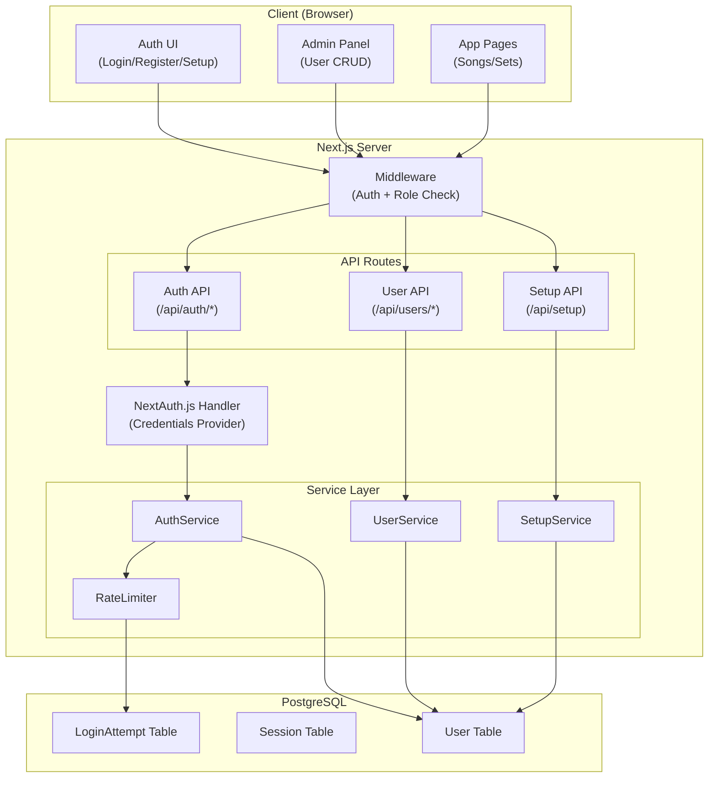
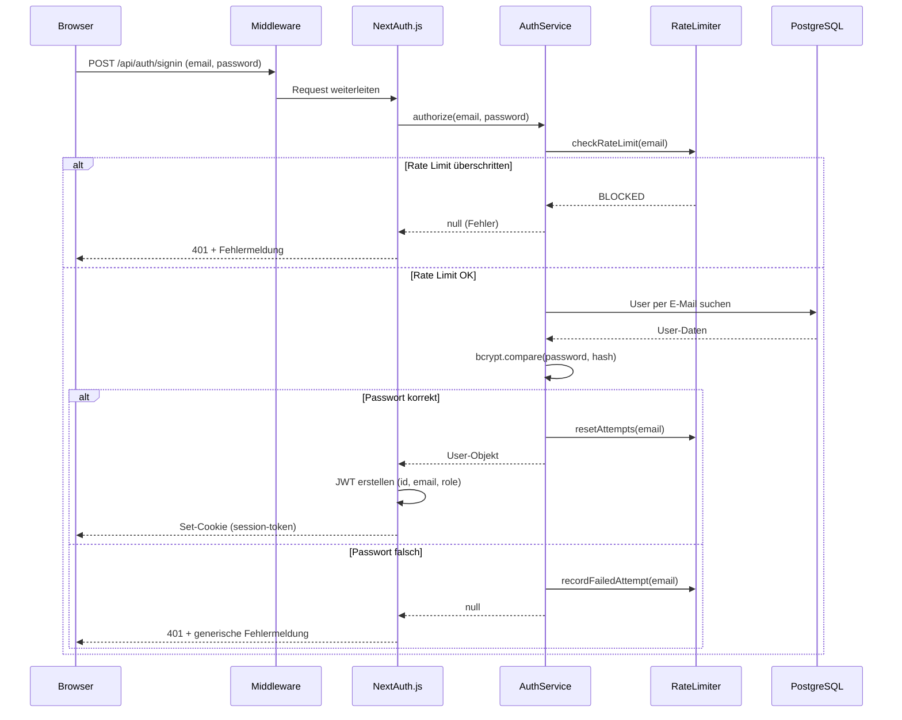
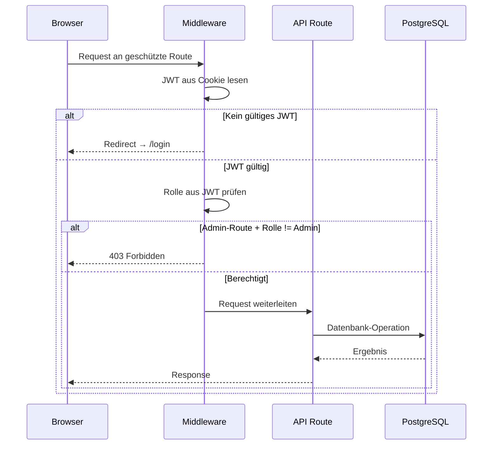

# Technisches Design: User-Management & Authentifizierung

## Übersicht

Dieses Dokument beschreibt das technische Design für das User-Management und die Authentifizierung der Songtext-Lern-Webanwendung. Das System basiert auf NextAuth.js (Auth.js) mit einem Credentials-Provider für E-Mail/Passwort-Authentifizierung, PostgreSQL als Datenbank via Prisma ORM, und einer React/Next.js-Frontend-Architektur mit Tailwind CSS und shadcn/ui.

Das Design umfasst:
- Benutzerregistrierung und Login mit Passwort-Hashing (bcrypt)
- Session-Management mit JWT-Strategie (24h Gültigkeit, Sliding Expiration)
- Rollen-System (Admin/User) mit Middleware-basierter Zugriffskontrolle
- Admin-Panel für CRUD-Operationen auf Benutzern
- Rate-Limiting für Login-Versuche (5 Versuche / 15 Minuten)
- Initialer Setup-Bildschirm für den ersten Admin-Account
- Responsive Auth-UI (320px–2560px) mit Accessibility-Unterstützung
- API-Absicherung (401/403, CSRF, HttpOnly-Cookies)

## Architektur

### Systemübersicht



### Authentifizierungs-Flow



### Request-Autorisierungs-Flow



## Komponenten und Schnittstellen

### Frontend-Komponenten

| Komponente | Pfad | Beschreibung |
|---|---|---|
| `LoginPage` | `app/(auth)/login/page.tsx` | Login-Formular mit E-Mail/Passwort |
| `RegisterPage` | `app/(auth)/register/page.tsx` | Registrierungsformular |
| `SetupPage` | `app/(auth)/setup/page.tsx` | Initialer Admin-Setup-Bildschirm |
| `AdminUsersPage` | `app/(admin)/admin/users/page.tsx` | Benutzerliste im Admin-Panel |
| `UserCreateDialog` | `components/admin/user-create-dialog.tsx` | Dialog zum Erstellen eines Benutzers |
| `UserEditDialog` | `components/admin/user-edit-dialog.tsx` | Dialog zum Bearbeiten eines Benutzers |
| `UserDeleteDialog` | `components/admin/user-delete-dialog.tsx` | Bestätigungsdialog zum Löschen |
| `AuthLayout` | `app/(auth)/layout.tsx` | Layout für Auth-Seiten (zentriert, responsiv) |
| `AdminLayout` | `app/(admin)/layout.tsx` | Layout für Admin-Seiten mit Navigation |

### API-Endpunkte

| Methode | Pfad | Auth | Rolle | Beschreibung |
|---|---|---|---|---|
| POST | `/api/auth/[...nextauth]` | — | — | NextAuth.js Handler (Login/Logout/Session) |
| POST | `/api/auth/register` | — | — | Benutzerregistrierung |
| POST | `/api/setup` | — | — | Initialen Admin-Account erstellen |
| GET | `/api/setup/status` | — | — | Prüft ob Setup nötig ist |
| GET | `/api/users` | ✓ | Admin | Liste aller Benutzer |
| POST | `/api/users` | ✓ | Admin | Neuen Benutzer erstellen |
| PUT | `/api/users/[id]` | ✓ | Admin | Benutzer bearbeiten |
| DELETE | `/api/users/[id]` | ✓ | Admin | Benutzer löschen |
| POST | `/api/users/[id]/reset-password` | ✓ | Admin | Passwort zurücksetzen |

### Service Layer

```typescript
// AuthService – Authentifizierungslogik
interface AuthService {
  authorize(email: string, password: string): Promise<User | null>;
  hashPassword(password: string): Promise<string>;
  verifyPassword(password: string, hash: string): Promise<boolean>;
  validateEmail(email: string): boolean;
  validatePassword(password: string): { valid: boolean; error?: string };
}

// UserService – CRUD-Operationen für Benutzer
interface UserService {
  listUsers(): Promise<User[]>;
  getUserById(id: string): Promise<User | null>;
  createUser(data: CreateUserInput): Promise<User>;
  updateUser(id: string, data: UpdateUserInput): Promise<User>;
  deleteUser(id: string, requestingUserId: string): Promise<void>;
  resetPassword(id: string): Promise<string>; // gibt temporäres Passwort zurück
  isEmailTaken(email: string): Promise<boolean>;
}

// RateLimiter – Login-Versuch-Begrenzung
interface RateLimiter {
  checkRateLimit(email: string): Promise<{ allowed: boolean; retryAfter?: number }>;
  recordFailedAttempt(email: string): Promise<void>;
  resetAttempts(email: string): Promise<void>;
}

// SetupService – Initialer Admin-Setup
interface SetupService {
  isSetupRequired(): Promise<boolean>;
  createInitialAdmin(data: SetupInput): Promise<User>;
}
```

### Middleware

```typescript
// middleware.ts – Next.js Middleware
// Schützt Routen basierend auf Auth-Status und Rolle

// Öffentliche Routen (kein Auth nötig):
//   /login, /register, /setup, /api/auth/*, /api/setup/*

// Geschützte Routen (Auth nötig):
//   /*, /api/*

// Admin-Routen (Auth + Admin-Rolle nötig):
//   /admin/*, /api/users/*
```

## Datenmodelle

### Prisma Schema

```prisma
enum Role {
  ADMIN
  USER
}

model User {
  id             String    @id @default(cuid())
  email          String    @unique
  name           String?
  passwordHash   String
  role           Role      @default(USER)
  createdAt      DateTime  @default(now())
  updatedAt      DateTime  @updatedAt

  loginAttempts  LoginAttempt[]

  @@map("users")
}

model LoginAttempt {
  id        String   @id @default(cuid())
  email     String
  success   Boolean
  ipAddress String?
  createdAt DateTime @default(now())

  user      User?    @relation(fields: [userId], references: [id], onDelete: Cascade)
  userId    String?

  @@index([email, createdAt])
  @@map("login_attempts")
}
```

### TypeScript-Typen

```typescript
// Eingabe-Typen
interface CreateUserInput {
  email: string;
  name?: string;
  password: string;
  role: "ADMIN" | "USER";
}

interface UpdateUserInput {
  email?: string;
  name?: string;
  role?: "ADMIN" | "USER";
}

interface SetupInput {
  email: string;
  name: string;
  password: string;
}

// Ausgabe-Typen (ohne sensible Daten)
interface UserResponse {
  id: string;
  email: string;
  name: string | null;
  role: "ADMIN" | "USER";
  createdAt: string;
  updatedAt: string;
}

// Session-Erweiterung für NextAuth
interface SessionUser {
  id: string;
  email: string;
  name: string | null;
  role: "ADMIN" | "USER";
}
```

### NextAuth.js Konfiguration

```typescript
// auth.ts – NextAuth Konfiguration
const authConfig = {
  providers: [
    CredentialsProvider({
      name: "credentials",
      credentials: {
        email: { label: "E-Mail", type: "email" },
        password: { label: "Passwort", type: "password" },
      },
      authorize: async (credentials) => {
        // Delegiert an AuthService.authorize()
      },
    }),
  ],
  session: {
    strategy: "jwt",
    maxAge: 24 * 60 * 60, // 24 Stunden
    updateAge: 60 * 5,     // Session alle 5 Minuten erneuern
  },
  callbacks: {
    jwt: async ({ token, user }) => {
      // Rolle in JWT-Token schreiben
    },
    session: async ({ session, token }) => {
      // Rolle aus JWT in Session-Objekt übertragen
    },
  },
  cookies: {
    sessionToken: {
      options: {
        httpOnly: true,
        secure: true,
        sameSite: "strict",
      },
    },
  },
  pages: {
    signIn: "/login",
  },
};
```


## Correctness Properties

*Eine Property ist eine Eigenschaft oder ein Verhalten, das über alle gültigen Ausführungen eines Systems hinweg gelten muss – im Wesentlichen eine formale Aussage darüber, was das System tun soll. Properties bilden die Brücke zwischen menschenlesbaren Spezifikationen und maschinell verifizierbaren Korrektheitsgarantien.*

### Property 1: Registrierungs-Round-Trip

*Für jede* gültige E-Mail-Adresse und jedes gültige Passwort (≥ 8 Zeichen) gilt: Nach der Registrierung muss der Benutzer in der Datenbank existieren, die Rolle "USER" haben, und ein Login mit denselben Credentials muss eine gültige Session erzeugen.

**Validates: Requirements 1.1, 1.4, 2.1, 4.2**

### Property 2: Ungültige Registrierungsdaten werden abgelehnt

*Für jeden* String, der kein gültiges E-Mail-Format hat, oder jedes Passwort mit weniger als 8 Zeichen, muss die Registrierung abgelehnt werden und die Benutzerliste darf sich nicht verändern.

**Validates: Requirements 1.3, 1.5**

### Property 3: E-Mail-Uniqueness

*Für jede* E-Mail-Adresse, die bereits einem Benutzer in der Datenbank zugeordnet ist, muss jeder Versuch einen weiteren Benutzer mit derselben E-Mail zu erstellen (sowohl über Registrierung als auch über Admin-Panel) abgelehnt werden.

**Validates: Requirements 1.2, 5.6**

### Property 4: Passwort-Hashing-Integrität

*Für jedes* Passwort, das bei der Registrierung oder Benutzererstellung angegeben wird, muss das in der Datenbank gespeicherte `passwordHash`-Feld ein gültiger bcrypt-Hash sein, und `bcrypt.compare(originalPasswort, hash)` muss `true` zurückgeben.

**Validates: Requirements 1.4**

### Property 5: Generische Fehlermeldung bei fehlgeschlagenem Login

*Für jede* ungültige Credential-Kombination (falsche E-Mail, falsches Passwort, oder beides) muss die zurückgegebene Fehlermeldung identisch sein und darf nicht preisgeben, ob die E-Mail oder das Passwort falsch war.

**Validates: Requirements 2.2**

### Property 6: Rate-Limiting bei Login-Versuchen

*Für jede* E-Mail-Adresse gilt: Wenn innerhalb von 15 Minuten 5 oder mehr fehlgeschlagene Login-Versuche aufgezeichnet wurden, muss jeder weitere Login-Versuch blockiert werden, unabhängig davon ob die Credentials korrekt sind.

**Validates: Requirements 2.4**

### Property 7: Rollenbasierte Zugriffskontrolle

*Für jede* geschützte API-Route und jeden Benutzer gilt: Ein Request ohne gültige Session muss mit HTTP 401 abgelehnt werden. Ein Request mit Rolle "USER" auf eine Admin-Route muss mit HTTP 403 abgelehnt werden. Ein Request mit Rolle "ADMIN" auf eine Admin-Route muss zugelassen werden.

**Validates: Requirements 4.3, 4.4, 4.5, 7.1, 7.2**

### Property 8: Admin-User-CRUD-Round-Trip (Erstellen)

*Für alle* gültigen `CreateUserInput`-Daten (gültige E-Mail, Name, Passwort ≥ 8 Zeichen, Rolle) muss nach dem Erstellen eines Benutzers über die Admin-API der Benutzer per `getUserById` abrufbar sein und die gleichen Daten (E-Mail, Name, Rolle) enthalten.

**Validates: Requirements 5.2**

### Property 9: Admin-User-CRUD-Round-Trip (Bearbeiten)

*Für jeden* existierenden Benutzer und alle gültigen `UpdateUserInput`-Daten muss nach dem Aktualisieren der Benutzer die neuen Werte enthalten, während nicht geänderte Felder unverändert bleiben.

**Validates: Requirements 5.3**

### Property 10: Löschen entfernt Benutzer

*Für jeden* existierenden Benutzer, der von einem anderen Admin gelöscht wird, muss der Benutzer danach nicht mehr in der Datenbank auffindbar sein.

**Validates: Requirements 5.4**

### Property 11: Selbstlöschung durch Admin ist verboten

*Für jeden* Admin-Benutzer muss der Versuch, den eigenen Account zu löschen, abgelehnt werden, und der Benutzer muss weiterhin in der Datenbank existieren.

**Validates: Requirements 5.5**

### Property 12: Passwort-Reset-Round-Trip

*Für jeden* existierenden Benutzer muss nach einem Passwort-Reset das zurückgegebene temporäre Passwort für einen Login funktionieren, und das alte Passwort darf nicht mehr funktionieren.

**Validates: Requirements 5.7**

### Property 13: ARIA-Labels auf Formularfeldern

*Für jedes* Formularfeld in der Auth-UI muss ein `aria-label` oder `aria-labelledby`-Attribut vorhanden sein, das den Zweck des Feldes beschreibt.

**Validates: Requirements 6.5**

### Property 14: Setup-Endpunkt-Verfügbarkeit

*Für jeden* Datenbankzustand gilt: Der Setup-Endpunkt muss genau dann verfügbar sein (HTTP 200), wenn kein Benutzer mit der Rolle "ADMIN" in der Datenbank existiert. Existiert mindestens ein Admin, muss der Setup-Endpunkt den Zugriff verweigern (Redirect auf Login).

**Validates: Requirements 8.1, 8.3**

### Property 15: Session-Cookie-Sicherheitsattribute

*Für jede* vom Auth-System gesetzte Session muss das Session-Cookie die Attribute `HttpOnly`, `Secure` und `SameSite=Strict` besitzen.

**Validates: Requirements 7.4**

## Fehlerbehandlung

### Registrierung & Login

| Fehlerfall | HTTP-Status | Verhalten |
|---|---|---|
| Ungültige E-Mail-Format | 400 | Validierungsfehler mit Feldangabe |
| Passwort zu kurz (< 8 Zeichen) | 400 | Validierungsfehler mit Feldangabe |
| E-Mail bereits vergeben | 409 | Fehlermeldung "E-Mail bereits vergeben" |
| Ungültige Login-Credentials | 401 | Generische Meldung "Anmeldedaten ungültig" |
| Rate-Limit überschritten | 429 | Meldung mit verbleibender Sperrzeit |

### Admin-Operationen

| Fehlerfall | HTTP-Status | Verhalten |
|---|---|---|
| Nicht authentifiziert | 401 | Redirect auf Login-Seite |
| Keine Admin-Berechtigung | 403 | Fehlermeldung "Zugriff verweigert" |
| Benutzer nicht gefunden | 404 | Fehlermeldung "Benutzer nicht gefunden" |
| Selbstlöschung | 403 | Fehlermeldung "Eigenen Account kann nicht gelöscht werden" |
| E-Mail-Duplikat bei Erstellung | 409 | Fehlermeldung "E-Mail bereits vergeben" |

### Setup

| Fehlerfall | HTTP-Status | Verhalten |
|---|---|---|
| Setup aufrufen wenn Admin existiert | 302 | Redirect auf Login-Seite |
| Ungültige Setup-Daten | 400 | Validierungsfehler |

### Allgemeine Fehlerbehandlung

- Alle API-Routen fangen unerwartete Fehler ab und geben HTTP 500 mit generischer Meldung zurück
- Sensible Fehlerdetails (Stack Traces, DB-Fehler) werden nur serverseitig geloggt, nie an den Client gesendet
- Prisma-spezifische Fehler (z.B. `P2002` für Unique-Constraint-Verletzung) werden in benutzerfreundliche Meldungen übersetzt

## Testing-Strategie

### Property-Based Testing

**Library:** [fast-check](https://github.com/dubzzz/fast-check) (JavaScript/TypeScript PBT-Library)

Jede Correctness Property wird als einzelner Property-Based Test implementiert mit mindestens 100 Iterationen. Jeder Test referenziert die zugehörige Design-Property im Kommentar.

**Konfiguration:**
```typescript
import fc from "fast-check";

// Mindestens 100 Iterationen pro Property-Test
const PBT_CONFIG = { numRuns: 100 };
```

**Property-Test-Mapping:**

| Property | Test-Datei | Tag |
|---|---|---|
| Property 1 | `__tests__/auth/registration.property.test.ts` | Feature: user-management-auth, Property 1: Registrierungs-Round-Trip |
| Property 2 | `__tests__/auth/registration.property.test.ts` | Feature: user-management-auth, Property 2: Ungültige Registrierungsdaten werden abgelehnt |
| Property 3 | `__tests__/auth/email-uniqueness.property.test.ts` | Feature: user-management-auth, Property 3: E-Mail-Uniqueness |
| Property 4 | `__tests__/auth/password-hashing.property.test.ts` | Feature: user-management-auth, Property 4: Passwort-Hashing-Integrität |
| Property 5 | `__tests__/auth/login.property.test.ts` | Feature: user-management-auth, Property 5: Generische Fehlermeldung bei fehlgeschlagenem Login |
| Property 6 | `__tests__/auth/rate-limiting.property.test.ts` | Feature: user-management-auth, Property 6: Rate-Limiting bei Login-Versuchen |
| Property 7 | `__tests__/auth/access-control.property.test.ts` | Feature: user-management-auth, Property 7: Rollenbasierte Zugriffskontrolle |
| Property 8 | `__tests__/admin/user-crud.property.test.ts` | Feature: user-management-auth, Property 8: Admin-User-CRUD-Round-Trip (Erstellen) |
| Property 9 | `__tests__/admin/user-crud.property.test.ts` | Feature: user-management-auth, Property 9: Admin-User-CRUD-Round-Trip (Bearbeiten) |
| Property 10 | `__tests__/admin/user-crud.property.test.ts` | Feature: user-management-auth, Property 10: Löschen entfernt Benutzer |
| Property 11 | `__tests__/admin/user-crud.property.test.ts` | Feature: user-management-auth, Property 11: Selbstlöschung durch Admin ist verboten |
| Property 12 | `__tests__/admin/password-reset.property.test.ts` | Feature: user-management-auth, Property 12: Passwort-Reset-Round-Trip |
| Property 13 | `__tests__/ui/auth-accessibility.property.test.ts` | Feature: user-management-auth, Property 13: ARIA-Labels auf Formularfeldern |
| Property 14 | `__tests__/setup/setup-availability.property.test.ts` | Feature: user-management-auth, Property 14: Setup-Endpunkt-Verfügbarkeit |
| Property 15 | `__tests__/auth/cookie-security.property.test.ts` | Feature: user-management-auth, Property 15: Session-Cookie-Sicherheitsattribute |

### Unit Tests

Unit Tests ergänzen die Property-Tests für spezifische Beispiele, Edge Cases und Integrationspunkte:

| Test-Datei | Fokus |
|---|---|
| `__tests__/auth/registration.test.ts` | Registrierung: Erfolgsfall, Duplikat-E-Mail, leere Felder |
| `__tests__/auth/login.test.ts` | Login: Erfolgsfall, Redirect nach Login, Session-Erstellung |
| `__tests__/auth/session.test.ts` | Session: 24h-Gültigkeit, Logout, Ablauf-Redirect |
| `__tests__/admin/user-management.test.ts` | Admin CRUD: Benutzerliste, Erstellen, Bearbeiten, Löschen |
| `__tests__/setup/initial-setup.test.ts` | Setup: Erstmaliger Start, Setup nach Admin-Erstellung deaktiviert |
| `__tests__/middleware/auth-middleware.test.ts` | Middleware: Route-Schutz, Rolle-Check, CSRF |

### Test-Infrastruktur

- **Test-Runner:** Vitest (kompatibel mit Next.js)
- **PBT-Library:** fast-check
- **Datenbank:** Testcontainers mit PostgreSQL für Integrationstests
- **Mocking:** Prisma Client wird für Unit Tests gemockt, Integrationstests nutzen echte DB
- **UI-Tests:** React Testing Library für Komponenten-Tests
