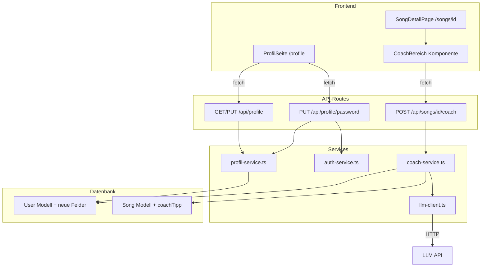
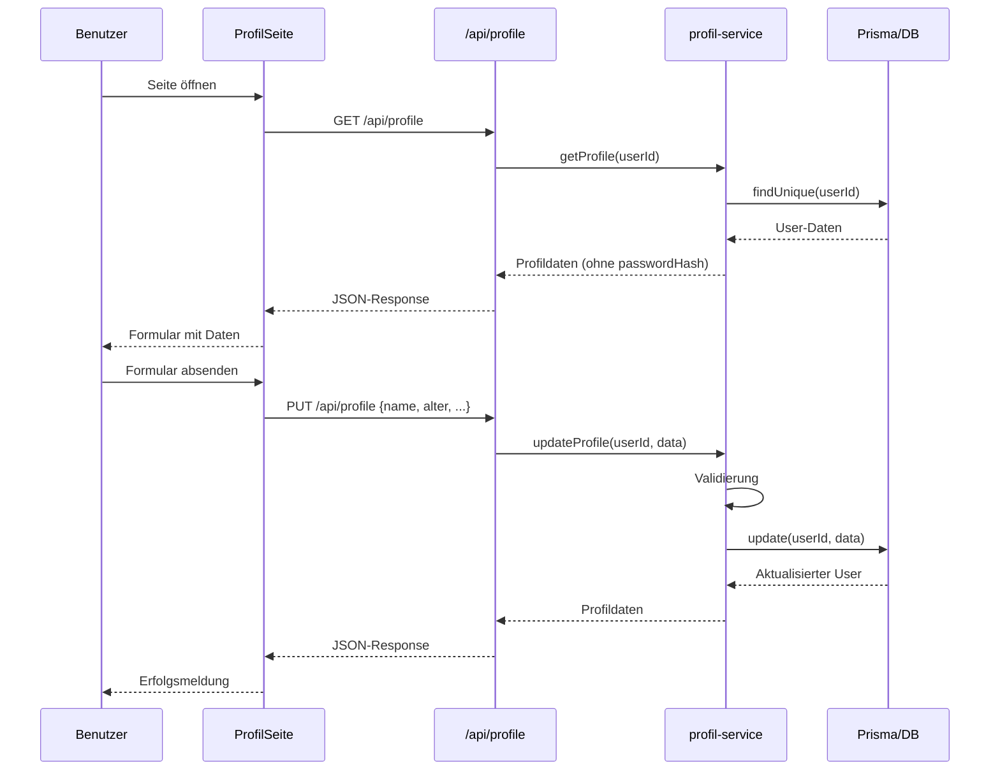
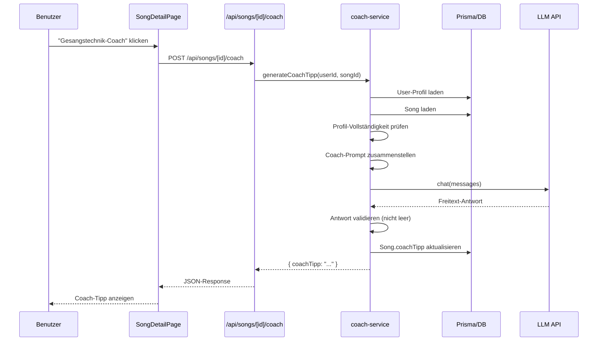

# Design: Benutzerprofil & Gesangstechnik-Coach

## Übersicht

Dieses Design beschreibt die technische Umsetzung zweier zusammenhängender Features für die Lyco-Anwendung:

1. **Benutzerprofil**: Erweiterung des bestehenden `User`-Modells um gesangsspezifische Felder (Alter, Geschlecht, Erfahrungslevel, Stimmlage, Genre) mit zugehöriger Profilseite (`/profile`), API-Endpunkten und Passwort-Änderungsfunktion.
2. **Gesangstechnik-Coach**: Ein LLM-basierter Coach, der auf Basis des Benutzerprofils und eines Songs personalisierte Gesangstipps generiert. Die Antwort wird als Freitext (`coachTipp`) am Song-Modell gespeichert.

Beide Features folgen den bestehenden Architekturmustern der Anwendung: Next.js App Router, Prisma ORM, Service-Layer-Pattern, NextAuth.js für Authentifizierung.

## Architektur

### Gesamtarchitektur



### Datenfluss: Profil



### Datenfluss: Coach



### Design-Entscheidungen

1. **Profil-Service als eigener Service**: Trennung vom bestehenden `user-service.ts`, da der User-Service Admin-Operationen (CRUD, Passwort-Reset) abdeckt, während der Profil-Service Self-Service-Operationen des angemeldeten Benutzers behandelt.

2. **Coach-Service analog zu Analyse-Service**: Der `coach-service.ts` folgt dem gleichen Pattern wie `analyse-service.ts` — Prompt-Erstellung, LLM-Aufruf, Validierung, Speicherung. Unterschied: Die Antwort ist Freitext statt strukturiertes JSON, daher wird `response_format` nicht auf `json_object` gesetzt.

3. **LLM-Client Wiederverwendung**: Der bestehende `createLLMClient()` wird wiederverwendet. Für den Coach wird eine separate Instanz ohne `response_format: json_object` benötigt, da die Antwort Freitext ist. Dafür wird der LLM-Client um eine optionale `text`-Response-Format-Option erweitert oder der Coach-Service nutzt eine eigene Client-Konfiguration.

4. **Kein Concurrency-Guard für Coach**: Anders als die Song-Analyse ist der Coach-Aufruf idempotent (überschreibt den vorherigen Tipp). Ein Concurrency-Guard ist nicht nötig.

5. **Profilseite unter `/profile`**: Neue Route im `(main)`-Layout-Bereich, damit Navigation und Layout konsistent bleiben.

## Komponenten und Schnittstellen

### Neue Services

#### profil-service.ts

**Pfad:** `src/lib/services/profil-service.ts`

```typescript
// Profildaten des angemeldeten Benutzers lesen
export async function getProfile(userId: string): Promise<ProfileData>

// Profildaten aktualisieren (Name, Alter, Geschlecht, Erfahrungslevel, Stimmlage, Genre)
export async function updateProfile(userId: string, data: UpdateProfileInput): Promise<ProfileData>

// Passwort ändern (altes Passwort verifizieren, neues Passwort hashen und speichern)
export async function changePassword(userId: string, data: ChangePasswordInput): Promise<void>
```

Validierungsregeln in `updateProfile`:
- `name`: nicht-leerer String, max. 100 Zeichen
- `alter`: Ganzzahl zwischen 1 und 120 (optional)
- `geschlecht`: MAENNLICH | WEIBLICH | DIVERS (optional)
- `erfahrungslevel`: ANFAENGER | FORTGESCHRITTEN | ERFAHREN | PROFI (optional)
- `stimmlage`: optionaler String
- `genre`: optionaler String

Validierungsregeln in `changePassword`:
- `currentPassword`: Pflichtfeld, wird gegen gespeicherten Hash verifiziert
- `newPassword`: Pflichtfeld, mindestens 8 Zeichen
- `confirmPassword`: Pflichtfeld, muss mit `newPassword` übereinstimmen

#### coach-service.ts

**Pfad:** `src/lib/services/coach-service.ts`

```typescript
// Coach-Tipp für einen Song generieren
export async function generateCoachTipp(userId: string, songId: string): Promise<CoachResult>

// Coach-Prompt zusammenstellen (intern)
function buildCoachPrompt(profile: ProfileData, song: SongBasicData): LLMMessage[]

// Coach-Antwort validieren (intern)
function validateCoachResponse(response: string): string
```

### Neue API-Routes

#### /api/profile/route.ts

**Pfad:** `src/app/api/profile/route.ts`

| Methode | Beschreibung | Request Body | Response |
|---------|-------------|-------------|----------|
| GET | Profildaten lesen | — | `{ profile: ProfileData }` |
| PUT | Profildaten aktualisieren | `UpdateProfileInput` | `{ profile: ProfileData }` |

#### /api/profile/password/route.ts

**Pfad:** `src/app/api/profile/password/route.ts`

| Methode | Beschreibung | Request Body | Response |
|---------|-------------|-------------|----------|
| PUT | Passwort ändern | `ChangePasswordInput` | `{ success: true }` |

#### /api/songs/[id]/coach/route.ts

**Pfad:** `src/app/api/songs/[id]/coach/route.ts`

| Methode | Beschreibung | Request Body | Response |
|---------|-------------|-------------|----------|
| POST | Coach-Tipp generieren | — | `{ coachTipp: string }` |

### Neue Frontend-Komponenten

#### ProfilSeite

**Pfad:** `src/app/(main)/profile/page.tsx`

Client-Komponente mit zwei Formularbereichen:
1. **Profildaten-Formular**: Name, Alter, Geschlecht, Erfahrungslevel, Stimmlage, Genre
2. **Passwort-Änderung**: Aktuelles Passwort, Neues Passwort, Bestätigung

State-Management:
- `profile: ProfileData | null` — geladene Profildaten
- `loading: boolean` — Ladezustand
- `saving: boolean` — Speicherzustand
- `error: string | null` — Fehlermeldung
- `success: string | null` — Erfolgsmeldung
- `fieldErrors: Record<string, string>` — Feld-spezifische Fehler
- `passwordForm: ChangePasswordInput` — Passwort-Formular-State
- `passwordSaving: boolean` — Passwort-Speicherzustand
- `passwordError: string | null` — Passwort-Fehlermeldung
- `passwordSuccess: string | null` — Passwort-Erfolgsmeldung

#### CoachBereich

**Pfad:** `src/components/songs/coach-bereich.tsx`

Props:
```typescript
interface CoachBereichProps {
  songId: string;
  coachTipp: string | null;
  onCoachTippChanged: (tipp: string) => void;
}
```

State:
- `loading: boolean` — Ladezustand während LLM-Aufruf
- `error: string | null` — Fehlermeldung
- `showProfileLink: boolean` — Link zur Profilseite bei unvollständigem Profil

### Geänderte Komponenten

#### MainLayout

**Pfad:** `src/app/(main)/layout.tsx`

Änderung: Neuer Navigationslink „Profil" in der Navigationsleiste, der auf `/profile` verweist.

#### SongDetailPage

**Pfad:** `src/app/(main)/songs/[id]/page.tsx`

Änderungen:
- Import und Rendering der `CoachBereich`-Komponente
- `coachTipp` aus den Song-Daten an `CoachBereich` übergeben
- Callback `onCoachTippChanged` zum Aktualisieren des lokalen Song-States

#### SongDetail-Typ

**Pfad:** `src/types/song.ts`

Änderung: `SongDetail`-Interface um `coachTipp: string | null` erweitern.


## Datenmodelle

### Prisma-Schema-Erweiterungen

#### Neue Enums

```prisma
enum Geschlecht {
  MAENNLICH
  WEIBLICH
  DIVERS
}

enum Erfahrungslevel {
  ANFAENGER
  FORTGESCHRITTEN
  ERFAHREN
  PROFI
}
```

#### User-Modell (erweitert)

```prisma
model User {
  // ... bestehende Felder ...
  alter           Int?
  geschlecht      Geschlecht?
  erfahrungslevel Erfahrungslevel?
  stimmlage       String?
  genre           String?
}
```

Alle neuen Felder sind optional (`?`) mit implizitem Standardwert `null`, sodass bestehende Benutzer bei der Migration nicht betroffen sind.

#### Song-Modell (erweitert)

```prisma
model Song {
  // ... bestehende Felder ...
  coachTipp String?
}
```

### TypeScript-Typen

#### Neue Typen in `src/types/profile.ts`

```typescript
export interface ProfileData {
  id: string;
  name: string | null;
  email: string;
  alter: number | null;
  geschlecht: "MAENNLICH" | "WEIBLICH" | "DIVERS" | null;
  erfahrungslevel: "ANFAENGER" | "FORTGESCHRITTEN" | "ERFAHREN" | "PROFI" | null;
  stimmlage: string | null;
  genre: string | null;
}

export interface UpdateProfileInput {
  name?: string;
  alter?: number | null;
  geschlecht?: "MAENNLICH" | "WEIBLICH" | "DIVERS" | null;
  erfahrungslevel?: "ANFAENGER" | "FORTGESCHRITTEN" | "ERFAHREN" | "PROFI" | null;
  stimmlage?: string | null;
  genre?: string | null;
}

export interface ChangePasswordInput {
  currentPassword: string;
  newPassword: string;
  confirmPassword: string;
}

export interface CoachResult {
  coachTipp: string;
}
```

#### Erweiterung in `src/types/song.ts`

```typescript
export interface SongDetail {
  // ... bestehende Felder ...
  coachTipp: string | null;  // NEU
}
```

### Coach-Prompt-Struktur

Der Coach-Prompt besteht aus zwei Teilen:

**System-Prompt:**
```
Du bist ein erfahrener Gesangscoach. Du gibst personalisierte Tipps und Übungsempfehlungen
basierend auf dem Profil des Sängers/der Sängerin und dem gewählten Song.
Antworte auf Deutsch in einem zusammenhängenden Freitext.
```

**User-Prompt:**
```
Ich bin [geschlecht] und singe Songs im Genre [genre].
Meine Stimmlage ist [stimmlage], mein Niveau ist [erfahrungslevel].
Ich möchte neue Songs lernen. Du bist mein Coach.

Es geht um folgenden Song: [titel] von [kuenstler]

Liefere mir folgende Informationen zum Gesang des Songs:
- Wie anspruchsvoll ist der Song zu singen für mich
- Wie wird der Song allgemein gesungen (Kopfstimme, Bruststimme, etc.)
- Was sind typische Charakteristiken, wie der Originalkünstler den Song singt
- Was sind schwierige Passagen
- Wie kann ich den Song am besten üben? (Welche allgemeinen Übungen bieten sich an,
  um bestimmte Passagen zu üben, wie kann ich die Charakteristik des Interpreten gut imitieren.)
```

### LLM-Client-Anpassung

Der bestehende `createLLMClient()` erzwingt `response_format: { type: "json_object" }`. Für den Coach wird Freitext benötigt. Lösung: Der LLM-Client wird um einen optionalen Parameter `responseFormat` erweitert, der standardmäßig `json_object` bleibt, aber auf `text` gesetzt werden kann.

```typescript
export interface LLMClientConfig {
  // ... bestehende Felder ...
  responseFormat?: "json_object" | "text";  // NEU, Standard: "json_object"
}
```

Der Coach-Service erstellt den Client mit:
```typescript
const llmClient = createLLMClient({ responseFormat: "text" });
```

