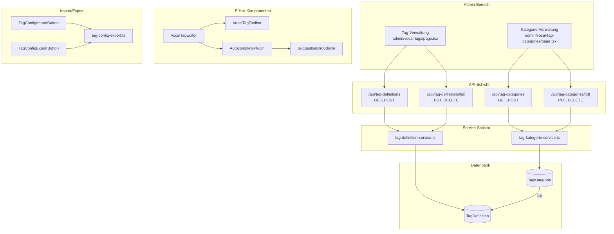
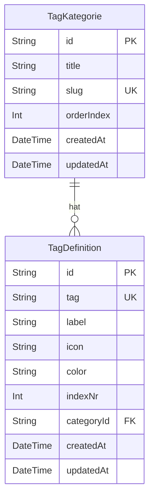

# Design-Dokument: Vocal-Tag-Kategorien

## Übersicht

Dieses Design erweitert das bestehende Vocal-Tag-System um ein Kategorie-Modell (`TagKategorie`), das Tag-Definitionen in thematische Gruppen organisiert. Die Erweiterung umfasst:

1. **Datenmodell**: Neues Prisma-Modell `TagKategorie` mit 1:n-Beziehung zu `TagDefinition`
2. **CRUD-API**: REST-Endpunkte unter `/api/tag-categories` für Kategorie-Verwaltung
3. **Admin-UI**: Neue Verwaltungsseite für Kategorien + Kategorie-Dropdown in der Tag-Verwaltung
4. **Import/Export**: Erweiterung des JSON-Formats um ein optionales `category`-Feld (Slug-basiert)
5. **Editor-Integration**: Gruppierte Darstellung im Tag-Picker-Dropdown und Autocomplete-Menü

### Design-Entscheidungen

- **Slug als Transfer-Identifier**: Im JSON-Import/Export wird der `slug` statt der `id` verwendet, da Slugs instanzübergreifend stabil sind.
- **Optionale Zuordnung**: `categoryId` ist nullable – Tags ohne Kategorie werden in einer "Ohne Kategorie"-Gruppe am Ende angezeigt.
- **Kaskadierendes Nullsetzen**: Beim Löschen einer Kategorie werden zugehörige Tags nicht gelöscht, sondern deren `categoryId` auf `null` gesetzt (`onDelete: SetNull`).
- **Auto-Erstellung beim Import**: Unbekannte Kategorie-Slugs im Import erzeugen automatisch neue Kategorien, um einen reibungslosen Transfer zu ermöglichen.

## Architektur



### Komponentenhierarchie

```
admin/vocal-tag-categories/page.tsx (NEU)
├── KategorieCreateDialog (NEU)
├── KategorieDeleteDialog (NEU)
└── KategorieListeInline (NEU)

admin/vocal-tags/page.tsx (ERWEITERT)
└── Kategorie-Dropdown pro Tag-Zeile (NEU)

VocalTagEditor (ERWEITERT)
├── VocalTagToolbar (ERWEITERT – gruppiertes Dropdown)
│   └── Kategorie-Gruppen mit Überschriften
├── AutocompletePlugin (ERWEITERT – gruppierte Items)
└── SuggestionDropdown (ERWEITERT – Kategorie-Überschriften)

tag-config-export.ts (ERWEITERT)
├── serializeTagConfig – inkl. category-Feld
└── validateTagConfigJson – inkl. category-Validierung
```

## Komponenten und Schnittstellen

### API-Endpunkte

#### Kategorie-API (`/api/tag-categories`)

| Methode | Pfad | Beschreibung | Auth | Status-Codes |
|---------|------|-------------|------|-------------|
| `GET` | `/api/tag-categories` | Alle Kategorien abrufen (sortiert nach `orderIndex`) | USER+ | 200, 401 |
| `POST` | `/api/tag-categories` | Neue Kategorie erstellen | ADMIN | 201, 400, 403, 409 |
| `PUT` | `/api/tag-categories/[id]` | Kategorie aktualisieren | ADMIN | 200, 400, 403, 404 |
| `DELETE` | `/api/tag-categories/[id]` | Kategorie löschen (Tags → `categoryId: null`) | ADMIN | 200, 403, 404 |

#### Erweiterte Tag-API (`/api/tag-definitions`)

| Methode | Pfad | Änderung |
|---------|------|---------|
| `GET` | `/api/tag-definitions` | Response enthält `categoryId` und optional `category`-Objekt |
| `POST` | `/api/tag-definitions` | Akzeptiert optionales `categoryId`-Feld |
| `PUT` | `/api/tag-definitions/[id]` | Akzeptiert optionales `categoryId`-Feld (inkl. `null` zum Entfernen) |

### TypeScript-Interfaces

```typescript
// --- Neue Typen in src/types/vocal-tag.ts ---

export interface TagKategorieData {
  id: string;
  title: string;
  slug: string;
  orderIndex: number;
  _count?: { tagDefinitions: number };
}

export interface CreateTagKategorieInput {
  title: string;
  slug: string;
  orderIndex?: number;
}

export interface UpdateTagKategorieInput {
  title?: string;
  slug?: string;
  orderIndex?: number;
}

// --- Erweiterte bestehende Typen ---

export interface TagDefinitionData {
  id: string;
  tag: string;
  label: string;
  icon: string;
  color: string;
  indexNr: number;
  categoryId: string | null;       // NEU
  category?: TagKategorieData;      // NEU (optional, für UI-Anzeige)
}

export interface CreateTagDefinitionInput {
  tag: string;
  label: string;
  icon: string;
  color: string;
  indexNr: number;
  categoryId?: string | null;       // NEU
}

export interface UpdateTagDefinitionInput {
  label?: string;
  icon?: string;
  color?: string;
  indexNr?: number;
  categoryId?: string | null;       // NEU
}

// --- Erweitertes Import-Format ---

export interface TagConfigImportItem {
  tag: string;
  label: string;
  icon: string;
  color: string;
  indexNr: number;
  category?: string;                // NEU (Slug-Referenz)
}

// --- Gruppierte Tag-Struktur für UI ---

export interface GruppierteTagDefinitionen {
  kategorie: TagKategorieData | null;  // null = "Ohne Kategorie"
  tags: TagDefinitionData[];
}
```

### Service-Schicht

```typescript
// src/lib/services/tag-kategorie-service.ts (NEU)

export async function getAllTagKategorien(): Promise<TagKategorieData[]>;
export async function createTagKategorie(input: CreateTagKategorieInput): Promise<TagKategorieData>;
export async function updateTagKategorie(id: string, input: UpdateTagKategorieInput): Promise<TagKategorieData>;
export async function deleteTagKategorie(id: string): Promise<{ deleted: boolean; affectedTags: number }>;
export async function findTagKategorieBySlug(slug: string): Promise<TagKategorieData | null>;

// src/lib/services/tag-definition-service.ts (ERWEITERT)

export async function getAllTagDefinitions(): Promise<TagDefinitionData[]>;
// → Enthält jetzt categoryId und optional category-Objekt via Prisma include
```

### Gruppierungs-Hilfsfunktion

```typescript
// src/lib/vocal-tag/tag-gruppierung.ts (NEU)

/**
 * Gruppiert Tag-Definitionen nach Kategorien.
 * Kategorien werden nach orderIndex sortiert.
 * Tags ohne Kategorie erscheinen in einer Gruppe am Ende.
 */
export function gruppiereTagsNachKategorie(
  tags: TagDefinitionData[],
  kategorien: TagKategorieData[],
): GruppierteTagDefinitionen[];
```

## Datenmodell

### Prisma-Schema-Erweiterung

```prisma
model TagKategorie {
  id         String @id @default(cuid())
  title      String
  slug       String @unique
  orderIndex Int    @default(0)

  createdAt DateTime @default(now())
  updatedAt DateTime @updatedAt

  tagDefinitions TagDefinition[]

  @@map("tag_kategorien")
}

model TagDefinition {
  id         String  @id @default(cuid())
  tag        String  @unique
  label      String
  icon       String
  color      String
  indexNr    Int
  categoryId String?                          // NEU

  createdAt DateTime @default(now())
  updatedAt DateTime @updatedAt

  category TagKategorie? @relation(fields: [categoryId], references: [id], onDelete: SetNull)  // NEU

  @@map("tag_definitions")
}
```

### ER-Diagramm



### Migration

Die Migration fügt hinzu:
1. Neue Tabelle `tag_kategorien` mit Spalten `id`, `title`, `slug` (unique), `orderIndex`, `createdAt`, `updatedAt`
2. Neue Spalte `categoryId` (nullable) in `tag_definitions` mit Foreign-Key auf `tag_kategorien.id` und `ON DELETE SET NULL`


## Korrektheitseigenschaften

*Eine Korrektheitseigenschaft ist ein Merkmal oder Verhalten, das für alle gültigen Ausführungen eines Systems gelten muss – im Wesentlichen eine formale Aussage darüber, was das System tun soll. Eigenschaften bilden die Brücke zwischen menschenlesbaren Spezifikationen und maschinenverifizierbaren Korrektheitsgarantien.*

### Eigenschaft 1: Slug-Eindeutigkeit

*Für alle* gültigen Slug-Werte gilt: Wenn eine Tag_Kategorie mit einem bestimmten Slug existiert, dann muss der Versuch, eine zweite Tag_Kategorie mit demselben Slug zu erstellen, mit HTTP-Status 409 abgelehnt werden, und die Gesamtanzahl der Kategorien darf sich nicht erhöhen.

**Validiert: Anforderungen 1.2, 2.4**

### Eigenschaft 2: Sortierung nach orderIndex

*Für jede* Menge von Tag_Kategorien mit beliebigen orderIndex-Werten gilt: Die GET-API muss die Kategorien aufsteigend nach `orderIndex` sortiert zurückgeben, d.h. für alle aufeinanderfolgenden Elemente i und i+1 in der Ergebnisliste muss `result[i].orderIndex <= result[i+1].orderIndex` gelten.

**Validiert: Anforderungen 1.3, 2.7**

### Eigenschaft 3: Kaskadierendes Nullsetzen beim Löschen

*Für jede* Tag_Kategorie mit N zugeordneten Tag_Definitionen (N ≥ 0) gilt: Nach dem Löschen der Kategorie müssen alle N Tag_Definitionen weiterhin existieren und deren `categoryId` muss `null` sein.

**Validiert: Anforderungen 1.5, 2.3**

### Eigenschaft 4: Kategorie-CRUD-Persistenz (Round-Trip)

*Für alle* gültigen Kombinationen von `title`, `slug` und `orderIndex` gilt: Eine über die API erstellte Tag_Kategorie muss beim anschließenden Abrufen exakt dieselben Werte für `title`, `slug` und `orderIndex` zurückgeben. Ebenso muss eine Aktualisierung dieser Felder beim erneuten Abrufen die aktualisierten Werte widerspiegeln.

**Validiert: Anforderungen 2.1, 2.2**

### Eigenschaft 5: Zugriffskontrolle

*Für alle* Benutzer mit einer Rolle ungleich ADMIN gilt: Mutations-Anfragen (POST, PUT, DELETE) an die Kategorie-API müssen mit HTTP-Status 403 abgelehnt werden, und der Datenbestand darf sich nicht verändern.

**Validiert: Anforderung 2.6**

### Eigenschaft 6: Import-Validierung des category-Feldes

*Für alle* Import-Einträge, deren `category`-Feld einen nicht-String-Wert enthält (Zahl, Objekt, Array, Boolean), muss die Validierungsfunktion einen Fehler zurückgeben. *Für alle* Import-Einträge mit einem String-Wert oder ohne `category`-Feld muss die Validierung bezüglich dieses Feldes erfolgreich sein.

**Validiert: Anforderungen 5.1, 5.5**

### Eigenschaft 7: Import-Kategorie-Auflösung

*Für jede* importierte Tag_Definition gilt:
- Wenn das `category`-Feld einem existierenden Kategorie-Slug entspricht, muss die Tag_Definition dieser Kategorie zugeordnet werden.
- Wenn das `category`-Feld einem nicht-existierenden Slug entspricht, muss eine neue Kategorie mit diesem Slug erstellt und die Tag_Definition zugeordnet werden.
- Wenn kein `category`-Feld vorhanden ist, muss `categoryId` null sein.

**Validiert: Anforderungen 5.2, 5.3, 5.4**

### Eigenschaft 8: Export-Serialisierung

*Für jede* Tag_Definition gilt: Wenn sie einer Kategorie zugeordnet ist, muss das exportierte JSON-Objekt ein `category`-Feld mit dem Slug der Kategorie enthalten. Wenn sie keiner Kategorie zugeordnet ist, darf das exportierte JSON-Objekt kein `category`-Feld enthalten.

**Validiert: Anforderungen 6.1, 6.2**

### Eigenschaft 9: Export/Import-Round-Trip

*Für jede* Menge von Tag_Definitionen mit Kategorie-Zuordnungen gilt: Das Ergebnis von Exportieren (Serialisierung zu JSON) und anschließendem Importieren (Deserialisierung und Kategorie-Auflösung) muss äquivalente Kategorie-Zuordnungen erzeugen – d.h. jede Tag_Definition muss nach dem Round-Trip derselben Kategorie (identifiziert über den Slug) zugeordnet sein wie zuvor.

**Validiert: Anforderung 6.3**

### Eigenschaft 10: Gruppierungsfunktion

*Für jede* Menge von Tag_Definitionen und Tag_Kategorien gilt:
1. Jede Tag_Definition erscheint in genau einer Gruppe.
2. Die Gruppen sind nach dem `orderIndex` der zugehörigen Kategorie sortiert.
3. Tags ohne Kategorie-Zuordnung erscheinen in der letzten Gruppe.
4. Die Gesamtanzahl der Tags über alle Gruppen entspricht der Eingabe-Anzahl.

**Validiert: Anforderungen 7.1, 7.2, 7.3, 8.1, 8.3**

### Eigenschaft 11: Filterung blendet leere Gruppen aus

*Für jede* Filtereingabe (Suchbegriff) und jede Menge von gruppierten Tag_Definitionen gilt: Nach Anwendung des Filters darf keine Gruppe leer sein – Gruppen, deren Tags vollständig herausgefiltert wurden, müssen aus dem Ergebnis entfernt werden.

**Validiert: Anforderung 8.2**

## Fehlerbehandlung

### API-Fehler

| Szenario | HTTP-Status | Fehlermeldung |
|----------|-------------|---------------|
| Nicht authentifiziert | 401 | "Nicht authentifiziert" |
| Keine ADMIN-Berechtigung | 403 | "Keine Berechtigung" |
| Pflichtfeld fehlt (title/slug) | 400 | "Feld '{feldname}' ist erforderlich" |
| Slug bereits vergeben | 409 | "Eine Kategorie mit diesem Slug existiert bereits" |
| Kategorie nicht gefunden | 404 | "Tag-Kategorie nicht gefunden" |
| Interner Fehler | 500 | "Interner Serverfehler" |

### Import-Fehler

| Szenario | Verhalten |
|----------|-----------|
| `category`-Feld ist kein String | Validierungsfehler: "Eintrag {n}: Feld 'category' muss ein String sein." |
| Unbekannter Kategorie-Slug | Automatische Erstellung einer neuen Kategorie (kein Fehler) |
| Fehlendes `category`-Feld | Tag wird ohne Kategorie importiert (kein Fehler) |

### UI-Fehler

| Szenario | Verhalten |
|----------|-----------|
| Kategorie-API nicht erreichbar | Fehlermeldung in der Verwaltungsseite, Retry-Möglichkeit |
| Löschen einer Kategorie mit zugeordneten Tags | Bestätigungsdialog mit Anzahl betroffener Tags |
| Slug-Konflikt beim Erstellen | Fehlermeldung im Erstellungs-Dialog |

## Teststrategie

### Property-Based Tests (fast-check)

Das Projekt verwendet `vitest` als Test-Runner und `fast-check` für Property-Based Tests. Jeder Property-Test wird mit mindestens 100 Iterationen konfiguriert.

| Test-Datei | Eigenschaft | Beschreibung |
|-----------|-------------|-------------|
| `__tests__/vocal-tag/kategorie-slug-eindeutigkeit.property.test.ts` | Eigenschaft 1 | Slug-Eindeutigkeit über die API |
| `__tests__/vocal-tag/kategorie-sortierung.property.test.ts` | Eigenschaft 2 | orderIndex-Sortierung der API-Antwort |
| `__tests__/vocal-tag/kategorie-loeschen-kaskade.property.test.ts` | Eigenschaft 3 | Kaskadierendes Nullsetzen beim Löschen |
| `__tests__/vocal-tag/kategorie-crud-roundtrip.property.test.ts` | Eigenschaft 4 | CRUD-Persistenz Round-Trip |
| `__tests__/vocal-tag/kategorie-zugriffskontrolle.property.test.ts` | Eigenschaft 5 | ADMIN-only Zugriffskontrolle |
| `__tests__/vocal-tag/import-category-validierung.property.test.ts` | Eigenschaft 6 | Validierung des category-Feldes |
| `__tests__/vocal-tag/import-kategorie-aufloesung.property.test.ts` | Eigenschaft 7 | Slug-Auflösung beim Import |
| `__tests__/vocal-tag/export-serialisierung.property.test.ts` | Eigenschaft 8 | Export enthält/weglässt category-Feld |
| `__tests__/vocal-tag/export-import-roundtrip.property.test.ts` | Eigenschaft 9 | Export/Import Round-Trip |
| `__tests__/vocal-tag/tag-gruppierung.property.test.ts` | Eigenschaft 10 | Gruppierungsfunktion |
| `__tests__/vocal-tag/tag-gruppierung-filter.property.test.ts` | Eigenschaft 11 | Filterung blendet leere Gruppen aus |

### Beispielbasierte Unit-Tests

| Test-Datei | Beschreibung | Validiert |
|-----------|-------------|-----------|
| `__tests__/vocal-tag/kategorie-verwaltung.test.ts` | Admin-UI: Liste, Inline-Editing, Erstellungs-Dialog | Anforderungen 3.1–3.5 |
| `__tests__/vocal-tag/kategorie-dropdown.test.ts` | Kategorie-Dropdown in Tag-Verwaltung | Anforderungen 4.1, 4.2, 4.4 |
| `__tests__/vocal-tag/kategorie-api-validation.test.ts` | API-Validierung: fehlende Felder, ungültige Typen | Anforderung 2.5 |
| `__tests__/vocal-tag/tag-picker-gruppierung.test.ts` | Tag-Picker: Top-5 unabhängig, Kategorie-Überschriften | Anforderungen 7.4, 8.4 |

### Test-Konfiguration

- **Property-Tests**: Minimum 100 Iterationen pro Eigenschaft
- **Tag-Format**: `Feature: vocal-tag-categories, Eigenschaft {nummer}: {text}`
- **Mocking**: Prisma-Client wird für Service-Tests gemockt; API-Tests verwenden `NextRequest`/`NextResponse`-Mocks
- **Generatoren**: `fast-check` Arbitraries für `TagKategorieData`, `TagDefinitionData`, Slug-Strings, orderIndex-Werte
