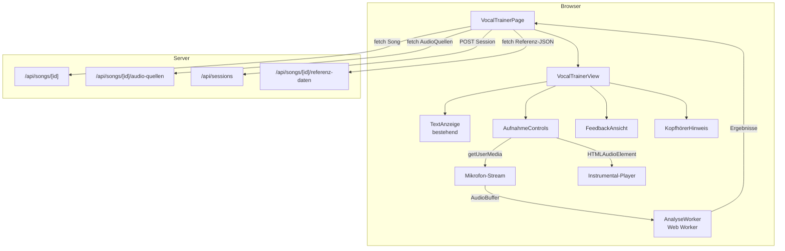
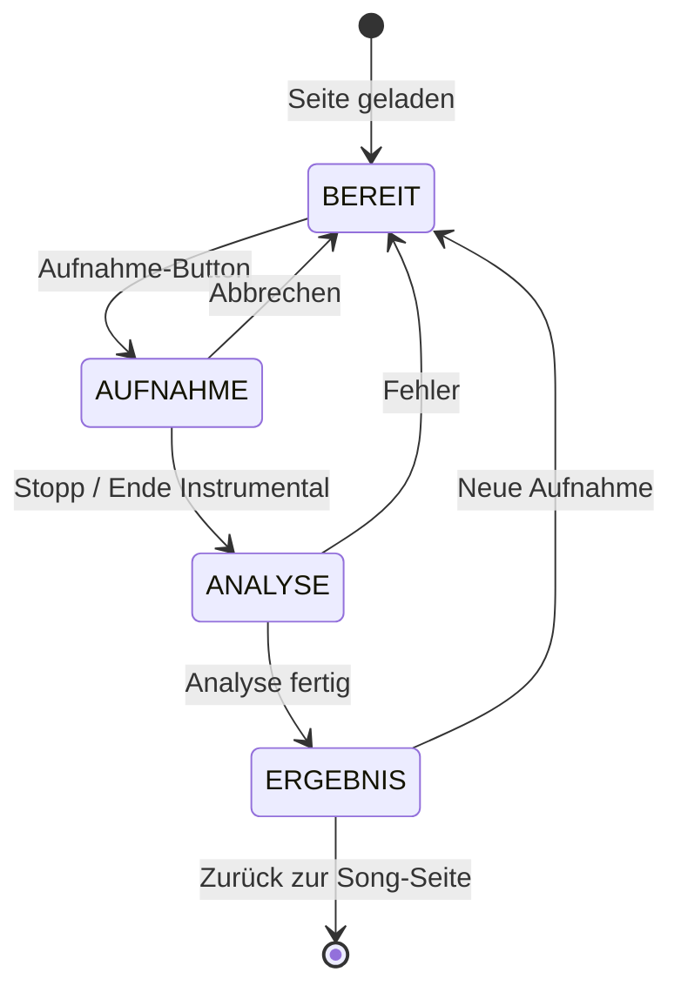
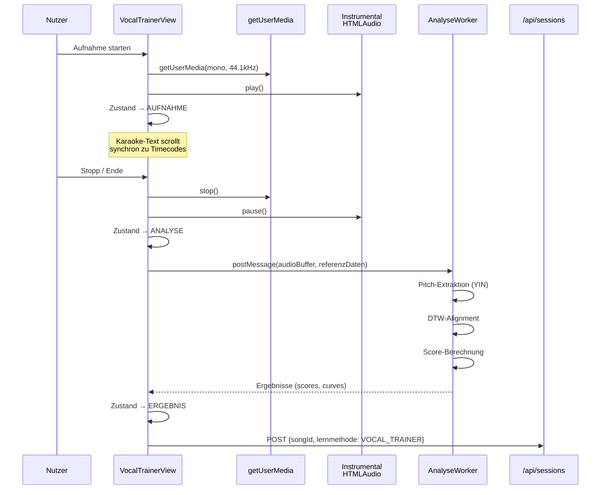

# Design-Dokument: Vocal Trainer

## Übersicht

Der Vocal Trainer erweitert Lyco um ein Gesangstraining-Modul, das die Stimme des Nutzers gegen eine Referenz-Vocal-Spur analysiert. Das Feature umfasst:

1. **Synchrone Aufnahme** – Mikrofon-Aufnahme parallel zur Instrumental-Wiedergabe mit Latenz-Kompensation
2. **Pitch-Extraktion** – Client-seitige Grundfrequenz-Analyse (YIN/MPM) in einem Web Worker
3. **Vergleichsalgorithmus** – DTW-basierter Abgleich von Pitch und Timing mit Scoring
4. **Feedback-Visualisierung** – Farbkodierter Pitch-Vergleichsgraph mit Scores
5. **Karaoke-Textanzeige** – Wiederverwendung der bestehenden Karaoke-Komponenten während der Aufnahme
6. **Audio-Rollen** – Erweiterung des AudioQuelle-Modells um `rolle` (STANDARD, INSTRUMENTAL, REFERENZ_VOKAL)

Die Vocal-Trainer-Ansicht ist unter `/songs/[id]/vocal-trainer/` erreichbar und nutzt den bestehenden Karaoke-Lesemodus als Basis für die Textanzeige während der Aufnahme.

## Architektur



### Zustandsmaschine



### Datenfluss Aufnahme → Analyse



## Komponenten und Schnittstellen

### Neue Komponenten

| Komponente | Pfad | Beschreibung |
|---|---|---|
| `VocalTrainerPage` | `src/app/(main)/songs/[id]/vocal-trainer/page.tsx` | Page-Komponente, lädt Song-Daten, verwaltet Zustandsmaschine |
| `VocalTrainerView` | `src/components/vocal-trainer/vocal-trainer-view.tsx` | Hauptansicht mit Karaoke-Text, Aufnahme-Controls, Feedback |
| `AufnahmeControls` | `src/components/vocal-trainer/aufnahme-controls.tsx` | Start/Stopp/Abbrechen-Buttons mit Zustandsabhängigkeit |
| `FeedbackAnsicht` | `src/components/vocal-trainer/feedback-ansicht.tsx` | Score-Anzeige und Vergleichs-Graph |
| `VergleichsGraph` | `src/components/vocal-trainer/vergleichs-graph.tsx` | Canvas/SVG-basierter Pitch-Kurvenvergleich |
| `KopfhoererHinweis` | `src/components/vocal-trainer/kopfhoerer-hinweis.tsx` | Modaler Dialog für Kopfhörer-Empfehlung |
| `RollenAuswahl` | `src/components/vocal-trainer/rollen-auswahl.tsx` | Dropdown für Audio_Rolle in der AudioQuellen-Verwaltung |

### Wiederverwendete Komponenten

| Komponente | Pfad | Nutzung |
|---|---|---|
| `TextAnzeige` | `src/components/karaoke/text-anzeige.tsx` | Karaoke-Textanzeige während AUFNAHME |
| `StrophenTitel` | `src/components/karaoke/strophen-titel.tsx` | Strophentitel oben mittig |
| `SongInfo` | `src/components/karaoke/song-info.tsx` | Song-Titel/Künstler unten mittig |
| `ZurueckButton` | `src/components/karaoke/zurueck-button.tsx` | Navigation zurück zur Song-Seite |
| `flattenLines` | `src/lib/karaoke/flatten-lines.ts` | Strophen/Zeilen in flache Liste |

### Neue Bibliotheken / Worker

| Modul | Pfad | Beschreibung |
|---|---|---|
| `analyse-worker` | `src/lib/vocal-trainer/analyse-worker.ts` | Web Worker: Pitch-Extraktion + DTW + Scoring |
| `pitch-extraktor` | `src/lib/vocal-trainer/pitch-extraktor.ts` | YIN-Algorithmus für F0-Extraktion |
| `dtw` | `src/lib/vocal-trainer/dtw.ts` | Dynamic Time Warping Implementierung |
| `scoring` | `src/lib/vocal-trainer/scoring.ts` | Pitch-Score, Timing-Score, Gesamt-Score |
| `referenz-daten` | `src/lib/vocal-trainer/referenz-daten.ts` | Serialisierung/Deserialisierung der Referenz-JSON |
| `pitch-daten` | `src/lib/vocal-trainer/pitch-daten.ts` | Serialisierung/Deserialisierung der Pitch-Frames |
| `latenz` | `src/lib/vocal-trainer/latenz.ts` | Latenz-Messung und -Kompensation |
| `frequenz-utils` | `src/lib/vocal-trainer/frequenz-utils.ts` | Hz→MIDI, Hz→Cents, MIDI→Hz Konvertierungen |

### API-Erweiterungen

| Endpunkt | Methode | Beschreibung |
|---|---|---|
| `/api/songs/[id]/audio-quellen/[quelleId]` | `PUT` | Erweitert um `rolle`-Feld |
| `/api/songs/[id]/referenz-daten` | `GET` | Liefert Referenz-JSON für den Song |
| `/api/sessions` | `POST` | Bestehend, nutzt neue Lernmethode `VOCAL_TRAINER` |

### Schnittstellen-Definitionen

```typescript
// Aufnahme-Zustand
type AufnahmeZustand = 'BEREIT' | 'AUFNAHME' | 'ANALYSE' | 'ERGEBNIS';

// Audio-Rolle für AudioQuelle
type AudioRolle = 'STANDARD' | 'INSTRUMENTAL' | 'REFERENZ_VOKAL';

// Referenz-Daten JSON-Struktur
interface ReferenzFrame {
  timestampMs: number;
  f0Hz: number;
  midiValue: number;
  isVoiced: boolean;
  isOnset: boolean;
}

interface ReferenzDaten {
  songId: string;
  sampleRate: number;
  windowSize: number;
  frames: ReferenzFrame[];
}

// Pitch-Daten der Nutzer-Aufnahme
interface PitchFrame {
  timestampMs: number;
  f0Hz: number;
  midiValue: number;
  isVoiced: boolean;
  confidence: number;
}

// Analyse-Ergebnis vom Worker
interface AnalyseErgebnis {
  pitchScore: number;       // 0–100
  timingScore: number;      // 0–100
  gesamtScore: number;      // 0–100
  referenzKurve: { timestampMs: number; midiValue: number }[];
  nutzerKurve: { timestampMs: number; midiValue: number; abweichungCents: number }[];
}

// Worker-Nachrichten
interface WorkerRequest {
  type: 'ANALYSE';
  audioBuffer: Float32Array;
  sampleRate: number;
  referenzDaten: ReferenzDaten;
  latenzMs: number;
}

interface WorkerResponse {
  type: 'ERGEBNIS' | 'FORTSCHRITT' | 'FEHLER';
  ergebnis?: AnalyseErgebnis;
  fortschritt?: number;     // 0–100
  fehler?: string;
}
```


## Datenmodelle

### Schema-Erweiterungen (Prisma)

#### 1. Neues Enum: `AudioRolle`

```prisma
enum AudioRolle {
  STANDARD
  INSTRUMENTAL
  REFERENZ_VOKAL
}
```

#### 2. Erweiterung: `AudioQuelle`-Modell

```prisma
model AudioQuelle {
  id         String     @id @default(cuid())
  songId     String
  url        String
  typ        AudioTyp
  label      String
  orderIndex Int
  rolle      AudioRolle @default(STANDARD)   // NEU
  createdAt  DateTime   @default(now())

  song Song @relation(fields: [songId], references: [id], onDelete: Cascade)

  @@map("audio_quellen")
}
```

#### 3. Erweiterung: `Lernmethode`-Enum

```prisma
enum Lernmethode {
  EMOTIONAL
  LUECKENTEXT
  ZEILE_FUER_ZEILE
  RUECKWAERTS
  SPACED_REPETITION
  QUIZ
  VOCAL_TRAINER    // NEU
}
```

### Referenz-Daten JSON-Schema

Die Referenz-Daten werden als statische JSON-Datei pro Song gespeichert (z.B. unter `/public/referenz-daten/{songId}.json` oder über eine API-Route ausgeliefert).

```json
{
  "songId": "clxyz...",
  "sampleRate": 44100,
  "windowSize": 1024,
  "frames": [
    {
      "timestampMs": 0,
      "f0Hz": 440.0,
      "midiValue": 69.0,
      "isVoiced": true,
      "isOnset": true
    },
    {
      "timestampMs": 23,
      "f0Hz": 0,
      "midiValue": 0,
      "isVoiced": false,
      "isOnset": false
    }
  ]
}
```

### Typ-Erweiterungen (TypeScript)

#### `src/types/audio.ts` – Erweiterung

```typescript
import { AudioTyp, AudioRolle } from "@/generated/prisma/client";

export interface AudioQuelleResponse {
  id: string;
  url: string;
  typ: AudioTyp;
  label: string;
  orderIndex: number;
  rolle: AudioRolle;  // NEU
}

export interface UpdateAudioQuelleInput {
  url?: string;
  typ?: AudioTyp;
  label?: string;
  rolle?: AudioRolle;  // NEU
}
```

#### `src/types/vocal-trainer.ts` – Neue Typen

```typescript
export type AufnahmeZustand = 'BEREIT' | 'AUFNAHME' | 'ANALYSE' | 'ERGEBNIS';

export interface ReferenzFrame {
  timestampMs: number;
  f0Hz: number;
  midiValue: number;
  isVoiced: boolean;
  isOnset: boolean;
}

export interface ReferenzDaten {
  songId: string;
  sampleRate: number;
  windowSize: number;
  frames: ReferenzFrame[];
}

export interface PitchFrame {
  timestampMs: number;
  f0Hz: number;
  midiValue: number;
  isVoiced: boolean;
  confidence: number;
}

export interface AnalyseErgebnis {
  pitchScore: number;
  timingScore: number;
  gesamtScore: number;
  referenzKurve: { timestampMs: number; midiValue: number }[];
  nutzerKurve: { timestampMs: number; midiValue: number; abweichungCents: number }[];
}
```

### Rollen-Constraint (Anwendungslogik)

Pro Song darf maximal eine AudioQuelle die Rolle `INSTRUMENTAL` und maximal eine die Rolle `REFERENZ_VOKAL` haben. Dieses Constraint wird in der Service-Schicht (`audio-quelle-service.ts`) durchgesetzt:

```typescript
// Beim Setzen einer Rolle: bestehende Quelle mit gleicher Rolle auf STANDARD zurücksetzen
async function setRolle(quelleId: string, rolle: AudioRolle, songId: string) {
  if (rolle !== 'STANDARD') {
    await prisma.audioQuelle.updateMany({
      where: { songId, rolle, id: { not: quelleId } },
      data: { rolle: 'STANDARD' },
    });
  }
  await prisma.audioQuelle.update({
    where: { id: quelleId },
    data: { rolle },
  });
}
```

### Frequenz-Konvertierungen

```typescript
// Hz → MIDI-Wert (A4 = 69, 440 Hz)
function hzToMidi(hz: number): number {
  return 69 + 12 * Math.log2(hz / 440);
}

// MIDI → Hz
function midiToHz(midi: number): number {
  return 440 * Math.pow(2, (midi - 69) / 12);
}

// Differenz in Cents zwischen zwei Frequenzen
function centsDiff(hzA: number, hzB: number): number {
  return 1200 * Math.log2(hzA / hzB);
}
```

